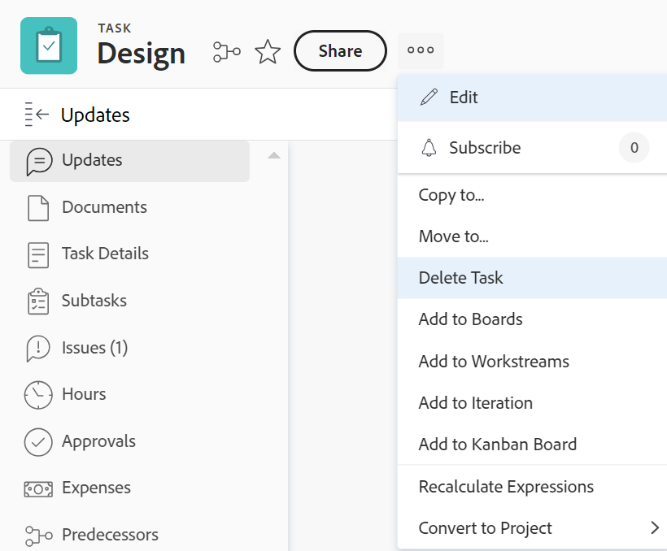

# Elimina attività

È possibile eliminare le attività che potrebbero essere duplicate o che sono state create per errore.

Per le attività con informazioni cronologiche (aggiornamenti, modifiche alla pianificazione, stato o altri campi), è consigliabile chiuderle o contrassegnarle come non attive, anziché eliminarle. In questo modo è possibile conservare le informazioni storiche per i progetti.

## Requisiti di accesso

Per eseguire i passaggi descritti in questo articolo, è necessario disporre dei seguenti diritti di accesso:

<table style="table-layout:auto"> 
 <col> 
 <col> 
 <tbody> 
  <tr> 
   <td role="rowheader">Piano Adobe Workfront*</td> 
   <td> 
Qualsiasi
 </td> 
  </tr> 
  <tr> 
   <td role="rowheader">Licenza Adobe Workfront*</td> 
   <td> 
Lavoro o superiore
 </td> 
  </tr> 
  <tr> 
   <td role="rowheader">Configurazioni del livello di accesso*</td> 
   <td> 
Modifica l'accesso ad Attività e Progetti con l'accesso a Elimina
 
Nota: se non disponi ancora dell’accesso, chiedi all’amministratore di Workfront se ha impostato restrizioni aggiuntive nel tuo livello di accesso. Per informazioni sull'accesso alle attività, vedere <a href="../../../administration-and-setup/add-users/configure-and-grant-access/grant-access-tasks.md" class="MCXref xref">Concedere l'accesso alle attività</a>. Per informazioni su come un amministratore di Workfront può modificare il tuo livello di accesso, consulta <a href="../../../administration-and-setup/add-users/configure-and-grant-access/create-modify-access-levels.md" class="MCXref xref">Creare o modificare livelli di accesso personalizzati</a>. 
 </td> 
  </tr> 
  <tr> 
   <td role="rowheader">Autorizzazioni oggetto</td> 
   <td> 
Autorizzazioni di Contribute per il progetto con la possibilità di aggiungere attività o versione successiva
 
Quando crei un’attività, ricevi automaticamente le autorizzazioni di gestione per l’attività
 
 Per informazioni sulle autorizzazioni per l'attività, vedere <a href="../../../workfront-basics/grant-and-request-access-to-objects/share-a-task.md" class="MCXref xref">Condividere un'attività </a>. 
 
Per informazioni sulla richiesta di autorizzazioni aggiuntive, vedere <a href="../../../workfront-basics/grant-and-request-access-to-objects/request-access.md" class="MCXref xref">Richiedere l'accesso agli oggetti </a>.
 </td> 
  </tr> 
 </tbody> 
</table>

&#42;Per conoscere il piano, il tipo di licenza o l&#39;accesso di cui si dispone, contattare l&#39;amministratore di Workfront.

## Comprendere il processo di eliminazione delle attività

* [Limitazioni per l&#39;eliminazione di attività](#limitations-for-deleting-tasks)
* [Impatto dell’eliminazione di attività](#the-impact-of-deleting-tasks)

### Limitazioni per l’eliminazione di attività  {#limitations-for-deleting-tasks}

* Quando un progetto ha lo stato Completato, è possibile eliminare le attività solo se l&#39;amministratore di Workfront o un amministratore di gruppo lo ha consentito nell&#39;area Preferenze progetto. Per informazioni sulla configurazione delle preferenze di progetto, vedere [Configurare le preferenze di progetto a livello di sistema](../../../administration-and-setup/set-up-workfront/configure-system-defaults/set-project-preferences.md).

* Se l’attività ha registrato ore, l’amministratore di Workfront o di gruppo deve consentire l’eliminazione di tali attività configurando le Preferenze attività e problemi nell’istanza Workfront. Ciò si applica anche quando si tenta di eliminare progetti che dispongono di attività con ore collegate.

  <!--
  (NOTE: the last statement is NWE&nbsp;only; not possible in classic)
  -->

  Per ulteriori informazioni sull&#39;abilitazione dell&#39;eliminazione delle attività in cui sono registrate le ore, vedere la sezione &quot;Eliminazione&quot; in [Configurare le preferenze relative alle attività e ai problemi a livello di sistema](../../../administration-and-setup/set-up-workfront/configure-system-defaults/set-task-issue-preferences.md).

### Impatto dell’eliminazione di attività {#the-impact-of-deleting-tasks}

L&#39;eliminazione di un&#39;attività ha un impatto su altri oggetti collegati all&#39;attività.

Quando si elimina un&#39;attività, vengono eliminati anche i seguenti oggetti allegati a un&#39;attività:

* Documenti

  Non è possibile eliminare un&#39;attività a cui è associato un documento estratto. Per ulteriori informazioni sull&#39;estrazione di documenti, vedere [Estrarre documenti](../../../documents/managing-documents/check-out-documents.md).

* Problemi
* Sottoattività
* Note
* Approvazioni

A seconda del modo in cui l’amministratore di Workfront configura le preferenze per l’eliminazione di progetti, attività o problemi nelle preferenze per le schede orario e le ore dell’istanza di Workfront, le ore registrate per le attività vengono gestite in uno dei seguenti modi durante l’eliminazione di un’attività:

* Spostati al progetto e non verrà ripristinato sull’attività, se questa viene successivamente ripristinata.
* Vengono eliminati e verranno ripristinati sull&#39;attività, se questa viene successivamente ripristinata.

  Ciò si applica anche quando si tenta di eliminare progetti che dispongono di attività con ore collegate.

  <!--
  <MadCap:conditionalText data-mc-conditions="QuicksilverOrClassic.Draft mode">
  (NOTE: this stays NWE; not possible in classic;)
  </MadCap:conditionalText>
  -->

  Per ulteriori informazioni sulla configurazione delle preferenze di eliminazione per le ore collegate a problemi, vedere [Configurare le preferenze relative alle ore e alla scheda orario](../../../administration-and-setup/set-up-workfront/configure-timesheets-schedules/timesheet-and-hour-preferences.md).

* Le spese per l&#39;attività verranno spostate nel progetto.

* Gli utenti assegnati all&#39;attività o all&#39;approvazione dell&#39;attività rimangono nel team di progetto.

  Per ulteriori informazioni sui team di progetto, vedere [Panoramica team di progetto](../../../manage-work/projects/planning-a-project/project-team-overview.md).

## Elimina attività

* [Eliminare più attività in un progetto contemporaneamente](#delete-multiple-tasks-in-a-project-simultaneously)
* [Eliminare una singola attività](#delete-a-single-task)

### Eliminare più attività contemporaneamente in un progetto  {#delete-multiple-tasks-in-a-project-simultaneously}

1. Fai clic sull&#39;icona  del **menu principale** nell&#39;angolo superiore destro di Adobe Workfront.

1. Fai clic su **Progetti**.
1. Fare clic sul nome del progetto contenente le attività che si desidera eliminare.
1. Fai clic su **Attività** nel pannello a sinistra.
1. Esegui una delle operazioni seguenti:

   1. (Condizionale) Quando l&#39;interruttore **Salvataggio automatico** è abilitato:

      1. Seleziona le attività da eliminare, quindi fai clic su **Altro**
      1. Fai clic su **Elimina**, quindi su **Elimina** per confermare l&#39;eliminazione.

         Le attività vengono eliminate.

   1. (Facoltativo) Fai clic sull&#39;icona **Modalità pianificazione** e seleziona **Salvataggio manuale** per annullare le modifiche apportate all&#39;elenco delle attività.

      

      Effettua le seguenti operazioni:

      1. Selezionare le attività da eliminare.
      1. Fare clic su **Elimina**.
      1. (Facoltativo) Fai clic su **Annulla** per annullare la modifica e non eliminare le attività.
      1. Fare clic su **Ripeti** per mantenere la modifica ed eliminare l&#39;attività.
      1. Fai clic su **Salva** per eliminare le attività.

         Le attività vengono eliminate solo dopo il salvataggio delle modifiche.

### Eliminare una singola attività {#delete-a-single-task}

1. Fai clic sull&#39;icona  del **menu principale** nell&#39;angolo superiore destro di Adobe Workfront.

1. Fai clic su **Progetti**.
1. Fare clic sul nome del progetto che contiene l&#39;attività che si desidera eliminare.
1. Fai clic su **Attività** nel pannello a sinistra.
1. Fare clic sul nome dell&#39;attività che si desidera eliminare.
1. Fai clic sull&#39;icona **Altro** nell&#39;angolo superiore destro.

   

1. Fai clic su **Elimina attività**.
1. Se l&#39;eliminazione è consentita, scegliere **Elimina**.

   L&#39;amministratore di Workfront o l&#39;amministratore di gruppo potrebbe non consentire l&#39;eliminazione delle attività in cui sono registrate le ore.

   Per ulteriori informazioni sull&#39;accesso e sulle autorizzazioni necessarie per eliminare un&#39;attività, vedere la sezione [Limitazioni per l&#39;eliminazione delle attività](#limitations-for-deleting-tasks) in questo articolo.

## Ripristina le attività eliminate

Un amministratore di Workfront o di gruppo può ripristinare le attività entro 30 giorni dall&#39;eliminazione, come descritto in [Ripristina elementi eliminati](../../../administration-and-setup/manage-workfront/manage-deleted-items/restore-deleted-items.md).
