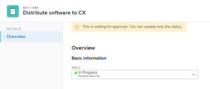
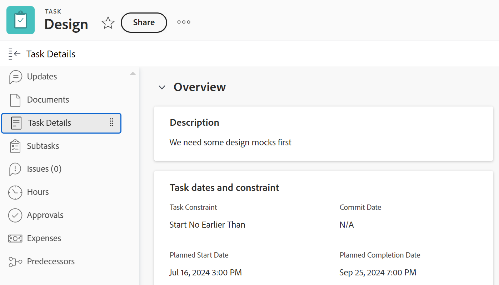
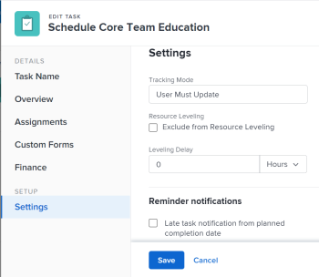

# Modifica attività

<!--Audited: 07/2024-->

<!--

(NOTE: some information in this area is repeated in the following articles. If you need to update a field, update it in both:

** Task finances in details

** Task information in overview)

-->

<!--

 

The highlighted information on this page refers to functionality not yet generally available. It is available only in the Preview environment for all customers. The same features will also be available in the Production environment for all customers starting with  a week from the Preview release.      

For more information, see [Interface modernization](/help/quicksilver/product-announcements/product-releases/interface-modernization/interface-modernization.md).  

 
-->

Potete modificare le informazioni sulle attività create o sulle quali disponete delle autorizzazioni Contribute o Manage.

## Requisiti di accesso

+++ Espandi per visualizzare i requisiti di accesso per la funzionalità in questo articolo. 

<table style="table-layout:auto"> 
 <col> 
 <col> 
 <tbody> 
  <tr> 
   <td role="rowheader">piano Adobe Workfront</td> 
   <td> 
Qualsiasi 
 </td> 
  </tr> 
  <tr> 
   <td role="rowheader">Licenza Adobe Workfront*</td> 
   <td> 
Standard

   
Lavoro o superiore
 </td> 
  </tr> 
  <tr> 
   <td role="rowheader">Livello di accesso</td> 
   <td> 
Modifica accesso ad attività e progetti
 </td> 
  </tr> 
  <tr> 
   <td role="rowheader">Autorizzazioni oggetto</td> 
   <td> 
    <ul> 
     <li> 
Concedere le autorizzazioni per un'attività per modificare le informazioni seguenti nell'area Dettagli attività: 

     <ul>
     <li>Descrizione</li>
     <li>Stato</li>
     </ul>  
      </li> 
     <li> 
Gestire le autorizzazioni per un'attività per modificare tutte le informazioni nell'area Dettagli e nella casella Modifica attività
 </li> 
    </ul> 
    <ul> 
     <li> 
Autorizzazioni Contribute (Contribute) o superiori per il progetto
 </li> 
    </ul> </td> 
  </tr> 
 </tbody> 
</table>

*Per informazioni, consulta [Requisiti di accesso nella documentazione di Workfront](/help/quicksilver/administration-and-setup/add-users/access-levels-and-object-permissions/access-level-requirements-in-documentation.md).

+++

## Limitazioni per la modifica delle attività

Esistono alcune limitazioni che potrebbero impedire la modifica delle attività.

Quando modifichi le attività, tieni presente quanto segue:

* L’aggiornamento delle attività attiva le notifiche per i progetti che si trovano nello stato Corrente. Per evitare confusione per gli utenti assegnati alle attività, limita il più possibile le attività di modifica quando il progetto è nello stato Corrente.
* Non è possibile modificare le attività in un processo di approvazione. È possibile registrare solo l&#39;ora o aggiornare lo stato di un&#39;attività in un processo di approvazione.

  

* È possibile modificare e aggiungere documenti alle attività di un progetto con stato Completato, Inattivo o In attesa di approvazione solo quando l&#39;amministratore di Workfront o un amministratore di gruppo ha abilitato questa funzionalità nell&#39;area Preferenze progetto. Per informazioni sull&#39;impostazione delle preferenze di progetto, vedere [Configurare le preferenze di progetto a livello di sistema](../../../administration-and-setup/set-up-workfront/configure-system-defaults/set-project-preferences.md).

* È sempre possibile modificare le informazioni seguenti su un&#39;attività quando il progetto è stato contrassegnato come Completo, Inattivo o si trova in un processo di approvazione:

   * Registra ore
   * Modifica spese esistenti
   * Allega un modulo personalizzato

* Gli altri utenti devono aggiornare le proprie pagine prima di poter visualizzare gli aggiornamenti apportati a un&#39;attività.

## Modificare un’attività in un elenco

È possibile modificare le informazioni sulle attività in un elenco di attività modificando i campi in linea visualizzati nella visualizzazione dell&#39;elenco.

Per informazioni sulla modifica delle attività negli elenchi, vedere [Modificare le attività in un elenco](../../../manage-work/tasks/manage-tasks/edit-tasks-in-a-list.md).

## Modificare un&#39;attività in un elenco utilizzando il Riepilogo

Potete modificare un&#39;attività in un elenco utilizzando il pannello Riepilogo. Per informazioni sulla modifica di un&#39;attività nel pannello Riepilogo, vedere la sezione &quot;Modifica un&#39;attività nel Riepilogo&quot; nell&#39;articolo [Modifica attività in un elenco](../../../manage-work/tasks/manage-tasks/edit-tasks-in-a-list.md).

## Modificare un&#39;attività nella casella Modifica attività

È possibile modificare un&#39;attività utilizzando le aree Modifica attività o Dettagli attività. Nei passaggi seguenti viene descritta la modifica di un&#39;attività nella casella Modifica attività.

{{step1-click-main-menu}}

1. Fai clic su **Progetti**, quindi fai clic sul nome di un progetto per aprirlo.
1. Fai clic su **Attività** nel pannello a sinistra.
1. Fare clic sull&#39;attività da modificare.
1. (Condizionale) Per modificare informazioni limitate su un&#39;attività, fai clic su **Dettagli attività** nel pannello a sinistra.

   

   È consigliabile modificare le informazioni nelle aree seguenti della sezione Dettagli attività:

   * **Panoramica**

     L&#39;area viene espansa per impostazione predefinita.

   * **Moduli personalizzati**

     I nomi dei moduli doganali vengono visualizzati solo se all’oggetto sono allegati moduli personalizzati.

   * **Finanza**

   >[!NOTE]
   >
   >A seconda della modalità di modifica del modello di layout da parte dell&#39;amministratore di Workfront o del gruppo, i campi nell&#39;area Dettagli attività potrebbero essere ridisposti o non visualizzati. Per informazioni, vedere [Personalizzare la visualizzazione Dettagli utilizzando un modello di layout](../../../administration-and-setup/customize-workfront/use-layout-templates/customize-details-view-layout-template.md).

   Per informazioni sui campi visibili nella sezione Dettagli attività, continuare a modificare l&#39;attività nella casella Modifica attività come descritto di seguito.

   Per modificare le informazioni nella sezione Dettagli, effettuare le seguenti operazioni:

   1. (Facoltativo) Fai clic sull&#39;icona **Comprimi tutto**  nell&#39;angolo superiore destro per comprimere tutte le aree.
   1. (Facoltativo e condizionale) Quando un&#39;area è compressa, fare clic sulla **freccia rivolta a destra**  accanto a ogni area per espandere l&#39;area che si desidera modificare.
   1. Per ulteriori informazioni sulla modifica delle informazioni nella scheda Dettagli attività, vedere gli articoli seguenti:

      * [Gestire le informazioni sull&#39;attività nell&#39;area Panoramica dettagli attività](../../../manage-work/tasks/manage-tasks/task-information-in-overview.md)
      * [Gestire i dati finanziari delle attività nella sezione Dettagli attività](../../../manage-work/tasks/manage-tasks/task-finances-in-details.md)

   1. (Facoltativo) Se non sono presenti moduli personalizzati allegati all&#39;attività, inizia a digitare il nome di un modulo nel campo **Aggiungi modulo personalizzato**, quindi selezionalo quando viene visualizzato nell&#39;elenco, quindi fai clic su **Salva modifiche**.
   1. (Facoltativo) Fai clic sull&#39;icona **Esporta**  per esportare le informazioni sulla panoramica e sui moduli personalizzati in un file PDF, quindi fai clic su **Esporta**. Selezionare una delle opzioni seguenti:

      * Seleziona tutto (viene visualizzato solo se è allegato almeno un modulo personalizzato)
      * Panoramica
      * Nome di uno o più moduli personalizzati

      Il file PDF viene scaricato nel computer.

      

      Per ulteriori informazioni, vedere [Esportare moduli personalizzati e dettagli oggetto](../../../workfront-basics/work-with-custom-forms/export-custom-forms-details.md).

1. (Condizionale) Per modificare tutte le informazioni sull&#39;attività, in qualità di utente con autorizzazioni di gestione per l&#39;attività, fai clic sul menu **Altro**  accanto al nome dell&#39;attività, quindi fai clic su **Modifica**.

   Oppure

   Da un elenco di attività, seleziona un&#39;attività, quindi fai clic sull&#39;icona **Modifica**  nella parte superiore dell&#39;elenco.

   Viene visualizzata la casella Modifica task (Edit Task).

   >[!IMPORTANT]
   >
   >Per visualizzare l’opzione Modifica, è necessario disporre delle autorizzazioni di gestione per l’attività.

   Tutti i campi delle attività sono disponibili nella casella Modifica attività e sono raggruppati per le aree elencate nel pannello a sinistra.

   >[!NOTE]
   >
   >A seconda della modalità di modifica del modello di layout da parte dell&#39;amministratore di Workfront o del gruppo, i campi nell&#39;area Dettagli attività potrebbero essere ridisposti o non visualizzati. Per informazioni, vedere [Personalizzare la visualizzazione Dettagli utilizzando un modello di layout](../../../administration-and-setup/customize-workfront/use-layout-templates/customize-details-view-layout-template.md).

   Prendere in considerazione la possibilità di specificare informazioni in una delle sezioni seguenti:

   * [Nome attività](#task-name)
   * [Panoramica](#overview)
   * [Assegnazioni](#assignments)
   * [Moduli personalizzati](#Custom%C2%A0F)
   * [Finanza](#finance)
   * [Impostazioni](#settings)
   * [Commento](#comment)

   >[!NOTE]
   >
   >A seconda del modo in cui l&#39;amministratore di Workfront o il gruppo imposta il modello di layout, i campi nella casella Modifica attività potrebbero essere ridisposti o non visualizzati. Per informazioni, vedere [Personalizzare la visualizzazione Dettagli utilizzando un modello di layout](../../../administration-and-setup/customize-workfront/use-layout-templates/customize-details-view-layout-template.md).

### Nome attività {#task-name}

1. Inizia a modificare l’attività come descritto in precedenza.
1. Fai clic su **Nome attività** nel pannello a sinistra.

   

1. Aggiorna il nome dell&#39;attività.

1. Fai clic su **Salva** o continua con le sezioni seguenti.

### Panoramica {#overview}

1. Inizia a modificare l’attività come descritto in precedenza.
1. Fai clic su **Panoramica** nel pannello a sinistra.

   

1. Aggiorna le seguenti informazioni sull&#39;attività:

   <table style="table-layout:auto"> 
    <col> 
    <col> 
    <tbody> 
     <tr> 
      <td role="rowheader">Descrizione</td> 
      <td>Aggiungere ulteriori informazioni sull'attività. </td> 
     </tr> 
     <tr> 
      <td colspan="2" role="rowheader">Sezione informazioni di base </td> 
     </tr> 
     <tr> 
      <td role="rowheader">Stato</td> 
      <td> 
Selezionare lo stato dell'attività che indica la fase di sviluppo in cui si trova l'attività.
 
<b>SUGGERIMENTO</b>

   È possibile aggiornare lo Stato dell&#39;attività nell&#39;intestazione dell&#39;attività. 

   
L'amministratore del Workfront o del gruppo può personalizzare i nomi degli stati delle attività. Per informazioni, vedere <a href="/help/quicksilver/administration-and-setup/customize-workfront/creating-custom-status-and-priority-labels/create-or-edit-a-status.md">Creare o modificare uno stato</a>. 
      </td> 
     </tr> 
     <tr> 
      <td role="rowheader">Priorità</td> 
      <td> 
Questo è un flag visivo che ti consente di assegnare la priorità alle attività. 
 
Selezionare una delle opzioni seguenti: 
 
       <ul> 
      <li> 
 Nessuno
 </li> 
      <li> 
 Basso 
 </li> 
      <li> 
Normal 
 </li> 
      <li> 
Alta 
 </li> 
      <li> 
 Urgente 
 </li> 
       </ul> 
A seconda delle Preferenze di progetto selezionate dall'amministratore di Workfront, i nomi delle priorità potrebbero essere diversi. Per informazioni sulle priorità delle attività, vedere <a href="../../../manage-work/tasks/task-information/task-priority.md" class="MCXref xref">Aggiorna priorità attività</a>. 
 </td> 
     </tr> 
     <tr> 
      <td colspan="2" role="rowheader">Sezione vincoli e date attività </td> 
     </tr> 
     <tr> 
      <td role="rowheader">Vincolo attività</td> 
      <td> 
Decidere quando l'attività deve essere completata specificando un vincolo attività. 
 
Selezionare una delle opzioni seguenti: 
 
       <ul> 
      <li> 
Date fisse 
 
Specifica un <strong>Inizio pianificato</strong> e una <strong>Data di completamento pianificata</strong>. 
 </li> 
      <li> 
Deve Iniziare Il 
 
Specifica una <strong>data inizio pianificata</strong>. 
 </li> 
      <li> 
Deve Terminare Il 
 
Specifica una <strong>data di completamento pianificata</strong>. 
 </li> 
       </ul> 
       <ul> 
      <li> 
Il Prima Possibile
 </li> 
      <li> 
Più tardi possibile
 </li> 
      <li> 
Primo Orario Disponibile
 </li> 
      <li> 
 Ultimo Orario Disponibile
 </li> 
      <li> 
Inizia Non Dopo Di 
 </li> 
      <li> 
Specifica una data di inizio pianificata
 </li> 
      <li> 
Iniziare Non Prima Di 
 
Specifica una <strong>data inizio pianificata</strong>. 
 </li> 
      <li> 
 Termina Non Dopo Di
 
Specifica una <strong>data di completamento pianificata</strong>. 
 </li> 
      <li> 
 Termina Non Prima Di
 
Specifica una <strong>data di completamento pianificata</strong>
 </li> 
       </ul> 
Per ulteriori informazioni sul vincolo attività, vedere <a href="../../../manage-work/tasks/task-constraints/task-constraint-overview.md" class="MCXref xref">Panoramica sul vincolo attività</a>.
 </td> 
     </tr> 
     <tr> 
      <td role="rowheader">Conferma data e ora</td> 
      <td> 
Si tratta della data entro la quale l’utente assegnato all’attività si impegna a completarla. Questo può essere diverso dalla Data di completamento pianificata. Solo gli assegnatari possono modificare questo campo. Per informazioni sulle date di conferma in Workfront, vedere <a href="../../../manage-work/projects/updating-work-in-a-project/overview-of-commit-dates.md" class="MCXref xref">Panoramica sulla data di conferma</a>. 
 </td> 
     </tr> 
     <tr> 
      <td role="rowheader">Data e ora di inizio pianificate</td> 
      <td> 
Quando è pianificato l’inizio dell’attività. La data di inizio pianificata di un'attività viene impostata e influenzata da diversi fattori:
 
       <ul> 
      <li>A seconda della preferenza a livello di sistema per la data di inizio pianificata dell'attività, la data di inizio di una nuova attività in un progetto può essere la data odierna o la data di inizio del progetto, per impostazione predefinita. Anche l'amministratore del gruppo associato al progetto può impostare questa preferenza per il gruppo. Per ulteriori informazioni sulle preferenze per le attività a livello di sistema o di gruppo, vedere <a href="../../../administration-and-setup/set-up-workfront/configure-system-defaults/set-task-issue-preferences.md" class="MCXref xref">Configurare le preferenze per attività e problemi a livello di sistema</a>.</li> 
      <li>A seconda dei predecessori dell'attività, la data di inizio pianificata viene scelta da Workfront come data disponibile successiva alla fine o all'inizio del predecessore, a seconda della relazione del predecessore. Per ulteriori informazioni sulle relazioni con i predecessori, vedere <a href="../../../manage-work/tasks/use-prdcssrs/predecessors-overview.md" class="MCXref xref">Panoramica sui predecessori delle attività</a>.</li> 
      <li>Il project manager o il proprietario dell'attività possono impostare manualmente la data di inizio pianificata quando il vincolo dell'attività è Date fisse o Deve iniziare il. Per ulteriori informazioni sui vincoli delle attività, vedere <a href="../../../manage-work/tasks/task-constraints/task-constraint-overview.md" class="MCXref xref">Panoramica sui vincoli delle attività</a>.</li> 
       </ul> </td> 
     </tr> 
     <tr> 
      <td role="rowheader">Data e ora di completamento pianificate</td> 
      <td> 
Data di completamento prevista, come visualizzata quando l'attività è pianificata. Workfront imposta la data di completamento pianificata utilizzando alcuni dei fattori seguenti:
 
       <ul> 
      <li>La data di completamento pianificata viene calcolata a partire dalla data di inizio pianificata aggiungendo la Durata dell'attività alla data di inizio pianificata. Quando il project manager o Workfront specifica la durata dell'attività, viene attivato un aggiornamento della data di completamento pianificata. Se la data pianificata cambia, ciò accade spesso perché la Durata dell'attività è stata aggiornata.</li> 
      <li>Il project manager o il proprietario dell'attività possono impostare manualmente la data di completamento pianificata quando il vincolo dell'attività è Date fisse o Deve finire il. Per ulteriori informazioni sui vincoli delle attività, vedere <a href="../../../manage-work/tasks/task-constraints/task-constraint-overview.md" class="MCXref xref">Panoramica sui vincoli delle attività</a>.</li> 
      <li>Se il Tipo di Durata dell'attività cambia e il numero di risorse sulle attività cambia contemporaneamente, cambierà anche la data di completamento pianificata. Per ulteriori informazioni sui tipi di durata, vedere <a href="../../../manage-work/tasks/taskdurtn/task-duration-and-duration-type.md" class="MCXref xref">Panoramica sulla durata dell'attività e sul tipo di durata</a>.</li> 
       </ul> </td> 
     </tr> 
     <tr> 
      <td role="rowheader">Data e ora di inizio effettive</td> 
      <td> 
Specificare una data di inizio effettiva per l'attività. Il valore predefinito viene generalmente popolato automaticamente quando si modifica lo stato dell'attività in In corso. La data di inizio effettiva può anche essere modificata manualmente dal project manager o dal proprietario dell'attività. 
 </td> 
     </tr> 
     <tr> 
      <td role="rowheader">Data e ora di completamento effettive</td> 
      <td> 
Specificare la data e l'ora effettive di completamento dell'attività. La data e l'ora predefinite di completamento di un'attività coincidono sempre con l'ora effettiva in cui lo stato diventa Completato. Il project manager o il proprietario dell'attività può inoltre modificare manualmente la data di completamento effettiva. 
 </td> 
     </tr> 
     <tr> 
      <td role="rowheader"><b>Sezione Orario di lavoro</b></td> 
     </tr> 
     <tr> 
      <td role="rowheader">Impegno di lavoro </td> 
      <td>

   
Quantità di lavoro necessaria per completare l'attività. È possibile che il project manager decida di utilizzare questo campo anziché le ore pianificate per stimare lo sforzo necessario per completare un'attività. Questo campo è visibile solo quando sono soddisfatte le seguenti condizioni:
 
      <ul> 
      <li> 
L’attività ha un tipo di durata semplice. 
 
<b>SUGGERIMENTO</b>

   Se si modifica il Tipo di durata dell&#39;attività, questo campo viene oscurato. 
 </li>
   <li>Il project manager ha abilitato il campo Usa impegno di lavoro per calcolare automaticamente le ore pianificate dell'attività nel progetto. </li> 
      </ul> 
      
Selezionare una delle opzioni seguenti:
 
      <ul> 
      <li>Piccola</li> 
      <li>Medium (valore predefinito per una nuova attività)</li> 
      <li>Grande</li> 
      </ul> 
      
<b>NOTA</b>

   L&#39;aggiornamento della quantità di lavoro potrebbe aggiornare le ore pianificate dell&#39;attività. L&#39;aggiornamento è immediato se il tipo di aggiornamento del progetto è Automatico. Quando il tipo di aggiornamento del progetto è Manuale, è necessario ricalcolare la sequenza temporale per visualizzare le ore pianificate aggiornate. 

   
Per informazioni sull'utilizzo dell'Impegno di lavoro invece delle Ore pianificate per stimare l'impegno di attività, vedere <a href="../../../manage-work/tasks/task-information/work-effort.md" class="MCXref xref">Panoramica sull'impegno di lavoro</a>. 
 
    </td> 
     </tr> 
    </tbody> 
   </table>

1. Fai clic su **Salva** o continua con le sezioni seguenti.

### Assegnazioni {#assignments}

1. Inizia a modificare l’attività come descritto in precedenza.
1. Fai clic su **Assegnazioni** nel pannello a sinistra.

   

1. Fai clic su **Cerca persone, mansione e team** e inizia a digitare il nome di un utente, una mansione o un team che desideri assegnare all&#39;attività, quindi fai clic su di esso o premi Invio quando viene visualizzato nell&#39;elenco.

   >[!NOTE]
   >
   >Se il nome dell&#39;utente contiene un carattere speciale, è necessario includere tale carattere nel campo di ricerca.

   >[!TIP]
   >
   >Puoi assegnare più utenti, mansioni o team. Puoi assegnare solo utenti attivi, mansioni e team.
   >
   >Se un utente, una mansione o un team è stato assegnato prima della disattivazione, rimane assegnato all&#39;elemento di lavoro. In questo caso, consigliamo quanto segue:
   >
   >* Riassegnare l&#39;elemento di lavoro alle risorse attive.
   >* Associare gli utenti di un team disattivato a un team attivo e riassegnare l&#39;elemento di lavoro al team attivo.

1. (Facoltativo) Indica se un assegnatario è l&#39;assegnatario principale dell&#39;attività, selezionando il pulsante di opzione **Proprietario** accanto al nome. Un team non può essere l&#39;assegnatario principale di un&#39;attività.
1. (Condizionale e facoltativo) Aggiorna i campi seguenti:

   <table style="table-layout:auto"> 
    <col> 
    <col> 
    <tbody> 
     <tr> 
      <td role="rowheader">Tipo di Durata</td> 
      <td> 
Questo identifica la relazione tra i seguenti: 
 
       <ul> 
      <li> 
Numero di risorse assegnate a un'attività 
 </li> 
      <li> 
Lo sforzo totale richiesto per completare l'attività 
 </li> 
      <li> 
 Durata totale dell'attività. 
 </li> 
       </ul> 
L'amministratore di Workfront o un amministratore gruppo seleziona l'impostazione predefinita Tipo di durata per le attività del sistema o del gruppo. Per informazioni sull'impostazione delle impostazioni predefinite del progetto, vedere <a href="../../../administration-and-setup/set-up-workfront/configure-system-defaults/set-task-issue-preferences.md" class="MCXref xref">Configurare le preferenze relative a problemi e attività a livello di sistema</a>. 
 
I tipi di durata consentono di impostare assegnazioni di risorse coerenti in base alle esigenze dell'attività. Per ulteriori informazioni sul tipo di durata di un'attività, vedere <a href="../../../manage-work/tasks/taskdurtn/task-duration-and-duration-type.md" class="MCXref xref">Panoramica sulla durata e sul tipo di durata dell'attività</a>. 
 
Selezionare una delle opzioni seguenti: 
 
       <ul> 
      <li> 
Incarico Calcolato 
 </li> 
      <li> 
 Lavoro Calcolato 
 </li> 
      <li> 
Impegno Aggiuntivo 
 </li> 
      <li> 
Semplice
 </li> 
       </ul> </td> 
     </tr> 
     <tr data-mc-conditions="QuicksilverOrClassic.Quicksilver"> 
      <td role="rowheader">Durata per Occorrenza</td> 
      <td> 
Viene visualizzato solo sull'elemento padre delle attività ricorrenti. Viene visualizzata la durata di ogni attività ricorrente, definita al momento della creazione dell'attività. Per informazioni sulla creazione di attività ricorrenti, vedere <a href="../../../manage-work/tasks/create-tasks/create-recurring-tasks.md" class="MCXref xref">Creare attività ricorrenti</a>. 
 
 <b>NOTA</b>

   Le durate modificate in singole attività ricorrenti non visualizzano il valore indicato in questo campo. 
 </td>
   </tr> 
     <tr> 
      <td role="rowheader">Durata</td> 
      <td> 
      
 
      
 
      
Quantità di tempo che consente a un'attività di rimanere aperta prima del completamento. 
 
      
<b>IMPORTANTE</b>

   Poiché la durata dell&#39;attività corrisponde in genere al tempo che intercorre tra l&#39;inizio pianificato e le date di completamento pianificate, influisce sulla sequenza temporale del progetto.

   
Per indicare la durata dell'attività e l'unità di tempo, eseguire le operazioni seguenti:
 
      <ul> 
      <li> 
Digita il periodo di tempo e seleziona una delle unità di tempo disponibili nel menu a discesa.
 
<b>SUGGERIMENTO</b>

      Quando si aggiorna la Durata delle attività in un elenco di attività, è possibile utilizzare l'abbreviazione per l'unità di tempo. 
 </li> 
      </ul> 
      
 Nella tabella seguente è possibile scegliere tra le opzioni relative al tempo normale o al tempo trascorso: 
 
      <table style="table-layout:auto"> 
      <col> 
      <col data-mc-conditions=""> 
      <tbody> 
      <tr> 
      <td>Unità di tempo</td> 
      <td>Abbreviazione</td> 
      </tr> 
      <tr> 
      <td>Minutes</td> 
      <td>M</td> 
      </tr> 
      <tr> 
      <td>Ore</td> 
      <td>H</td> 
      </tr> 
      <tr> 
      <td>Giorni. Questa è l'impostazione predefinita. </td> 
      <td>Dsbld</td> 
      </tr> 
      <tr> 
      <td>Weeks</td> 
      <td>M</td> 
      </tr> 
      <tr> 
      <td>Months</td> 
      <td>T</td> 
      </tr> 
      <tr> 
      <td>Minuti trascorsi</td> 
      <td>EM</td> 
      </tr> 
      <tr> 
      <td>Ore trascorse</td> 
      <td>EH</td> 
      </tr> 
      <tr> 
      <td>Giorni trascorsi</td> 
      <td>ED</td> 
      </tr> 
      <tr> 
      <td>Settimane trascorse</td> 
      <td>EW</td> 
      </tr> 
      <tr> 
      <td>Mesi trascorsi</td> 
      <td>ET</td> 
      </tr> 
      </tbody> 
   </table>

   
<b>NOTA</b>

   
Il tempo trascorso è un'unità di tempo per la durata di un'attività. Si tratta del tempo che intercorre tra la Data inizio pianificata e la Data completamento pianificata di un'attività e che include ferie, fine settimana e ferie. In altre parole, il tempo trascorso è il trascorrere dei giorni di calendario.

   L&#39;orario regolare prende in considerazione le festività, i fine settimana e le ferie e le esclude dalla Durata dell&#39;attività. Per ulteriori informazioni sulla durata dell&#39;attività, vedere <a href="../../../manage-work/tasks/taskdurtn/task-duration-and-duration-type.md" class="MCXref xref">Panoramica sulla durata e sul tipo di durata dell&#39;attività</a>. 

   
 
   
 </td> 
   </tr> 
   <tr> 
   <td role="rowheader">Lavoro Necessario</td> 
   <td> 
Specifica il numero di ore pianificate per l'attività, in ore. Quantità di tempo effettivo necessario agli assegnatari dell'attività per completare l'attività. È possibile specificare solo il numero di ore pianificate per un'attività quando il tipo di durata è impostato su Assegnazione calcolata. Per ulteriori informazioni sui tipi di durata, vedere <a href="../../../manage-work/tasks/taskdurtn/task-duration-and-duration-type.md" class="MCXref xref">Panoramica sulla durata dell'attività e sul tipo di durata</a>.
 
   <b>NOTA</b>
   

   Quando si creano attività ricorrenti, le ore pianificate sono quelle di ogni occorrenza. Le ore pianificate delle attività padre sono il totale di tutte le ore pianificate di tutte le occorrenze. Per informazioni sulla creazione di attività ricorrenti, vedere <a href="../../../manage-work/tasks/create-tasks/create-recurring-tasks.md" class="MCXref xref">Creare attività ricorrenti</a>.
   

   </td> 
   </tr> 
   <tr> 
   <td role="rowheader">Allocazione</td> 
   <td> 
Se il vincolo dell'attività è Lavoro calcolato o Impegno, specificare <strong>Allocazione %</strong> (percentuale di allocazione) per ogni assegnatario. Quantità di tempo della pianificazione dell'assegnatario che può trascorrere per l'attività. Se si modifica la percentuale di allocazione per un assegnatario, verranno modificate le ore pianificate di un'attività. 
 
Quando Vincolo attività è Semplice, è possibile specificare quanto segue:
 
      <ul> 
      <li> 
Ore di allocazione di ciascun assegnatario.
 </li> 
      <li> 
Ore pianificate dell'attività
 </li> 
      <li> 
Durata dell’attività
 </li> 
      </ul> </td> 
   </tr> 
   <tr> 
   <td role="rowheader">Mansione dell'assegnatario</td> 
   <td> 
Selezionare una mansione dal menu a discesa <strong>Ruolo dell'assegnatario</strong> quando si seleziona una persona come assegnatario. Questo è il ruolo che l’assegnatario può svolgere per questa attività. 
 
<b>SUGGERIMENTO</b>

   Nel menu a discesa vengono visualizzati solo i ruoli associati a ciascun assegnatario nel relativo profilo.
 </td>
   </tr> 
      </tbody> 
      </table>

1. Fai clic su **Salva** o continua con le sezioni seguenti.

### Moduli personalizzati

È possibile definire moduli personalizzati predefiniti da allegare automaticamente alle attività quando queste vengono aggiunte a un progetto. Per informazioni sulla configurazione del progetto per includere moduli personalizzati predefiniti per tutte le nuove attività, vedere la sezione &quot;Attività&quot; nell&#39;articolo [Modifica progetti](../../../manage-work/projects/manage-projects/edit-projects.md).

1. Inizia a modificare l’attività come descritto in precedenza.
1. Fai clic su **Forms personalizzato** nel pannello a sinistra oppure sul nome di un modulo personalizzato, se è già allegato.

   

1. Fare clic su **Aggiungi modulo personalizzato** e selezionare il modulo o i moduli personalizzati che si desidera associare all&#39;attività. Devi creare i moduli personalizzati prima che siano disponibili per la selezione in questo campo. Nell’elenco vengono visualizzati solo i moduli personalizzati attivi.

   Per ulteriori informazioni sulla creazione di moduli personalizzati, vedere [Creare un modulo personalizzato](/help/quicksilver/administration-and-setup/customize-workfront/create-manage-custom-forms/form-designer/design-a-form/design-a-form.md).È possibile aggiungere fino a dieci moduli personalizzati a un&#39;attività

1. (Condizionale) Se hai allegato un modulo personalizzato all’attività, modifica eventuali campi del modulo. È necessario specificare tutti i campi obbligatori prima di salvare l&#39;attività.

   >[!NOTE]
   >
   >A seconda di come l’amministratore di Workfront imposta le autorizzazioni per le sezioni nel modulo personalizzato, non tutti possono visualizzare o modificare gli stessi campi in un determinato modulo personalizzato. Le autorizzazioni per modificare i campi all’interno di una sezione di un modulo personalizzato dipendono dalle autorizzazioni di cui disponi per l’attività stessa. Per informazioni sull&#39;impostazione delle autorizzazioni per l&#39;attività, vedere [Condividere un&#39;attività](../../../workfront-basics/grant-and-request-access-to-objects/share-a-task.md).

1. Fai clic su **Salva** o continua con le sezioni seguenti.

### Finanz {#finance}

1. Inizia a modificare l&#39;attività come descritto nella sezione [Modifica attività](#Edit2) in questo articolo.
1. Fai clic su **Finanza** nel pannello a sinistra.

   

1. Aggiorna i campi seguenti:

   <table style="table-layout:auto"> 
    <col> 
    <col> 
    <tbody> 
     <tr> 
      <td role="rowheader">Tipo di costo</td> 
      <td> 
Specificare il tipo di costo per l'attività. Questo determinerà come viene calcolato il costo dell'attività, in base al numero di ore sulle attività. 
 
Selezionare una delle opzioni seguenti: 
 
       <ul> 
        <li> 
Nessun Costo
 </li> 
        <li> 
Ore Fisse 
 </li> 
        <li> 
 Ore Utente 
 </li> 
        <li> 
 Ore Ruolo
 </li> 
       </ul> 
Per ulteriori informazioni sul tracciamento dei costi, vedere <a href="../../../manage-work/projects/project-finances/track-costs.md" class="MCXref xref">Tracciare i costi</a> . L'amministratore di Workfront o un amministratore di gruppo seleziona l'impostazione Tipo di costo predefinita per le attività del sistema o del gruppo. Per informazioni sull'impostazione delle impostazioni predefinite del progetto, vedere <a href="../../../administration-and-setup/set-up-workfront/configure-system-defaults/set-project-preferences.md" class="MCXref xref">Configurare le preferenze del progetto a livello di sistema</a>.
 </td> 
     </tr> 
     <tr> 
      <td role="rowheader">Tipo di entrate</td> 
      <td> 
Specificare il tipo di retribuzione per l'attività. Questo determinerà il modo in cui vengono calcolati i Ricavi sull'attività, in base al numero di ore sulle attività. 
 
Selezionare una delle opzioni seguenti: 
 
       <ul> 
      <li> 
 Non Fatturabile 
 </li> 
      <li> 
Ore Utente 
 </li> 
      <li> 
Ore Ruolo 
 </li> 
      <li> 
Ore Fisse 
 </li> 
      <li> 
Ore utente con limite 
 </li> 
      <li> 
Ore ruolo con limite 
 </li> 
      <li> 
Ore Utente più Fisso 
 </li> 
      <li> 
Ore Ruolo più Fisso 
 </li> 
      <li> 
Reddito Fisso 
 </li> 
       </ul> 
Per ulteriori informazioni sul tracciamento dei ricavi, vedi<a href="../../../manage-work/projects/project-finances/billing-and-revenue-overview.md" class="MCXref xref">Panoramica su fatturazione e ricavi</a> . 
 
L'amministratore di Workfront o l'amministratore di gruppo seleziona l'impostazione Tipo di retribuzione predefinita per le attività del sistema o del gruppo. Per informazioni sull'impostazione delle impostazioni predefinite del progetto, vedere <a href="../../../administration-and-setup/set-up-workfront/configure-system-defaults/set-project-preferences.md" class="MCXref xref">Configurare le preferenze del progetto a livello di sistema</a>.
 </td> 
     </tr> 
    </tbody> 
   </table>

1. Fai clic su **Salva** o continua con la sezione seguente.

### Impostazioni {#settings}

1. Inizia a modificare l&#39;attività come descritto nella sezione [Modifica attività](#Edit2) in questo articolo.
1. Fai clic su **Impostazioni** nel pannello a sinistra.

   

1. Aggiorna i campi seguenti:

   <table style="table-layout:auto"> 
    <col> 
    <col> 
    <tbody> 
     <tr> 
      <td role="rowheader">Modalità Tracciamento</td> 
      <td> 
Specificare la modalità di verifica dello stato di avanzamento dell'attività. 
 
Selezionare una delle opzioni seguenti: 
 
       <ul> 
      <li> 
 Utente deve Aggiornare 
 </li> 
      <li> 
Presupponi puntuale 
 </li> 
      <li> 
Ignora Avvertimenti di Ritardo
 </li> 
      <li> 
 Completamento automatico 
 </li> 
      <li> 
Predecessore 
 </li> 
       </ul> 
Per ulteriori informazioni sulla modalità di verifica delle attività, vedere <a href="../../../manage-work/tasks/task-information/task-tracking-mode.md" class="MCXref xref">Panoramica sulla modalità di verifica delle attività</a>.
 </td> 
     </tr> 
     <tr> 
      <td role="rowheader">Livellamento Risorse</td> 
      <td> 
Selezionare il campo <strong>Escludi dal livellamento risorse</strong> se si desidera escludere dal livellamento le risorse assegnate all'attività.
 </td> 
     </tr> 
     <tr> 
      <td role="rowheader">Ritardo di Livellamento</td> 
      <td> 
Specifica il ritardo di livellamento in ore. 
 
 Per ulteriori informazioni sui ritardi di livellamento, vedere <a href="../../../manage-work/tasks/task-information/task-leveling-delay.md" class="MCXref xref">Aggiorna ritardo di livellamento attività</a>. 
 </td> 
     </tr> 
     <tr> 
      <td role="rowheader">Processo di approvazione</td> 
      <td> 
Selezionare un processo di approvazione da associare all'attività. Prima di poter associare i processi alle attività, l'amministratore di Workfront deve definirli a livello di sistema. Un utente con accesso amministrativo ai processi di approvazione può anche creare processi di approvazione specifici per il gruppo. 
 
Per ulteriori informazioni sulla creazione di processi di approvazione, vedere <a href="../../../administration-and-setup/customize-workfront/configure-approval-milestone-processes/create-approval-processes.md">Creare un processo di approvazione per gli elementi di lavoro</a>. Quando aggiungi processi di approvazione, tieni presente quanto segue: 
 
       <ul>

   <li> 
Nell'elenco vengono visualizzati solo i processi di approvazione attivi. 
 </li>

   <li> 
I processi di approvazione a livello di sistema e di gruppo vengono visualizzati nell’elenco. Un processo di approvazione associato a un gruppo diverso da quello del progetto non viene visualizzato nell’elenco. 

   
<b>IMPORTANTE</b>

   Se il gruppo del progetto cambia, il processo di approvazione specifico del gruppo precedentemente allegato diventa un processo di approvazione a utente singolo. Per ulteriori informazioni su come le modifiche al gruppo del progetto o le modifiche al processo di approvazione influiscono sulle impostazioni di approvazione, vedere <a href="../../../administration-and-setup/customize-workfront/configure-approval-milestone-processes/how-changes-affect-group-approvals.md">Come le modifiche al gruppo e al processo di approvazione influiscono sui processi di approvazione assegnati</a>. 

   </li>

   <li> 
È possibile definire processi di approvazione predefiniti da allegare automaticamente alle attività quando queste vengono aggiunte a un progetto. Per informazioni sulla configurazione del progetto per includere i processi di approvazione attività predefiniti, vedere la sezione "Attività" nell'articolo <a href="../../../manage-work/projects/manage-projects/edit-projects.md" class="MCXref xref">Modifica progetti</a>. 
 </li>

   <li> 
Quando si modificano attività in blocco, si verificano i seguenti scenari: 
 
      <ul> 
      <li> 
Quando si selezionano più attività dallo stesso gruppo, in questo campo vengono visualizzati sia i processi di approvazione a livello di sistema che quelli a livello di gruppo. 
 </li> 
      <li> 
Quando si selezionano più attività da gruppi diversi, in questo campo vengono visualizzati solo i processi di approvazione a livello di sistema. 
 </li> 
      <li> 
Quando a una delle attività è associato un processo di approvazione a utente singolo, questo viene sostituito dal processo di approvazione a livello di sistema o di gruppo selezionato. 
 </li>

   </ul> </li> 
      </ul> </td> 
     </tr> 
    </tbody> 
   </table>
    </li>

1. Fai clic su **Salva** o continua con la sezione seguente.

<!--notes from the table: 
(NOTE: this bullet stays here although the sections it might appear in are QS only, so we can use the snippet for both Qs and classic)
       -->

### Commento

1. Inizia a modificare l&#39;attività come descritto nella sezione [Modifica attività](#Edit2) in questo articolo.
1. Fai clic su **Commento** nel pannello a sinistra.

   

1. Aggiungi un aggiornamento nello spazio fornito.
1. (Facoltativo) Aggiungi una delle seguenti opzioni all’aggiornamento:

   * Aggiungi utenti o team all&#39;aggiornamento nell&#39;area **Assegna tag a persone** o utilizza @ per includerli nell&#39;aggiornamento.
   * Seleziona la casella di controllo **Privato per la mia azienda** per mantenere l&#39;aggiornamento privato per gli utenti della tua azienda.

     >[!TIP]
     >
     >L&#39;impostazione **Privato per la mia società** è disponibile solo quando il tuo profilo Workfront è associato a una società.
1. Fai clic su **Salva**.

## Modificare un’attività nell’intestazione dell’attività (limitato)

È possibile modificare una quantità limitata di informazioni nell&#39;intestazione dell&#39;attività.

L&#39;amministratore del sistema o del gruppo può personalizzare i campi visualizzati nell&#39;intestazione dell&#39;attività. Per ulteriori informazioni, vedere [Personalizzare le intestazioni degli oggetti utilizzando un modello di layout](../../../administration-and-setup/customize-workfront/use-layout-templates/customize-object-headers.md).

Per impostazione predefinita, nell&#39;intestazione dell&#39;attività sono inclusi i campi seguenti:

* Nome attività
* Percentuale completata

  Per informazioni, vedere [Visualizzare e aggiornare la percentuale di completamento per le attività](/help/quicksilver/manage-work/projects/updating-work-in-a-project/view-update-percent-complete-for-tasks.md).
* Assegnazioni
* Data di completamento Pianificata

  >[!CAUTION]
  >
  >Alcuni vincoli di attività e altre dipendenze potrebbero impedire la modifica della Data di completamento pianificata di un&#39;attività. Per informazioni sui vincoli attività, vedere [Panoramica sui vincoli attività](../../../manage-work/tasks/task-constraints/task-constraint-overview.md).

* Stato
* Prendere decisioni di approvazione se si è impostati come approvatore in un processo di approvazione corrente

## Modifica attività in blocco

È possibile modificare le attività in blocco in un elenco e aggiornarne tutte le informazioni contemporaneamente quando si seleziona di salvare automaticamente le modifiche apportate alle attività nell&#39;elenco.

Per informazioni sul salvataggio di attività in blocco, vedere la sezione &quot;Modifica attività in blocco&quot; nell&#39;articolo [Modifica attività in un elenco](../../../manage-work/tasks/manage-tasks/edit-tasks-in-a-list.md).
