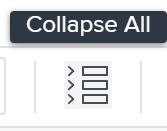

# Gestire le finanze dell”attività nella sezione Dettagli attività

<!--

(NOTE: some of the information (fields) in this article is also in the Edit tasks article; if you need to update one field, to it in both articles)

-->

{{highlighted-preview}}

È possibile visualizzare o modificare le informazioni finanziarie di un task accedendo all&#39;area Panoramica della sezione Dettagli task. In quest’area è disponibile un numero limitato di campi che è possibile visualizzare o modificare.

Per informazioni sulla modifica di tutte le informazioni finanziarie per un&#39;attività, vedere [Modifica attività](../../../manage-work/tasks/manage-tasks/edit-tasks.md).

## Requisiti di accesso

+++ Espandi per visualizzare i requisiti di accesso per la funzionalità descritta in questo articolo. 

<table style="table-layout:auto"> 
 <col> 
 <col> 
 <tbody> 
  <tr> 
   <td role="rowheader">Pacchetto Adobe Workfront</td> 
   <td> 
Per utilizzare i tipi di costo e di ricavi orari utente e ruolo e aggiungere un rapporto straordinario: Ultimate flusso di lavoro

      
Per modificare tutte le altre impostazioni e utilizzare tutti gli altri tipi di ricavi e costi: qualsiasi pacchetto Workfront o Workflow
 </td> 
  </tr> 
  <tr> 
   <td role="rowheader">Licenza di Adobe Workfront</td> 
   <td>
Standard
 
   
Work o successiva
 </td> 
  </tr> 
  <tr> 
   <td role="rowheader">Configurazioni del livello di accesso</td> 
   <td> 
Modificare l’accesso a Progetti e Attività
 
Visualizza l'accesso ai dati finanziari o superiore
 
È necessario disporre dell'accesso Modifica ai dati finanziari per modificare le informazioni finanziarie sulle attività
 </td> 
  </tr> 
  <tr> 
   <td role="rowheader">Autorizzazioni sugli oggetti</td> 
   <td> 
Visualizza le autorizzazioni per l'attività che includono Visualizza contabilità o versioni successive
 
Per modificare le informazioni finanziarie relative ai task è necessario disporre delle autorizzazioni Gestione per il task che includono Modifica dati finanziari
</td> 
  </tr> 
 </tbody> 
</table>

Per ulteriori informazioni, consulta [Requisiti di accesso nella documentazione di Workfront](/help/quicksilver/administration-and-setup/add-users/access-levels-and-object-permissions/access-level-requirements-in-documentation.md).

+++

<!--
Old:
<table style="table-layout:auto"> 
 <col> 
 <col> 
 <tbody> 
  <tr> 
   <td role="rowheader">Adobe Workfront plan*</td> 
   <td> 
Any
 </td> 
  </tr> 
  <tr> 
   <td role="rowheader">Adobe Workfront license*</td> 
   <td> 
Work or higher
 </td> 
  </tr> 
  <tr> 
   <td role="rowheader">Access level configurations*</td> 
   <td> 
Edit access to Projects and Tasks
 
View access to Financial Data or higher
 
You must have Edit access to Financial Data to edit financial information on tasks
 
Note: If you still don't have access, ask your Workfront administrator if they set additional restrictions in your access level. For information on how a Workfront administrator can change your access level, see <a href="../../../administration-and-setup/add-users/configure-and-grant-access/create-modify-access-levels.md" class="MCXref xref">Create or modify custom access levels</a>.
 </td> 
  </tr> 
  <tr> 
   <td role="rowheader">Object permissions</td> 
   <td> 
View permissions to the task that include View Finance or higher
 
You must have Manage permissions on the task that include Edit Finance to edit financial information on tasks
 
For information on requesting additional access, see <a href="../../../workfront-basics/grant-and-request-access-to-objects/request-access.md" class="MCXref xref">Request access to objects </a>.
 </td> 
  </tr> 
 </tbody> 
</table>
-->

## Modificare i dati finanziari dell&#39;attività nella sezione Dettagli attività

1. Passare a un progetto in cui si desidera visualizzare un&#39;attività.

   >[!NOTE]
   >
   >Per trovare un&#39;attività, è anche possibile cercarla e fare clic sul nome per accedere all&#39;attività. Per ulteriori informazioni sulla ricerca di oggetti in Workfront, vedere [Cerca in Adobe Workfront](../../../workfront-basics/navigate-workfront/search/search-workfront.md).

1. Fai clic su **Attività** nel pannello a sinistra.
1. Fare clic sul nome di un&#39;attività che si desidera visualizzare.
1. Fai clic su **Dettagli attività**.
1. (Facoltativo) Fai clic sull&#39;icona **Comprimi tutto** in alto a destra nella pagina Dettagli attività.

   

   >[!NOTE]
   >
   >A seconda del modo in cui l’amministratore di Workfront o il gruppo imposta il modello di layout, i campi nella sezione Dettagli attività potrebbero essere ridisposti o non visualizzati. Per informazioni, vedere [Personalizzare la visualizzazione Dettagli utilizzando un modello di layout](../../../administration-and-setup/customize-workfront/use-layout-templates/customize-details-view-layout-template.md).

1. Fai clic su **Finanza** per espandere e visualizzare le informazioni finanziarie per l&#39;attività.

   Fai clic sull&#39;icona **Modifica**  nell&#39;angolo superiore destro della sezione Dettagli, quindi fai clic su **Finanza**.

1. Modificare qualsiasi campo disponibile per la modifica facendo clic sul campo o facendo clic su **+Aggiungi** per aggiungere informazioni a un campo vuoto.
1. Rivedi o modifica le seguenti informazioni nell&#39;area **Finanza**:

   <table style="table-layout:auto"> 
    <col> 
    <col> 
    <tbody> 
     <tr> 
      <td role="rowheader">Tipo di costo</td> 
      <td> 
Specificare il tipo di costo per l'attività. Questo determinerà come viene calcolato il costo dell'attività, in base al numero di ore sulle attività. 
 
Selezionare una delle opzioni seguenti: 
 
       <ul> 
        <li> 
Nessun Costo
 </li> 
        <li> 
Ore Fisse 
 </li> 
        <li> 
 Ore Utente 
 </li> 
        <li> 
 Ore Ruolo
 </li> 
        <li> 
 Ore Utente e Ruolo
 </li> 
       </ul> 
Per ulteriori informazioni sul tracciamento dei costi, vedere <a href="../../../manage-work/projects/project-finances/track-costs.md" class="MCXref xref">Tracciare i costi</a> . L'amministratore di Workfront o un amministratore di gruppo seleziona l'impostazione Tipo di costo predefinita per le attività del sistema o del gruppo. Per informazioni sull'impostazione delle impostazioni predefinite del progetto, vedere <a href="../../../administration-and-setup/set-up-workfront/configure-system-defaults/set-project-preferences.md" class="MCXref xref">Configurare le preferenze del progetto a livello di sistema</a>.
 </td> 
     </tr> 
     <tr> 
      <td role="rowheader">Tipo di entrate</td> 
      <td> 
Specificare il tipo di retribuzione per l'attività. Questo determinerà il modo in cui vengono calcolati i Ricavi sull'attività, in base al numero di ore sulle attività. 
 
Selezionare una delle opzioni seguenti: 
 
       <ul> 
        <li> 
 Non Fatturabile 
 </li> 
        <li> 
Ore Utente 
 </li> 
        <li> 
Ore Ruolo 
 </li> 
        <li> 
 Ore Utente e Ruolo
 </li>
        <li> 
Ore Fisse 
 </li> 
        <li> 
Ore utente con limite 
 </li> 
        <li> 
Ore ruolo con limite 
 </li>
        <li> 
 Ore Utente e Ruolo con Cap
 </li> 
        <li> 
Ore Utente più Fisso 
 </li> 
        <li> 
Ore Ruolo più Fisso 
 </li> 
        <li> 
 Ore Utente e Ruolo più Fisso
 </li>
        <li> 
Reddito Fisso 
 </li> 
       </ul> 
Per ulteriori informazioni sul tracciamento dei ricavi, vedere<a href="../../../manage-work/projects/project-finances/billing-and-revenue-overview.md" class="MCXref xref">Panoramica su fatturazione e ricavi</a> e <a href="/help/quicksilver/manage-work/projects/project-finances/overview-revenue-cost-hierarchy.md">Panoramica sulla gerarchia dei ricavi e dei costi</a>. 
 
L'amministratore di Workfront o l'amministratore di gruppo seleziona l'impostazione Tipo di retribuzione predefinita per le attività del sistema o del gruppo. Per informazioni sull'impostazione delle impostazioni predefinite del progetto, vedere <a href="../../../administration-and-setup/set-up-workfront/configure-system-defaults/set-project-preferences.md" class="MCXref xref">Configurare le preferenze del progetto a livello di sistema</a>.
 </td> 
     </tr> 
     <tr> 
      <td role="rowheader">Costo Pianificato</td> 
      <td> 
Questo calcolo mostra il costo dell'attività in base alle ore pianificate, al tipo di costo e alla tariffa oraria per gli utenti o le mansioni. Per ulteriori informazioni sul tracciamento dei costi, vedere <a href="../../../manage-work/projects/project-finances/track-costs.md" class="MCXref xref">Tracciare i costi</a>. 
 </td> 
     </tr> 
     <tr> 
      <td role="rowheader">Costo Reale</td> 
      <td> 
 Si tratta di un calcolo che mostra il costo dell'attività in base alle ore effettive, al tipo di costo e alla tariffa oraria per gli utenti o le mansioni. Per ulteriori informazioni sul tracciamento dei costi, vedere <a href="../../../manage-work/projects/project-finances/track-costs.md" class="MCXref xref">Tracciare i costi</a>.
 </td> 
     </tr> 
     <tr> 
      <td role="rowheader">Entrate pianificate</td> 
      <td> 
Si tratta di un calcolo che mostra i ricavi associati all'attività in base alle ore pianificate, al tipo di ricavi e alla tariffa oraria per gli utenti o i ruoli. Per ulteriori informazioni sul tracciamento dei costi, vedere <a href="../../../manage-work/projects/project-finances/track-costs.md" class="MCXref xref">Tracciare i costi</a>.
 </td> 
     </tr> 
     <tr> 
      <td role="rowheader">Entrate effettive</td> 
      <td> 
Si tratta di un calcolo che mostra i ricavi associati all'attività in base alle ore effettive, al tipo di ricavi e alla tariffa oraria per gli utenti o i ruoli. Per ulteriori informazioni sul tracciamento dei costi, vedere <a href="../../../manage-work/projects/project-finances/track-costs.md" class="MCXref xref">Tracciare i costi</a>.
 </td> 
     </tr> 
     <tr>
      <td>Rapporto ore di straordinario</td> 
      <td>
Immettere il moltiplicatore del lavoro straordinario per l'attività, ad esempio 1,5 o 2,0. Il valore predefinito è 1,0 (nessun moltiplicatore). Per ulteriori informazioni, vedere <a href="/help/quicksilver/manage-work/projects/project-finances/define-overtime-ratio.md">Definire una proporzione di lavoro straordinario</a>.

Per visualizzare il campo Rapporto lavoro straordinario:

       <ul>
       <li>Il Tipo di Reddito dell'attività deve essere Ore Utente e Ruolo. Per ulteriori informazioni, vedere <a href="/help/quicksilver/manage-work/projects/project-finances/overview-revenue-cost-hierarchy.md">Panoramica sulla gerarchia dei ricavi e dei costi</a>.</li>
       <li>Il campo deve essere abilitato nel modello di layout, per l'area Finanza nella visualizzazione Dettagli attività. Per ulteriori informazioni, vedere <a href="/help/quicksilver/administration-and-setup/customize-workfront/use-layout-templates/customize-details-view-layout-template.md">Personalizzare la visualizzazione Dettagli utilizzando un modello di layout</a>.</li>
       </ul>
      </td>
     </tr>
     <tr> 
      <td role="rowheader">CPI/SPI/CSI</td> 
      <td> 
Si tratta di metriche delle prestazioni delle attività che mostrano le prestazioni dell'attività in un determinato momento. I relativi valori vengono calcolati in base al metodo dell'indice delle prestazioni del progetto. Per ulteriori informazioni, vedere i seguenti articoli:
 
       <ul> 
        <li> 
<a href="../../../manage-work/projects/project-finances/calculate-cpi.md" class="MCXref xref">Calcola indice prestazioni costi (IPC)</a> 
 </li> 
        <li> 
<a href="../../../manage-work/projects/project-finances/calculate-spi.md" class="MCXref xref">Calcola indice prestazioni pianificazione (SPI) </a> 
 </li> 
        <li> 
 
<a href="../../../manage-work/projects/project-finances/calculate-csi.md" class="MCXref xref">Calcola indice prestazioni programma costi</a> 
 
 </li> 
       </ul> </td> 
     </tr> 
     <tr> 
      <td role="rowheader">Stima al completamento (EAC)</td> 
      <td> 
Questo è un calcolo che mostra il costo totale dell'attività, al completamento. Per ulteriori informazioni sulla stima al completamento, vedere <a href="../../../manage-work/projects/project-finances/calculate-eac.md" class="MCXref xref">Calcola stima al completamento (EAC)</a>.
 </td> 
     </tr> 
    </tbody> 
   </table>

1. (Condizionale) Se si stanno modificando i campi nella sezione Finanza, fare clic su **Salva modifiche**.
