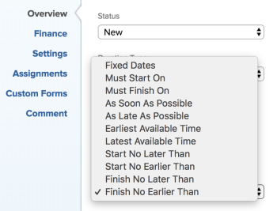

# Panoramica sui vincoli attività: Finire non prima di

Finire non prima di (FNET) è un vincolo attività che pianifica il completamento di un&#39;attività dopo la data specificata.

## Panoramica del vincolo Finire non prima del

Quando si utilizza il vincolo Finire non prima di (FNET) per un&#39;attività, tenere presente quanto segue:

* Utilizzare questo vincolo quando il progetto è programmato dalla data di completamento. In questo caso, è possibile impostare un vincolo morbido sull&#39;attività prima di forzare la visualizzazione a rischio di altre attività dipendenti.
* Quando si utilizza FNET in un progetto pianificato **Dalla data di inizio**, il vincolo pianifica l&#39;attività come se fosse programmata nel più breve tempo possibile.
* Quando si sposta o si copia un&#39;attività con un vincolo FNET in un altro progetto, il vincolo dell&#39;attività o delle date del progetto può variare a seconda delle date del vincolo e delle date di inizio e di completamento del progetto. Esistono i seguenti scenari:

   * Quando il progetto di destinazione è programmato dall’inizio:

      * Quando la data di vincolo dell&#39;attività è precedente alla data di inizio pianificata del progetto, il vincolo dell&#39;attività viene impostato su Il più presto possibile.
      * Quando la data vincolo dell&#39;attività è successiva alla data completamento pianificato del progetto, la data completamento pianificato del progetto viene modificata in modo da corrispondere alla data vincolo completamento dell&#39;attività.

   * Quando il progetto di destinazione è programmato dal completamento:

      * Quando la data vincolo dell&#39;attività è successiva alla data di completamento del progetto, il vincolo attività diventa il più tardi possibile.
      * Quando la data vincolo dell&#39;attività è precedente alla data inizio pianificata del progetto, la data inizio pianificata del progetto viene modificata in modo da corrispondere alla data vincolo inizio dell&#39;attività.

   * Indipendentemente dalla programmazione del progetto, se la data vincolo dell&#39;attività è compresa tra le date di inizio e di completamento del progetto, non verranno apportate modifiche al vincolo attività o alle date del progetto.

  Per informazioni sullo spostamento delle attività, vedere [Sposta attività](../../../manage-work/tasks/manage-tasks/move-tasks.md). Per informazioni sulla copia delle attività, vedere [Copia e duplica attività](../../../manage-work/tasks/manage-tasks/copy-and-duplicate-tasks.md).

  Per informazioni su come aggiornare il vincolo attività in un&#39;attività, vedere [Aggiornare il vincolo attività di un&#39;attività](../../../manage-work/tasks/task-constraints/update-task-constraint-of-task.md).

<!--

<h2>Use the Finish No Earlier Than constraint</h2>

(NOTE: replaced with new article linked above)&nbsp;

To update the Task Constraint to Finish No Earlier Than:

<ol>
<li value="1">Go to a task whose Task Constraint you want to update.</li>
<li value="2"> 
Click the <strong>More</strong> icon  next to the task name, then click <strong>Edit</strong>.
 </li>
<li value="3"> 
In the <strong>Overview</strong> section, expand the <strong>Task Constraint</strong> drop-down menu.
 </li>
<li value="4"> 
Select <strong>Finish No Earlier Than</strong>.
 
  
 </li>
<li value="5"> 
Specify a <strong>Planned Completion Date</strong>.
 
The task must complete no earlier than this date. 
 </li>
<li value="6">Click <strong>Save Changes.</strong> </li>
</ol>

-->
