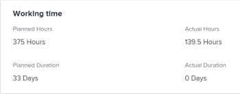

# Panoramica sull’orario pianificato

Le ore pianificate associate a un&#39;attività, un problema o un progetto rappresentano il tempo necessario agli utenti assegnati per completare l&#39;attività, il problema o il progetto.

## Considerazioni sulle ore pianificate in Adobe Workfront

* Le ore pianificate sono associate principalmente agli elementi di lavoro (attività e problemi) in Adobe Workfront. Le ore pianificate dagli articoli da lavoro si estendono fino all&#39;orario pianificato dei loro progetti.
* Per impostazione predefinita, Workfront distribuisce task ed emette ore pianificate in modo uniforme a tutti i giorni della durata dell&#39;attività o del problema.
* Quando gli utenti e i ruoli vengono assegnati a attività e problemi, le ore pianificate delle attività e dei problemi vengono associate alle assegnazioni di utenti o ruoli.
* Se si desidera utilizzare gli strumenti di gestione delle risorse in Workfront, è necessario definire il valore di Orari pianificati per le attività e i problemi.
* È possibile modificare il valore di Orari pianificati sulle attività solo per alcuni tipi di Durata.

   Per ulteriori informazioni sulla modifica delle ore pianificate sulle attività in relazione al tipo di durata delle attività, vedere la sezione [Aggiorna attività Orari pianificati in base al tipo di durata](#update-task-planned-hours-based-on-duration-type) in questo articolo.

* Puoi modificare il valore di Ora pianificata per i problemi in qualsiasi momento.
* Non è possibile modificare il valore di Orari pianificati dei progetti o delle attività principali, in quanto si tratta di un totale calcolato di tutte le ore pianificate di tutte le attività e sottoattività.
* La gestione delle allocazioni degli utenti tramite gli strumenti di gestione delle risorse potrebbe modificare il numero di ore pianificate di attività, problemi, progetti e quello delle assegnazioni associate agli elementi di lavoro.

## Ore pianificate per attività rispetto a Ore pianificate per progetti {#planned-hours-on-tasks-vs-planned-hours-on-projects}

Orari pianificati dalle attività fino alle ore pianificate del progetto. Le ore pianificate dai problemi non si estendono sempre alle ore pianificate del progetto.

Questa sezione descrive le differenze tra l&#39;attività e il progetto Orario pianificato. Descrive inoltre dove puoi visualizzare le ore pianificate dei problemi che si estendono al progetto.

* [Orario pianificato per le attività](#planned-hours-on-tasks)
* [Orario pianificato per i progetti](#planned-hours-on-projects)

### Orario pianificato per le attività {#planned-hours-on-tasks}

Le ore pianificate di un&#39;attività indicano il tempo stimato che potrebbe essere necessario per il lavoro effettivo sull&#39;attività. Per impostazione predefinita, Workfront distribuisce uniformemente la quantità totale di ore pianificate per ogni giorno entro la durata di ciascuna attività. La quantità giornaliera di ore pianificate diventa l&#39;allocazione giornaliera per l&#39;attività. Se l’attività viene assegnata a più risorse, per impostazione predefinita a ciascuna risorsa viene assegnato un importo pari a ore giornaliere.

Utilizzando il servizio di bilanciamento del carico di lavoro, puoi modificare le allocazioni giornaliere per gli utenti assegnati alle attività. In questo modo è inoltre possibile aggiornare le ore pianificate dell&#39;attività quando il tipo di durata dell&#39;attività è semplice. Per ulteriori informazioni, consulta la sezione &quot;Aggiorna le ore pianificate dell&#39;attività durante la gestione delle allocazioni degli utenti&quot; nell&#39;articolo [Gestire le allocazioni di utenti nel load balancer](../../../resource-mgmt/workload-balancer/manage-user-allocations-workload-balancer.md).

Quando un&#39;attività contiene attività secondarie, l&#39;orario pianificato dell&#39;attività principale corrisponde alla somma di tutte le ore pianificate per le sottoattività. Non è possibile aggiornare l&#39;orario pianificato di un&#39;attività padre.

>[!NOTE]
>
>A differenza delle ore pianificate, le ore effettive su un&#39;attività padre sono ore registrate direttamente sull&#39;attività padre. Non rappresentano una somma delle ore effettive delle attività figlio.\
>Per ulteriori informazioni sugli orari effettivi, vedi [Visualizza ore effettive](../../../manage-work/tasks/task-information/actual-hours.md).

### Orario pianificato per i progetti {#planned-hours-on-projects}

Non è possibile modificare la quantità di ore pianificate in un progetto. Le ore pianificate su un progetto sono una somma calcolata di tutte le ore pianificate da tutte le attività del progetto.

Se i problemi vengono inclusi nel calcolo dell’ora pianificata dipende dalla posizione all’interno del progetto in cui vengono visualizzate le ore pianificate. Puoi visualizzare le ore pianificate del progetto nelle seguenti posizioni all’interno di un progetto:

* **Dettagli progetto** **sezione** ****e **Modifica progetto**scatola **:**Vengono presi in considerazione solo gli orari pianificati per le attività del progetto. Le ore pianificate per i problemi relativi al progetto non vengono prese in considerazione quando si visualizza il numero totale di ore pianificate per il progetto nella sezione Dettagli progetto o nella casella Modifica progetto.

* **Il **Load Balancer: Solo le ore pianificate associate alle attività visibili nel servizio di bilanciamento del carico di lavoro vengono visualizzate nel servizio di bilanciamento del carico di lavoro per i progetti. Le allocazioni giornaliere degli utenti possono modificare le ore pianificate giornaliere del progetto nel servizio di bilanciamento del carico di lavoro.
* **Sezione Utilizzo :** Le ore pianificate associate agli utenti assegnati alle attività e i problemi relativi al progetto vengono presi in considerazione quando viene visualizzato il numero totale di ore pianificate per il progetto nella sezione Utilizzo .
* **Pannello Assegnazione ruolo** nell’elenco delle attività : In questa area vengono visualizzate le ore pianificate per le attività e i problemi relativi al progetto assegnati a un ruolo di lavoro o a un utente associato a un ruolo di lavoro. Le ore pianificate associate a attività e problemi non assegnati o assegnati ai team non vengono visualizzate in questa area. Per ulteriori informazioni, consulta [Visualizza le ore pianificate del progetto nel pannello Assegnazione ruolo](../../../manage-work/projects/planning-a-project/view-planed-hours-in-role-allocation-panel.md).

## Distribuzione di ore pianificate per tutta la durata di un&#39;attività

Per impostazione predefinita, Workfront distribuisce le ore pianificate in modo uniforme per tutta la durata di un&#39;attività, allocando un numero uguale di ore pianificate per ogni giorno dell&#39;attività, in base alla disponibilità della pianificazione del progetto.

Ad esempio, se un&#39;attività è impostata per iniziare alle 16.00 e la pianificazione è rimasta un&#39;ora nel primo giorno dell&#39;attività, Workfront inserisce un&#39;ora pianificata nel primo giorno dell&#39;attività Durata, quindi divide il resto dell&#39;ora pianificata equamente tra il resto dei giorni nell&#39;attività Durata.

>[!NOTE]
>
>L’allocazione giornaliera o giornaliera prevista è l’allocazione di ore pianificate per ogni giorno durante la durata dell’attività. Se l&#39;attività dispone di un&#39;assegnazione, questo numero rappresenta le ore pianificate per giorno per assegnazione. Se l&#39;attività dispone di più assegnazioni, l&#39;orario pianificato per giorno per assegnazione è diverso dall&#39;orario pianificato per giorno per l&#39;attività. In Workfront non è disponibile alcuna rappresentazione visiva per le ore pianificate per giorno per assegnazione, per le attività con più assegnazioni.

## Individuare e comprendere i valori dell’ora pianificata

Puoi trovare i valori di Ora pianificata in diverse aree di Workfront. 

Il numero di ore pianificate visualizzate deriva dagli elementi di lavoro del progetto o viene calcolato in modo diverso a seconda dell&#39;area e dell&#39;oggetto in cui vengono visualizzate.

È possibile individuare le ore pianificate nelle seguenti aree di Workfront:

* [Sezione Dettagli di un progetto, un&#39;attività o un problema](#the-details-section-of-a-project-task-or-issue)
* [Casella Modifica attività o Modifica problema](#the-edit-task-or-edit-issue-box)
* [Report](#reports)
* [Il servizio di bilanciamento del carico di lavoro](#the-workload-balancer)
* [Planner risorse](#the-resource-planner)
* [Rapporto Utilizzo](#the-utilization-report)
* [Pannello Assegnazione ruolo](#The%C2%A0Role)

### Sezione Dettagli di un progetto, un&#39;attività o un problema {#the-details-section-of-a-project-task-or-issue}

Le ore pianificate nella sezione Dettagli di un&#39;attività, di un problema o di un progetto sono le ore pianificate totali associate al rispettivo elemento.

Per ulteriori informazioni sull&#39;orario pianificato del progetto, consulta la sezione [Ore pianificate per attività rispetto a Ore pianificate per progetti](#planned-hours-on-tasks-vs-planned-hours-on-projects) in questo articolo.

### Casella Modifica attività o Modifica problema {#the-edit-task-or-edit-issue-box}

Le ore pianificate nella casella Modifica di un&#39;attività o di un problema sono le ore pianificate totali del rispettivo elemento.

Per ulteriori informazioni sull&#39;orario pianificato del progetto, consulta la sezione [Ore pianificate per attività rispetto a Ore pianificate per progetti](#planned-hours-on-tasks-vs-planned-hours-on-projects) in questo articolo.

Per le attività, è possibile modificare la quantità di ore pianificate solo per determinati tipi di durata. Per informazioni consulta [Aggiorna attività Orari pianificati in base al tipo di durata](#update-task-planned-hours-based-on-duration-type) in questo articolo.

È possibile visualizzare la singola allocazione di Ore pianificate per ogni utente o ruolo di lavoro assegnato all&#39;attività o al problema nell&#39;area Assegnazioni.

### Report {#reports}

È possibile aggiungere il campo Orari pianificati nei rapporti relativi a progetti, attività ed emissioni.

Per impostazione predefinita, la colonna Ora pianificata è inclusa nella visualizzazione Standard di un elenco di attività.

Le ore pianificate di un&#39;attività, di un problema o di un rapporto di progetto sono le ore pianificate totali del rispettivo elemento visualizzate nella sezione Dettagli o nella casella Modifica degli elementi.

Per informazioni sulla creazione di rapporti, consulta [Creare un rapporto personalizzato](../../../reports-and-dashboards/reports/creating-and-managing-reports/create-custom-report.md).

>[!NOTE]
>
>Se si crea un rapporto Progetto (dati finanziari) e lo si raggruppa per data, è possibile che nelle ore Pianificate venga visualizzata una parte delle ore Pianificate del progetto, a seconda della cronologia delle attività del progetto. Per impostazione predefinita, in Workfront le ore pianificate delle attività vengono distribuite in modo uniforme per ogni giorno della durata dell&#39;attività. Le ore pianificate per un determinato intervallo di tempo corrispondono a quelle di distribuzione uguali impostate da Workfront per tale intervallo di tempo nel rapporto Progetto (dati finanziari) .

<!--
### The Scheduling areas  {#the-scheduling-areas}

The Planned Hours for tasks and issues display in the Scheduling areas in the Planned Hours field.

You can view the daily allocation of Planned Hours for each user assigned to a task or an issue in the Scheduling areas.

The daily hour amount represents one of the following:

* the default amount equally distributed by Workfront for each day of the Duration of the tasks or issues
* the adjusted daily allocation managed by resource managers.

  For information about adjusting daily allocations in the Scheduling tools, see [Manage user allocations in the Scheduling areas](../../../resource-mgmt/resource-scheduling/manage-allocations-scheduling-areas.md).
-->

### Il servizio di bilanciamento del carico di lavoro {#the-workload-balancer}

Le seguenti ore pianificate per attività, problemi e progetti vengono visualizzate nel servizio di bilanciamento del carico di lavoro a destra del nome dell&#39;attività, del problema o del progetto:

* Per le attività e i problemi, viene visualizzato l’orario pianificato associato a tali attività.
* Per i progetti, un totale di ore pianificate dalle attività e dai problemi visibili sullo schermo.

   >[!TIP]
   >
   >Il servizio di bilanciamento del carico di lavoro non visualizza tutte le ore pianificate di un progetto come visibili nell’area Dettagli progetto.

È possibile visualizzare l&#39;allocazione giornaliera delle ore pianificate per ogni utente assegnato a un&#39;attività o a un problema nel servizio di bilanciamento del carico di lavoro.

La quantità giornaliera di ore pianificate rappresenta una delle seguenti: 

* l’importo predefinito equamente distribuito da Workfront per ogni giorno della Durata delle attività, dei problemi o del progetto
* l’allocazione giornaliera corretta gestita dai gestori delle risorse.

   Per informazioni sulla regolazione delle allocazioni giornaliere nel servizio di bilanciamento del carico di lavoro , consulta [Gestire le allocazioni di utenti nel load balancer](../../../resource-mgmt/workload-balancer/manage-user-allocations-workload-balancer.md).

### Planner risorse {#the-resource-planner}

In planner risorse viene visualizzato l&#39;orario pianificato per progetti, attività, problemi.

È possibile visualizzare le allocazioni settimanali di Orari pianificati per gli utenti e i ruoli di lavoro associati agli elementi di lavoro nella colonna PLN del Planner risorse.

>[!TIP]
>
>Gli adeguamenti giornalieri dell&#39;allocazione nel workload Balancer influenzano le allocazioni settimanali per le attività e i problemi nel Resource Planner.

Il numero di ore pianificate per ciascun oggetto varia a seconda della visualizzazione applicata al planner risorse. Per ulteriori informazioni, consulta [Panoramica delle informazioni su ore, FTE e costi nelle visualizzazioni Progetto e Ruolo del Planner risorse](../../../resource-mgmt/resource-planning/overview-of-planner-hour-fte-cost-information-in-role-project-views.md).

La quantità settimanale di ore pianificate per attività e problemi rappresenta una delle seguenti: 

* l&#39;importo settimanale predefinito equamente distribuito da Workfront per ogni giorno della Durata delle attività o dei problemi
* l’allocazione settimanale corretta gestita dai gestori delle risorse nel servizio di bilanciamento del carico di lavoro.

   Per informazioni sulla regolazione delle allocazioni giornaliere nel servizio di bilanciamento del carico di lavoro , consulta [Gestire le allocazioni di utenti nel load balancer](../../../resource-mgmt/workload-balancer/manage-user-allocations-workload-balancer.md).

L’importo settimanale per i progetti, gli utenti e i ruoli è influenzato dalle quantità settimanali di ore pianificate per le attività e i problemi ad essi associati.

### Rapporto Utilizzo {#the-utilization-report}

Il progetto Orari pianificati è quello associato alle assegnazioni di ogni attività e problema.

>[!IMPORTANT]
>
>Le ore pianificate nel rapporto Utilizzo sono associate alle assegnazioni e non alle attività e ai problemi stessi. Le ore pianificate nel rapporto Utilizzo non corrispondono sempre alle ore pianificate sulle attività e sui problemi del progetto. Tuttavia, le ore pianificate corrispondono alle ore associate alle assegnazioni per attività e problemi.

Nel rapporto Utilizzo è possibile visualizzare i seguenti tipi di ore pianificate:

* l&#39;orario totale programmato di tutte le assegnazioni del progetto per la durata complessiva dei progetti inclusi
* il totale delle ore pianificate di tutte le assegnazioni solo per l&#39;intervallo di date specificato (è possibile specificare una singola settimana o un mese).

   Quando l&#39;allocazione giornaliera dell&#39;utente per le ore è stata regolata utilizzando il servizio di bilanciamento del carico di lavoro, le ore pianificate per un intervallo di date specifico possono essere influenzate se le date selezionate nel rapporto Utilizzo contengono solo una parte della durata di un&#39;attività o di un problema. Per informazioni sulla regolazione delle allocazioni giornaliere per gli utenti, consulta [Gestire le allocazioni di utenti nel load balancer](../../../resource-mgmt/workload-balancer/manage-user-allocations-workload-balancer.md).

Per ulteriori informazioni, consulta [Visualizza informazioni sull’utilizzo delle risorse](../../../resource-mgmt/resource-utilization/view-utilization-information.md).

### Pannello Assegnazione ruolo

Le ore pianificate nel pannello Assegnazione ruolo rappresentano il numero di ore pianificate associate a ciascun ruolo di lavoro assegnato alle attività o ai problemi del progetto per la durata totale del progetto. Il numero corrisponde al ruolo Orari pianificati dal planner risorse.

>[!TIP]
Tieni presente che l’orario pianificato associato agli utenti non viene visualizzato nel pannello Assegnazione ruolo .

Per ulteriori informazioni, consulta [Mostra l’allocazione dei ruoli per progetti e iniziative nel servizio di bilanciamento del carico di lavoro](../../../scenario-planner/show-role-allocation-workload-balancer.md).

## Aggiorna attività Orari pianificati in base al tipo di durata {#update-task-planned-hours-based-on-duration-type}

È possibile aggiornare le ore pianificate totali sulle attività quando si modificano le attività solo se le attività hanno un determinato tipo di durata.

Esistono i seguenti scenari:

* È possibile modificare le ore pianificate per le attività solo quando si utilizzano i tipi di assegnazione calcolata o di durata semplice durante la modifica di un&#39;attività.

   Per ulteriori informazioni sul tipo di durata dell&#39;assegnazione calcolata, vedere [Panoramica sul tipo di durata: Assegnazione calcolata](../../../manage-work/tasks/taskdurtn/calculated-assignment.md).

   Per ulteriori informazioni sul tipo di durata semplice, consulta [Panoramica sul tipo di durata: Semplice](../../../manage-work/tasks/taskdurtn/simple-duration-type.md).

* È possibile aggiornare le ore pianificate dell&#39;attività nel servizio di bilanciamento del carico di lavoro solo per le attività di tipo di durata semplice quando si gestiscono le allocazioni degli utenti alle attività. Per informazioni sulla gestione delle allocazioni degli utenti nel servizio di bilanciamento del carico di lavoro, vedi [Gestire le allocazioni di utenti nel load balancer](../../../resource-mgmt/workload-balancer/manage-user-allocations-workload-balancer.md).
* Non è possibile modificare le ore pianificate per le attività con un tipo di sforzo di durata guidato o lavoro calcolato. In questi casi, Workfront determina le ore pianificate in base alla durata dell&#39;attività; tuttavia, in questo caso le ore pianificate sono sempre uguali alla durata (in ore) e non sono influenzate dall’allocazione percentuale delle risorse assegnate.

   Per ulteriori informazioni sul tipo di durata guidata sforzo, consulta [Panoramica sul tipo di durata: Guida allo sforzo](../../../manage-work/tasks/taskdurtn/effort-driven.md).

   Per ulteriori informazioni sul tipo di durata del lavoro calcolato, vedere [Panoramica sul tipo di durata: Lavoro calcolato](../../../manage-work/tasks/taskdurtn/calculated-work.md).

## Aggiorna le ore pianificate dell&#39;attività durante la gestione delle allocazioni degli utenti

È possibile aggiornare l&#39;orario pianificato per le attività quando si aggiornano manualmente le allocazioni dei ruoli utente o processo alle attività. Questo è possibile solo quando le attività hanno un tipo di durata semplice.

Per ulteriori informazioni, consulta [Panoramica sul tipo di durata: Semplice](../../../manage-work/tasks/taskdurtn/simple-duration-type.md).

È possibile aggiornare l&#39;allocazione complessiva degli utenti e dei ruoli assegnati all&#39;attività oppure le allocazioni giornaliere dell&#39;utente quando si utilizza il servizio di bilanciamento del carico di lavoro.

Per informazioni sulla gestione delle allocazioni complessive di ruoli utente e processo per le attività, vedere [Gestione delle ore di allocazione di utenti e ruoli sulle attività](../../../manage-work/tasks/assign-tasks/manage-allocation-hours-on-tasks.md).

Per informazioni sulla gestione delle allocazioni giornaliere per le attività, vedere [Gestire le allocazioni di utenti nel load balancer](../../../resource-mgmt/workload-balancer/manage-user-allocations-workload-balancer.md).

Esistono i seguenti scenari quando si aggiornano manualmente le allocazioni dei ruoli utente o processo per le attività:

* Se non è stato eseguito l&#39;aggiornamento manuale delle allocazioni dei singoli utenti o ruoli per attivare una modifica all&#39;attività Orari pianificati, le ore pianificate rimangono invariate quando si aggiungono, rimuovono o sostituiscono le assegnazioni nell&#39;attività. Quando si aggiunge una nuova assegnazione all&#39;attività, le singole allocazioni vengono ridistribuite tra tutti gli assegnatari.
* Dopo aver aggiornato manualmente le allocazioni per attivare una modifica all&#39;attività Orari pianificati, l&#39;ora pianificata diminuisce quando si rimuovono le assegnazioni dall&#39;attività. Rimangono invariati quando si sostituisce un&#39;assegnazione.
* Dopo aver aggiornato manualmente le allocazioni per attivare una modifica all&#39;attività Orari pianificati e aver aggiunto un&#39;assegnazione all&#39;attività, per impostazione predefinita la nuova assegnazione viene allocata 0 ore. È necessario aggiornare manualmente l&#39;allocazione all&#39;attività che potrebbe influenzare l&#39;orario pianificato.
* Se le allocazioni non sono state aggiornate manualmente per attivare una modifica all&#39;attività Orari pianificati e si rimuovono tutte le assegnazioni all&#39;attività, le ore pianificate rimangono invariate.
* Quando si sono aggiornate manualmente le allocazioni per attivare una modifica all&#39;attività Orari pianificati e si rimuovono tutte le assegnazioni all&#39;attività, vengono rimosse anche le ore pianificate e l&#39;ora pianificata dell&#39;attività diventa 0.

>[!NOTE]
Ad esempio, se un&#39;attività ha 10 ore pianificate e si dispone di due assegnatari, ciascuno di essi è assegnato 5 ore ciascuna, per impostazione predefinita.
* Se non si aggiorna l&#39;allocazione di singoli utenti o le allocazioni giornaliere utilizzando il load balancer e si rimuovono una o tutte le assegnatarie dall&#39;attività, l&#39;attività Orari pianificati rimane di 10 ore.
* Se si modificano manualmente le allocazioni delle assegnazioni a 4 e 6 ore, rispettivamente, e si rimuove l&#39;utente allocato a 6 ore e il relativo ruolo, l&#39;attività Orari pianificati viene aggiornata a 4 ore. Se si rimuove anche l&#39;utente allocato a 4 ore ma che mantiene il ruolo di lavoro associato all&#39;utente rimosso, l&#39;orario pianificato dell&#39;attività rimane di 4 ore. Se si rimuove l&#39;ultimo utente allocato a 4 ore e il relativo ruolo e l&#39;attività rimane non assegnata, l&#39;attività Orario pianificato dell&#39;attività diventa 0.

## Aggiorna automaticamente le ore pianificate dell&#39;attività utilizzando lo sforzo di lavoro

Quando si utilizza l&#39;impegno di lavoro per stimare lo sforzo necessario per il completamento di un&#39;attività, la quantità di ore pianificate per le attività viene aggiornata automaticamente. Questo è possibile solo per le attività con un tipo di durata semplice.

Per informazioni sull&#39;utilizzo dello sforzo di lavoro per stimare lo sforzo dell&#39;attività, vedere [Panoramica sullo sforzo di lavoro](../../../manage-work/tasks/task-information/work-effort.md).

<!--

(NOTE: this issue has the explanation of how Planned Hours should work - from Vazgen and Anna: https://hub.workfront.com/issue/6217dced00730b7034c4b808339a35ce/

-->

<!--

Details of their comments: 

-->

<!--

Anna Asatryan

3/22/2022 At 3:16 PM

&nbsp;

to Mark Paul, Corrie Butler, Arman Simonyan, Gagik Khalatyan, Alina Wilson, Artur Sargsyan, Vazgen Babayan, Anna Asatryan

I have done some rough calculations on what the planned hours/revenues should look like Book.xlsx . And if we look, for example at the 2 users highlighted in one of the screenshots their planned hours look way off from what the calculation looks like in the spreadsheet (i.e. equally distributed allocation). When looking at the Workload balancer (the second screenshot), as an example for the user Yashas Mitta, I can see that the allocation has been modified. Obviously the utilization report calculates the allocations based on the modified contouring using the new work per day calculation. The project financial report uses the old, equal distribution of allocation along the full duration of the task. Hence. there is a difference when grouping per periods.

Vazgen Babayan

I believe we will need to prioritise syncing the project financial data report with the new work per day.

Alina Wilson

@Anna Asatryan , do you have a definition of what we should say in documentation (glossary, for example) for how the Planned Hours (or Planned Revenue) is calculated, keeping in mind that we don't document the concept of "workPerDay". We call them "daily allocations", for example, but let me know if that's accurate, too.

Vazgen Babayan

Last Thursday at 3:13 PM

I think an important note here is that regardless the calculation, even if the both views used the same formula, they will not display the same data, because the underlying data sources are different. The Financial Data report does not respect user-entered allocations in Workload Balancer at this moment. So there will be a clear discrepancy, as Anna showed in her message. My recommendation for communication will be to explain that the data sources are different so there can be a mismatch in data and that we will look into addressing that on our roadmap.

Alina Wilson

So far, I hear you guys say this (with my questions for confirmation/ comments in bold):

- the utilization report calculates the allocations based on the modified contouring using the new work per day calculation (so this is what we see in the Workload Balancer, right?)

- the project financial report uses the old, equal distribution of allocation along the full duration of the task (this is before the daily allocations for example were modified in the WB, right?)

I have these additional questions:

- what does the Project Details show? Which Planned Hours, for instance - because earlier, we had a question about this also. - which numbers?

- what does any Planned Hours/ Planned Revenue field that can be pulled in any other report (outside of Financial Data and Utilization reports) show? - which numbers?

- are there any other areas I am not thinking of that we need to document, @Corrie Butler

I will try to document all the possible areas where these display but please help. Thanks!

Vazgen Babayan

Last Saturday at 3:41 PM

<ul>
<li> 
Confirming the first two points 
 </li>
</ul>

For the following questions

<ul>
<li> 
Project details show an aggregated sum of task planned hours. It doesn't have anything to do with the work per day because it always deals with total numbers for the whole duration of the Project/Task.
 </li>
<li> 
Same thing applies to the Planned Hours and Planned Revenue fields in reports - they show totals for the whole Project/Task duration and thus have no use of work per day.
 </li>
<li> 
Can't think of any other fields related to this right now.
 </li>
<li> 
In general, if I were to summarize the system behavior, it's as follows:
 </li>
<li> 
Every area that only deals with total numbers of Planned Hours / Planned Revenue, uses the numbers entered on the tasks. Those are Task / Project Details, reports exposing those fields.
 </li>
<li> 
Areas that deal with time-sensitive portions of Planned Hours / Planned Revenue, use work per day. Those are all Resource Management tools - Workload Balancer, Resource Planner, Utilization Report, importing projects via Scenario Planner.
 </li>
<li> 
All the areas in the second point support user-edited allocations made in Workload Balancer.
 </li>
<li> 
Scheduling area and Project Financial Data reports use the old version of the work per day, which doesn't respect user-edited allocations from Workload Balancer.
 </li>
<li> 
Scheduling will be removed this year, and we need to do work to move the Project Financial Data reports to the new work per day sometime after Q3.
 </li>
</ul>

Alina Wilson

@Vazgen Babayan , one clarifying question: when you say "Scheduling and Project Financial Data reports use the old version of the work per day, which doesn't respect user-edited allocations from WB" - you mean that those use the system default which spreads the allocations evenly, correct? Because you can edit (daily) allocations in Scheduling tools, but it doesn't use that, correct? It uses the default of the daily allocation that the system figures out when dividing the Planned Hours by the number of days in the Duration. Please let me know. And thanks!

Anna Asatryan

Yesterday at 11:42 AM

@Alina Wilson , that's correct, when saying "Scheduling and Project Financial Data reports use the old version of the work per day, which doesn't respect user-edited allocations from WB" Vazgen meant that it spreads the allocation evenly.

As for the scheduling, the allocation modification that's being done there isn't reflected anywhere else in the application other than in the Scheduling itself. That's probably one of the reasons it's being deprecated.

-->

<!--

   

-->

<!--

(NOTE: everything below is drafted because I replaced it with the table above)

-->

<!--

You can find the Planned Hours information on tasks, issues, or projects in the following locations:

-->

<!--

The Planned Hours in the Details  section  of a task, issue, or project are the total Planned Hours of the respective item. 

Finding the Planned Hours in the Details  section  is identical for tasks, issues, and projects. 
 <note type="tip">
You cannot edit the Planned Hours of projects manually, as they are a calculation of all Planned Hours of all the tasks on the project.
</note>

To locate the Planned Hours value on the Details  section  of a task: 

<ol>
<li value="1">Go to a task for which you want to review the Planned Hours.</li>
<li value="2"> 
Click <strong>Task Details</strong> in the left panel. 
 </li>
<li value="3"> 
Click the <strong>Overview</strong> area and notice the Planned Hours value.
 
This value represents the time it would take the user assigned to the task to complete it. 
 </li>
</ol>

-->

<!--

<h3> </h3>

The Planned Hours in the Edit box of a task, issue, or project are the total Planned Hours of the respective item. 

Finding the Planned Hours while editing a task or an issue is identical. 
 <note type="tip">
You cannot edit the Planned Hours of projects manually, as they are a calculation of all Planned Hours of all the tasks on the project.
</note>

To locate the value of Planned Hours while editing a task:

<ol>
<li value="1">Go to the task or issue you want to view Planned Hours for.</li>
<li value="2"> 
Click the <strong>More</strong> icon  next to the task name, then click <strong>Edit</strong>.
 
The Planned Hours are located in the <strong>Overview</strong> section. 
 </li>
</ol>

-->

<!--

The Planned Hours column is included in the Standard view of a task list, by default. For issues and projects, you can add it to the view, when you are editing the view or when you build a report. 

The Planned Hours in a task, issue, or project report are the total Planned Hours of the respective item as they display in the Details  section  or the Edit box of the items. 

Adding the Planned Hours column to a project view is similar to building a view in a project report. 

To show Planned Hours in a project report:

<ol>
<li value="1"> 
Click the <strong>Main Menu</strong> icon  in the upper-right corner of Workfront, then click <strong>Reports</strong>. 
 </li>
<li value="2">Click <strong>New Report</strong>, then choose <strong>Project</strong> as your object.</li>
<li value="3">Click <strong>Add Column</strong>, and start typing <strong>Planned Hours</strong> when the <strong>Show in this column</strong> drop-down field is displayed. Select the field when it appears in the list.</li>
<li value="4"> 
Click <strong>Save + Close</strong> to save the report. 
 
The Planned Hours column shows the total number of Planned Hours on each project. 
 </li>
</ol>

-->

<!--

Planned Hours in Resource Management tools
 <note type="important">
When viewing Planned Hours in the Resource Management tools by a specific time frame, the daily allocations for each work item and the daily allocations for the resources assigned to the work items during that time frame can influence the daily Planned Hours of projects or work items.
</note>

You can see the value of Planned Hours for your tasks, issues, or projects when using the following Resource Management tools:

<ul>
<li> 
Resource Planner
 
For information about using the Resource Planner, see <a href="../../../resource-mgmt/resource-planning/get-started-resource-planner.md" class="MCXref xref">Resource Planner overview</a>.
 </li>
<li> 
Utilization Report.
 
For information about the utilization report, see <a href="../../../reports-and-dashboards/reports/using-built-in-reports/resource-utilization-report.md" class="MCXref xref">Overview of the Resource Utilization report</a>.
 </li>
<li>

Workload Balancer or Scheduling areas in the following sections:

<ul>
<li>Scheduling or Workload Balancer sections in the Resourcing area</li>
<li>Scheduling or Workload Balancer section at the project level</li>
<li>Schedule or Workload Balancer section at the team level</li>
</ul>

 
For information about scheduling resources, see <a href="../../../resource-mgmt/resource-scheduling/get-started-resource-scheduling.md" class="MCXref xref">Get started with Resource Scheduling</a>.
 
For information about the Workload Balancer, see <a href="../../../resource-mgmt/workload-balancer/overview-workload-balancer.md" class="MCXref xref">Overview of the Workload Balancer</a>. 
 </li>
<li> 
<b>Role Allocation panel</b> in the project  task list or  Workload Balancer: The Planned Hours for the tasks and the issues on the project that are assigned to a job role or a user associated with a job role are taken into account in this area. For more information, see <a href="../../../manage-work/projects/planning-a-project/view-planed-hours-in-role-allocation-panel.md" class="MCXref xref">View project Planned Hours in the Role Allocation panel</a>. 
 </li>
</ul>

-->
