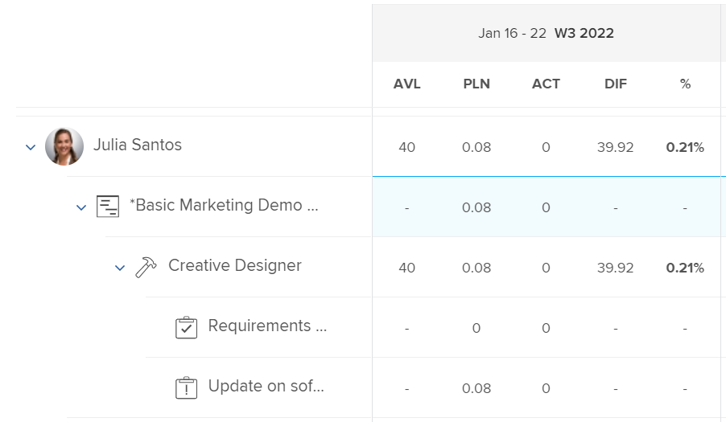

# Panoramica sulle ore pianificate

<!-- Audited: 01/2024 -->

Le ore pianificate associate a un&#39;attività, un problema o un progetto rappresentano il tempo necessario affinché gli utenti assegnati possano completare l&#39;attività, il problema o il progetto.

## Considerazioni sulle ore pianificate in Adobe Workfront

* Le ore pianificate sono associate principalmente agli elementi di lavoro (attività e problemi) in Adobe Workfront. Le Ore pianificate dagli elementi di lavoro vengono riportate nelle Ore pianificate dei relativi progetti.
* Per impostazione predefinita, Workfront distribuisce le ore pianificate per attività e problemi in modo uniforme a tutti i giorni della Durata dell’attività o del problema.
* Quando utenti e ruoli vengono assegnati ad attività e problemi, le ore pianificate delle attività e dei problemi vengono associate alle assegnazioni di utenti o ruoli.
* Se desideri utilizzare gli strumenti di Gestione risorse in Workfront, devi definire il valore di Ore pianificate per le attività e i problemi.
* È possibile modificare il valore di Ore pianificate sulle attività solo per alcuni Tipi di durata.

  Per ulteriori informazioni sulla modifica delle ore pianificate sulle attività in relazione al tipo di durata delle attività, vedere la sezione [Aggiorna le ore pianificate dell&#39;attività in base al tipo di durata](#update-task-planned-hours-based-on-duration-type) in questo articolo.

* Puoi modificare il valore di Ore pianificate sui problemi in qualsiasi momento.
* Non è possibile modificare il valore di Ore pianificate dei progetti o delle attività padre, in quanto si tratta di un totale calcolato di tutte le Ore pianificate di tutte le relative attività e sottoattività.
* La gestione delle allocazioni degli utenti mediante gli strumenti di gestione delle risorse può modificare il numero di ore pianificate per attività, problemi e progetti e quello delle assegnazioni associate agli elementi di lavoro.

## Ore pianificate sulle attività rispetto alle ore pianificate sui progetti {#planned-hours-on-tasks-vs-planned-hours-on-projects}

Le Ore Pianificate dalle attività vengono riportate alle Ore Pianificate del progetto. Le ore pianificate da problemi non sempre vengono aggregate alle ore pianificate del progetto.

In questa sezione vengono descritte le differenze tra l&#39;attività e le ore pianificate del progetto. Descrive anche dove puoi visualizzare le ore pianificate del problema riportate nel progetto.

### Ore pianificate per le attività {#planned-hours-on-tasks}

Le ore pianificate di un&#39;attività indicano la quantità di tempo stimata che il lavoro effettivo potrebbe richiedere. Per impostazione predefinita, Workfront distribuisce la quantità totale di ore pianificate in modo uniforme per ogni giorno all&#39;interno della durata di ogni attività. La quantità giornaliera di ore pianificate diventa le allocazioni giornaliere per l&#39;attività. Se l&#39;attività è assegnata a più risorse, per impostazione predefinita a ciascuna risorsa viene assegnata una quantità uguale di ore giornaliere.

Utilizzando il Bilanciatore dei carichi di lavoro, è possibile modificare le allocazioni giornaliere per gli utenti assegnati alle attività. Questo può anche aggiornare le ore pianificate dell&#39;attività quando il tipo di durata dell&#39;attività è Semplice. Per ulteriori informazioni, consulta la sezione &quot;Aggiornare le ore pianificate per l’attività durante la gestione delle allocazioni degli utenti&quot; nell’articolo [Gestire le allocazioni utente nel Bilanciatore dei carichi di lavoro](../../../resource-mgmt/workload-balancer/manage-user-allocations-workload-balancer.md).

Quando un&#39;attività contiene sottoattività, le ore pianificate dell&#39;attività padre corrispondono alla somma di tutte le ore pianificate di tutte le sottoattività. Non è possibile aggiornare le ore pianificate di un&#39;attività padre.

>[!NOTE]
>
>A differenza delle ore pianificate, le ore effettive di un&#39;attività padre sono ore registrate direttamente sull&#39;attività padre. Non rappresentano una somma delle ore effettive delle attività figlio.\
>Per ulteriori informazioni sulle ore effettive, consulta [Visualizza ore effettive](../../../manage-work/tasks/task-information/actual-hours.md).

### Ore pianificate nei progetti {#planned-hours-on-projects}

Non puoi modificare la quantità di Ore Pianificate su un progetto. Le ore pianificate in un progetto sono una somma calcolata di tutte le ore pianificate di tutte le attività del progetto.

Se i problemi sono inclusi nel calcolo per le ore pianificate dipende dalla posizione all&#39;interno del progetto in cui visualizzi le ore pianificate. Puoi visualizzare le ore pianificate del progetto nelle seguenti posizioni all’interno di un progetto:

* **Sezione Project Details (Dettagli progetto) e casella Edit Project (Modifica progetto)**: vengono considerate solo le ore pianificate per le attività del progetto. Le ore pianificate per i problemi del progetto non vengono considerate quando si visualizza il numero totale di ore pianificate per il progetto nella sezione Dettagli progetto o nella casella Modifica progetto.

* **Il Bilanciatore dei carichi di lavoro**: nel Bilanciatore dei carichi di lavoro per i progetti vengono visualizzate solo le ore pianificate associate alle attività visibili nel Bilanciatore dei carichi di lavoro. Le allocazioni giornaliere degli utenti possono modificare le ore pianificate giornaliere del progetto nel Bilanciatore dei carichi di lavoro.
* **Sezione Utilizzo**: le ore pianificate associate agli utenti assegnati alle attività e i problemi del progetto vengono presi in considerazione quando si visualizza il numero totale di ore pianificate per il progetto nella sezione Utilizzo.
* **Pannello Allocazione ruoli** nell’elenco delle attività: in quest’area vengono visualizzate le ore pianificate per le attività e i problemi del progetto assegnati a una mansione o a un utente associato a una mansione. Le ore pianificate associate ad attività e problemi non assegnati o assegnati ai team non vengono visualizzate in quest’area. Per ulteriori informazioni, consulta [Visualizza le ore pianificate per il progetto nel pannello Allocazione ruoli](../../../manage-work/projects/planning-a-project/view-planed-hours-in-role-allocation-panel.md).

## Distribuzione delle ore pianificate per la durata di un&#39;attività

Per impostazione predefinita, Workfront distribuisce le ore pianificate in modo uniforme per la durata di un&#39;attività, allocando un numero uguale di ore pianificate per ogni giorno dell&#39;attività, in base alla disponibilità della pianificazione del progetto.

Se ad esempio un&#39;attività è impostata per iniziare alle 16 e alla pianificazione manca un&#39;ora nel primo giorno dell&#39;attività, Workfront inserisce un&#39;ora pianificata nel primo giorno della durata dell&#39;attività, quindi divide il resto delle ore pianificate equamente tra il resto dei giorni della durata dell&#39;attività.

>[!NOTE]
>
>Le ore pianificate al giorno o l&#39;allocazione giornaliera è l&#39;allocazione delle ore pianificate per ogni giorno durante la durata dell&#39;attività. Se l&#39;attività ha un&#39;assegnazione, questo numero rappresenta le ore pianificate al giorno per assegnazione. Se l&#39;attività ha più assegnazioni, le ore pianificate al giorno per ogni assegnazione sono diverse dalle ore pianificate al giorno per l&#39;attività. In Workfront non è disponibile alcuna rappresentazione visiva per le ore pianificate al giorno per assegnazione, per le attività con più assegnazioni.

## Individuare e comprendere i valori delle ore pianificate

Puoi trovare i valori delle ore pianificate in varie aree di Workfront.

Il numero di ore pianificate visualizzate proviene dagli elementi di lavoro del progetto o viene calcolato in modo diverso a seconda dell’area e dell’oggetto in cui vengono visualizzate.

Puoi individuare le ore pianificate nelle seguenti aree di Workfront:

* [La sezione Dettagli di un progetto, attività o problema](#the-details-section-of-a-project-task-or-issue)
* [Casella Modifica attività o Modifica problema](#the-edit-task-or-edit-issue-box)
* [Rapporti](#reports)
* [Il Bilanciatore dei carichi di lavoro](#the-workload-balancer)
* [Pianificazione risorse](#the-resource-planner)
* [Rapporto Utilizzo](#the-utilization-report)
* [Pannello Allocazione ruoli](#the-role-allocation-panel)

### La sezione Dettagli di un progetto, attività o problema {#the-details-section-of-a-project-task-or-issue}

Le Ore pianificate nella sezione Dettagli di un&#39;attività, un problema o un progetto sono le ore pianificate totali associate all&#39;articolo.

Per ulteriori informazioni sulle ore pianificate per il progetto, vedi [Ore pianificate sulle attività rispetto alle ore pianificate sui progetti](#planned-hours-on-tasks-vs-planned-hours-on-projects) in questo articolo.

### Casella Modifica attività o Modifica problema {#the-edit-task-or-edit-issue-box}

Le Ore pianificate nella casella Modifica di un’attività o di un problema corrispondono al totale delle Ore pianificate del rispettivo elemento.

Per ulteriori informazioni sulle ore pianificate per il progetto, vedi [Ore pianificate sulle attività rispetto alle ore pianificate sui progetti](#planned-hours-on-tasks-vs-planned-hours-on-projects) in questo articolo.

Per le attività, è possibile modificare la quantità di ore pianificate solo per determinati tipi di durata. Per informazioni, vedere [Aggiorna le ore pianificate dell&#39;attività in base al tipo di durata](#update-task-planned-hours-based-on-duration-type) in questo articolo.

È possibile visualizzare la singola allocazione di ore pianificate per ogni utente o mansione assegnata all&#39;attività o al problema nell&#39;area Assegnazioni.

### Report {#reports}

Puoi aggiungere il campo Ore pianificate nei rapporti su progetti, attività e problemi.

Per impostazione predefinita, la colonna Ore pianificate è inclusa nella visualizzazione Standard di un elenco di attività.

Le ore pianificate in un rapporto di attività, problema o progetto sono le ore pianificate totali del rispettivo elemento visualizzate nella sezione Dettagli o nella casella Modifica degli elementi.

Per informazioni sulla creazione di rapporti, consulta [Creare un rapporto personalizzato](../../../reports-and-dashboards/reports/creating-and-managing-reports/create-custom-report.md).

>[!NOTE]
>
>Se si crea un report Progetto (Dati finanziari) e lo si raggruppa per data, le ore pianificate potrebbero visualizzare una parte delle ore pianificate del progetto a seconda della sequenza temporale delle attività del progetto. Per impostazione predefinita, Workfront distribuisce le ore pianificate delle attività in modo uniforme per ogni giorno della durata dell&#39;attività. Le ore pianificate per un determinato intervallo di tempo corrispondono alla distribuzione uguale impostata da Workfront per tale intervallo di tempo nel rapporto Progetto (Dati finanziari).

<!--
### The Scheduling areas  {#the-scheduling-areas}

The Planned Hours for tasks and issues display in the Scheduling areas in the Planned Hours field.

You can view the daily allocation of Planned Hours for each user assigned to a task or an issue in the Scheduling areas.

The daily hour amount represents one of the following:

* the default amount equally distributed by Workfront for each day of the Duration of the tasks or issues
* the adjusted daily allocation managed by resource managers.

  For information about adjusting daily allocations in the Scheduling tools, see [Manage user allocations in the Scheduling areas](../../../resource-mgmt/resource-scheduling/manage-allocations-scheduling-areas.md).
-->

### Il Bilanciatore dei carichi di lavoro {#the-workload-balancer}

Le ore pianificate seguenti per attività, problemi e progetti vengono visualizzate nel Bilanciatore dei carichi di lavoro a destra del nome dell’attività, del problema o del progetto:

* Per le attività e i problemi, vengono visualizzate le ore pianificate ad esse associate.
* Per i progetti, viene visualizzato un totale di ore pianificate per le attività e i problemi visibili sullo schermo.

  >[!TIP]
  >
  >Il Bilanciatore dei carichi di lavoro non mostra tutte le ore pianificate di un progetto come visibili nell’area Dettagli progetto.

Puoi visualizzare l’allocazione giornaliera delle ore pianificate per ogni utente assegnato a un’attività o a un problema nel Bilanciatore dei carichi di lavoro.

La quantità giornaliera di ore pianificate rappresenta uno dei seguenti valori: 

* l&#39;importo predefinito distribuito equamente da Workfront per ogni giorno della Durata delle attività, delle emissioni o del progetto
* allocazione giornaliera adeguata gestita dai responsabili delle risorse

  Per informazioni sulla regolazione delle allocazioni giornaliere nel Bilanciatore dei carichi di lavoro, vedere [Gestire le allocazioni utente nel Bilanciatore dei carichi di lavoro](../../../resource-mgmt/workload-balancer/manage-user-allocations-workload-balancer.md).

### Pianificazione risorse {#the-resource-planner}

In Pianificazione risorse vengono visualizzate le ore pianificate per progetti, attività e problemi.

È possibile visualizzare le allocazioni settimanali delle ore pianificate per gli utenti e le mansioni associate agli elementi di lavoro nella colonna PLN della Programmazione risorse.

>[!TIP]
>
>Gli adeguamenti dell&#39;allocazione giornaliera nel Bilanciatore dei carichi di lavoro influenzano le allocazioni settimanali per le attività e i problemi nella Programmazione delle risorse.

Il numero di ore pianificate per ciascun oggetto varia a seconda della visualizzazione applicata alla Programmazione delle risorse. Per ulteriori informazioni, consulta [Panoramica di ore, FTE e informazioni sui costi nelle visualizzazioni Progetto e Ruolo della Programmazione delle risorse](../../../resource-mgmt/resource-planning/overview-of-planner-hour-fte-cost-information-in-role-project-views.md).

La quantità di ore pianificate settimanali per attività e problemi rappresenta una delle seguenti:

* l&#39;importo settimanale predefinito distribuito equamente da Workfront per ogni giorno della Durata delle attività o delle emissioni
* l&#39;allocazione settimanale corretta gestita dai responsabili delle risorse nel Bilanciatore dei carichi di lavoro

  Per informazioni sulla regolazione delle allocazioni giornaliere nel Bilanciatore dei carichi di lavoro, vedere [Gestire le allocazioni utente nel Bilanciatore dei carichi di lavoro](../../../resource-mgmt/workload-balancer/manage-user-allocations-workload-balancer.md).

La quantità settimanale per progetti, utenti e ruoli è influenzata dalle quantità settimanali di ore pianificate per le attività e i problemi associati.

### Rapporto Utilizzo {#the-utilization-report}

Le Ore pianificate del progetto sono quelle associate alle assegnazioni per ogni attività e problema.

>[!IMPORTANT]
>
>Si noti che le ore pianificate nel rapporto Utilizzo sono associate alle assegnazioni e non alle attività e ai problemi stessi. Le ore pianificate nel rapporto Utilizzo non sempre corrispondono alle ore pianificate nelle attività e nei problemi del progetto. Tuttavia, le ore pianificate corrispondono alle ore associate alle assegnazioni per attività e problemi.

Nel rapporto Utilizzo è possibile visualizzare i seguenti tipi di ore pianificate:

* le ore pianificate totali di tutte le assegnazioni del progetto per la durata complessiva dei progetti inclusi
* le ore pianificate totali di tutte le assegnazioni solo per l&#39;intervallo di date specificato (è possibile specificare una singola settimana o mese).

  Quando l’allocazione giornaliera dell’utente per le ore è stata regolata utilizzando il Bilanciatore dei carichi di lavoro, le Ore pianificate per un intervallo di date specifico possono essere influenzate se le date selezionate nel rapporto Utilizzo contengono solo una parte della Durata di un’attività o di un problema. Per informazioni sulla regolazione delle allocazioni giornaliere per gli utenti, consulta [Gestire le allocazioni utente nel Bilanciatore dei carichi di lavoro](../../../resource-mgmt/workload-balancer/manage-user-allocations-workload-balancer.md).

Per ulteriori informazioni, consulta [Visualizza informazioni sull&#39;utilizzo delle risorse](../../../resource-mgmt/resource-utilization/view-utilization-information.md).

### Pannello Allocazione ruoli

Le ore pianificate nel pannello Allocazione ruolo rappresentano il numero di ore pianificate associate a ciascuna mansione assegnata alle attività o ai problemi sul progetto per la durata totale del progetto. Il numero corrisponde al ruolo Ore pianificate della Programmazione delle risorse.

>[!TIP]
>
Tieni presente che le ore pianificate associate agli utenti non vengono visualizzate nel pannello Allocazione ruoli.

Per ulteriori informazioni, consulta [Mostra l’allocazione dei ruoli per progetti e iniziative nel Bilanciatore dei carichi di lavoro](../../../scenario-planner/show-role-allocation-workload-balancer.md).

## Aggiorna le ore pianificate dell&#39;attività in base al tipo di durata {#update-task-planned-hours-based-on-duration-type}

È possibile aggiornare il totale delle ore pianificate per le attività quando si modificano le attività solo se le attività hanno un determinato tipo di durata.

Esistono i seguenti scenari:

* È possibile modificare le ore pianificate per le attività solo quando si utilizzano i tipi di assegnazione calcolata o di durata semplice durante la modifica di un&#39;attività.

  Per ulteriori informazioni sul tipo di durata dell&#39;assegnazione calcolata, vedere [Panoramica sul tipo di durata: assegnazione calcolata](../../../manage-work/tasks/taskdurtn/calculated-assignment.md).

  Per ulteriori informazioni sul tipo di durata semplice, consulta [Panoramica sul tipo di durata: semplice](../../../manage-work/tasks/taskdurtn/simple-duration-type.md).

* È possibile aggiornare le ore pianificate dell&#39;attività nel Bilanciatore dei carichi di lavoro solo per le attività con tipo di durata semplice quando si gestiscono le allocazioni degli utenti alle attività. Per informazioni sulla gestione delle allocazioni utente nel Bilanciatore dei carichi di lavoro, consulta [Gestire le allocazioni utente nel Bilanciatore dei carichi di lavoro](../../../resource-mgmt/workload-balancer/manage-user-allocations-workload-balancer.md).
* Non è possibile modificare le ore pianificate per le attività con un tipo di durata Lavoro forzato o Lavoro calcolato. In questi casi, Workfront determina le ore pianificate in base alla durata dell&#39;attività; tuttavia, in questo caso le ore pianificate sono sempre uguali alla durata (in ore) e non sono influenzate dalla percentuale di allocazione delle risorse assegnate.

  Per ulteriori informazioni sul tipo di durata basata sull&#39;impegno, vedere [Panoramica sul tipo di durata: basata sulle risorse](../../../manage-work/tasks/taskdurtn/effort-driven.md).

  Per ulteriori informazioni sul tipo di durata del lavoro calcolato, vedere [Panoramica sul tipo di durata: lavoro calcolato](../../../manage-work/tasks/taskdurtn/calculated-work.md).

## Aggiorna le ore pianificate per l&#39;attività durante la gestione delle allocazioni utente

È possibile aggiornare le ore pianificate per le attività quando si aggiornano manualmente le allocazioni di utenti o mansioni alle attività. Ciò è possibile solo quando le attività hanno un Tipo di durata semplice.

Per ulteriori informazioni, consulta [Panoramica sul tipo di durata: semplice](../../../manage-work/tasks/taskdurtn/simple-duration-type.md).

È possibile aggiornare l&#39;allocazione complessiva degli utenti e dei ruoli assegnati all&#39;attività oppure le allocazioni giornaliere degli utenti quando si utilizza il Bilanciatore dei carichi di lavoro.

Per informazioni sulla gestione delle allocazioni complessive di utenti e ruoli per le attività, vedere [Gestire le ore di allocazione di utenti e ruoli sulle attività](../../../manage-work/tasks/assign-tasks/manage-allocation-hours-on-tasks.md).

Per informazioni sulla gestione delle allocazioni giornaliere per le attività, vedere [Gestire le allocazioni utente nel Bilanciatore dei carichi di lavoro](../../../resource-mgmt/workload-balancer/manage-user-allocations-workload-balancer.md).

Quando si aggiornano manualmente le allocazioni di utenti o ruoli per le attività, si verificano gli scenari seguenti:

* Se le allocazioni di singoli utenti o ruoli non sono state aggiornate manualmente per attivare una modifica alle ore pianificate per l&#39;attività, le ore pianificate rimangono invariate quando si aggiungono, rimuovono o sostituiscono assegnazioni per l&#39;attività. Quando si aggiunge una nuova assegnazione all&#39;attività, le singole allocazioni vengono ridistribuite tra tutti gli assegnatari.
* Dopo aver aggiornato manualmente le allocazioni per attivare una modifica alle ore pianificate per l&#39;attività, le ore pianificate diminuiscono quando si rimuovono le assegnazioni dall&#39;attività. Rimangono invariate quando si sostituisce un&#39;assegnazione.
* Dopo aver aggiornato manualmente le allocazioni per attivare una modifica alle ore pianificate per l&#39;attività e aver aggiunto un&#39;assegnazione all&#39;attività, per impostazione predefinita alla nuova assegnazione vengono assegnate 0 ore. È necessario aggiornare manualmente la loro allocazione all&#39;attività, che potrebbe influenzare le ore pianificate.
* Se non sono state aggiornate manualmente le allocazioni per attivare una modifica alle ore pianificate dell&#39;attività e si rimuovono tutte le assegnazioni all&#39;attività, le ore pianificate rimangono invariate.
* Dopo aver aggiornato manualmente le allocazioni per attivare una modifica alle ore pianificate dell&#39;attività e aver rimosso tutte le assegnazioni all&#39;attività, anche le ore pianificate vengono rimosse e le ore pianificate dell&#39;attività diventano 0.

>[!NOTE]
>
Ad esempio, se un’attività ha 10 ore pianificate e hai due assegnatari, per impostazione predefinita vengono loro assegnate 5 ore ciascuno.
>
* Se non si aggiorna l&#39;allocazione dei singoli utenti o le allocazioni giornaliere utilizzando il Bilanciatore dei carichi di lavoro e si rimuovono alcuni o tutti gli assegnatari dall&#39;attività, l&#39;attività Ore pianificate rimane 10 ore.
* Se si modificano manualmente le allocazioni delle assegnazioni rispettivamente a 4 e 6 ore e si rimuove l&#39;utente allocato a 6 ore e la relativa mansione, l&#39;attività Lavoro pianificato viene aggiornata a 4 ore. Se si rimuove anche l&#39;utente allocato a 4 ore ma si mantiene la mansione associata all&#39;utente rimosso, le ore pianificate dell&#39;attività rimangono 4 ore. Se si rimuove l&#39;ultimo utente allocato a 4 ore e la relativa mansione e l&#39;attività rimane non assegnata, l&#39;attività Lavoro Necessario diventa 0.

## Aggiorna automaticamente le ore pianificate per l&#39;attività tramite Impegno di lavoro

Quando si utilizza Impegno di lavoro per stimare lo sforzo necessario per il completamento di un&#39;attività, la quantità di ore pianificate per le attività viene aggiornata automaticamente. Ciò è possibile solo per le attività con un tipo di durata semplice.

Per informazioni sull&#39;utilizzo di Impegno di lavoro per stimare l&#39;impegno dell&#39;attività, vedere [Panoramica sull’impegno di lavoro](../../../manage-work/tasks/task-information/work-effort.md).

<!--

(NOTE: this issue has the explanation of how Planned Hours should work - from Vazgen and Anna: https://hub.workfront.com/issue/6217dced00730b7034c4b808339a35ce/

-->

<!--

Details of their comments: 

-->

<!--

Anna Asatryan

3/22/2022 At 3:16 PM

&nbsp;

to Mark Paul, Corrie Butler, Arman Simonyan, Gagik Khalatyan, Alina Wilson, Artur Sargsyan, Vazgen Babayan, Anna Asatryan

I have done some rough calculations on what the planned hours/revenues should look like Book.xlsx . And if we look, for example at the 2 users highlighted in one of the screenshots their planned hours look way off from what the calculation looks like in the spreadsheet (i.e. equally distributed allocation). When looking at the Workload balancer (the second screenshot), as an example for the user Yashas Mitta, I can see that the allocation has been modified. Obviously the utilization report calculates the allocations based on the modified contouring using the new work per day calculation. The project financial report uses the old, equal distribution of allocation along the full duration of the task. Hence. there is a difference when grouping per periods.

Vazgen Babayan

I believe we will need to prioritise syncing the project financial data report with the new work per day.

Alina Wilson

@Anna Asatryan , do you have a definition of what we should say in documentation (glossary, for example) for how the Planned Hours (or Planned Revenue) is calculated, keeping in mind that we don't document the concept of "workPerDay". We call them "daily allocations", for example, but let me know if that's accurate, too.

Vazgen Babayan

Last Thursday at 3:13 PM

I think an important note here is that regardless the calculation, even if the both views used the same formula, they will not display the same data, because the underlying data sources are different. The Financial Data report does not respect user-entered allocations in Workload Balancer at this moment. So there will be a clear discrepancy, as Anna showed in her message. My recommendation for communication will be to explain that the data sources are different so there can be a mismatch in data and that we will look into addressing that on our roadmap.

Alina Wilson

So far, I hear you guys say this (with my questions for confirmation/ comments in bold):

- the utilization report calculates the allocations based on the modified contouring using the new work per day calculation (so this is what we see in the Workload Balancer, right?)

- the project financial report uses the old, equal distribution of allocation along the full duration of the task (this is before the daily allocations for example were modified in the WB, right?)

I have these additional questions:

- what does the Project Details show? Which Planned Hours, for instance - because earlier, we had a question about this also. - which numbers?

- what does any Planned Hours/ Planned Revenue field that can be pulled in any other report (outside of Financial Data and Utilization reports) show? - which numbers?

- are there any other areas I am not thinking of that we need to document, @Corrie Butler

I will try to document all the possible areas where these display but please help. Thanks!

Vazgen Babayan

Last Saturday at 3:41 PM

<ul>
<li> 
Confirming the first two points 
 </li>
</ul>

For the following questions

<ul>
<li> 
Project details show an aggregated sum of task planned hours. It doesn't have anything to do with the work per day because it always deals with total numbers for the whole duration of the Project/Task.
 </li>
<li> 
Same thing applies to the Planned Hours and Planned Revenue fields in reports - they show totals for the whole Project/Task duration and thus have no use of work per day.
 </li>
<li> 
Can't think of any other fields related to this right now.
 </li>
<li> 
In general, if I were to summarize the system behavior, it's as follows:
 </li>
<li> 
Every area that only deals with total numbers of Planned Hours / Planned Revenue, uses the numbers entered on the tasks. Those are Task / Project Details, reports exposing those fields.
 </li>
<li> 
Areas that deal with time-sensitive portions of Planned Hours / Planned Revenue, use work per day. Those are all Resource Management tools - Workload Balancer, Resource Planner, Utilization Report, importing projects via Scenario Planner.
 </li>
<li> 
All the areas in the second point support user-edited allocations made in Workload Balancer.
 </li>
<li> 
Scheduling area and Project Financial Data reports use the old version of the work per day, which doesn't respect user-edited allocations from Workload Balancer.
 </li>
<li> 
Scheduling will be removed this year, and we need to do work to move the Project Financial Data reports to the new work per day sometime after Q3.
 </li>
</ul>

Alina Wilson

@Vazgen Babayan , one clarifying question: when you say "Scheduling and Project Financial Data reports use the old version of the work per day, which doesn't respect user-edited allocations from WB" - you mean that those use the system default which spreads the allocations evenly, correct? Because you can edit (daily) allocations in Scheduling tools, but it doesn't use that, correct? It uses the default of the daily allocation that the system figures out when dividing the Planned Hours by the number of days in the Duration. Please let me know. And thanks!

Anna Asatryan

Yesterday at 11:42 AM

@Alina Wilson , that's correct, when saying "Scheduling and Project Financial Data reports use the old version of the work per day, which doesn't respect user-edited allocations from WB" Vazgen meant that it spreads the allocation evenly.

As for the scheduling, the allocation modification that's being done there isn't reflected anywhere else in the application other than in the Scheduling itself. That's probably one of the reasons it's being deprecated.

-->

<!--

   

-->

<!--

(NOTE: everything below is drafted because I replaced it with the table above)

-->

<!--

You can find the Planned Hours information on tasks, issues, or projects in the following locations:

-->

<!--

The Planned Hours in the Details  section  of a task, issue, or project are the total Planned Hours of the respective item. 

Finding the Planned Hours in the Details  section  is identical for tasks, issues, and projects. 
 <note type="tip">
You cannot edit the Planned Hours of projects manually, as they are a calculation of all Planned Hours of all the tasks on the project.
</note>

To locate the Planned Hours value on the Details  section  of a task: 

<ol>
<li value="1">Go to a task for which you want to review the Planned Hours.</li>
<li value="2"> 
Click <strong>Task Details</strong> in the left panel. 
 </li>
<li value="3"> 
Click the <strong>Overview</strong> area and notice the Planned Hours value.
 
This value represents the time it would take the user assigned to the task to complete it. 
 </li>
</ol>

-->

<!--

<h3> </h3>

The Planned Hours in the Edit box of a task, issue, or project are the total Planned Hours of the respective item. 

Finding the Planned Hours while editing a task or an issue is identical. 
 <note type="tip">
You cannot edit the Planned Hours of projects manually, as they are a calculation of all Planned Hours of all the tasks on the project.
</note>

To locate the value of Planned Hours while editing a task:

<ol>
<li value="1">Go to the task or issue you want to view Planned Hours for.</li>
<li value="2"> 
Click the <strong>More</strong> icon  next to the task name, then click <strong>Edit</strong>.
 
The Planned Hours are located in the <strong>Overview</strong> section. 
 </li>
</ol>

-->

<!--

The Planned Hours column is included in the Standard view of a task list, by default. For issues and projects, you can add it to the view, when you are editing the view or when you build a report. 

The Planned Hours in a task, issue, or project report are the total Planned Hours of the respective item as they display in the Details  section  or the Edit box of the items. 

Adding the Planned Hours column to a project view is similar to building a view in a project report. 

To show Planned Hours in a project report:

<ol>
<li value="1"> 
Click the <strong>Main Menu</strong> icon  in the upper-right corner of Workfront, then click <strong>Reports</strong>. 
 </li>
<li value="2">Click <strong>New Report</strong>, then choose <strong>Project</strong> as your object.</li>
<li value="3">Click <strong>Add Column</strong>, and start typing <strong>Planned Hours</strong> when the <strong>Show in this column</strong> drop-down field is displayed. Select the field when it appears in the list.</li>
<li value="4"> 
Click <strong>Save + Close</strong> to save the report. 
 
The Planned Hours column shows the total number of Planned Hours on each project. 
 </li>
</ol>

-->

<!--

Planned Hours in Resource Management tools
 <note type="important">
When viewing Planned Hours in the Resource Management tools by a specific time frame, the daily allocations for each work item and the daily allocations for the resources assigned to the work items during that time frame can influence the daily Planned Hours of projects or work items.
</note>

You can see the value of Planned Hours for your tasks, issues, or projects when using the following Resource Management tools:

<ul>
<li> 
Resource Planner
 
For information about using the Resource Planner, see <a href="../../../resource-mgmt/resource-planning/get-started-resource-planner.md" class="MCXref xref">Resource Planner overview</a>.
 </li>
<li> 
Utilization Report.
 
For information about the utilization report, see <a href="../../../reports-and-dashboards/reports/using-built-in-reports/resource-utilization-report.md" class="MCXref xref">Overview of the Resource Utilization report</a>.
 </li>
<li>

Workload Balancer or Scheduling areas in the following sections:

<ul>
<li>Scheduling or Workload Balancer sections in the Resourcing area</li>
<li>Scheduling or Workload Balancer section at the project level</li>
<li>Schedule or Workload Balancer section at the team level</li>
</ul>

 
For information about scheduling resources, see <a href="../../../resource-mgmt/resource-scheduling/get-started-resource-scheduling.md" class="MCXref xref">Get started with Resource Scheduling</a>.
 
For information about the Workload Balancer, see <a href="../../../resource-mgmt/workload-balancer/overview-workload-balancer.md" class="MCXref xref">Workload Balancer overview</a>. 
 </li>
<li> 
<b>Role Allocation panel</b> in the project  task list or  Workload Balancer: The Planned Hours for the tasks and the issues on the project that are assigned to a job role or a user associated with a job role are taken into account in this area. For more information, see <a href="../../../manage-work/projects/planning-a-project/view-planed-hours-in-role-allocation-panel.md" class="MCXref xref">View project Planned Hours in the Role Allocation panel</a>. 
 </li>
</ul>

-->
