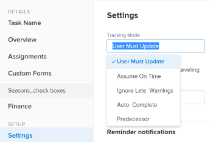

# Impostare modalità di tracciamento per le attività

<!--Audited: 01/2025-->

La modalità di tracciamento di un’attività determina il modo in cui lo stato di avanzamento dell’attività viene aggiornato in Adobe Workfront.

Per informazioni sulla modalità di verifica delle attività, vedere [Panoramica sulla modalità di verifica delle attività](../../../manage-work/tasks/task-information/task-tracking-mode.md).

## Requisiti di accesso

+++ Espandi per visualizzare i requisiti di accesso per la funzionalità descritta in questo articolo. 

<table style="table-layout:auto"> 
 <col> 
 <col> 
 <tbody> 
  <tr> 
   <td role="rowheader">Pacchetto Adobe Workfront</td> 
   <td> 
Qualsiasi
 </td> 
  </tr> 
  <tr> 
   <td role="rowheader">Licenza di Adobe Workfront</td> 
   <td> 
Standard

Work o successiva
 
   </td> 
  </tr> 
  <tr> 
   <td role="rowheader">Configurazioni del livello di accesso</td> 
   <td> 
Modifica l'accesso alle Attività 
 </td> 
  </tr> 
  <tr> 
   <td role="rowheader">Autorizzazioni sugli oggetti</td> 
   <td> 
Gestire le autorizzazioni per un’attività
 </td> 
  </tr> 
 </tbody> 
</table>

*Per informazioni, consulta [Requisiti di accesso nella documentazione di Workfront](/help/quicksilver/administration-and-setup/add-users/access-levels-and-object-permissions/access-level-requirements-in-documentation.md).

+++

<!--
old: 
<table style="table-layout:auto"> 
 <col> 
 <col> 
 <tbody> 
  <tr> 
   <td role="rowheader">Adobe Workfront plan</td> 
   <td> 
Any
 </td> 
  </tr> 
  <tr> 
   <td role="rowheader">Adobe Workfront license*</td> 
   <td> 
New: Standard
 
   Or
   
Current: Work or higher
 
   </td> 
  </tr> 
  <tr> 
   <td role="rowheader">Access level configurations</td> 
   <td> 
Edit access to Tasks 
 </td> 
  </tr> 
  <tr> 
   <td role="rowheader">Object permissions</td> 
   <td> 
Manage permissions on a task
 </td> 
  </tr> 
 </tbody> 
</table>

-->

## Impostare modalità di tracciamento per le attività

1. Vai all’attività per la quale vuoi impostare la modalità di tracciamento.
1. Fai clic sull&#39;icona **Altro** accanto al nome dell&#39;attività, quindi fai clic su **Modifica**.

   Viene visualizzata la finestra di dialogo Modifica attività.

1. Nella sezione **Impostazioni**, utilizza il menu a discesa **Modalità di tracciamento** per selezionare la modalità di tracciamento per l&#39;attività.

   

1. Selezionare una delle opzioni seguenti:

   * L’utente deve aggiornare (opzione predefinita)
   * presume nei tempi
   * Ignora Avvertimenti di Ritardo
   * Auto completamento
   * Predecessore

   Per ulteriori informazioni sulle opzioni della modalità di tracciamento, vedere [Panoramica della modalità di tracciamento attività](../../../manage-work/tasks/task-information/task-tracking-mode.md)

1. Fai clic su **Salva**.
