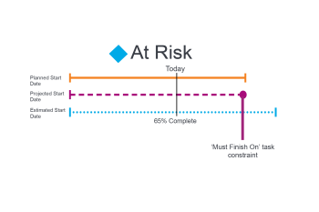

# Panoramica sullo stato di avanzamento dell’attività

<!-- Audited: 1/2024 -->

Adobe Workfront determina lo stato di avanzamento di un’attività osservando l’avanzamento dell’attività nella relativa sequenza temporale. È possibile configurare Workfront per determinare la condizione di un progetto in base al valore dello stato di avanzamento delle attività. Per ulteriori informazioni sulla configurazione della condizione del progetto, consulta l’articolo [Panoramica della condizione e del tipo di condizione del progetto](../../../manage-work/projects/manage-projects/project-condition-and-condition-type.md).

## Criteri che determinano lo stato di avanzamento delle attività

Per informazioni sullo stato di avanzamento di un progetto, vedi [Panoramica sullo stato di avanzamento del progetto](../../../manage-work/projects/planning-a-project/project-progress-status.md).

Per informazioni sul monitoraggio dell&#39;avanzamento delle attività, vedere [Panoramica sulla modalità di monitoraggio attività](../../../manage-work/tasks/task-information/task-tracking-mode.md).

I seguenti criteri determinano lo stato di avanzamento di un&#39;attività:

<table> 
 <col> 
 <col> 
 <thead> 
  <tr> 
   <th> 
<strong>Stato di avanzamento</strong> 
 </th> 
   <th> 
<strong>Determinazione dei criteri</strong> 
 </th> 
  </tr> 
 </thead> 
 <tbody> 
  <tr valign="top"> 
   <td scope="col"> 
 
 
<strong>Ora di attivazione</strong> 
 </td> 
   <td scope="col"> 
Un’attività viene considerata <strong>Ora di attivazione</strong> quando tutte le date pianificate corrispondono alle date previste. Questo stato di avanzamento potrebbe anche indicare che il progetto è in anticipo rispetto alla programmazione e che le date previste potrebbero essere precedenti alle date pianificate.
 
Per ulteriori informazioni sulle date previste, consulta <a href="../../../manage-work/projects/planning-a-project/project-projected-completion-date.md" class="MCXref xref">Panoramica della data di completamento prevista per progetti, attività e problemi</a>.
 
Per ulteriori informazioni sulla data di completamento pianificata per l'attività, vedere i seguenti articoli:
 
    <ul> 
     <li> 
<a href="../../../manage-work/tasks/task-information/task-planned-start-date.md" class="MCXref xref">Panoramica della data di inizio pianificata dell'attività</a> 
 </li> 
     <li> 
<a href="../../../manage-work/tasks/task-information/task-planned-completion-date.md" class="MCXref xref">Panoramica della data di completamento pianificata dell'attività</a> 
 </li> 
    </ul> </td> 
  </tr> 
  <tr> 
   <td>

 
<strong>A Rischio</strong> 
 </td> 
   <td>
Un’attività viene considerata <strong>A Rischio</strong> quando la data di completamento stimata è successiva alla data di completamento pianificata e alla data di completamento prevista. Ciò può verificarsi quando un’attività ha un vincolo di <strong>Deve Finire il</strong> o <strong>Deve iniziare il</strong> tuttavia, la percentuale di completamento o le relazioni predecessori dell'attività indicano che l'attività non può terminare o iniziare nelle date specificate. 

 Impostazione del vincolo attività su <strong>Deve Finire il</strong> imposta manualmente la Data di completamento pianificata su una data specifica. In questo caso, la data di completamento prevista corrisponde alla data di completamento pianificata. Nel caso di questo vincolo, Workfront analizza l’attività per calcolare quando finirà in base alla percentuale di completamento. Questo calcolo viene memorizzato come Data di scadenza stimata. Se la data di scadenza stimata è successiva alla data di completamento prevista, l'attività è considerata a rischio di ritardo. 
 
 Impostazione del vincolo attività su <strong>Deve iniziare il</strong> imposta manualmente la data di inizio pianificata su una data specifica. In questo caso, la data di inizio prevista corrisponde alla data di inizio pianificata. Nel caso di questo vincolo, Workfront analizza l'attività per calcolare quando inizierà in base alle relazioni precedenti. Questo calcolo viene memorizzato come Data di inizio stimata. Se esiste un predecessore imposto che non consente all'attività di iniziare alla data di inizio specificata, la data di inizio stimata può essere successiva alla data di completamento prevista. L'attività è considerata a rischio di ritardo. 
 
Nota: in genere, le date stimate corrispondono alle date previste tranne quando <strong>Deve iniziare il</strong> o <strong>Deve Finire il</strong> vengono utilizzati. In questi casi, le Date stimate continuano a essere calcolate in base alla percentuale di completamento e ad altri fattori (relazioni predecessori), mentre le Date previste sono obbligate a corrispondere alle Date pianificate che sono state impostate manualmente.
 </td> 
  </tr> 
  <tr> 
   <td> 
<strong>Dietro</strong> 
 </td> 
   <td> 
Un'attività è considerata <strong>Dietro</strong> quando la data di completamento stimata è successiva o uguale alla data di completamento pianificata e precedente alla data di completamento prevista.
 
La Data di completamento prevista è una visualizzazione in tempo reale di quando l'attività verrà completata in base all'avanzamento precedente. Anche se l'attività è stata avviata in ritardo, non è ancora considerata in ritardo, perché le date di completamento pianificate e previste sono ancora nel futuro e l'attività potrebbe essere ancora completata in tempo.
 
Nota: il <strong>Dietro</strong> e <strong>A Rischio</strong> Gli stati di avanzamento sono quasi identici. Tuttavia, <strong>A Rischio</strong> indica che su una o entrambe le date pianificate sono presenti alcuni vincoli di attività forzati (Deve finire il, Deve iniziare il, Date fisse). Se l'attività non è soggetta a vincoli, le Date previste corrispondono alle Date stimate e riflettono il calcolo di sistema della Data di completamento in base all'avanzamento corrente dell'attività. L'attività non è ancora considerata in ritardo perché le date di completamento pianificate e previste sono ancora nel futuro e l'attività potrebbe essere completata in tempo. Per ulteriori informazioni sulle date previste e stimate, consulta <a href="../../../manage-work/tasks/task-information/differentiate-projected-estimated-dates.md" class="MCXref xref">Differenziare tra date previste e date stimate </a>.
 </td> 
  </tr> 
  <tr valign="top"> 
   <td> 
<strong>In Ritardo</strong> 
 </td> 
   <td> 
Un'attività è <strong>In Ritardo</strong> quando la Data di completamento pianificata è precedente alla data odierna. 
 </td> 
  </tr> 
 </tbody> 
</table>

<!--hiding this because some users find the images confusing, as they don't really show the dates mentioned in the descriptions above. Keep the pictures though, in case some users will complain that we hid them. 

## How task Progress Status updates over time

The different date types in our projects tell us how tasks are progressing over time:

* On Time

  

* At Risk

  

* Behind

  

* Late

  

-->