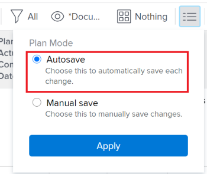

# Creare relazioni predecessori tramite la combinazione di attività

In Adobe Workfront è possibile creare relazioni predecessori in diversi modi. Un metodo consiste nel concatenare attività.

Per informazioni sulle attività precedenti, consulta [Panoramica dei predecessori delle attività](../../../manage-work/tasks/use-prdcssrs/predecessors-overview.md).

Concatenando le attività, è possibile consentire al sistema di creare automaticamente le relazioni predecessori sulle attività selezionate, anziché creare manualmente una relazione su ogni attività. È ancora possibile utilizzare diversi tipi di relazioni predecessori tra le attività.

## Requisiti di accesso

Per eseguire i passaggi descritti in questo articolo, è necessario disporre dei seguenti diritti di accesso:

<table style="table-layout:auto"> 
 <col> 
 <col> 
 <tbody> 
  <tr> 
   <td role="rowheader">piano Adobe Workfront*</td> 
   <td> 
Qualsiasi
 </td> 
  </tr> 
  <tr> 
   <td role="rowheader">Licenza Adobe Workfront*</td> 
   <td> 
Piano 
 </td> 
  </tr> 
  <tr> 
   <td role="rowheader">Configurazioni a livello di accesso*</td> 
   <td> 
Modifica l’accesso a Attività e Progetti
 
Nota: Se non disponi ancora dell’accesso, chiedi all’amministratore Workfront se ha impostato ulteriori restrizioni nel livello di accesso. Per informazioni su come un amministratore Workfront può modificare il livello di accesso, consulta <a href="../../../administration-and-setup/add-users/configure-and-grant-access/create-modify-access-levels.md" class="MCXref xref">Creare o modificare livelli di accesso personalizzati</a>.
 </td> 
  </tr> 
  <tr> 
   <td role="rowheader">Autorizzazioni oggetto</td> 
   <td> 
Gestisci le autorizzazioni per le attività e il progetto
 
Per informazioni sulla richiesta di accesso aggiuntivo, vedi <a href="../../../workfront-basics/grant-and-request-access-to-objects/request-access.md" class="MCXref xref">Richiedere l’accesso agli oggetti </a>.
 </td> 
  </tr> 
 </tbody> 
</table>

&#42;Per informazioni sul piano, il tipo di licenza o l&#39;accesso, contattare l&#39;amministratore Workfront.

## Attività di catena per creare relazioni predecessori

1. Passare al progetto contenente le attività che si desidera catena.
1. Fai clic su **Attività** nel pannello a sinistra.
1. (Condizionale) Seleziona **Salvataggio automatico** nell&#39;angolo in alto a destra dell&#39;elenco delle attività, selezionare le attività che si desidera catena.

   

   >[!IMPORTANT]
   >
   >Non è possibile utilizzare la combinazione di attività in un elenco di attività quando si salvano manualmente le modifiche alle attività o si utilizza la modalità di pianificazione della timeline per salvare le attività.

1. Fai clic con il pulsante destro del mouse sulle attività selezionate, quindi fai clic su **Catena**.
1. Selezionare uno dei seguenti tipi di dipendenza:

   * **Fine-Inizio**
   * **Fine-Fine**
   * **Inizio-Inizio**
   * **Inizio-Fine**

   Per ulteriori informazioni sui tipi di dipendenza predecessore, consulta [Panoramica dei tipi di dipendenza dell&#39;attività](../../../manage-work/tasks/use-prdcssrs/task-dependency-types.md).

1. (Facoltativo) Fai clic su **Unchain** se alcune delle attività sono state precedentemente concatenate.

   >[!CAUTION]
   >
   >Solo i predecessori sequenziali vengono rimossi utilizzando l’opzione unchain quando si eseguono operazioni di modifica in serie.

   Le attività selezionate sono ora collegate da relazioni predecessori.
