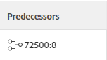

# Creare predecessori tra progetti

Un predecessore tra progetti diversi è un’attività da cui dipende un’altra attività (detta attività successore) in un altro progetto. Il predecessore è l&#39;attività che ha la priorità rispetto all&#39;attività dipendente (successore). Ad esempio, è possibile creare una dipendenza che richiede che l&#39;attività predecessore sia contrassegnata come Completa prima che l&#39;attività dipendente possa avviarsi.

Come i predecessori di un singolo progetto, Adobe Workfront consente alle attività di dipendere dalle attività di altri progetti.

**ESEMPIO**

Se una società di scavi dispone di un solo backhoe e due progetti simultanei hanno attività che richiedono l’utilizzo del backhoe, il project manager può rendere l’attività del primo progetto dipendente dall’attività del secondo progetto per illustrare che lo scavo può iniziare quando il progetto precedente rinuncerà al backhoe.
Quando si collegano progetti tramite predecessori tra progetti diversi, le date del progetto principale (quella con l’attività predecessore) avranno un impatto sul progetto secondario (quella con l’attività successiva).

>[!TIP]
>
>Per visualizzare le date aggiornate per il progetto secondario, è necessario ricalcolare le timeline dei progetti. Per ulteriori informazioni sul ricalcolo delle timeline, consulta [Configurare i calcoli della timeline per i progetti](../../../administration-and-setup/set-up-workfront/configure-system-defaults/configure-timeline-recalculations-projects.md).

Per ulteriori informazioni sulle relazioni predecessori, vedi [Panoramica dei predecessori delle attività](../../../manage-work/tasks/use-prdcssrs/predecessors-overview.md).

## Requisiti di accesso

<!--drafted - replace table for P&P:

<table style="table-layout:auto"> 
 <col> 
 <col> 
 <tbody> 
  <tr> 
   <td role="rowheader">Adobe Workfront plan*</td> 
   <td> 
Any
 </td> 
  </tr> 
  <tr> 
   <td role="rowheader">Adobe Workfront license*</td> 
   <td> 
Current license: Standard 
 
   Or
   
Legacy license: Plan 

   </td> 
  </tr> 
  <tr> 
   <td role="rowheader">Access level configurations*</td> 
   <td> 
Edit access to Tasks and Projects
 
<b>NOTE</b>
   
   If you still don't have access, ask your Workfront administrator if they set additional restrictions in your access level. For information on how a Workfront administrator can modify your access level, see <a href="../../../administration-and-setup/add-users/configure-and-grant-access/create-modify-access-levels.md" class="MCXref xref">Create or modify custom access levels</a>.
 </td> 
  </tr> 
  <tr> 
   <td role="rowheader">Object permissions</td> 
   <td> 
Manage permissions to the tasks and the projects
 
For information on requesting additional access, see <a href="../../../workfront-basics/grant-and-request-access-to-objects/request-access.md" class="MCXref xref">Request access to objects </a>.
 </td> 
  </tr> 
 </tbody> 
</table>
-->

Per eseguire i passaggi descritti in questo articolo, è necessario disporre dei seguenti diritti di accesso:

<table style="table-layout:auto"> 
 <col> 
 <col> 
 <tbody> 
  <tr> 
   <td role="rowheader">piano Adobe Workfront*</td> 
   <td> 
Qualsiasi
 </td> 
  </tr> 
  <tr> 
   <td role="rowheader">Licenza Adobe Workfront*</td> 
   <td> 
Piano 
 </td> 
  </tr> 
  <tr> 
   <td role="rowheader">Configurazioni a livello di accesso*</td> 
   <td> 
Modifica l’accesso a Attività e Progetti
 
<b>NOTA</b>

Se non disponi ancora dell’accesso, chiedi all’amministratore Workfront se ha impostato ulteriori restrizioni nel livello di accesso. Per informazioni su come un amministratore Workfront può modificare il livello di accesso, consulta <a href="../../../administration-and-setup/add-users/configure-and-grant-access/create-modify-access-levels.md" class="MCXref xref">Creare o modificare livelli di accesso personalizzati</a>.
 </td>
</tr> 
  <tr> 
   <td role="rowheader">Autorizzazioni oggetto</td> 
   <td> 
Gestione delle autorizzazioni per le attività e i progetti
 
Per informazioni sulla richiesta di accesso aggiuntivo, vedi <a href="../../../workfront-basics/grant-and-request-access-to-objects/request-access.md" class="MCXref xref">Richiedere l’accesso agli oggetti </a>.
 </td> 
  </tr> 
 </tbody> 
</table>

&#42;Per informazioni sul piano, il tipo di licenza o l&#39;accesso, contattare l&#39;amministratore Workfront.

## Creare un predecessore tra progetti

1. Vai al compito che sarà il tuo successore.
1. Fai clic su **Predecessori** nel pannello a sinistra.
1. Fai clic su **Aggiungi predecessore.**
1. In **Progetto padre** inizia a digitare il nome del progetto che contiene l&#39;attività che desideri dipendere dall&#39;attività corrente.
1. Fai clic sul nome quando viene visualizzato nell’elenco a discesa.
1. In **Attività** iniziare a digitare il nome dell&#39;attività che si desidera dipendere dall&#39;attività corrente.
1. Specificare le seguenti informazioni per definire la relazione tra il predecessore e l&#39;attività dipendente:

   * **Tipo di dipendenza:** Selezionare la relazione che si desidera che l&#39;attività abbia con l&#39;attività dipendente. La relazione predefinita è &quot;Fine-Inizio&quot;, ovvero l&#39;attività predecessore deve terminare prima che l&#39;attività dipendente possa iniziare. Per ulteriori informazioni sui vari tipi di dipendenza, consulta [Panoramica dei tipi di dipendenza dell&#39;attività](../../../manage-work/tasks/use-prdcssrs/task-dependency-types.md)

   * **Ritardo:** Specificare il tempo che deve trascorrere dopo il completamento di un predecessore imposto fino all&#39;inizio dell&#39;attività dipendente. Per ulteriori informazioni sui vari tipi di ritardo, vedi [Panoramica dei tipi di ritardo](../../../manage-work/tasks/use-prdcssrs/lag-types.md).

   * **Imposto:** Quando questa opzione è selezionata, la relazione di dipendenza tra le due attività non può essere elusa dagli utenti che iniziano le attività in anticipo. Ad esempio, se si applica una relazione tra l&#39;attività A e l&#39;attività B, l&#39;attività B non può essere avviata fino al completamento dell&#39;attività A. Per ulteriori informazioni sull&#39;applicazione dei predecessori, consulta [Applica predecessori](../../../manage-work/tasks/use-prdcssrs/enforced-predecessors.md).

      Quando questa opzione non è selezionata, la dipendenza viene trattata come un suggerimento per gli utenti. Ad esempio, gli utenti possono avviare l&#39;attività B prima del completamento dell&#39;attività A.

1. Fai clic su **Salva**.

   Le attività con un predecessore tra progetti presentano il numero di riferimento del progetto a cui appartiene il predecessore e il numero dell&#39;attività, separati da due punti nella colonna Predecessori di un elenco di attività.

   

   L&#39;icona predecessore diventa verde quando l&#39;attività predecessore è contrassegnata come completata. Questo indica che l&#39;attività dipendente è pronta per il lavoro.

   Passa il puntatore del mouse su questo valore per ottenere ulteriori informazioni sul predecessore, sul progetto e sulle date. Fai clic sul predecessore tra progetti nella casella dei dettagli per aprire l’attività. Fai clic su **Vedi Progetto** per aprire il progetto trasversale.

   

   >[!TIP]
   >
   >   La **Vedi Progetto** viene visualizzata solo quando si visualizza un predecessore tra progetti diversi.

