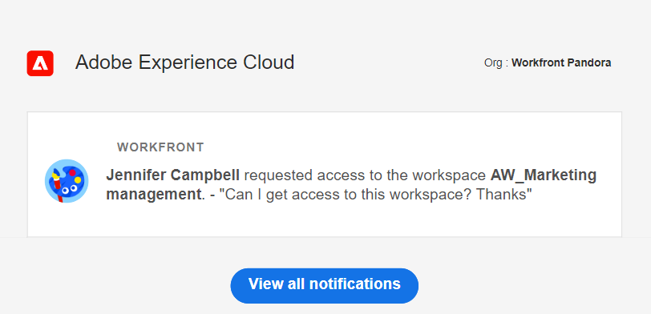

# Richiedere le autorizzazioni per una visualizzazione o un’area di lavoro

<!--The highlighted information on this page refers to functionality not yet generally available. It is available only in the Preview environment for all customers. After the monthly releases to Production, the same features are also available in the Production environment for customers who enabled fast releases.    

For information about fast releases, see [Enable or disable fast releases for your organization](/help/quicksilver/administration-and-setup/set-up-workfront/configure-system-defaults/enable-fast-release-process.md). -->

>[!IMPORTANT]
>
>La funzionalità descritta in questo articolo è disponibile solo quando l’organizzazione è stata integrata in Adobe Unified Experience.
>
>Per ulteriori informazioni, vedere [Esperienza unificata Adobe per Workfront](/help/quicksilver/workfront-basics/navigate-workfront/workfront-navigation/adobe-unified-experience.md).

È possibile richiedere le autorizzazioni per una visualizzazione o un&#39;area di lavoro quando qualcuno condivide con te un collegamento alla visualizzazione o all&#39;area di lavoro a cui non hai accesso.

La richiesta delle autorizzazioni per una visualizzazione è simile alla richiesta delle autorizzazioni per un&#39;area di lavoro.

In questo articolo viene descritto come richiedere l&#39;accesso a una visualizzazione o a un&#39;area di lavoro quando un utente condivide un collegamento con l&#39;utente e non è possibile accedere alla pagina condivisa.

Per informazioni sulla concessione di autorizzazioni per visualizzazioni e aree di lavoro, vedere gli articoli seguenti:

* [Condividere le visualizzazioni](/help/quicksilver/planning/access/share-views.md)
* [Condividere le aree di lavoro](/help/quicksilver/planning/access/share-workspaces.md)

## Requisiti di accesso

+++ Espandere per visualizzare i requisiti di accesso.

Per eseguire i passaggi descritti in questo articolo, è necessario disporre dei seguenti diritti di accesso:

<table style="table-layout:auto"> 
<col> 
</col> 
<col> 
</col> 
<tbody> 
    <tr> 
<tr> 
<td> 
   
 Prodotti
 </td> 
   <td> 
   <ul><li>
 Adobe Workfront
</li> 
   <li>
 Adobe Workfront Planning
</li></ul></td> 
  </tr>   
<tr> 
   <td role="rowheader">
Piano Adobe Workfront*
</td> 
   <td> 

Uno dei seguenti piani di Workfront:
 
<ul><li>Seleziona</li> 
<li>Prime</li> 
<li>Ultimate</li></ul> 

Workfront Planning non è disponibile per i piani Workfront legacy
 
   </td> 
<tr> 
   <td role="rowheader">
Pacchetto Adobe Workfront Planning*
</td> 
   <td> 

Qualsiasi 
 

Per ulteriori informazioni su quanto incluso in ogni piano di Workfront Planning, contattare l'account manager Workfront. 
 
   </td> 
 <tr> 
   <td role="rowheader">
Piattaforma Adobe Workfront
</td> 
   <td> 

Per poter accedere a Workfront Planning, l’istanza di Workfront della tua organizzazione deve essere integrata in Adobe Unified Experience.
 

<b>IMPORTANTE</b>

Gli utenti dell’organizzazione possono richiedere autorizzazioni per visualizzazioni e aree di lavoro solo quando l’organizzazione è integrata in Adobe Unified Experience. 

Per ulteriori informazioni, vedere <a href="/help/quicksilver/workfront-basics/navigate-workfront/workfront-navigation/adobe-unified-experience.md">Esperienza unificata Adobe per Workfront</a>. 
 
   </td> 
   </tr> 
  </tr> 
  <tr> 
   <td role="rowheader">
Licenza Adobe Workfront*
</td> 
   <td>
 Standard, Light o Contributor

   
Workfront Planning non è disponibile per le licenze Workfront legacy
 
  </td> 
  </tr> 
  <tr> 
   <td role="rowheader">
Configurazione del livello di accesso
</td> 
   <td> 
Nessun controllo del livello di accesso per Adobe Workfront Planning
   
</td> 
  </tr> 
<tr> 
   <td role="rowheader">
Autorizzazioni oggetto
</td> 
   <td>  
Dopo aver concesso la richiesta di autorizzazione, puoi ottenere le seguenti autorizzazioni:

   <ul><li>
Visualizzare o gestire una visualizzazione
</li>
   <li>
Visualizzare, contribuire o gestire in un'area di lavoro
</li></ul>  
   
Solo gli utenti con le autorizzazioni di gestione per un’area di lavoro e una visualizzazione possono condividere una visualizzazione pubblicamente.
</td> 
  </tr> 
<tr>
   <td role="rowheader">
Modello layout
</td>
   <td> Agli utenti con una licenza Light o Contributor deve essere assegnato un modello di layout che includa Planning.
   
Per impostazione predefinita, le aree Pianificazione sono attivate dagli utenti standard e dagli amministratori di sistema.

</li></ul>

</td>
  </tr>

</tbody> 
</table>

*Per ulteriori informazioni sui requisiti di accesso a Workfront, vedere [Requisiti di accesso nella documentazione di Workfront](/help/quicksilver/administration-and-setup/add-users/access-levels-and-object-permissions/access-level-requirements-in-documentation.md).

+++

## Richiedere le autorizzazioni per una visualizzazione o un’area di lavoro

La richiesta di autorizzazioni per una visualizzazione è simile alla richiesta di autorizzazioni per un&#39;area di lavoro.

Quando qualcuno condivide con te un collegamento a un’area di lavoro o a una visualizzazione a cui non hai accesso:

1. Fai clic sul collegamento condiviso con te per la visualizzazione o l’area di lavoro.

   Viene visualizzata una pagina di **Accesso negato** per informare che non si dispone dell&#39;accesso alla visualizzazione o all&#39;area di lavoro.

   

1. (Condizionale) Se il collegamento condiviso è per una visualizzazione di un&#39;area di lavoro a cui hai accesso, fai clic su **Apri con visualizzazione esistente**. Se si dispone delle autorizzazioni di accesso all&#39;area di lavoro, la pagina del tipo di record viene visualizzata nella visualizzazione predefinita.

1. (Facoltativo e condizionale) Se non disponi delle autorizzazioni necessarie per visualizzare l&#39;area di lavoro, aggiungi un messaggio personalizzato nella casella disponibile, quindi fai clic su **Richiedi accesso**.

   Tutti gli utenti con autorizzazioni di gestione per la visualizzazione o l’area di lavoro ricevono le notifiche seguenti per la richiesta di accesso:
   * Una notifica in-app

     
   * Una notifica e-mail

     

1. (Facoltativo) Quando il gestore della visualizzazione o dell’area di lavoro ti concede le autorizzazioni per la visualizzazione o l’area di lavoro, ricevi una notifica e-mail e una notifica in-app con la conferma che l’autorizzazione è stata concessa. <!--check this - I was not able to test this, but Isk confirmed.-->
