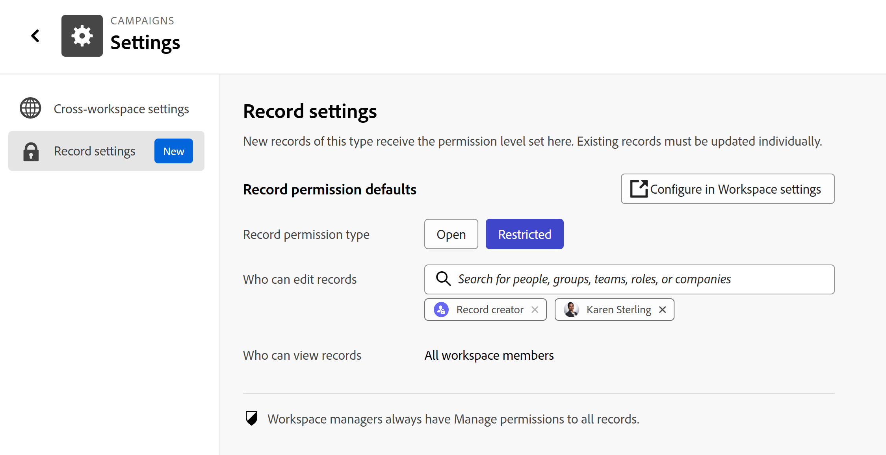

# Impostare le autorizzazioni predefinite per i record

Le informazioni contenute in questa pagina si riferiscono a funzionalità non ancora generalmente disponibili. È disponibile solo nell’ambiente di anteprima per tutti i clienti. Dopo il rilascio in anteprima, le stesse funzioni sono disponibili mensilmente nell’ambiente di produzione per i clienti che hanno abilitato i rilasci rapidi. \
Per informazioni sulle versioni rapide, vedere [Abilitare o disabilitare le versioni rapide per l&#39;organizzazione](/help/quicksilver/administration-and-setup/set-up-workfront/configure-system-defaults/enable-fast-release-process.md). 

{{planning-important-intro}}

È possibile impostare le autorizzazioni predefinite per i record quando si modifica il tipo di record o le impostazioni dell&#39;area di lavoro.

È possibile assegnare autorizzazioni Aperte o Limitate a tutti i record che verranno aggiunti per un tipo di record.

## Requisiti di accesso

+++ Espandi per visualizzare i requisiti di accesso per la funzionalità descritta in questo articolo. 

<!--
at GA, check that the Workfront plans article linked below has Planning info
-->

<table style="table-layout:auto"> 
<col> 
</col> 
<col> 
</col> 
<tbody> 
    <tr> 
<tr> 
   <td role="rowheader">
Pacchetto Adobe Workfront
</td> 
   <td> 

Qualsiasi Workfront o flusso di lavoro con un pacchetto Planning
 
Oppure

Qualsiasi pacchetto di prodotti Workfront Planning come unità autonoma

</tr>

<tr> 
   <td role="rowheader">
Licenza di Adobe Workfront
</td> 
   <td>
Qualsiasi
 
   
<b>NOTA</b>

   
Solo le persone con una licenza Standard possono ottenere le autorizzazioni di gestione per i record. Tutte le altre licenze possono disporre solo delle autorizzazioni di visualizzazione e l’opzione Gestisci non è attiva.

  </td> 
  </tr> 
  <tr> 
   <td role="rowheader">
Autorizzazioni sugli oggetti
</td> 
   <td>  
Gestire le autorizzazioni per un’area di lavoro e un tipo di record
  
   
<b>IMPORTANTE</b>

   
Solo gli utenti con le autorizzazioni di gestione di un'area di lavoro possono condividere un record
</td> 
  </tr>
</tbody> 
</table>

Per ulteriori informazioni, consulta [Requisiti di accesso nella documentazione di Workfront](/help/quicksilver/administration-and-setup/add-users/access-levels-and-object-permissions/access-level-requirements-in-documentation.md).

+++

## Considerazioni sull&#39;impostazione delle autorizzazioni di record predefinite

Durante la configurazione delle autorizzazioni dei record predefiniti, considera quanto segue:

* È possibile attivare una sola regola di autorizzazione predefinita per tipo di record alla volta.
* La modifica della regola ha effetto solo sui record creati dopo la modifica. I record esistenti mantengono le autorizzazioni correnti.
* Gli amministratori di sistema e i responsabili del workspace mantengono sempre l&#39;accesso Gestisci a ogni record, indipendentemente dalla regola.
* Una volta creato un record, le relative autorizzazioni possono essere modificate in modo indipendente nella finestra di dialogo di condivisione senza influire sulla regola predefinita.
* Per i tipi di record globali, ogni area di lavoro (principale e secondaria) può configurare la propria regola predefinita e i nuovi record assumono la regola dell&#39;area di lavoro in cui vengono creati.

## Configurare le autorizzazioni dei record predefiniti per un’area di lavoro

1. Vai a un&#39;area di lavoro > **Altro** menu  > **Impostazioni** > **Tipi di record**.

   

1. (Facoltativo) Fare clic all&#39;interno della cella di un **tipo di record** per modificare i nomi dei tipi di record.

1. Nella colonna **Impostazione predefinita autorizzazione nuovo record** fare clic sulla cella relativa al tipo di record di cui si desidera aggiornare le autorizzazioni.

1. Scegli una tra le opzioni seguenti:

   * **Apri**: tutti i collaboratori dell&#39;area di lavoro possono gestire il record appena creato. Questo è il comportamento predefinito corrente per tutti i tipi di record esistenti e nuovi.
   * **Limitato**: solo il creatore del record e tutti gli utenti aggiunti in modo esplicito possono modificare i record appena creati. Tutti gli altri utenti possono accedere in sola visualizzazione.

1. (Condizionale) Se stai modificando le autorizzazioni predefinite da **Limitato** a **Apri**, fai clic su **Passa a** nella casella **Passa a Apri** per confermare la scelta.
1. (Condizionale) Se hai selezionato **Limitato**, aggiungi ulteriori editor nella colonna **Chi può modificare i record**. Puoi aggiungere utenti, gruppi, team, ruoli o aziende.

   >[!NOTE]
   >
   >* Il creatore di record è sempre incluso e non può essere rimosso.
   >* È possibile selezionare solo le entità che dispongono già delle autorizzazioni Contribute (Contribuisci) o Manage (Gestisci) per il tipo di record.

   Le modifiche vengono salvate automaticamente. Una volta salvata, la regola viene applicata immediatamente e automaticamente a tutti i record creati per quel tipo di record.

## Configurare le autorizzazioni dei record predefiniti per un tipo di record

1. Vai a un tipo di record > **Altro** menu  > **Impostazioni** > **Impostazioni record**.

   

1. Nel campo **Tipo di autorizzazione record**, fare clic su una delle opzioni seguenti:

   * **Apri**: tutti i collaboratori dell&#39;area di lavoro possono gestire il record appena creato. Questo è il comportamento predefinito corrente per tutti i tipi di record esistenti e nuovi.
   * **Limitato**: solo il creatore del record e tutti gli utenti aggiunti in modo esplicito possono modificare i record appena creati. Tutti gli altri utenti possono accedere in sola visualizzazione.
1. (Condizionale) Se stai modificando le autorizzazioni predefinite da **Limitato** a **Apri**, fai clic su **Passa a** nella casella **Passa a Apri** per confermare la scelta.
1. (Condizionale) Se hai selezionato **Limitato**, aggiungi ulteriori editor nel campo **Chi può modificare i record**. Puoi aggiungere utenti, gruppi, team, ruoli o aziende.

   >[!NOTE]
   >
   >* Il creatore di record è sempre incluso e non può essere rimosso.
   >* È possibile selezionare solo le entità che dispongono già delle autorizzazioni Contribute (Contribuisci) o Manage (Gestisci) per il tipo di record.

   Le modifiche vengono salvate automaticamente. Una volta salvata, la regola viene applicata immediatamente e automaticamente a tutti i record creati per quel tipo di record.