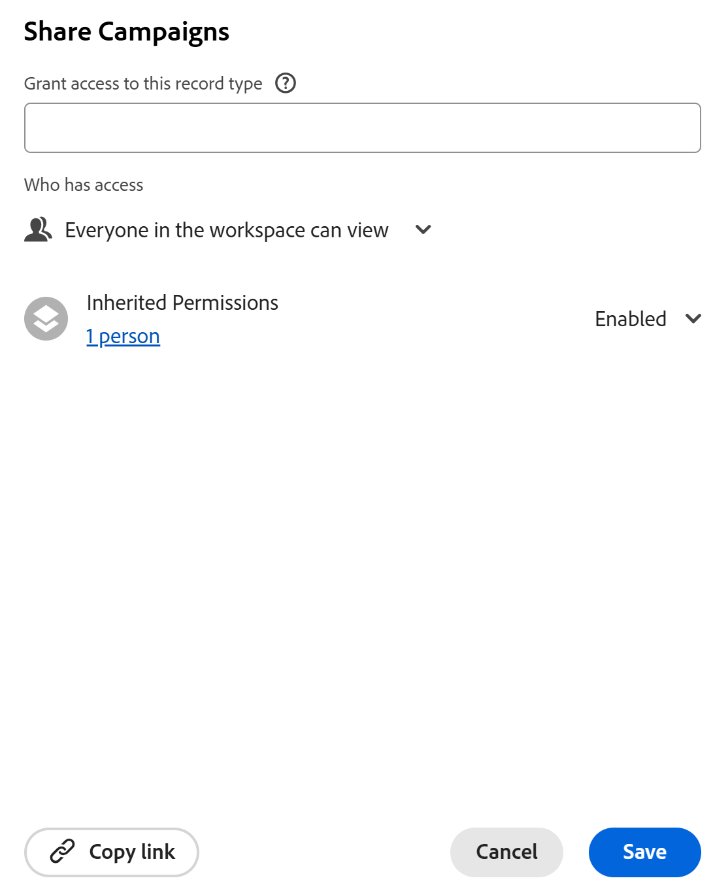

<!-- take the Remove permissions section out, at the end - this is what Lilit said: Because of "Everyone in the workspace can view" wildcard, currently it's not possible to entirely remove access to a record type. Let's take out this section. -->

# Condividere tipi di record

Le informazioni contenute in questa pagina si riferiscono a funzionalità non ancora generalmente disponibili. È disponibile solo nell’ambiente di anteprima per tutti i clienti. Dopo i rilasci mensili in Produzione, le stesse funzioni sono disponibili nell’ambiente di Produzione per i clienti che hanno abilitato i rilasci rapidi. 

Per informazioni sulle versioni rapide, vedere [Abilitare o disabilitare le versioni rapide per l&#39;organizzazione](/help/quicksilver/administration-and-setup/set-up-workfront/configure-system-defaults/enable-fast-release-process.md). 

{{planning-important-intro}}

È possibile condividere un tipo di record con altri utenti per garantire la collaborazione durante l&#39;utilizzo dei record in Adobe Workfront Planning.

>[!IMPORTANT]
>
>Gli utenti con accesso a un&#39;area di lavoro ottengono automaticamente almeno le autorizzazioni di visualizzazione per tutti i tipi di record nell&#39;area di lavoro.
>La condivisione delle visualizzazioni non concede agli utenti le autorizzazioni per i tipi di record. Solo le aree di lavoro condivise possono concedere agli utenti le autorizzazioni per i tipi di record.
>
>* Per informazioni generali sulla condivisione di oggetti in Workfront Planning, vedere anche [Panoramica sulle autorizzazioni di condivisione in Adobe Workfront Planning](/help/quicksilver/planning/access/sharing-permissions-overview.md).
>* Per ulteriori informazioni, vedere la sezione [Considerazioni durante la condivisione dei tipi di record](#considerations-when-sharing-record-types) in questo articolo.

## Requisiti di accesso

+++ Espandere per visualizzare i requisiti di accesso.

<!--at GA, check that the Workfront plans article linked below has Planning info-->

Per eseguire i passaggi descritti in questo articolo, è necessario disporre dei seguenti diritti di accesso:

<table style="table-layout:auto"> 
<col> 
</col> 
<col> 
</col> 
<tbody> 
    <tr> 
<tr> 
<td> 
   
 Prodotti
 </td> 
   <td> 
   <ul><li>
 Adobe Workfront
</li> 
   <li>
 Adobe Workfront Planning
</li></ul></td> 
  </tr>   
<tr> 
   <td role="rowheader">
Piano Adobe Workfront*
</td> 
   <td> 

Uno dei seguenti piani di Workfront:
 
<ul><li>Seleziona</li> 
<li>Prime</li> 
<li>Ultimate</li></ul> 

Workfront Planning non è disponibile per i piani Workfront legacy
 
   </td> 
<tr> 
   <td role="rowheader">
Pacchetto Adobe Workfront Planning*
</td> 
   <td> 

Qualsiasi 
 

Per ulteriori informazioni su quanto incluso in ogni piano di Workfront Planning, contattare l'account manager Workfront. 
 
   </td> 
 <tr> 
   <td role="rowheader">
Piattaforma Adobe Workfront
</td> 
   <td> 

Per poter accedere a tutte le funzionalità di Workfront Planning, l’istanza di Workfront della tua organizzazione deve essere integrata in Adobe Unified Experience.
 

Per consentire agli utenti di richiedere e concedere autorizzazioni per una visualizzazione da una richiesta di autorizzazione, la tua organizzazione deve essere integrata nell’esperienza unificata di Adobe. 

Per ulteriori informazioni, vedere <a href="/help/quicksilver/workfront-basics/navigate-workfront/workfront-navigation/adobe-unified-experience.md">Esperienza unificata Adobe per Workfront</a>. 
 
   </td> 
   </tr> 
  </tr> 
  <tr> 
   <td role="rowheader">
Licenza Adobe Workfront*
</td> 
   <td>
 Standard

   
Workfront Planning non è disponibile per le licenze Workfront legacy
 
  </td> 
  </tr> 
  <tr> 
   <td role="rowheader">
Configurazione del livello di accesso
</td> 
   <td> 
Nessun controllo del livello di accesso per Adobe Workfront Planning
   
</td> 
  </tr> 
<tr> 
   <td role="rowheader">
Autorizzazioni oggetto
</td> 
   <td>  
Gestire le autorizzazioni per un tipo di record
  
   
Solo gli utenti con le autorizzazioni di gestione di un'area di lavoro possono condividere le autorizzazioni di gestione di un tipo di record
</td> 
  </tr> 
<tr> 
   <td role="rowheader">
Modello layout
</td> 
   <td> 
A tutti gli utenti, inclusi gli amministratori di Workfront, deve essere assegnato un modello di layout che includa l'area Planning nel menu principale. 
 </td> 
  </tr> 
</tbody> 
</table>

*Per ulteriori informazioni sui requisiti di accesso a Workfront, vedere [Requisiti di accesso nella documentazione di Workfront](/help/quicksilver/administration-and-setup/add-users/access-levels-and-object-permissions/access-level-requirements-in-documentation.md).

+++

<!--replace the layout template info in the table with this at release: 

In the Production environment, all users including the System Administrators must be assigned to a layout template that includes the Planning areas.

In the Preview environment, Standard users and System Administrators have the Planning area enabled by default.

-->

## Considerazioni durante la condivisione dei tipi di record

* Per impostazione predefinita, la concessione di autorizzazioni a un’area di lavoro conferisce agli utenti le stesse autorizzazioni per i tipi di record nell’area di lavoro.

  È inoltre possibile modificare le autorizzazioni per i singoli tipi di record.

  Non è tuttavia possibile concedere a un tipo di record autorizzazioni superiori a quelle di cui dispone per l&#39;area di lavoro.
* È possibile concedere agli utenti autorizzazioni inferiori per il tipo di record rispetto a quelle disponibili nell&#39;area di lavoro. Ad esempio, possono disporre delle autorizzazioni Contribute per l&#39;area di lavoro e delle autorizzazioni View per un tipo di record.
* Le persone con l&#39;autorizzazione Gestione per l&#39;area di lavoro mantengono sempre l&#39;accesso Gestione a tutti i tipi di record nell&#39;area di lavoro. Le relative autorizzazioni non possono essere ridotte per i tipi di record, anche quando le autorizzazioni ereditate sono disattivate.

* Attualmente è possibile ottenere quanto segue quando si condividono tipi di record:

   * Assegnare agli utenti le autorizzazioni di visualizzazione per un&#39;area di lavoro quando si condivide per la prima volta un tipo di record con gli utenti che non dispongono di autorizzazioni per l&#39;area di lavoro.

     Questo consente inoltre di visualizzare tutti i tipi di record nell&#39;area di lavoro.

     Quando si assegnano loro le autorizzazioni per il tipo di record, nella casella Condivisione è presente un&#39;indicazione che le autorizzazioni vengono aggiunte anche all&#39;area di lavoro.
   * Quando si disattivano le autorizzazioni ereditate, il tipo di record diventa di sola visualizzazione per tutti gli utenti dell&#39;area di lavoro, ad eccezione dei manager dell&#39;area di lavoro.

     Le persone con autorizzazioni Gestisci per l&#39;area di lavoro dispongono sempre delle autorizzazioni Gestione per i tipi di record, anche quando si disattivano le autorizzazioni Ereditate per il tipo di record.
   * Ridurre l&#39;autorizzazione delle persone a un tipo di record. Non è possibile aumentare l&#39;autorizzazione di un utente a un tipo di record a partire da quella disponibile nell&#39;area di lavoro.

     Se ad esempio un utente dispone dell&#39;autorizzazione Contribuisci all&#39;area di lavoro, è possibile modificare l&#39;autorizzazione in un tipo di record specifico in Visualizza. Tuttavia, se dispongono dell&#39;autorizzazione Visualizzazione per l&#39;area di lavoro, non potete concedere l&#39;autorizzazione Contribuisci a qualsiasi tipo di record.

* Impossibile rimuovere l&#39;accesso a un tipo di record per le persone nell&#39;area di lavoro. Tutti dispongono sempre almeno dell&#39;autorizzazione Visualizzazione per tutti i tipi di record se dispongono almeno dell&#39;autorizzazione Visualizzazione per l&#39;area di lavoro.

* È possibile condividere un tipo di record internamente con le entità seguenti:

  Utenti, gruppi, team, aziende e ruoli di Workfront
* Non è possibile condividere tipi di record esternamente con utenti esterni a Workfront.
* Per assegnare a un tipo di record un utente che non dispone di autorizzazioni di area di lavoro superiori alle autorizzazioni di visualizzazione, è necessario innanzitutto condividere l&#39;area di lavoro con l&#39;utente con un&#39;autorizzazione superiore a quella di visualizzazione. Le autorizzazioni più elevate per l’area di lavoro verranno quindi applicate ai tipi di record.

## Condivisione delle autorizzazioni per un tipo di record

È possibile modificare le autorizzazioni per i singoli tipi di record di un&#39;area di lavoro se si dispone dell&#39;autorizzazione Gestione per l&#39;area di lavoro.

{{step1-to-planning}}

1. Aprire l&#39;area di lavoro di cui si desidera condividere i tipi di record, quindi fare clic su una scheda del tipo di record.

   Verrà aperta la pagina del tipo di record.

1. Dalla scheda di qualsiasi visualizzazione, fai clic su **Condividi** nell&#39;angolo superiore destro del tipo di record.

   Viene visualizzata la casella **Condividi**.

   

1. (Facoltativo) Nell&#39;area **Chi ha accesso**, l&#39;opzione **Tutti nell&#39;area di lavoro possono visualizzare** è selezionata per impostazione predefinita.  Tutti gli utenti che dispongono di autorizzazioni View (Visualizzazione) o di livello superiore per l&#39;area di lavoro possono visualizzare il tipo di record.

1. (Facoltativo) Fai clic sul numero di utenti nell&#39;opzione **Autorizzazioni ereditate** per visualizzare utenti, team, gruppi, aziende o ruoli che ereditano le autorizzazioni dall&#39;area di lavoro.

   >[!TIP]
   >
   >Non è possibile rimuovere singole entità dall&#39;elenco Autorizzazioni ereditate.

1. (Facoltativo e condizionale) Se si desidera condividere il tipo di record con entità specifiche e concedere loro un accesso al tipo di record diverso da quello già disponibile per l&#39;area di lavoro, eseguire le operazioni seguenti:

   1. Seleziona **Disattiva** dal menu a discesa **Autorizzazioni ereditate**.

   >[!TIP]
   >
   >I manager di Workspace continuano a disporre delle autorizzazioni di gestione per il tipo di record.

   1. Nel campo **Concedi l&#39;accesso a questo tipo di record**, aggiungi gli utenti, i team, i gruppi, le aziende o le mansioni a cui desideri concedere un livello di autorizzazione diverso da quello che hanno per l&#39;area di lavoro.
   1. Scegli un livello di autorizzazione.

   >[!IMPORTANT]
   >
   >* Non è mai possibile concedere agli utenti autorizzazioni maggiori per un tipo di record rispetto a quelle disponibili in un&#39;area di lavoro.
   >* Se gli utenti dispongono delle autorizzazioni di gestione per l&#39;area di lavoro, non è possibile assegnare loro un&#39;autorizzazione inferiore rispetto a Gestisci a un tipo di record.
   >* Se dispongono delle autorizzazioni Contribute per l&#39;area di lavoro, potete concedere agli utenti un&#39;autorizzazione minore per il tipo di record.
   > Per ulteriori informazioni, vedere [Panoramica sulle autorizzazioni di condivisione in Adobe Workfront Planning](/help/quicksilver/planning/access/sharing-permissions-overview.md).

1. Per consentire agli utenti che non dispongono delle autorizzazioni per l&#39;area di lavoro di visualizzare un tipo di record, nel campo **Concedi l&#39;accesso a questa visualizzazione**, inizia a digitare il nome di un utente, un gruppo, un team, una società o una mansione, quindi fai clic su di esso quando viene visualizzato nell&#39;elenco.

   L&#39;entità selezionata viene aggiunta al tipo di record e all&#39;area di lavoro con autorizzazioni **Visualizza**.

   Gli amministratori di sistema ricevono sempre le autorizzazioni Manage (Gestione) per i tipi di record condivisi con loro e vi è un&#39;indicazione che un utente è un amministratore di sistema.

1. (Facoltativo) Fai clic su **Copia collegamento** per copiare negli Appunti un collegamento al tipo di record e condividerlo con altri utenti.
1. Fai clic su **Salva**.

   Il tipo di record è ora condiviso con altri utenti.

1. Condividi il collegamento copiato con altri utenti. Gli utenti che ricevono il collegamento devono essere utenti attivi e accedere a Workfront per poter accedere alla pagina del tipo di record e visualizzarla nella visualizzazione selezionata. Per visualizzarlo, è necessario disporre delle autorizzazioni per il tipo di record.

## Rimuovere le autorizzazioni per un tipo di record

È possibile rimuovere le autorizzazioni degli utenti da un tipo di record. Tuttavia, conservano almeno l’accesso di visualizzazione all’area di lavoro, che consente loro di visualizzare almeno il tipo di record. È necessario rimuoverne l&#39;accesso dall&#39;area di lavoro se si desidera che non dispongano di autorizzazioni per i tipi di record nell&#39;area di lavoro.

{{step1-to-planning}}

1. Aprire l&#39;area di lavoro di cui si desidera interrompere la condivisione dei tipi di record, quindi fare clic su una scheda del tipo di record. Verrà aperta la pagina del tipo di record.

1. Dalla scheda di qualsiasi visualizzazione, fai clic su **Condividi** nell&#39;angolo superiore destro del tipo di record.

   Viene visualizzata la casella **Condividi**.
1. Individuare l&#39;utente, il gruppo, il team, la società o la mansione di cui si desidera rimuovere le autorizzazioni, espandere il menu a discesa delle autorizzazioni a destra del nome, quindi fare clic su **Rimuovi**. <!--check the screen shot below - the UI text for View might not be accurate-->

   

1. Fai clic su **Salva**.

   Gli utenti non dispongono più delle autorizzazioni indicate per il tipo di record. Tuttavia, dispongono ancora delle autorizzazioni per l’area di lavoro, a meno che non vengano rimosse anche dalle autorizzazioni dell’area di lavoro.

   Agli utenti che sono stati rimossi dall’accesso alla vista non viene notificato che non dispongono più di questo accesso.

<!-- This is not working yet: *************************** edit this before publishing, because this was not tested with record types - this section came from sharing views *******************: 

## Grant permissions to a record type from a permission request

Users who access a link to a record type to which they do not have permissions can request permissions to the record type. All users with Manage permissions to the view receive the permission request and can grant or deny the permissions. 

1. (Conditional) If you are are the manager of a view, you might receive a request from another user to access the view in the following areas:
   
   * An in-app notification
      
   * An email notification
      
1. (Conditional) From the notification area in Workfront, click the in-app notification
   Or
   From the email notification, click **View all notifications**, then click the notification in the list.

   The **Pending access requests** box displays. 

      
1. (Optional) For the user whose permissions you want to approve, select one of the following options from the drop-down menu to the right of the user's name: 
   * **View**
   * **Manage**
1. Select the user for whom you want to approve or deny the permission, then click **Approve all** or **Deny all**. 
1. Click the left-pointing arrow to the left of **Pending access requests**, then click **Save**.

   If you approved the request, the users are added to the sharing box of the view. The user requesting the permission receives an email confirmation that their request was approved. <!--will they also get an in-app notification??-->

