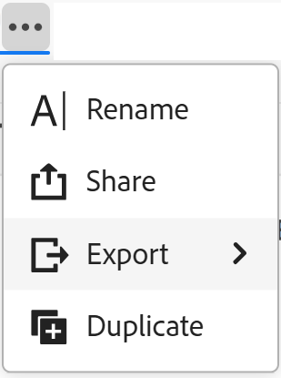

# Condividere le visualizzazioni

<!--The highlighted information on this page refers to functionality not yet generally available. It is available only in the Preview environment for all customers. After the monthly releases to Production, the same features are also available in the Production environment for customers who enabled fast releases.    

For information about fast releases, see [Enable or disable fast releases for your organization](/help/quicksilver/administration-and-setup/set-up-workfront/configure-system-defaults/enable-fast-release-process.md). -->

{{planning-important-intro}}

È possibile condividere una visualizzazione con altri utenti per garantire la collaborazione durante l&#39;utilizzo dei record in Adobe Workfront Planning.

>[!IMPORTANT]
>
>* La concessione di autorizzazioni a un&#39;area di lavoro non consente ad altri utenti di concedere autorizzazioni per le visualizzazioni nelle pagine dei tipi di record. È necessario concedere autorizzazioni alle singole visualizzazioni in una pagina di tipo record per condividerle con altri utenti.
>
>* La concessione delle autorizzazioni a una visualizzazione non modifica le autorizzazioni per la visualizzazione dei record. Le autorizzazioni per i record vengono concesse condividendo le aree di lavoro.
>
>* Quando si condivide una visualizzazione, si concedono ad altri utenti le autorizzazioni necessarie per accedere a tutti gli elementi della visualizzazione. Ad esempio, quando si assegnano le autorizzazioni Gestione a una visualizzazione, è possibile modificare il raggruppamento, il filtro, l&#39;ordinamento o l&#39;aspetto della barra.

<!--
This article describes how you can share a view with others. For information about requesting, granting, or denying permissions to a view, see [Request permissions to a view or a workspace](/help/quicksilver/planning/access/request-permissions.md). -->

## Requisiti di accesso

+++ Espandere per visualizzare i requisiti di accesso.

<!--at GA, check that the Workfront plans article linked below has Planning info-->

<table style="table-layout:auto"> 
<col> 
</col> 
<col> 
</col> 
<tbody> 
    <tr> 
<tr> 
<td> 
   
 Prodotti
 </td> 
   <td> 
   <ul><li>
 Adobe Workfront
</li> 
   <li>
 Adobe Workfront Planning
</li></ul></td> 
  </tr>   
<tr> 
   <td role="rowheader">
Piano Adobe Workfront*
</td> 
   <td> 

Uno dei seguenti piani di Workfront:
 
<ul><li>Seleziona</li> 
<li>Prime</li> 
<li>Ultimate</li></ul> 

Workfront Planning non è disponibile per i piani Workfront legacy
 
   </td> 
<tr> 
   <td role="rowheader">
Pacchetto Adobe Workfront Planning*
</td> 
   <td> 

Qualsiasi 
 

Per ulteriori informazioni su quanto incluso in ogni piano di Workfront Planning, contattare l'account manager Workfront. 
 
   </td> 
 <tr> 
   <td role="rowheader">
Piattaforma Adobe Workfront
</td> 
   <td> 

Per poter accedere a Workfront Planning, l’istanza di Workfront della tua organizzazione deve essere integrata in Adobe Unified Experience.
 

Per consentire agli utenti di richiedere e concedere autorizzazioni per una visualizzazione da una richiesta di autorizzazione, la tua organizzazione deve essere integrata nell’esperienza unificata di Adobe. 

Gli utenti devono essere aggiunti a Adobe Admin Console per ottenere le autorizzazioni per le viste di Workfront Planning.

Per ulteriori informazioni, vedere <a href="/help/quicksilver/workfront-basics/navigate-workfront/workfront-navigation/adobe-unified-experience.md">Esperienza unificata Adobe per Workfront</a>. 
 
   </td> 
   </tr> 
  </tr> 
  <tr> 
   <td role="rowheader">
Licenza Adobe Workfront*
</td> 
   <td>
 Standard

   
Workfront Planning non è disponibile per le licenze Workfront legacy
 
  </td> 
  </tr> 
  <tr> 
   <td role="rowheader">
Configurazione del livello di accesso
</td> 
   <td> 
Nessun controllo del livello di accesso per Adobe Workfront Planning
   
</td> 
  </tr> 
<tr> 
   <td role="rowheader">
Autorizzazioni oggetto
</td> 
   <td>  
Gestire le autorizzazioni per una visualizzazione
  
   
Solo gli utenti con le autorizzazioni di gestione di un’area di lavoro possono condividere una visualizzazione pubblicamente.
</td> 
  </tr>

</tbody> 
</table>

*Per ulteriori informazioni sui requisiti di accesso a Workfront, vedere [Requisiti di accesso nella documentazione di Workfront](/help/quicksilver/administration-and-setup/add-users/access-levels-and-object-permissions/access-level-requirements-in-documentation.md).

+++

## Considerazioni durante la condivisione delle visualizzazioni

* È possibile condividere una visualizzazione nei modi seguenti:

   * Internamente, con utenti, gruppi, team, aziende e ruoli di Workfront
   * Pubblicamente, con utenti esterni a Workfront
   * Copiando e condividendo un collegamento a una visualizzazione
   * Esportandolo in un file Excel o CSV. Potete esportare solo la vista tabella in un file. Per informazioni, vedere [Gestire la visualizzazione della tabella](/help/quicksilver/planning/views/manage-the-table-view.md).

* Per informazioni generali sulla condivisione di oggetti in Workfront Planning, vedere anche [Panoramica sulle autorizzazioni di condivisione in Adobe Workfront Planning](/help/quicksilver/planning/access/sharing-permissions-overview.md).
* È possibile assegnare le autorizzazioni Visualizzazione o Gestione a una visualizzazione agli utenti interni di Workfront.

* Gli utenti con le autorizzazioni Gestione possono modificare le impostazioni di visualizzazione, condividerle, duplicarle o eliminarle.

* Puoi condividere le visualizzazioni con persone esterne all’organizzazione tramite un collegamento pubblico.

* Quando condividi pubblicamente una visualizzazione, il collegamento è accessibile a chiunque non faccia parte della tua azienda per un periodo di tempo limitato, indicato dalla data di scadenza. Non è necessario effettuare l&#39;accesso per visualizzare la visualizzazione condivisa.

* Gli utenti esterni all&#39;organizzazione che dispongono dell&#39;accesso a una visualizzazione non possono creare altre visualizzazioni, modificare la visualizzazione condivisa o aggiungere, eliminare o modificare le informazioni del record nella visualizzazione.

## Condivisione interna delle autorizzazioni per una visualizzazione

È possibile condividere le visualizzazioni create o le visualizzazioni per le quali si dispone delle autorizzazioni Gestione con utenti, gruppi, team, aziende e ruoli in Workfront Planning.

>[!NOTE]
>
>Gli amministratori di sistema non possono visualizzare o condividere viste che non hanno creato personalmente. Possono accedere o condividere solo le visualizzazioni condivise con loro.
>
>Gli amministratori di sistema possono disporre solo delle autorizzazioni di gestione per una visualizzazione.

{{step1-to-planning}}

1. Aprire l&#39;area di lavoro di cui si desidera condividere la visualizzazione, quindi fare clic su una scheda del tipo di record.

   Verrà aperta la pagina del tipo di record.

1. Nella scheda Visualizza eseguire una delle operazioni seguenti:

   * Passa il puntatore del mouse sul nome della scheda della visualizzazione che desideri condividere e fai clic sul menu **Altro**  a destra del nome della visualizzazione, quindi fai clic su **Condividi**.

     

   * Fai clic su **Condividi** > **Condividi visualizzazione corrente**

     

   Viene visualizzata la casella **Condividi visualizzazione** e la scheda **Condivisione interna** deve essere selezionata per impostazione predefinita.

1. (Facoltativo) Nell&#39;area **Chi ha accesso**, selezionare una delle opzioni seguenti:

   * **L&#39;accesso è consentito solo alle persone invitate**: è necessario specificare gli utenti, i gruppi, il team, la società o la mansione con cui si desidera condividere la visualizzazione. Questa è l&#39;opzione predefinita.

   >[!NOTE]
   >
   >Oltre a team, gruppi, aziende e ruoli, puoi condividere solo con gli utenti che sono stati aggiunti al Adobe Admin Console. Non è possibile aggiungere utenti solo Workfront. Per informazioni, vedere [Gestione degli utenti in Adobe Admin Console](/help/quicksilver/administration-and-setup/add-users/create-and-manage-users/admin-console.md).

   * **Tutti gli utenti nell&#39;area di lavoro possono visualizzare**: tutti gli utenti che dispongono di autorizzazioni di visualizzazione o di livello superiore per le aree di lavoro possono accedere alla visualizzazione.

1. Nel campo **Concedi l&#39;accesso a questa visualizzazione**, inizia a digitare il nome di un utente, un gruppo, un team, una società o una mansione e fai clic su di esso quando viene visualizzato nell&#39;elenco.

   

1. Seleziona uno dei seguenti livelli di autorizzazione dal menu a discesa:
   * Visualizza
   * Gestisci

     Per informazioni sui livelli di autorizzazione e sulle azioni che gli utenti possono eseguire per ogni livello, vedere [Panoramica sulle autorizzazioni di condivisione in Adobe Workfront Planning](/help/quicksilver/planning/access/sharing-permissions-overview.md).

     Gli amministratori di sistema ricevono sempre le autorizzazioni di gestione per le visualizzazioni condivise con loro.

1. Fai clic su **Salva**.

   La visualizzazione viene aggiornata con l&#39;icona Persone  per indicare che la visualizzazione è ora condivisa con altri utenti.

   Gli utenti con cui hai condiviso la visualizzazione ricevono una notifica in-app e una notifica e-mail relativa alle autorizzazioni per essa.

   >[!TIP]
   >
   >Le visualizzazioni senza un utente o un&#39;icona globale sono visualizzazioni create dall&#39;utente e non sono condivise con altri utenti. Le viste non condivise sono visibili solo a te.

1. Condividi il collegamento copiato con altri utenti. Gli utenti che ricevono il collegamento devono essere utenti attivi e accedere a Workfront per poter accedere alla pagina del tipo di record e visualizzarla nella visualizzazione selezionata.

## Condivisione pubblica delle autorizzazioni per una visualizzazione

Puoi condividere le viste create o le viste per le quali disponi delle autorizzazioni di gestione con persone che non dispongono di una licenza Workfront e che potrebbero essere esterne alla tua organizzazione.

>[!IMPORTANT]
>
>Solo gli utenti con le autorizzazioni Gestione di un&#39;area di lavoro possono condividere pubblicamente le visualizzazioni dell&#39;area di lavoro.

Per condividere una visualizzazione pubblicamente in Workfront Planning:

{{step1-to-planning}}

1. Aprire l&#39;area di lavoro di cui si desidera condividere la visualizzazione, quindi fare clic su una scheda del tipo di record.

   Verrà aperta la pagina del tipo di record.

1. Nella scheda Visualizza eseguire una delle operazioni seguenti:

   * Passa il puntatore del mouse sul nome della scheda della visualizzazione che desideri condividere e fai clic sul menu **Altro**  a destra del nome della visualizzazione, quindi fai clic su **Condividi**.

   
   * Fai clic su **Condividi** > **Condividi visualizzazione corrente**

   Viene visualizzata la casella **Condividi visualizzazione**.

1. Fai clic su **Condivisione pubblica**.

   

1. Abilita l&#39;impostazione **Crea collegamento pubblico**.

   È disponibile un collegamento. Questo è un link pubblico. Quando è condiviso, chiunque disponga del collegamento, incluse persone esterne all&#39;organizzazione, può accedere alla pagina del tipo di record e visualizzare record e campi nella pagina.

1. Fai clic sull&#39;icona **Copia collegamento**  per copiare il collegamento negli Appunti.

1. Immetti manualmente una data o utilizza il calendario nel campo **Data di scadenza collegamento** per selezionare una data di scadenza per il collegamento pubblico. La visualizzazione della pagina record non sarà accessibile dopo la data selezionata.

1. Fai clic su **Salva**.

   La visualizzazione viene aggiornata con l&#39;icona globale  per indicare che la visualizzazione è condivisa pubblicamente.

   >[!TIP]
   >
   >Le visualizzazioni senza un utente o un&#39;icona globale sono visualizzazioni create dall&#39;utente e non sono condivise con altri utenti. Le viste non condivise sono visibili solo a te.

1. (Facoltativo) Incolla il collegamento copiato in un messaggio e-mail, chat, documento o in un commento di Workfront per condividerlo con altri utenti.

## Copiare un collegamento in una visualizzazione

È possibile copiare un collegamento negli Appunti e includerlo in un&#39;altra applicazione o condividerlo con altri utenti.

Per copiare un collegamento a una visualizzazione condivisa pubblicamente, vedere la sezione [Autorizzazioni di condivisione per una visualizzazione condivisa pubblicamente](#share-permissions-to-a-view-publicly) in questo articolo.

Questa sezione descrive come condividere una vista internamente.

>[!IMPORTANT]
>
>È innanzitutto necessario condividere la visualizzazione con gli utenti prima di condividere il collegamento alla visualizzazione affinché possano visualizzarla.

{{step1-to-planning}}

1. Apri l’area di lavoro di cui desideri copiare la visualizzazione e condividere il collegamento, quindi fai clic su una scheda del tipo di record.

   Verrà aperta la pagina del tipo di record.

1. Nella scheda di una vista effettuare una delle seguenti operazioni:

   * Passa il puntatore del mouse sulla scheda della visualizzazione che desideri condividere e fai clic sul menu **Altro**  a destra del nome della visualizzazione, quindi fai clic su **Condividi** > **Copia collegamento** nella casella **Condividi visualizzazione**.
   * Fai clic su **Condividi** > **Copia il collegamento di visualizzazione** dalla pagina del tipo di record.

   Un collegamento alla visualizzazione viene copiato negli Appunti e si riceve una conferma nella parte inferiore dello schermo.

   Ora puoi incollare il collegamento a un’altra applicazione o inviarlo ad altri.

## Concedere autorizzazioni a una visualizzazione da una richiesta di autorizzazione

Gli utenti che accedono a un collegamento a una visualizzazione per la quale non dispongono di autorizzazioni possono richiedere le autorizzazioni per la visualizzazione. Tutti gli utenti con autorizzazioni Manage (Gestisci) per la visualizzazione ricevono la richiesta di autorizzazione e possono concedere o negare le autorizzazioni.

1. (Condizionale) Se sei il manager di una visualizzazione, potresti ricevere una richiesta da un altro utente per accedere alla visualizzazione nelle seguenti aree:

   * Una notifica in-app

     
   * Una notifica e-mail

     
1. (Condizionale) Dall’area di notifica in Workfront, fai clic sulla notifica in-app.
Oppure
Dalla notifica e-mail, fai clic su **Visualizza tutte le notifiche**, quindi fai clic sulla notifica nell&#39;elenco.

   Viene visualizzata la casella **Richieste di accesso in sospeso**.

   
1. (Facoltativo) Per l’utente di cui desideri approvare le autorizzazioni, seleziona una delle seguenti opzioni dal menu a discesa a destra del nome dell’utente:
   * **Visualizza**
   * **Gestisci**
1. Selezionare l&#39;utente per il quale si desidera approvare o negare l&#39;autorizzazione, quindi fare clic su **Approva tutto** o **Rifiuta tutto**.
1. Fai clic sulla freccia rivolta a sinistra a sinistra di **Richieste di accesso in sospeso**, quindi fai clic su **Salva**.

   Se hai approvato la richiesta, gli utenti vengono aggiunti alla casella di condivisione della visualizzazione. L’utente che richiede l’autorizzazione riceve una conferma via e-mail che la sua richiesta è stata approvata. <!--will they also get an in-app notification??-->

## Rimuovere le autorizzazioni per una visualizzazione

{{step1-to-planning}}

1. Aprire l&#39;area di lavoro di cui si desidera interrompere la condivisione della visualizzazione, quindi fare clic su una scheda del tipo di record. Verrà aperta la pagina del tipo di record.
1. Nella scheda Visualizza eseguire una delle operazioni seguenti:

   * Passa il puntatore del mouse sul nome della scheda della visualizzazione che desideri condividere e fai clic sul menu **Altro**  a destra del nome della visualizzazione, quindi fai clic su **Condividi**.

   * Fai clic su **Condividi** > **Condividi visualizzazione corrente**

   Viene visualizzata la casella **Condividi visualizzazione**.
1. Per rimuovere la condivisione interna di una vista, eseguire le operazioni seguenti:

   1. Verificare che la scheda **Condivisione interna** sia selezionata.
   1. Individuare l&#39;utente, il gruppo, il team, la società o la mansione da rimuovere, espandere il menu a discesa delle autorizzazioni a destra del nome dell&#39;entità con cui si condivide la visualizzazione, quindi fare clic su **Rimuovi**.

1. Per rimuovere la condivisione pubblica di una visualizzazione, eseguire le operazioni seguenti:

   1. Fare clic sulla scheda **Condivisione pubblica**.
   1. Deseleziona l&#39;opzione **Crea collegamento pubblico**.

1. Fai clic su **Salva**.

   Le persone non hanno più accesso alla visualizzazione. Agli utenti che sono stati rimossi dall’accesso alla vista non viene notificato che non dispongono più di questo accesso.
