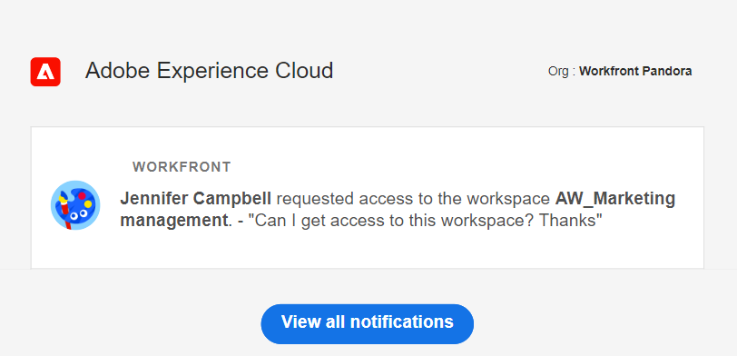

# Condividere le aree di lavoro

<!--The highlighted information on this page refers to functionality not yet generally available. It is available only in the Preview environment for all customers. After the monthly releases to Production, the same features are also available in the Production environment for customers who enabled fast releases.    

For information about fast releases, see [Enable or disable fast releases for your organization](/help/quicksilver/administration-and-setup/set-up-workfront/configure-system-defaults/enable-fast-release-process.md). -->

{{planning-important-intro}}

Puoi condividere un’area di lavoro con altri utenti per garantire la collaborazione quando lavori in Adobe Workfront Planning.

<!--
This article describes how you can share a view with others. For information about requesting, granting, or denying permissions to a view, see [Request permissions to a view or a workspace](/help/quicksilver/planning/access/request-permissions.md). -->

>[!NOTE]
>
>La concessione di autorizzazioni a un&#39;area di lavoro non consente ad altri utenti di concedere autorizzazioni per le visualizzazioni nelle pagine dei tipi di record. È necessario concedere autorizzazioni alle singole visualizzazioni in una pagina di tipo record per condividerle con altri utenti. Per informazioni, vedere [Condividere una visualizzazione](/help/quicksilver/planning/access/share-views.md).

## Requisiti di accesso

+++ Espandere per visualizzare i requisiti di accesso.

Per eseguire i passaggi descritti in questo articolo, è necessario disporre dei seguenti diritti di accesso:

<table style="table-layout:auto"> 
<col> 
</col> 
<col> 
</col> 
<tbody> 
    <tr> 
<tr> 
<td> 
   
 Prodotti
 </td> 
   <td> 
   <ul><li>
 Adobe Workfront
</li> 
   <li>
 Adobe Workfront Planning
</li></ul></td> 
  </tr>   
<tr> 
   <td role="rowheader">
Piano Adobe Workfront*
</td> 
   <td> 

Uno dei seguenti piani di Workfront:
 
<ul><li>Seleziona</li> 
<li>Prime</li> 
<li>Ultimate</li></ul> 

Workfront Planning non è disponibile per i piani Workfront legacy
 
   </td> 
<tr> 
   <td role="rowheader">
Pacchetto Adobe Workfront Planning*
</td> 
   <td> 

Qualsiasi 
 

Per ulteriori informazioni su quanto incluso in ogni piano di Workfront Planning, contattare l'account manager Workfront. 
 
   </td> 
 <tr> 
   <td role="rowheader">
Piattaforma Adobe Workfront
</td> 
   <td> 

Per poter accedere a Workfront Planning, l’istanza di Workfront della tua organizzazione deve essere integrata in Adobe Unified Experience.

Per consentire agli utenti di richiedere e concedere autorizzazioni per un’area di lavoro da una richiesta di autorizzazione, è necessario che la tua organizzazione sia integrata nell’esperienza unificata di Adobe. 
 

Per ottenere le autorizzazioni per le aree di lavoro di Workfront Planning, è necessario aggiungere gli utenti a Adobe Admin Console.

Per ulteriori informazioni, vedere <a href="/help/quicksilver/workfront-basics/navigate-workfront/workfront-navigation/adobe-unified-experience.md">Esperienza unificata Adobe per Workfront</a>. 
 
   </td> 
   </tr> 
  </tr> 
  <tr> 
   <td role="rowheader">
Licenza Adobe Workfront*
</td> 
   <td>
 Standard 

   
Workfront Planning non è disponibile per le licenze Workfront legacy
 
  </td> 
  </tr> 
  <tr> 
   <td role="rowheader">
Configurazione del livello di accesso
</td> 
   <td> 
Nessun controllo del livello di accesso per Adobe Workfront Planning
   
</td> 
  </tr> 
<tr> 
   <td role="rowheader">
Autorizzazioni oggetto
</td> 
   <td>  
Gestire le autorizzazioni per un’area di lavoro
  </td> 
  </tr>

</tbody> 
</table>

*Per ulteriori informazioni sui requisiti di accesso a Workfront, vedere [Requisiti di accesso nella documentazione di Workfront](/help/quicksilver/administration-and-setup/add-users/access-levels-and-object-permissions/access-level-requirements-in-documentation.md).

+++

## Considerazioni sulla condivisione delle aree di lavoro

* Per informazioni generali sulla condivisione di oggetti in Workfront Planning, vedere anche [Panoramica sulle autorizzazioni di condivisione in Adobe Workfront Planning](/help/quicksilver/planning/access/sharing-permissions-overview.md).
* Puoi condividere le aree di lavoro con utenti, team, ruoli, gruppi o aziende all’interno della tua organizzazione.
* Oltre a team, gruppi, aziende e ruoli, puoi condividere solo con gli utenti che sono stati aggiunti al Adobe Admin Console.
* Non è possibile condividere le aree di lavoro con utenti esterni all’organizzazione.
* Quando si condivide un&#39;area di lavoro, vengono condivisi anche tutti i tipi di record, i record e i campi associati alle aree di lavoro.
* Quando si condivide un&#39;area di lavoro, le visualizzazioni non vengono condivise. È necessario condividere le visualizzazioni separatamente.
* Le autorizzazioni di Workspace vengono visualizzate come autorizzazioni ereditate per i tipi di record.

## Condividere le autorizzazioni per un’area di lavoro

I seguenti utenti possono condividere un’area di lavoro con altri utenti:

* Gli amministratori di sistema possono condividere tutte le aree di lavoro, incluse quelle che non hanno creato.
* Tutti gli altri utenti possono condividere solo le aree di lavoro per le quali dispongono delle autorizzazioni di gestione.

Per condividere un’area di lavoro con altri utenti:

{{step1-to-planning}}

1. Apri l&#39;area di lavoro che desideri condividere, quindi fai clic su **Condividi** nell&#39;angolo superiore destro dello schermo.

   

1. Nel campo **Concedi l&#39;accesso a questa area di lavoro**, inizia a digitare il nome di un utente, un gruppo, un team, una società o una mansione e fai clic su di esso quando viene visualizzato nell&#39;elenco.

   

1. Seleziona uno dei seguenti livelli di autorizzazione dal menu a discesa:
   * Visualizza
   * Contribuisci
   * Gestisci

     Per informazioni sui livelli di autorizzazione e sulle azioni che gli utenti possono eseguire per ogni livello, vedere [Panoramica sulle autorizzazioni di condivisione in Adobe Workfront Planning](/help/quicksilver/planning/access/sharing-permissions-overview.md).
1. Fai clic su **Copia collegamento** per copiare un collegamento nell&#39;area di lavoro negli Appunti.
1. Condividi il collegamento copiato con altri utenti. Per poter accedere all’area di lavoro, gli utenti che ricevono il collegamento devono essere utenti attivi e accedere a Workfront.
1. Fai clic su **Salva**.

   Gli utenti che hanno condiviso l’area di lavoro con ricevono una notifica in-app e una notifica e-mail relativa alle autorizzazioni di accesso.

## Concedere autorizzazioni a un’area di lavoro da una richiesta di autorizzazione

Gli utenti che accedono a un collegamento a un’area di lavoro per la quale non dispongono di autorizzazioni possono richiedere le autorizzazioni per l’area di lavoro. Tutti gli utenti con autorizzazioni Gestisci per l&#39;area di lavoro ricevono la richiesta di autorizzazione e possono concedere o negare le autorizzazioni.

1. (Condizionale) Se sei il manager di un’area di lavoro, potresti ricevere una richiesta da un altro utente per accedere alla vista nelle seguenti aree:

   * Una notifica in-app

     
   * Una notifica e-mail

     
1. (Condizionale) Dall’area di notifica in Workfront, fai clic sulla notifica in-app.
Oppure
Dalla notifica e-mail, fai clic su **Visualizza tutte le notifiche**, quindi fai clic sulla notifica nell&#39;elenco.

   Viene visualizzata la casella **Richieste di accesso in sospeso**.

   

1. (Facoltativo) Per l’utente di cui desideri approvare le autorizzazioni, seleziona una delle seguenti opzioni dal menu a discesa a destra del nome dell’utente:
   * **Visualizza**
   * **Contribuisci**
   * **Gestisci**
1. Selezionare l&#39;utente per il quale si desidera approvare o negare l&#39;autorizzazione, quindi fare clic su **Approva tutto** o **Rifiuta tutto**.
1. Fai clic sulla freccia rivolta a sinistra a sinistra di **Richieste di accesso in sospeso**, quindi fai clic su **Salva**.

   Se hai approvato la richiesta, gli utenti vengono aggiunti alla casella di condivisione dell’area di lavoro. L’utente che richiede l’autorizzazione riceve una conferma via e-mail che la sua richiesta è stata approvata. <!--will they also get an in-app notification??-->

## Rimuovere le autorizzazioni per un’area di lavoro

{{step1-to-planning}}

1. Apri l&#39;area di lavoro a cui vuoi rimuovere le autorizzazioni, quindi fai clic su **Condividi** nell&#39;angolo superiore destro dello schermo.
1. Fai clic sul menu a discesa a destra del nome di un&#39;entità con cui stai condividendo l&#39;area di lavoro, quindi fai clic su **Rimuovi**.
1. Fai clic su **Salva**.

   Gli utenti rimossi non hanno più accesso al workspace o ai relativi oggetti.
