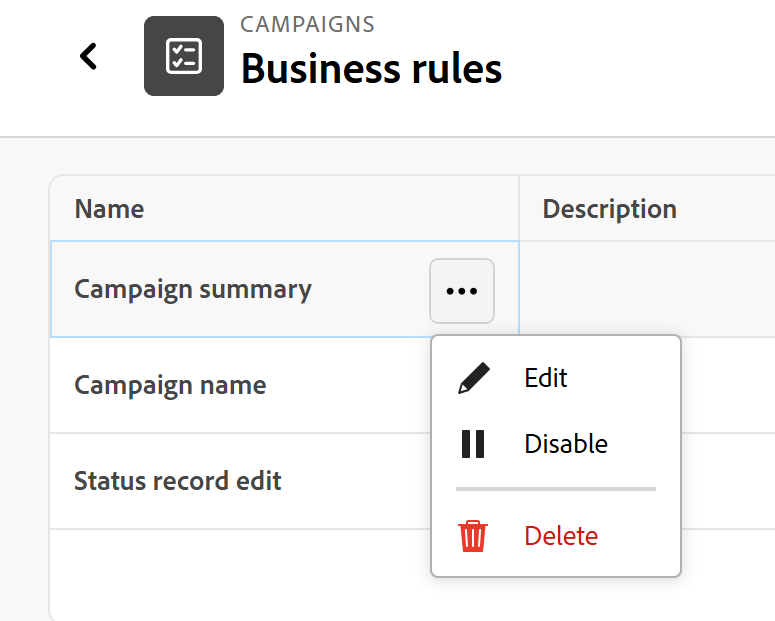

# Configurare le regole business di tipo record

{{planning-important-intro}}

<span class="preview">Le informazioni contenute in questa pagina si riferiscono a funzionalità non ancora generalmente disponibili. È disponibile solo nell’ambiente di anteprima per tutti i clienti. Dopo il rilascio in anteprima, le stesse funzioni sono disponibili mensilmente nell’ambiente di produzione per i clienti che hanno abilitato i rilasci rapidi. </span>

<span class="preview">Per informazioni sulle versioni rapide, vedere [Abilitare o disabilitare le versioni rapide per l&#39;organizzazione](/help/quicksilver/administration-and-setup/set-up-workfront/configure-system-defaults/enable-fast-release-process.md). </span>

È possibile configurare le regole business per i tipi di record di Adobe Workfront Planning per indicare che alcuni campi sono obbligatori prima che un&#39;azione su un record di quel tipo sia consentita o impedita.

A seconda della modalità di formulazione della regola, è possibile consentire le azioni seguenti sui record se vengono soddisfatte le regole aziendali definite:

* Modificare o meno un record
* Eliminare o non eliminare un record

## Requisiti di accesso

+++ Espandere per visualizzare i requisiti di accesso per eseguire i passaggi descritti in questo articolo:  

<table style="table-layout:auto"> 
<col> 
</col> 
<col> 
</col> 
<tbody> 
    <tr> 
<tr> 
</tr>   
<tr> 
   <td role="rowheader"><p>Pacchetto Adobe Workfront</p></td> 
   <td> 
<ul> 
<li><p>Qualsiasi Workfront o flusso di lavoro con un pacchetto Planning</p></li>
Oppure
<li><p>Qualsiasi pacchetto Planning acquistato come prodotto standalone</p></li></ul>
   </td> </tr>
  <tr> 
   <td role="rowheader"><p>Licenza di Adobe Workfront</p></td> 
   <td><p>Standard flusso di lavoro</p>
   </td> 
  </tr> 
<tr> 
   <td role="rowheader"><p>Licenza Adobe Planning</p></td> 
   <td><p>Standard di pianificazione</p>
   </td> 
  </tr> 
<tr> 
   <td role="rowheader"><p>Configurazione del livello di accesso</p></td> 
   <td> <p>È necessario aggiungere sia un flusso di lavoro che un tipo di licenza Planning al livello di accesso quando si dispone sia di un flusso di lavoro che di un pacchetto Planning</p>   
</td> 
  </tr> 
  <tr> 
   <td role="rowheader"><p>Autorizzazioni sugli oggetti</p></td> 
   <td>   <p>Gestire le autorizzazioni per un’area di lavoro e per un tipo di record</p>  
   <p>Gli amministratori di sistema dispongono delle autorizzazioni per tutte le aree di lavoro, incluse quelle non create</p>  </td> 
  </tr>  
</tbody> 
</table>

Per ulteriori informazioni sui requisiti di accesso a Workfront, vedere [Requisiti di accesso nella documentazione di Workfront](/help/quicksilver/administration-and-setup/add-users/access-levels-and-object-permissions/access-level-requirements-in-documentation.md).

+++

## Considerazioni durante la configurazione delle regole aziendali

* Le regole business associano una condizione a una modifica di campo o all&#39;eliminazione di un record. La regola entra in gioco solo in un momento specifico e intenzionale: quando un campo sta per diventare un valore di campo configurato nella regola.

* Una regola si presenta così in un linguaggio semplice: &quot;Prima di poter modificare questo record, il campo di riepilogo della campagna deve avere un valore&quot;.

  Se il campo è vuoto, la modifica del record viene bloccata e l’utente riceve un messaggio chiaro che spiega cosa deve risolvere prima di procedere. La modifica è consentita dopo aver aggiornato il campo richiesto e riprovato.

* Le regole non bloccano la creazione dei record. Gli utenti possono comunque creare record, ma devono assicurarsi che i campi obbligatori non siano vuoti o contengano il valore specificato.
* Le regole non modificano o eliminano automaticamente i record. La modifica deve essere intenzionale e attivata da un utente.
* Le regole non vengono applicate retroattivamente: i record precedenti non vengono interessati. Il controllo delle regole viene eseguito solo al successivo tentativo di modifica o eliminazione di un record.
* Non è possibile aggiungere regole business ai tipi di record globali nelle aree di lavoro principali o secondarie.
* È possibile creare una condizione per la regola business che faccia riferimento a tutti i tipi di campo ad eccezione dei seguenti:
  * Campi formula
  * Campi di ricerca
  * Campi di riferimento
* Le regole si applicano a tutti coloro che possono modificare o eliminare record.
* È possibile avere più regole business per un tipo di record.  <!--Syuzanna is checking this because it should be just ONE rule per action: one per edit and one per delete - see this: https://workfront.slack.com/archives/C0BHWEUSJCU/p1788281638322049?thread_ts=1787924876.280359&cid=C0BHWEUSJCU; I also logged a bug for this because it released with more than one per action - https://experience.adobe.com/#/@adobeinternalworkfront/so:hub-Hub/workfront/issue/6a99add600001e9aa90435ec181dec3e/overview-->

  Tutte le regole vengono controllate contemporaneamente e il messaggio di errore visualizza tutti i campi mancanti in un&#39;unica istruzione.

## Configurare le regole business

1. Passare a una pagina del tipo di record.
1. Da qualsiasi visualizzazione, fare clic sul menu **Altro**  a destra del nome del tipo di record, quindi fare clic su **Regole aziendali**.

   Viene visualizzata la pagina della tabella Regole business.
1. Fare clic su **Nuova regola business**.
1. Nella casella della regola **Nuova attività** aggiungere un nome per la regola business nel primo campo disponibile. Questo campo è obbligatorio
1. (Facoltativo) Aggiungi una descrizione per definire la regola business, quindi fai clic su **Salva**.

   Verrà aperto il modulo di impostazione della regola business.

   

1. Nella sezione **If** del modulo di configurazione della regola business, scegliere le azioni da limitare o consentire in base a una regola specifica. Scegli tra i seguenti: <!--check UI text-->
   * **Modifica record**: gli utenti potranno modificare o meno il record, se viene soddisfatta la condizione definita in questa regola.
   * **Eliminazione record**: gli utenti potranno eliminare o non eliminare il record se viene soddisfatta la condizione definita in questa regola.
     <!--add screen shot when UI text is final-->
1. Nel campo **Formula**, aggiungere la regola business. Scegli un operatore per la regola dalla sezione **Espressioni formula** nel pannello di destra.

   Ad esempio, puoi scegliere **IF** dalla sezione dei campi **Other** oppure iniziare a digitare &quot;IF&quot;, quindi fare clic su di esso quando viene visualizzato nell&#39;elenco dei suggerimenti.

   >[!TIP]
   >
   >Si consiglia di selezionare i campi e gli operatori dall’elenco dei suggerimenti, per mantenere corretta la sintassi della regola.
1. Scegliere e il campo da rendere obbligatorio per consentire la modifica o l&#39;eliminazione dei record di questo tipo di record.

   Ad esempio, puoi digitare l&#39;istruzione seguente per rendere obbligatorio il campo **Riepilogo campagna**:

   ```
      IF(ISBLANK({Campaign summary}),"Campaign summary is a required field. You cannot edit this record without a value for the Campaign summary field.")
   ```

   >[!IMPORTANT]
   >
   >Si consiglia vivamente di includere nella formula della regola le seguenti informazioni per facilitare agli utenti la comprensione di quando un&#39;azione che stanno tentando di eseguire su un record non è consentita:
   >
   >* I campi esatti per i quali è impostata la regola.
   >* La conseguenza esatta se la regola non viene soddisfatta.

   Nel campo **Formula** sono presenti indicatori quando un campo o un&#39;espressione non sono corretti.  <!--add screen shot?-->

   Nella sezione **Then** della regola business, puoi visualizzare una spiegazione delle funzioni della regola.

1. Fai clic su **Attiva** per attivare la regola per questo tipo di record, quindi fai clic su **Salva**.

   Le regole vengono applicate subito dopo l&#39;attivazione e tutti gli utenti che dispongono delle autorizzazioni per modificare o eliminare record nel tipo di record selezionato devono seguirle.
1. (Facoltativo e consigliato) Fare clic sulla freccia indietro a sinistra delle **Regole aziendali** nell&#39;intestazione della pagina per visualizzare la pagina del tipo di record e passare alla visualizzazione tabella o aprire la pagina di un record, quindi provare a modificare o eliminare un record per verificare la regola appena creata.

## Gestire le regole business

È possibile modificare, eliminare o disattivare le regole business esistenti.

La modifica di una regola esistente non modifica i record esistenti. La regola modificata si applica solo ai record esistenti quando un utente tenta di modificarli o eliminarli.

1. Tornare alla pagina della tabella **Regole business** per il tipo di record.
1. Individuare la regola che si desidera modificare.
1. Passa il puntatore del mouse sul nome della regola, quindi fai clic sul menu **Altro** , quindi su una delle seguenti opzioni:

   * **Modifica**: consente di aprire la pagina di impostazione della regola business e di modificare le informazioni sulla regola business.
   * **Disattiva**: <!--check this in the UI: right now, it says Disable--> Questa regola non verrà più attivata ma verrà mantenuta per il futuro, necessario.
   * **Elimina**: tutte le informazioni sulla regola vengono eliminate. Non è possibile recuperare le regole eliminate.

   Le regole modificate o la disattivazione delle regole si applicano solo ai record futuri e non vengono applicate retroattivamente.

   <!--add NEW screen shot below if UI is fixed with Deactivate at release; it was fixed in devTest-->

   <!---->

<!--

***********FROM CLAUDE - BELOW - MUST EDIT*******************


### What business rules actually do

Business rules attach a condition to a **status change**. Instead of enforcing complete data the moment someone creates a record (which would slow everyone down), the rule only kicks in at one specific, deliberate moment: when a status is about to change to a status you've configured.

A rule looks like this in plain language:

> "Before a record can move to **Ready for Execution**, the field **Brand** must have a value."

If the field is empty, the status change is blocked and the person gets a clear message telling them what to fix. Once they fill it in and try again, the change goes through.

A few important things this is *not*:

* **It doesn't block record creation.** People can still create a new record instantly and fill it in over time, exactly like today. 
* **It doesn't auto-fill anything or auto-change statuses.** A person always has to make the status change themselves.
* **It doesn't retroactively flag old records.** Records that are already sitting in the target status aren't affected — the check only runs the next time someone tries to move a record *into* that status.

### Step 1: Open the business rules configuration area

Business rules live alongside your other admin setup — you won't need to hunt for a separate "Planning" panel. From your workflow setup area:

1. Go to the main **workflow setup / admin configuration** area for your workspace.
2. Look for the **business rules** section for the record type you want to configure (for example, "Materials" or "Campaigns").


### Step 2: Choose the record type

Rules are configured per record type, so pick the one you want to add a rule to. For example, if you want to make sure every Materials record has key fields filled in before execution, select **Materials**.

### Step 3: Create a new rule

For each rule, you'll specify three things:

| What you set | Example |
|---|---|
| **Record type** | Materials |
| **Target status** | Ready for Execution |
| **Required field** | Brand |

In other words: "When a Materials record's status is changed to **Ready for Execution**, the field **Brand** must have a value."

You can add more than one rule for the same status. For example, you might require Brand, Therapeutic Area, Indication, and Estimated Launch Date all to be filled in before a record can move to "Ready for Execution" — each is its own rule, and all of them are checked together.

**What fields can you require?**

* Connected record fields (e.g., a linked Brand or Indication record) — the rule passes as soon as at least one record is linked.
* Standard text fields (single-line or paragraph) — the rule passes once there's any value.
* Date fields — the rule passes once a date is set.

**What you can't use yet:** formula fields and lookup fields aren't supported as rule targets in this release, since they're calculated in the background rather than filled in directly by a person.

### Step 4: Write the message people will see

When you create a rule, you'll also provide the message that shows up if someone tries to make the change without the field filled in. Keep it specific and actionable — something like:

> "Brand is required."

You don't need to worry about formatting a whole error banner — the system handles combining messages if multiple rules are violated at once (see below).

### Step 5: Save the rule

Once saved, the rule takes effect **immediately** for everyone in the workspace — no need to log out, refresh, or wait for a deployment. The very next time anyone tries to move a record into that status, the rule is checked.

### What your team will actually experience

Here's what changes for the people using Planning day to day, once a rule is live.

#### If a required field is empty

1. A planner opens a record and changes the status to the gated status (say, "Ready for Execution").
2. The system checks all rules tied to that status.
3. If a required field is empty, the change is **rejected** — the status reverts back to what it was.
4. A toast message appears, naming exactly which field(s) are missing:
   > *"Status change blocked: 'Brand' and 'Estimated Launch Date' must be populated before moving to 'Ready for Execution.'"*
5. The planner fills in the missing field(s) and tries the status change again.
6. This time, the rule passes, and the status updates normally.

#### If everything is already filled in

Nothing changes. The status updates instantly, with no extra steps or popups. Business rules are invisible until they're actually needed.

#### If several fields are missing at once

All the violated rules are checked together, and the message lists every missing field in one go — planners don't have to fix one field, try again, get told about the next one, and repeat.

### Step 6: Edit or remove a rule later

Rules aren't set in stone. To make changes:

1. Go back to the business rules configuration area for the record type.
2. Find the rule you want to change.
3. Edit the required field, target status, or message — or delete the rule entirely.
4. Save. The change applies immediately to future status changes.

Keep in mind: editing or deleting a rule **only affects transitions going forward.** Records that already made it into the target status before the change aren't reevaluated.
3## A few things worth knowing

* **This is separate from locking records after a status change.** Business rules (as described here) only check field completeness *before* a status change goes through. A different, related feature governs whether a record becomes fully locked from edits/deletion once it reaches a certain status — that's not what's covered here.
* **Bulk status changes** (changing status on many records at once) aren't fully defined yet for how they interact with business rules — if your team relies heavily on bulk actions, check with your Adobe contact on current behavior.
* **If a rule can't be evaluated** due to a system error, the transition is blocked rather than silently allowed through — you'll never end up with an incomplete record slipping past a rule because of a backend hiccup.
* **Turning the feature off** doesn't delete your configured rules — they're just paused. Turning it back on restores them exactly as they were, no reconfiguration needed.

### Quick reference: setting up your first rule

1. Confirm the feature is enabled for your tenant.
2. Go to workflow setup → business rules for your record type.
3. Choose the record type (e.g., Materials).
4. Create a rule: target status + required field.
5. Write a clear, specific error message.
6. Save — it's live immediately.
7. Repeat for each field you want to require.
8. Test it yourself: try changing a record's status with the field empty, confirm you see the expected message, fill in the field, and confirm the status change now goes through.

That's it — from here on, anyone converting a record forward will get a clear nudge if something's missing, instead of a downstream project quietly showing up incomplete.

-->