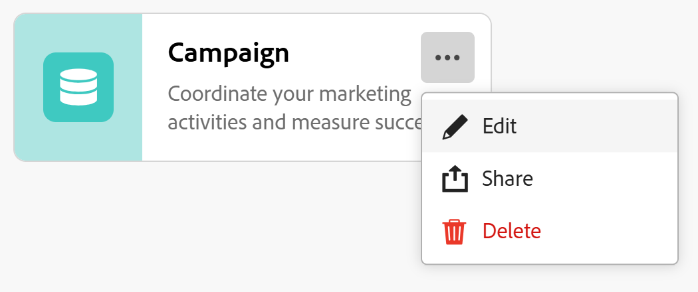
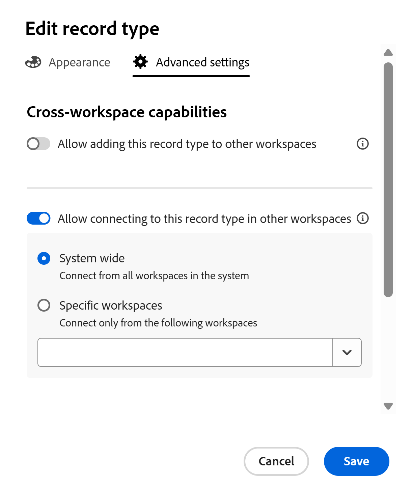

<!-- add these to the metadata, when making this public: 

feature: Workfront Planning
role: User, Admin
author: Alina
recommendations: noDisplay, noCatalog

-->

<!--*******************THIS TITLE MIGHT NEED TO CHANGE WHEN WE HAVE THE FINAL NAME FOR THE "GLOBAL" RECORD TYPE - NOT SURE IF WE ARE GOING TO USE "GLOBAL" OR "DYNAMIC", OR ???? ***************; also update TOC file, the miniTOC,  etc when this is finalized-->

<!--this article is linked to the UI - do not delete or change the URL-->
<!--add more info here about permissions, how users gain permissions from the original record type, per Lilit: users who add this to another space gain View permissions on that space when they add records to this added record type - this info is in the UI - this is what she sent in figma:

Hey, Alina, Lusine. As this page contains not only the "global record types" but also cross-workspace connectivity setting, we shouldn't have this message that's highlighting only the global rt features. I think we should have explanation for each setting both in enabled and disabled states. 

So we'd have the "Allow adding this record type to other workspaces" setting in enabled or disabled state, and display an explanation text below it explaining the capability, as well as a link to help articles for more context. I'd like to include the following key points in the message:  

Once enabled, this record type can be added in other workspaces by designated people 

Members of those workspaces can create and manage records in scope of their workspace 

Any records added by other workspace members will be rolled up to this workspace with view access so members of the current workspace can create views for cross-workspace records.  

Then for the second setting for cross-workspace connections, we'll need a similar explanation text would highlight that the other workspaces can create connections and gain view access to the records in this record type, but will not see the record type in their workspace. (not sure what she means by this last bit, asking in figma also)

-->

# Configurare le funzionalità tra aree di lavoro diverse per i tipi di record

<!--this is linked to the UI in the info icon when you enable a record to be either centralized or connectable-->

Le informazioni contenute in questa pagina si riferiscono a funzionalità non ancora generalmente disponibili. È disponibile solo nell’ambiente di anteprima per tutti i clienti. Dopo i rilasci mensili in Produzione, le stesse funzioni sono disponibili nell’ambiente di Produzione per i clienti che hanno abilitato i rilasci rapidi. 

Per informazioni sulle versioni rapide, vedere [Abilitare o disabilitare le versioni rapide per l&#39;organizzazione](/help/quicksilver/administration-and-setup/set-up-workfront/configure-system-defaults/enable-fast-release-process.md). 

Di seguito sono riportate le funzionalità dei tipi di record in più aree di lavoro:

* È possibile designare un tipo di record come centralizzato. Gli utenti possono aggiungere tipi di record centralizzati ad altre aree di lavoro che possono gestire.
* È possibile designare un tipo di record come collegabile. Gli utenti possono connettersi a questo tipo di record da altre aree di lavoro.

È necessario innanzitutto definire le funzionalità di un tipo di record in più aree di lavoro prima che i responsabili dell&#39;area di lavoro possano collegarlo o aggiungerlo ad altre aree di lavoro.

Quando si crea o si modifica un tipo di record, è possibile definire le funzionalità di un tipo di record in più aree di lavoro.

Per informazioni, vedere uno degli articoli seguenti:

* [Crea tipi di record](/help/quicksilver/planning/architecture/create-record-types.md)
* [Modifica tipi di record](/help/quicksilver/planning/architecture/edit-record-types.md)

## Requisiti di accesso

+++ Espandi per visualizzare i requisiti di accesso per la funzionalità in questo articolo.

<table style="table-layout:auto"> 
<col> 
</col> 
<col> 
</col> 
<tbody> 
    <tr> 
<tr>

</tr>   
<tr> 
   <td role="rowheader">
Pacchetto Adobe Workfront
</td> 
   <td> 
<ul><li>
Qualsiasi pacchetto Workfront
</li>
E
<li>
Pacchetto Planning Plus
</li></ul>
<!--Or:
<ul><li>
Any Workflow package
 </li>
And
<li>
Planning Prime or Ultimate package
</li></ul>-->

Per ulteriori informazioni su ciò che è incluso in ogni pacchetto di Workfront Planning, contattare l'account manager Workfront. 
 
   </td>

<tr> 
   <td role="rowheader">
Licenza Adobe Workfront
</td> 
   <td>
Standard

   </td> 
  </tr> 
  <tr> 
   <td role="rowheader">
Autorizzazioni oggetto
</td> 
   <td>   
Gestione delle autorizzazioni per un'area di lavoro</a> 
  
   
Gli amministratori di sistema dispongono delle autorizzazioni per tutte le aree di lavoro, incluse quelle non create
  </td> 
  </tr>  
</tbody> 
</table>

Per ulteriori informazioni sui requisiti di accesso a Workfront, vedere [Requisiti di accesso nella documentazione di Workfront](/help/quicksilver/administration-and-setup/add-users/access-levels-and-object-permissions/access-level-requirements-in-documentation.md).

+++   

## Configurare tipi di record centralizzati

<!--this is a UI term; don't change the title of this section-->
<!--IMPORTANT: not sure if we can call these centralized yet - checking with Lilit as of Sept 2; you might need to revert this to what the screen shot shows below?????-->

In qualità di responsabile dell&#39;area di lavoro, è possibile configurare un tipo di record come tipo di record centralizzato. È possibile aggiungere un tipo di record centralizzato ad altre aree di lavoro.

Un responsabile dell&#39;area di lavoro può aggiungere un tipo di record centralizzato a un&#39;area di lavoro gestita. Vengono aggiunti anche i campi originali del tipo di record.

Gli utenti possono aggiungere record a un tipo di record centralizzato da qualsiasi area di lavoro per cui dispongono delle autorizzazioni Contribute e in cui viene aggiunto il tipo di record centralizzato, inclusa l&#39;area di lavoro originale. Possono visualizzare i record dall’area di lavoro a cui dispongono solo delle autorizzazioni di visualizzazione.

Per ulteriori informazioni, vedere [Panoramica sui tipi di record tra aree di lavoro](/help/quicksilver/planning/architecture/cross-workspace-record-types-overview.md)

Per configurare l&#39;aggiunta di un tipo di record come tipo di record centralizzato:

{{step1-to-planning}}

1. Fare clic sul workspace di cui si desidera modificare i tipi di record.

   Viene visualizzata la pagina dell&#39;area di lavoro e i tipi di record.
1. Esegui una delle operazioni seguenti:

   * Passa il puntatore del mouse sulla scheda di un tipo di record e fai clic sul menu **Altro**  nell&#39;angolo superiore destro della scheda del tipo di record
Oppure
   * Fai clic su una scheda del tipo di record per aprire la pagina del tipo di record, quindi fai clic sul menu **Altro**  a destra del nome del tipo di record.
1. Fai clic su **Modifica**.

   

   >[!TIP]
   >
   >Se un tipo di record è già stato designato come tipo di record centralizzato e viene aggiunto ad altre aree di lavoro, l&#39;opzione Modifica non è disponibile.

1. Nella casella **Modifica tipo di record** selezionare la scheda **Impostazioni avanzate**.
1. Abilita l&#39;impostazione **Consenti l&#39;aggiunta di questo tipo di record ad altre aree di lavoro**.

   

   >[!TIP]
   >
   >Dopo aver aggiunto un tipo di record centralizzato a un&#39;altra area di lavoro, questa impostazione non può più essere disabilitata.

1. Nel campo **Selezionare gli utenti che possono aggiungere questo tipo di record alle aree di lavoro che gestiscono**, aggiungere le entità che si desidera consentire di aggiungere questo tipo di record alle aree di lavoro che gestiscono.

   Il tuo nome viene aggiunto automaticamente nel campo.

   È possibile aggiungere singoli utenti o gruppi, team, mansioni o società di cui si desidera consentire l&#39;aggiunta di questo tipo di record alle aree di lavoro che gestiscono.

   È necessario designare almeno un&#39;entità (utente, team, gruppo, mansione o società) per abilitare questa impostazione.

   È possibile modificare questo campo dopo aver salvato il tipo di record.

1. (Facoltativo) Rimuovi il tuo nome dal campo **Seleziona gli utenti che possono aggiungere questo tipo di record alle aree di lavoro che gestiscono**.

1. Fai clic su **Salva**.

   Si verificano le seguenti situazioni:

   * Il tipo di record e i relativi campi sono ora disponibili per essere aggiunti a un&#39;altra area di lavoro dalle persone designate.

   >[!NOTE]
   >
   >È possibile modificare l&#39;aspetto e le impostazioni del tipo di record e i relativi campi originali solo dall&#39;area di lavoro originale.

   * Nella scheda del tipo di record viene visualizzata un&#39;icona centralizzata  per indicare che il tipo di record è disponibile per l&#39;aggiunta ad altre aree di lavoro.
   * Un campo **Workspace** generato dal sistema viene aggiunto alla vista tabella del tipo di record e dei relativi dettagli.

     Nel campo Workspace viene visualizzata l&#39;area di lavoro da cui viene creato ogni record.

     Questo campo è di sola lettura e non può essere eliminato.
1. (Facoltativo) Passare a un&#39;altra area di lavoro e creare un tipo di record utilizzando un tipo di record esistente. Selezionare il tipo di record abilitato nei passaggi precedenti.

   Per informazioni, vedere [Aggiungere tipi di record esistenti da un&#39;altra area di lavoro](/help/quicksilver/planning/architecture/add-existing-record-types-from-another-workspace.md).

## Configura tipi di record collegabili

<!--this is a UI term; don't change the title of this section-->

È possibile configurare un tipo di record per la connessione da altre aree di lavoro quando si crea o si modifica il tipo di record.

Per configurare un tipo di record a cui connettersi da altre aree di lavoro quando si modifica il tipo di record:

{{step1-to-planning}}

1. Fare clic sul workspace di cui si desidera modificare i tipi di record.

   Viene visualizzata la pagina dell&#39;area di lavoro e i tipi di record.
1. Esegui una delle operazioni seguenti:

   * Passa il puntatore del mouse sulla scheda di un tipo di record e fai clic sul menu **Altro**  nell&#39;angolo superiore destro della scheda del tipo di record, quindi fai clic su **Modifica**
Oppure
   * Fai clic su una scheda del tipo di record per aprire la pagina del tipo di record, fai clic sul menu **Altro**  a destra del nome del tipo di record, quindi fai clic su **Modifica**.

   

1. Nella casella **Modifica tipo di record** selezionare la scheda **Impostazioni avanzate**.
1. Abilita l&#39;impostazione **Consenti la connessione a questo tipo di record in altre aree di lavoro**. <!-- check the setting name, I sent this to Lilit to say FROM instead of IN-->

   

   Se attivato, il tipo di record è accessibile e può essere connesso ad altre aree di lavoro.

1. Scegliere le aree di lavoro da cui è possibile accedere al tipo di record. Scegli una delle seguenti opzioni:

   * **A livello di sistema**: gli utenti possono connettersi a questo tipo di record da tutte le aree di lavoro per le quali dispongono delle autorizzazioni di gestione.
   * **Aree di lavoro specifiche**: aggiungere i nomi delle aree di lavoro a cui i responsabili area di lavoro possono connettersi a questo tipo di record.
1. Fai clic su **Salva**.

   Si verificano le seguenti situazioni:

   * Il tipo di record e i relativi campi sono ora disponibili per la connessione alle aree di lavoro specificate.
   * Nella scheda del tipo di record viene visualizzata l&#39;icona di connessione tra più aree di lavoro  per indicare che il tipo di record è disponibile per la connessione da qualsiasi area di lavoro designata nella configurazione.

   Il tipo di record diventa disponibile per la connessione alle aree di lavoro specificate.
1. (Facoltativo) Vai a un’altra area di lavoro e aggiungi una connessione al tipo di record abilitato per la connessione tra aree di lavoro diverse nei passaggi precedenti.

   Per informazioni, vedere [Tipi di record di connessione](/help/quicksilver/planning/architecture/connect-record-types.md).

