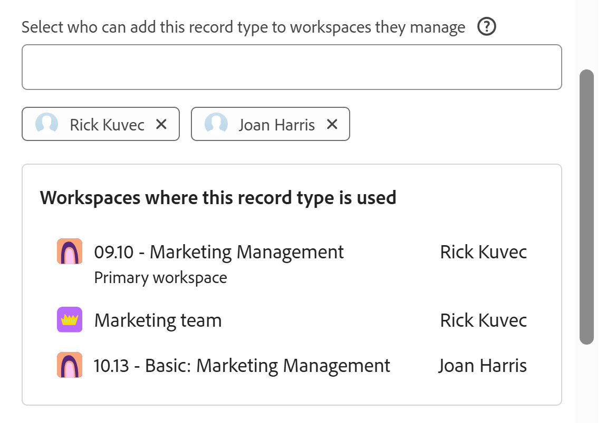

<!-- add these to the metadata, when making this public: 

feature: Workfront Planning
role: User, Admin
author: Alina
recommendations: noDisplay, noCatalog

-->

<!--*******************REPLACE THE "ADVANCED SETTINGS" SECTION IN THE "EDIT RECORD TYPES" ARTICLE WITH A LINK TO THIS ARTICLE INSTEAD AND REMOVE THE STEPS FROM THE "EDIT RECORD TYPES" ARTICLE ON HOW TO ALLOW CROSS-WORKSPACE SETTINGS FOR RECORD TYPES*************-->

<!--this article is linked to the UI - do not delete or change the URL-->

<!--THIS MIGHT ALREADY BE ADDED TO THE "OVERVIEW" ARTICLE, BUT CHECK: add more info here about permissions, how users gain permissions from the original record type, per Lilit: users who add this to another space gain View permissions on that space when they add records to this added record type.

-->

# Configurare le funzionalità tra aree di lavoro diverse per i tipi di record

{{planning-important-intro}}

<!--this is linked to the UI in the info icon when you enable a record to be either global or connectable-->

Le informazioni contenute in questa pagina si riferiscono a funzionalità non ancora generalmente disponibili. È disponibile solo nell’ambiente di anteprima per tutti i clienti. Dopo i rilasci mensili in Produzione, le stesse funzioni sono disponibili nell’ambiente di Produzione per i clienti che hanno abilitato i rilasci rapidi. 

Per informazioni sulle versioni rapide, vedere [Abilitare o disabilitare le versioni rapide per l&#39;organizzazione](/help/quicksilver/administration-and-setup/set-up-workfront/configure-system-defaults/enable-fast-release-process.md). 

In Adobe Workfront Planning è possibile configurare i tipi di record in modo che funzionino in più aree di lavoro.

È possibile designare un tipo di record come uno dei seguenti:

* **Tipo di record globale**: gli utenti possono aggiungere tipi di record globali ad altre aree di lavoro gestibili.
* **Tipo di record collegabile**: gli utenti possono connettersi a questo tipo di record da altre aree di lavoro.

È necessario innanzitutto definire le funzionalità di un tipo di record in più aree di lavoro prima che i responsabili dell&#39;area di lavoro possano aggiungerlo o collegarlo da altre aree di lavoro.

Quando si crea o si modifica un tipo di record, è possibile definire le funzionalità di un tipo di record in più aree di lavoro.

Per informazioni, vedere uno degli articoli seguenti:

* [Crea tipi di record](/help/quicksilver/planning/architecture/create-record-types.md)
* [Modifica tipi di record](/help/quicksilver/planning/architecture/edit-record-types.md)

## Requisiti di accesso

+++ Espandi per visualizzare i requisiti di accesso per la funzionalità in questo articolo.

<table style="table-layout:auto"> 
<col> 
</col> 
<col> 
</col> 
<tbody> 
    <tr> 
<tr>

</tr>   
<tr> 
   <td role="rowheader">
Pacchetto Adobe Workfront
</td> 
   <td> 
<ul><li>
Qualsiasi pacchetto Workfront
</li>

E

<li>
Qualsiasi pacchetto Planning per la creazione di tipi di record collegabili
</li>
<li>
Pacchetto Planning Plus per la creazione di tipi di record globali
</li>
</ul>
Oppure:
<ul><li>
Un pacchetto Workflow Prime o Ultimate
 </li>
E
<li>
Un pacchetto Planning Prime o Ultimate
</li></ul>

Per ulteriori informazioni su ciò che è incluso in ogni pacchetto di Workfront Planning, contattare l'account manager Workfront. 
 
   </td> 
  <tr> 
   <td role="rowheader">
Licenza Adobe Workfront
</td> 
   <td>
Standard

   </td> 
  </tr> 
  <tr> 
   <td role="rowheader">
Autorizzazioni oggetto
</td> 
   <td>   
Gestione delle autorizzazioni per un'area di lavoro e per il tipo di record</a> 
  
   
Gli amministratori di sistema dispongono delle autorizzazioni per tutte le aree di lavoro, incluse quelle non create
  </td> 
  </tr>  
</tbody> 
</table>

Per ulteriori informazioni sui requisiti di accesso a Workfront, vedere [Requisiti di accesso nella documentazione di Workfront](/help/quicksilver/administration-and-setup/add-users/access-levels-and-object-permissions/access-level-requirements-in-documentation.md).

+++   

## Configurare i tipi di record globali

<!--this is a UI term; don't change the title of this section-->

In qualità di responsabile dell&#39;area di lavoro, è possibile configurare un tipo di record come tipo di record globale. È possibile aggiungere un tipo di record globale ad altre aree di lavoro.

Un gestore dell&#39;area di lavoro può aggiungere un tipo di record globale a un&#39;area di lavoro gestita. I campi originali del tipo di record vengono aggiunti anche all&#39;area di lavoro secondaria.

Gli utenti possono aggiungere record a un tipo di record globale da qualsiasi area di lavoro in cui dispongono delle autorizzazioni Contribute e in cui viene aggiunto il tipo di record globale, inclusa l&#39;area di lavoro originale. Possono visualizzare i record dalle aree di lavoro a cui dispongono solo delle autorizzazioni di visualizzazione.

Per ulteriori informazioni, vedere [Panoramica sui tipi di record tra aree di lavoro](/help/quicksilver/planning/architecture/cross-workspace-record-types-overview.md).

Per configurare un tipo di record come globale:

{{step1-to-planning}}

1. Fare clic sull&#39;area di lavoro di cui si desidera configurare i tipi di record come globali.

   Viene visualizzata la pagina dell&#39;area di lavoro e i tipi di record.
1. Esegui una delle operazioni seguenti:

   * Passa il puntatore del mouse sulla scheda di un tipo di record e fai clic sul menu **Altro**  nell&#39;angolo superiore destro della scheda del tipo di record

     

   * Fai clic su una scheda del tipo di record per aprire la pagina del tipo di record, quindi fai clic sul menu **Altro**  a destra del nome del tipo di record.
1. Fai clic su **Modifica** o **Impostazioni**.

   >[!TIP]
   >
   >Quando un tipo di record viene aggiunto a un&#39;altra area di lavoro, viene visualizzato come tipo di record globale in tale area di lavoro. In questo caso, le opzioni Modifica e Impostazioni sono disattivate.

1. (Condizionale) Se hai fatto clic su **Modifica**, nella casella **Modifica tipo di record**, fai clic sulla scheda **Impostazioni per più aree di lavoro**

   Oppure, se hai fatto clic su **Impostazioni**, fai clic sulla sezione **Impostazioni per più aree di lavoro** nel pannello a sinistra.
1. Abilita l&#39;impostazione **Consenti l&#39;aggiunta di questo tipo di record ad altre aree di lavoro**.

   

   >[!TIP]
   >
   >Dopo aver aggiunto un tipo di record globale a un&#39;altra area di lavoro, questa impostazione non può più essere disabilitata.

1. Nel campo **Selezionare gli utenti che possono aggiungere questo tipo di record alle aree di lavoro che gestiscono**, aggiungere le entità che si desidera consentire di aggiungere questo tipo di record alle aree di lavoro che gestiscono.

   Il tuo nome viene aggiunto automaticamente nel campo.

   È possibile aggiungere singoli utenti, gruppi, team, mansioni o società di cui si desidera consentire l&#39;aggiunta di questo tipo di record alle aree di lavoro che gestiscono.

   È possibile modificare questo campo dopo aver salvato il tipo di record.

1. (Facoltativo) Rimuovi il tuo nome dal campo **Seleziona gli utenti che possono aggiungere questo tipo di record alle aree di lavoro che gestiscono**.

   >[!TIP]
   >
   >È necessario designare almeno un&#39;entità (utente, team, gruppo, mansione o società) per abilitare questa impostazione.

1. (Condizionale) Fai clic su **Salva** nella casella **Modifica tipo di record** oppure fai clic sulla freccia indietro a sinistra di **Impostazioni** nell&#39;intestazione della pagina per salvare le modifiche.

   Si verificano le seguenti situazioni:

   * Il tipo di record e i relativi campi sono ora disponibili per essere aggiunti a un&#39;altra area di lavoro dalle persone designate.

   >[!NOTE]
   >
   >È possibile modificare l&#39;aspetto e le impostazioni del tipo di record e i relativi campi originali solo dall&#39;area di lavoro originale.

   * Nella scheda del tipo di record viene visualizzata l&#39;icona **tipo di record globale**  per indicare che il tipo di record è disponibile per l&#39;aggiunta ad altre aree di lavoro.
   * Un campo **Workspace** generato dal sistema viene aggiunto alla vista tabella del tipo di record e dei relativi dettagli.

     Nel campo Workspace viene visualizzata l&#39;area di lavoro da cui viene creato ogni record.

     Questo campo è di sola lettura e non può essere eliminato.
1. (Facoltativo) Passare a un&#39;altra area di lavoro e creare un tipo di record utilizzando un tipo di record esistente. Selezionare il tipo di record abilitato nei passaggi precedenti.

   Per informazioni, vedere [Aggiungere tipi di record esistenti da un&#39;altra area di lavoro](/help/quicksilver/planning/architecture/add-existing-record-types-from-another-workspace.md).

   Il tipo di record aggiunto da un tipo di record globale nell&#39;area di lavoro secondaria visualizza anche un&#39;icona **tipo di record globale** .
1. (Facoltativo) Tornare all&#39;area di lavoro originale in cui è stato creato il tipo di record globale e modificare il tipo di record seguendo i passaggi da 1 a 4 sopra <!--ensure this stays accurate-->
1. (Facoltativo) Esaminare l&#39;elenco delle aree di lavoro in cui il record globale è stato aggiunto nelle **aree di lavoro in cui viene utilizzato questo tipo di record, sezione**.

   

## Configura tipi di record collegabili

<!--this is a UI term; don't change the title of this section-->

È possibile configurare un tipo di record per la connessione da altre aree di lavoro quando si crea o si modifica il tipo di record.

Per configurare un tipo di record come collegabile:

{{step1-to-planning}}

1. Fare clic sull&#39;area di lavoro di cui si desidera configurare i tipi di record come collegabile.

   Viene visualizzata la pagina dell&#39;area di lavoro e i tipi di record.
1. Esegui una delle operazioni seguenti:

   * Passa il puntatore del mouse sulla scheda di un tipo di record e fai clic sul menu **Altro**  nell&#39;angolo superiore destro della scheda del tipo di record

     

   * Fai clic su una scheda del tipo di record per aprire la pagina del tipo di record, quindi fai clic sul menu **Altro**  a destra del nome del tipo di record.
1. Fai clic su **Modifica** o **Impostazioni**.

1. (Condizionale) Se hai fatto clic su **Modifica**, nella casella **Modifica tipo di record**, fai clic sulla scheda **Impostazioni per più aree di lavoro**

   Oppure, se hai fatto clic su **Impostazioni**, fai clic sulla sezione **Impostazioni per più aree di lavoro** nel pannello a sinistra.

1. Abilita l&#39;impostazione **Consenti la connessione a questo tipo di record in altre aree di lavoro**. <!-- check the setting name, I sent this to Lilit to say FROM instead of IN-->

   <!-- add new screen shot with new tab name-->

   

   Se attivato, il tipo di record è accessibile e può essere connesso ad altre aree di lavoro.

1. Scegliere le aree di lavoro da cui è possibile accedere al tipo di record. Scegli una delle seguenti opzioni:

   <!--check names of the setting: System wide?? OR All workspaces??-->

   * **Tutte le aree di lavoro**: gli utenti possono connettersi a questo tipo di record da tutte le aree di lavoro per le quali dispongono delle autorizzazioni di gestione.
   * **Aree di lavoro specifiche**: aggiungere dal menu a discesa i nomi delle aree di lavoro a cui i responsabili dell&#39;area di lavoro possono connettersi a questo tipo di record.
1. (Condizionale) Fai clic su **Salva** nella casella **Modifica tipo di record** oppure fai clic sulla freccia indietro a sinistra di **Impostazioni** nell&#39;intestazione della pagina per salvare le modifiche.

   Si verificano le seguenti situazioni:

   * Il tipo di record e i relativi campi sono ora disponibili per la connessione alle aree di lavoro specificate.
   * Nella scheda del tipo di record viene visualizzata l&#39;icona del tipo di record collegabile  per indicare che il tipo di record è disponibile per la connessione da qualsiasi area di lavoro designata nella configurazione.

1. (Facoltativo) Vai a un’altra area di lavoro e aggiungi una connessione al tipo di record abilitato per la connessione tra aree di lavoro diverse nei passaggi precedenti.

   Per informazioni, vedere [Tipi di record di connessione](/help/quicksilver/planning/architecture/connect-record-types.md).

