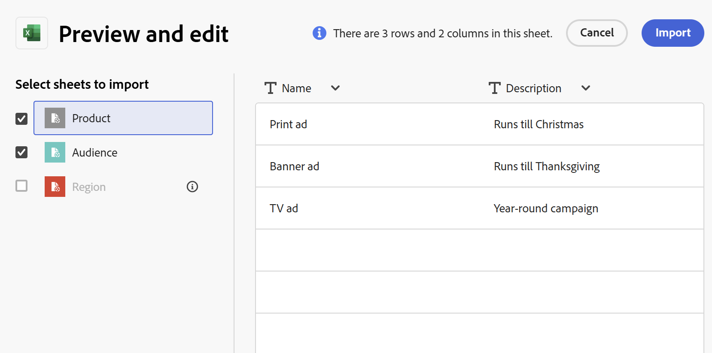

<!--this is linked to the UI in an empty workspace screen-->

# Crea tipi di record

<!--The information on this page refers to functionality not yet generally available. It is available only in the Preview environment for all customers. After the monthly releases to Production, the same features are also available in the Production environment for customers who enabled fast releases.    

For information about fast releases, see [Enable or disable fast releases for your organization](/help/quicksilver/administration-and-setup/set-up-workfront/configure-system-defaults/enable-fast-release-process.md). -->

{{planning-important-intro}}

I tipi di record sono i tipi di oggetto di Adobe Workfront Planning. In Workfront Planning è possibile creare tipi di record personalizzati che illustrano gli elementi relativi al lavoro necessari per il ciclo di vita dell&#39;organizzazione.

Per ulteriori informazioni sui tipi di record, vedere [Panoramica sui tipi di record](/help/quicksilver/planning/architecture/overview-of-record-types.md).

## Requisiti di accesso

+++ Espandere per visualizzare i requisiti di accesso per Workfront Planning.

Per eseguire i passaggi descritti in questo articolo, è necessario disporre dei seguenti diritti di accesso:

<table style="table-layout:auto"> 
<col> 
</col> 
<col> 
</col> 
<tbody> 
    <tr> 
<tr> 
<td> 
   
 Prodotti
 </td> 
   <td> 
   <ul><li>
 Adobe Workfront
</li> 
   <li>
 Adobe Workfront Planning
</li></ul></td> 
  </tr>   
<tr> 
   <td role="rowheader">
Piano Adobe Workfront*
</td> 
   <td> 

Uno dei seguenti piani di Workfront:
 
<ul><li>Seleziona</li> 
<li>Prime</li> 
<li>Ultimate</li></ul> 

Workfront Planning non è disponibile per i piani Workfront legacy
 
   </td> 
<tr> 
   <td role="rowheader">
Pacchetto Adobe Workfront Planning*
</td> 
   <td> 

Qualsiasi 
 

Per ulteriori informazioni su quanto incluso in ogni piano di Workfront Planning, contattare l'account manager Workfront. 
 
   </td> 
 <tr> 
   <td role="rowheader">
Piattaforma Adobe Workfront
</td> 
   <td> 

Per poter accedere a tutte le funzionalità di Workfront Planning, l’istanza di Workfront della tua organizzazione deve essere integrata in Adobe Unified Experience.
 

Per ulteriori informazioni, vedere <a href="/help/quicksilver/workfront-basics/navigate-workfront/workfront-navigation/adobe-unified-experience.md">Esperienza unificata Adobe per Workfront</a>. 
 
   </td> 
   </tr> 
  </tr> 
  <tr> 
   <td role="rowheader">
Licenza Adobe Workfront*
</td> 
   <td>
 Standard

   
Workfront Planning non è disponibile per le licenze Workfront legacy
 
  </td> 
  </tr> 
  <tr> 
   <td role="rowheader">
Configurazione del livello di accesso
</td> 
   <td> 
Nessun controllo del livello di accesso per Adobe Workfront Planning
   
</td> 
  </tr> 
<tr> 
   <td role="rowheader">
Autorizzazioni oggetto
</td> 
   <td>   
Gestione delle autorizzazioni per un'area di lavoro</a> 
  
   
Gli amministratori di sistema dispongono delle autorizzazioni per tutte le aree di lavoro, incluse quelle non create
  </td> 
  </tr> 
<tr> 
   <td role="rowheader">
Modello di layout
</td> 
   <td> 
A tutti gli utenti, inclusi gli amministratori di Workfront, deve essere assegnato un modello di layout che includa l'area Planning nel menu principale. 
 </td> 
  </tr> 
</tbody> 
</table>

*Per ulteriori informazioni sui requisiti di accesso a Workfront, vedere [Requisiti di accesso nella documentazione di Workfront](/help/quicksilver/administration-and-setup/add-users/access-levels-and-object-permissions/access-level-requirements-in-documentation.md).

+++

## Considerazioni sulla creazione di tipi di record

* È possibile creare tipi di record in un&#39;area di lavoro nei modi seguenti:

   * Automaticamente:
      * Quando crei un’area di lavoro utilizzando un modello.

        Per informazioni, vedere [Creare aree di lavoro](/help/quicksilver/planning/architecture/create-workspaces.md).

      * Quando vengono importati utilizzando un file Excel o CSV.

     >[!TIP]
     >
     >Quando si importa un tipo di record da un file Excel o CSV, è inoltre possibile importare record e campi.

   * Manualmente:

      * Da zero.

        Questo articolo descrive come creare tipi di record da zero.

* È possibile spostare tipi di record all&#39;interno di una sezione e da una sezione di un&#39;area di lavoro a un&#39;altra. Non è possibile spostare tipi di record da un&#39;area di lavoro a un&#39;altra.

## Creare tipi di record utilizzando un modello di area di lavoro

È possibile creare automaticamente i tipi di record quando si crea un&#39;area di lavoro utilizzando un modello di Workfront Planning. Ogni modello contiene tipi di record di esempio.

Quando si crea un&#39;area di lavoro da un modello, i tipi di record vengono raggruppati nelle sezioni seguenti:

* Tipi di record operativi
* Tassonomie

È possibile aggiungere manualmente tipi di record nelle sezioni Tipi di record operativi e Tassonomie.

Per informazioni sulla creazione di aree di lavoro, vedere [Creare aree di lavoro](/help/quicksilver/planning/architecture/create-workspaces.md).

Per informazioni sui tipi di record inclusi in ogni modello, vedere [Elenco dei modelli di area di lavoro](/help/quicksilver/planning/architecture/workspace-templates.md).

## Creare un tipo di record da zero

{{step1-to-planning}}

1. Fare clic sull&#39;area di lavoro in cui si desidera creare un tipo di record.

   Oppure

   Da un workspace, espandere la freccia rivolta verso il basso a destra del nome di un workspace esistente, cercare un workspace e selezionarlo quando viene visualizzato nell&#39;elenco.
1. (Facoltativo) Fai clic su **Aggiungi sezione** per aggiungere una nuova sezione all&#39;area di lavoro.
1. Fare clic su **Aggiungi tipo di record**, quindi su **Nuovo**.

   Viene visualizzata la casella Aggiungi tipo di record.
   <!--1. (Conditional) When creating record types by importing an Excel or CSV file is enabled, click **From scratch**. Otherwise, the **Add record type** box opens. -->

   

1. Aggiorna le seguenti informazioni:

   * Sostituire &quot;Tipo di record senza titolo&quot; con il nome del tipo di record futuro. <!--did they bring back the field label here and did they rename it to "Name"-->
   * **Descrizione**: aggiungere ulteriori informazioni sul tipo di record.
   * Selezionare un colore e una forma per l&#39;icona associata al tipo di record. Effettua le seguenti operazioni:
      * Selezionare un colore per identificare il nuovo tipo di record. Colore dell&#39;icona del tipo di record. Il grigio è selezionato per impostazione predefinita.
      * Seleziona un’icona dall’elenco, oppure inizia a digitare il nome di un’icona per descrivere ciò che rappresenta, quindi selezionala quando viene visualizzata. Icona del tipo di record. Per impostazione predefinita, viene selezionata un&#39;icona di file.

1. Fai clic su **Crea**.

   La scheda del tipo di record viene aggiunta alla sezione e all&#39;area di lavoro selezionate.
Sulla scheda viene visualizzata la descrizione del tipo di record.

   

1. (Facoltativo) Passa il puntatore del mouse sulla scheda del tipo di record, fai clic sull&#39;icona **Altro**  nell&#39;angolo superiore destro, quindi fai clic su **Modifica** per modificare le informazioni sul tipo di record.
1. (Facoltativo) Fare clic sulla scheda tipo di record per aprire la pagina tipo di record.

   

   Per impostazione predefinita, la pagina del tipo di record viene visualizzata nella vista tabella. Le colonne della tabella sono campi associati al nuovo tipo di record. Ogni riga è un record univoco da aggiungere.

   Per impostazione predefinita, i campi seguenti vengono visualizzati nelle colonne della vista tabella di un tipo di record operativo:

   * Nome
   * Descrizione
   * Data di inizio
   * Data di fine
   * Stato

1. (Facoltativo) Aggiorna il nome del tipo di record nell’intestazione della pagina

   Oppure

   Fai clic sull&#39;icona **Altro**  a destra del nome del tipo di record e fai clic su **Modifica** per rinominarlo o modificare le informazioni su di esso. Per ulteriori informazioni, vedere [Modifica tipi di record](/help/quicksilver/planning/architecture/edit-record-types.md).

1. (Facoltativo) Fare clic su **+ Nuovo record** per aggiungere record del tipo di record selezionato. Per ulteriori informazioni, vedere [Creare record](/help/quicksilver/planning/records/create-records.md).
1. (Facoltativo) Fai clic sull&#39;icona **+** nell&#39;angolo superiore destro della tabella per aggiungere altri campi al tipo di record.

   Per ulteriori informazioni sulla creazione dei campi, vedere [Creare i campi](/help/quicksilver/planning/fields/create-fields.md).

1. (Facoltativo) Fare clic sulla freccia rivolta a sinistra a sinistra del nome del tipo di record nell&#39;intestazione per tornare all&#39;area di lavoro selezionata.

1. (Facoltativo) Dall’area di lavoro, fai clic su una scheda del tipo di record e tieni premuto per trascinarla in un punto desiderato o per spostarla in un’altra sezione.

   Le modifiche vengono salvate automaticamente.

   Per ulteriori informazioni sull&#39;aggiunta di record, l&#39;eliminazione o la modifica di tipi di record o l&#39;aggiornamento della visualizzazione nella pagina del tipo di record, vedere gli articoli seguenti:

   * [Crea record](/help/quicksilver/planning/records/create-records.md)
   * [Elimina tipi di record](/help/quicksilver/planning/architecture/delete-record-types.md)
   * [Modifica tipi di record](/help/quicksilver/planning/architecture/edit-record-types.md)
   * [Gestisci visualizzazioni record](/help/quicksilver/planning/views/manage-record-views.md)

## Creare tipi di record importando un file Excel o CSV

Quando si importano tipi di record utilizzando un file Excel o CSV, tenere presente quanto segue:

* Ogni foglio del file Excel diventa un tipo di record. Il nome del foglio diventa il nome del tipo di record.
* Se è presente un solo foglio o se si importa un file CSV, il nome del file diventa il nome del tipo di record.
* Le intestazioni di colonna di ciascun foglio diventano i campi associati a ciascun tipo di record.
* I campi sono univoci per i rispettivi tipi di record.
* Ogni riga di ogni foglio diventa un record univoco associato al rispettivo tipo di record.
* Ogni foglio del file Excel non deve superare i seguenti:
   * 10.000 righe
   * 500 colonne
* Il file Excel non deve superare i 5 MB.
* I fogli vuoti non sono supportati.

Per importare tipi di record utilizzando un file Excel o CSV:

{{step1-to-planning}}

1. Fare clic sull&#39;area di lavoro in cui si desidera creare i tipi di record.

   Oppure

   Da un workspace, espandere la freccia rivolta verso il basso a destra del nome di un workspace esistente, cercare un workspace e selezionarlo quando viene visualizzato nell&#39;elenco.
1. Fare clic su **Aggiungi tipo di record**.
1. Fare clic su **Dal file**.
1. Trascina e rilascia un file Excel o CSV salvato in precedenza sul computer, oppure fai clic su **Seleziona un file CSV o Excel** per cercarne uno.
1. Fare clic su **Anteprima e modifica**.

   La casella **Anteprima e modifica** viene visualizzata con le seguenti informazioni:

   * I nomi dei fogli o dei tipi di record futuri vengono visualizzati nel pannello sinistro. Per impostazione predefinita, Workfront Planning seleziona un&#39;icona e un colore per ogni nuovo tipo di record.
   * Il primo foglio o il tipo di record viene selezionato e i nomi dei campi associati vengono visualizzati come intestazioni di colonna. Il tipo di ogni campo è selezionato per impostazione predefinita.
   * Ogni riga rappresenta un nuovo record. Nella casella Anteprima e modifica vengono visualizzati solo i primi 10 record.

   

1. (Facoltativo) Fate clic sul nome di ciascun foglio nel pannello a sinistra per esaminare le informazioni in esso contenute.

   >[!NOTE]
   >
   >I fogli vuoti non sono supportati e sono oscurati.

1. (Facoltativo) Deseleziona i fogli che non desideri importare dal pannello a sinistra.

   

   I fogli deselezionati vengono visualizzati con uno sfondo grigio.

1. (Facoltativo) Fai clic sulla freccia rivolta verso il basso a destra dell’intestazione della colonna per effettuare una delle seguenti operazioni:

   * Rinomina uno dei campi
   * Cambia il tipo di campo ****
   * Aggiorna il campo **Descrizione**

1. (Condizionale) Dopo aver aggiornato le informazioni sul campo, fai clic su **Salva**.

1. Fare clic su **Importa** quando si è pronti per importare il file.

   Le informazioni seguenti vengono importate in Workfront Planning:

   * Nuovi tipi di record
   * Nuovi campi associati a ciascun tipo di record
   * Nuovi record associati a ciascun tipo di record

   È possibile iniziare a gestire campi e record nelle pagine dei tipi di record.

   Tutti gli utenti con accesso a Workfront Planning possono ora visualizzare e modificare i tipi di record importati e le relative informazioni.
