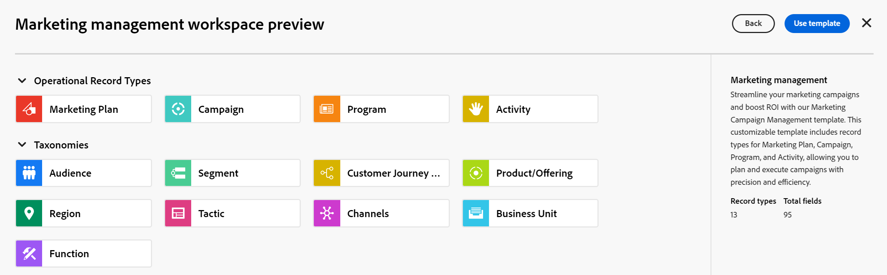

# Creare aree di lavoro

Le informazioni contenute in questa pagina si riferiscono a funzionalità non ancora generalmente disponibili. È disponibile solo nell’ambiente di anteprima per tutti i clienti. Dopo i rilasci mensili in Produzione, le stesse funzioni sono disponibili nell’ambiente di Produzione per i clienti che hanno abilitato i rilasci rapidi. 

Per informazioni sulle versioni rapide, vedere [Abilitare o disabilitare le versioni rapide per l&#39;organizzazione](/help/quicksilver/administration-and-setup/set-up-workfront/configure-system-defaults/enable-fast-release-process.md). 

{{planning-important-intro}}

In Adobe Workfront Planning, le aree di lavoro sono posizioni centralizzate in cui i team possono pianificare il lavoro.

Un&#39;area di lavoro è una raccolta di tipi di record utilizzati da un team e rappresenta il ciclo di vita del lavoro del team. È possibile personalizzare completamente le aree di lavoro in Adobe Workfront Planning.

Per informazioni generali sulle aree di lavoro, vedere [Panoramica delle aree di lavoro](/help/quicksilver/planning/architecture/workspaces-overview.md).

## Requisiti di accesso

+++ Espandi per visualizzare i requisiti di accesso per la funzionalità in questo articolo. 

<table style="table-layout:auto"> 
<col> 
</col> 
<col> 
</col> 
<tbody> 
    <tr> 
<tr> 
</tr>   
<tr> 
   <td role="rowheader">
Pacchetto Adobe Workfront
</td> 
   <td> 

Qualsiasi pacchetto Workfront o flusso di lavoro
 

Qualsiasi pacchetto di Workfront Planning

Un pacchetto Workfront Planning Prime o versione successiva per creare più aree di lavoro alla volta

Per ulteriori informazioni su ciò che è incluso in ogni pacchetto Workfront Planning, contattare il rappresentante del proprio account Workfront. 
 
   </td> 
  <tr> 
   <td role="rowheader">
Licenza di Adobe Workfront
</td> 
   <td>
Standard

   
L’amministratore di sistema può creare più aree di lavoro contemporaneamente utilizzando il bundle di modelli basato su best practice

   </td> 
  </tr> 
  <tr> 
   <td role="rowheader">
Autorizzazioni sugli oggetti
</td> 
   <td>   
Gestire le autorizzazioni per un’area di lavoro
  
   
Gli amministratori di sistema dispongono delle autorizzazioni per tutte le aree di lavoro, incluse quelle non create
  </td> 
  </tr>  
</tbody> 
</table>

Per ulteriori informazioni sui requisiti di accesso a Workfront, vedere [Requisiti di accesso nella documentazione di Workfront](/help/quicksilver/administration-and-setup/add-users/access-levels-and-object-permissions/access-level-requirements-in-documentation.md).

+++   

<!--
Old:

<table style="table-layout:auto"> 
<col> 
</col> 
<col> 
</col> 
<tbody> 
    <tr> 
<tr> 
<td> 
   
 Products
 </td> 
   <td> 
   <ul><li>
 Adobe Workfront
</li> 
   <li>
 Adobe Workfront Planning
</li></ul></td> 
  </tr>   
<tr> 
   <td role="rowheader">
Adobe Workfront plan*
</td> 
   <td> 

Any of the following Workfront plans:
 
<ul><li>Select</li> 
<li>Prime</li> 
<li>Ultimate</li></ul> 

Workfront Planning is not available for legacy Workfront plans
 
   </td> 
<tr> 
   <td role="rowheader">
Adobe Workfront Planning package*
</td> 
   <td> 

Any 
 

For more information about what is included in each Workfront Planning plan, contact your Workfront account manager. 
 
   </td> 
 <tr> 
   <td role="rowheader">
Adobe Workfront platform
</td> 
   <td> 

Your organization's instance of Workfront must be onboarded to the Adobe Unified Experience to be able to access Workfront Planning.
 

For more information, see <a href="/help/quicksilver/workfront-basics/navigate-workfront/workfront-navigation/adobe-unified-experience.md">Adobe Unified Experience for Workfront</a>. 
 
   </td> 
   </tr> 
  </tr> 
  <tr> 
   <td role="rowheader">
Adobe Workfront license*
</td> 
   <td>
 Standard 

   
Workfront Planning is not available for legacy Workfront licenses
 
  </td> 
  </tr> 
  <tr> 
   <td role="rowheader">
Access level configuration
</td> 
   <td> 
There are no access level controls for Adobe Workfront Planning
   
</td> 
  </tr> 
<tr> 
   <td role="rowheader">
Object permissions
</td> 
   <td>   
You receive Manage permissions to the workspaces you create. 
 </td> 
  </tr> 
</tbody> 
</table>
-->

## Crea un’area di lavoro

È possibile creare un workspace e aggiungervi tipi di record per organizzare gli oggetti in Workfront Planning.

Per ulteriori informazioni sulla modifica di un&#39;area di lavoro, vedere [Modifica aree di lavoro](/help/quicksilver/planning/architecture/edit-workspaces.md).

È possibile creare aree di lavoro nei modi seguenti:

* Creare un’area di lavoro da zero o da un modello

  Per informazioni, vedere la sezione [Creare un&#39;area di lavoro da zero o da un modello](#create-a-workspace-from-scratch-or-from-a-template) in questo articolo.
* Creare un&#39;area di lavoro utilizzando Planning Designer basato sull&#39;intelligenza artificiale. Questa funzione è attualmente disponibile solo per un numero limitato di clienti in un programma Beta.

  Per informazioni, vedere [Introduzione ad Adobe Workfront Planning Designer](/help/quicksilver/planning/general/planning-ai-designer.md).

* Creare più aree di lavoro utilizzando un bundle di modelli per più aree di lavoro basato sulle best practice

  Per informazioni, vedere la sezione [Creare più aree di lavoro utilizzando un bundle di modelli multisfera &#x200B;](#create-multiple-workspaces-using-a-best-practice-multi-workspace-template-bundle) basato su best practice in questo articolo

  >[!TIP]
  >
  >È possibile creare più aree di lavoro contemporaneamente solo utilizzando il bundle di modelli best practice.

### Creare un’area di lavoro da zero o da un modello

{{step1-to-planning}}

1. Fai clic su **Crea area di lavoro**

   Viene visualizzata la casella Crea area di lavoro. È possibile creare un&#39;area di lavoro da zero utilizzando uno dei modelli disponibili.

1. (Facoltativo e condizionale) Fare clic su **Anteprima** in uno dei seguenti modelli di area di lavoro predefiniti:

   * Base: Gestione del marketing
   * Avanzato: Gestione del marketing
   * Enterprise: Gestione del marketing
   * Gestione vendite
   * Gestione dei prodotti

   Viene visualizzata la casella di anteprima del modello.

   È possibile indicare i tipi di record operativi, le tassonomie e il numero di campi associati a ciascun modello.

   

   Per informazioni sui modelli di area di lavoro di Workfront Planning, vedere [Elenco dei modelli di area di lavoro](/help/quicksilver/planning/architecture/workspace-templates.md).

1. Dalla casella di anteprima del modello, fai clic su **Usa modello** per iniziare a creare l&#39;area di lavoro dal modello selezionato

   Oppure

   Fai clic su **Indietro**, quindi su **Nuova area di lavoro** per creare un&#39;area di lavoro da zero.

   Viene creato uno dei seguenti tipi di aree di lavoro:

   * Area di lavoro vuota denominata **Workspace senza titolo** in cui è possibile iniziare ad aggiungere tipi di record manualmente quando si crea un&#39;area di lavoro da zero.
   * Area di lavoro denominata in base al modello selezionato, popolata con tipi di record di esempio. È possibile personalizzare ulteriormente i tipi di record e il workspace.

   Per gli amministratori di Workfront, la nuova area di lavoro viene visualizzata nella scheda **Aree di lavoro in cui sono presente**.

   Per tutti gli altri utenti che possono creare aree di lavoro, la nuova area di lavoro viene visualizzata nell&#39;area **Aree di lavoro**.

1. Fai clic sul nome del workspace nell’intestazione del nuovo workspace per rinominarlo, quindi premi Invio.

1. (Facoltativo e condizionale) Se l&#39;area di lavoro è stata creata da un modello, fare clic all&#39;interno del nome delle sezioni **Tipi di record operativi** o **Tassonomie**

   Oppure

   Passa il mouse sul nome di una sezione, quindi fai clic sul menu **Altro** , quindi fai clic su **Rinomina** per rinominare la sezione.

   >[!TIP]
   >
   >È possibile rinominare qualsiasi sezione da qualsiasi area di lavoro, anche se non è stata creata.

   Per ulteriori informazioni sulla modifica delle aree di lavoro, inclusa la modifica delle sezioni dell&#39;area di lavoro, vedere [Modifica aree di lavoro](/help/quicksilver/planning/architecture/edit-workspaces.md).

1. (Facoltativo) Fai clic su **Aggiungi tipo di record** per aggiungere tipi di record all&#39;area di lavoro in qualsiasi sezione.

   Per informazioni, consulta [Creare tipi di record](/help/quicksilver/planning/architecture/create-record-types.md).

   Per ulteriori informazioni sulla modifica e l&#39;eliminazione di tipi di record in un&#39;area di lavoro, vedere [Modifica aree di lavoro](/help/quicksilver/planning/architecture/edit-workspaces.md).

1. (Facoltativo) Fare clic sulla freccia indietro a sinistra della nuova area di lavoro per aprire la pagina principale di Planning. Viene creata una nuova scheda dell&#39;area di lavoro per la nuova area di lavoro nella scheda **Aree di lavoro attive**.

   Il nome dell’utente che ha creato l’area di lavoro viene salvato nella scheda dell’area di lavoro come Proprietario.

   >[!NOTE]
   >
   >Per gli utenti attualmente sottoposti a transizione ad Adobe Identity Management System (IMS), le aree di lavoro create da utenti solo di Workfront che non sono utenti IMS vengono visualizzate come create da **System**.
   >
   >Per informazioni su IMS, consulta [Esperienza unificata Adobe per Workfront](/help/quicksilver/workfront-basics/navigate-workfront/workfront-navigation/adobe-unified-experience.md).

### Creare più aree di lavoro utilizzando un bundle di modelli per più aree di lavoro basato sulle best practice

>[!IMPORTANT]
>
>La creazione di più aree di lavoro alla volta utilizzando il bundle di modelli di best practice è disponibile solo quando sono soddisfatti i seguenti prerequisiti:
>
>* La tua organizzazione ha acquistato un pacchetto Workfront Planning Prime o Ultimate.
>* Sei un amministratore di sistema

Puoi utilizzare un bundle di modelli per più aree di lavoro per creare 6 aree di lavoro con un clic.

I modelli inclusi nel bundle contengono aree di lavoro, tipi di record, record, visualizzazioni e campi per aiutarti a iniziare con l’implementazione di Planning.

>[!IMPORTANT]
>
>I nomi delle aree di lavoro e dei record inclusi nel bundle sono esempi e non riflettono il tuo ambiente.
>
>I nomi dei tipi di record e dei campi possono essere utilizzati in qualsiasi organizzazione come standard per l’implementazione in qualsiasi settore, in base al nostro consiglio.
>

{{step1-to-planning}}

1. Fai clic su **Crea area di lavoro**

   Viene visualizzata la casella Crea area di lavoro. È possibile creare un&#39;area di lavoro da zero utilizzando uno dei modelli disponibili.

1. Fare clic su **Rivedi configurazione area di lavoro** nell&#39;area **Inizia qui (scelta consigliata)**.
1. (Facoltativo) Fai clic su **Anteprima** in uno dei seguenti modelli di area di lavoro predefiniti per aprire la casella Anteprima per ciascun modello:

   * 1.Classificazioni globali e tassonomie

     Il modello Classificazioni globali e tassonomie include tutti i tipi di record e i campi che si consiglia di creare nell&#39;ambiente per una corretta implementazione di Workfront Planning.

     In seguito sarà possibile collegare o importare i tipi di record contenuti in questo modello in altre aree di lavoro create.
   * 2.Fréscopa Global Marketing
   * 3.Marketing sociale Fréscopa
   * 4.Fréscopa Media e PR
   * 5.Eventi globali di Fréscopa
   * 6.Leadership della società esecutiva Fréscopa

1. Dopo aver aperto la casella **Anteprima** per ogni modello di area di lavoro, fare clic su Indietro per tornare alla casella **Crea area di lavoro** oppure su Usa modelli per utilizzare i modelli inclusi nel bundle e creare aree di lavoro.

   Le aree di lavoro vengono create e visualizzate nelle schede **Aree di lavoro** in e **Tutte le aree di lavoro** per gli amministratori di sistema. Tutti gli utenti con licenza Standard visualizzeranno le aree di lavoro nella propria area di lavoro dopo che un amministratore di sistema le avrà create e condivise con loro.

1. Inizia a modificare le aree di lavoro create e ad aggiungere tipi di record, record, visualizzazioni e campi pertinenti per la tua organizzazione.

   Per ulteriori informazioni sulle best practice per l&#39;implementazione di Workfront, vedere gli articoli nella sezione [Best practice di Adobe Workfront Planning: indice articolo](/help/quicksilver/planning/best-practices.md/best-practices-article-index.md).

   Per informazioni sulla modifica delle aree di lavoro, vedere [Modifica aree di lavoro](/help/quicksilver/planning/architecture/edit-workspaces.md).

