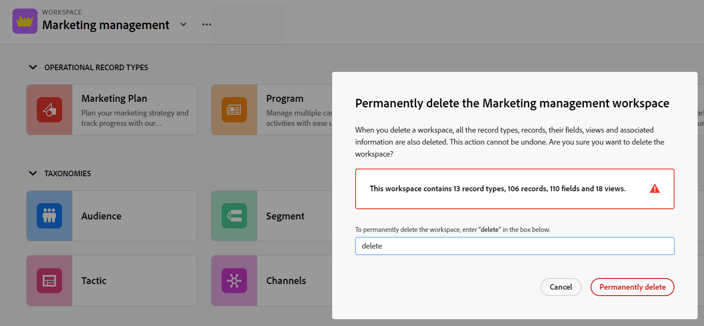

# Eliminare le aree di lavoro

Le informazioni contenute in questa pagina si riferiscono a funzionalità non ancora generalmente disponibili. È disponibile solo nell’ambiente di anteprima per tutti i clienti. Dopo i rilasci mensili in Produzione, le stesse funzioni sono disponibili nell’ambiente di Produzione per i clienti che hanno abilitato i rilasci rapidi. 

Per informazioni sulle versioni rapide, vedere [Abilitare o disabilitare le versioni rapide per l&#39;organizzazione](/help/quicksilver/administration-and-setup/set-up-workfront/configure-system-defaults/enable-fast-release-process.md). 

{{planning-important-intro}}

In Adobe Workfront Planning, le aree di lavoro sono posizioni centralizzate in cui i team possono pianificare il lavoro. Per ulteriori informazioni, vedere [Creare aree di lavoro](/help/quicksilver/planning/architecture/create-workspaces.md).

È possibile eliminare le aree di lavoro non più rilevanti.

È consigliabile ricreare alcuni o tutti i tipi di record, i record, i campi e le visualizzazioni associati all&#39;area di lavoro che si desidera eliminare in un&#39;altra area di lavoro prima di eliminarla.

## Requisiti di accesso

+++ Espandi per visualizzare i requisiti di accesso per la funzionalità in questo articolo. 

<table style="table-layout:auto"> 
<col> 
</col> 
<col> 
</col> 
<tbody> 
    <tr> 
<tr> 
</tr>   
<tr> 
   <td role="rowheader">
Pacchetto Adobe Workfront
</td> 
   <td> 
<ul> 
<li>
Qualsiasi pacchetto Workfront e Planning
</li>
Oppure
<li>
Qualsiasi flusso di lavoro e qualsiasi pacchetto di Planning
</li></ul>

Per ulteriori informazioni su ciò che è incluso in ogni pacchetto Workfront Planning, contattare il rappresentante del proprio account Workfront. 
 
   </td> 
  <tr> 
   <td role="rowheader">
Licenza Adobe Workfront
</td> 
   <td>
Standard

   </td> 
  </tr> 
  <tr> 
   <td role="rowheader">
Autorizzazioni oggetto
</td> 
   <td>   
Gestire le autorizzazioni per un’area di lavoro
  
   
Gli amministratori di sistema dispongono delle autorizzazioni per tutte le aree di lavoro, incluse quelle non create
  </td> 
  </tr>  
</tbody> 
</table>

Per ulteriori informazioni sui requisiti di accesso a Workfront, vedere [Requisiti di accesso nella documentazione di Workfront](/help/quicksilver/administration-and-setup/add-users/access-levels-and-object-permissions/access-level-requirements-in-documentation.md).

+++   

<!--Old:

<table style="table-layout:auto"> 
<col> 
</col> 
<col> 
</col> 
<tbody> 
    <tr> 
<tr> 
<td> 
   
 Products
 </td> 
   <td> 
   <ul><li>
 Adobe Workfront
</li> 
   <li>
 Adobe Workfront Planning
</li></ul></td> 
  </tr>   
<tr> 
   <td role="rowheader">
Adobe Workfront plan*
</td> 
   <td> 

Any of the following Workfront plans:
 
<ul><li>Select</li> 
<li>Prime</li> 
<li>Ultimate</li></ul> 

Workfront Planning is not available for legacy Workfront plans
 
   </td> 
<tr> 
   <td role="rowheader">
Adobe Workfront Planning package*
</td> 
   <td> 

Any 
 

For more information about what is included in each Workfront Planning plan, contact your Workfront account manager. 
 
   </td> 
 <tr> 
   <td role="rowheader">
Adobe Workfront platform
</td> 
   <td> 

Your organization's instance of Workfront must be onboarded to the Adobe Unified Experience to be able to access Workfront Planning.
 

For more information, see <a href="/help/quicksilver/workfront-basics/navigate-workfront/workfront-navigation/adobe-unified-experience.md">Adobe Unified Experience for Workfront</a>. 
 
   </td> 
   </tr> 
  </tr> 
  <tr> 
   <td role="rowheader">
Adobe Workfront license*
</td> 
   <td>
 Standard 

   
Workfront Planning is not available for legacy Workfront licenses
 
  </td> 
  </tr> 
  <tr> 
   <td role="rowheader">
Access level configuration
</td> 
   <td> 
There are no access level controls for Adobe Workfront Planning
   
</td> 
  </tr> 
<tr> 
   <td role="rowheader">
Object permissions
</td> 
   <td>   
Manage permissions to a workspace
  
   
System Administrators have permissions to all workspaces, including the ones they did not create
 </td> 
  </tr> 
</tbody> 
</table> -->

## Considerazioni sull’eliminazione delle aree di lavoro

* Quando si eliminano le aree di lavoro, vengono eliminati anche tutti i tipi di record, i record, i relativi campi e le visualizzazioni.
* Le aree di lavoro eliminate e le informazioni in esse contenute non possono essere recuperate.

## Eliminare un’area di lavoro

{{step1-to-planning}}

1. (Condizionale) Se sei un amministratore di Workfront, fai clic su una delle seguenti opzioni:

   * **Aree di lavoro a cui partecipo** per accedere alle aree di lavoro create
   * **Altre aree di lavoro** per accedere alle aree di lavoro condivise con te
Oppure
     **Tutte le aree di lavoro** per accedere alle aree di lavoro condivise con te o create

1. (Facoltativo) Fai clic su **Mostra tutto** per visualizzare altre aree di lavoro. Il collegamento **Mostra tutto** viene visualizzato solo se sono presenti più di due righe di schede dell&#39;area di lavoro.
1. (Facoltativo) Fai clic su **Mostra meno** per limitare il numero di aree di lavoro visualizzate sullo schermo.
1. Per eliminare un&#39;area di lavoro, effettuate una delle seguenti operazioni:

   * Passa il puntatore del mouse sulla scheda dell&#39;area di lavoro, quindi fai clic sul menu **Altro**  nell&#39;angolo superiore destro della scheda
Oppure
   *  Fai clic sull&#39;icona **cerca**  nell&#39;angolo superiore destro della pagina Aree di lavoro per cercare un&#39;area di lavoro per nome e fai clic su una scheda dell&#39;area di lavoro per aprirla, quindi fai clic sul menu **Altro**  a destra del nome dell&#39;area di lavoro.
1. Fai clic su **Elimina**.

   

1. Digita &quot;**delete**&quot; nello spazio fornito, quindi fai clic su **Delete** definitivamente. Non fa distinzione tra maiuscole e minuscole.

   L’area di lavoro viene eliminata e non può essere recuperata. Verranno eliminati anche tutti i tipi di record, i record, i campi e le visualizzazioni ad essi associati. <!--ensure this is right at or before GA-->

