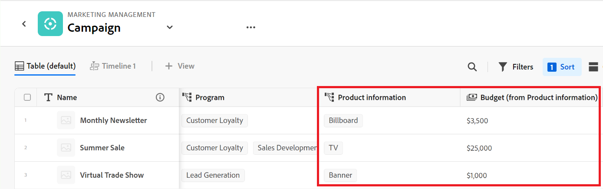
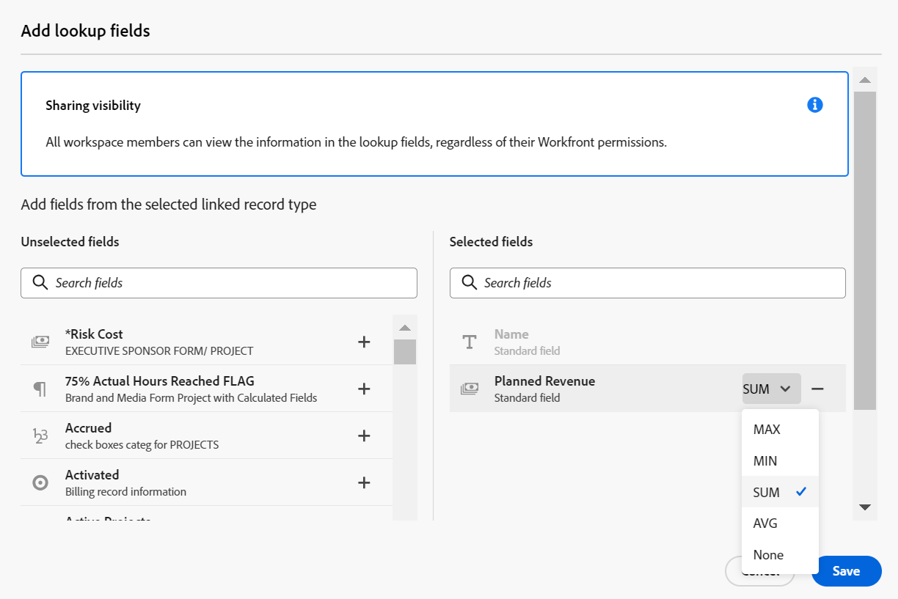

# Esempio di connessione di tipi di record e record

{{planning-important-intro}}

Questo articolo descrive un esempio di quanto segue:

* Come creare una connessione tra due tipi di record di Workfront Planning e due record.

* Come creare una connessione tra un tipo di record di Workfront Planning e un tipo di oggetto progetto di Workfront, nonché una connessione tra un record e un progetto.

Per ulteriori informazioni, consulta anche i seguenti articoli:

* [Connetti tipi di record](/help/quicksilver/planning/architecture/connect-record-types.md)
* [Connetti record](/help/quicksilver/planning/records/connect-records.md)

## Collegare due tipi di record e record di Workfront Planning (esempio)

Ad esempio, il tipo di record originale è Campaign.

È inoltre disponibile un altro tipo di record denominato Prodotto, che dispone di un campo valuta denominato Budget.

Desideri creare un campo sul tipo di record Campaign in cui visualizzare i valori del campo Budget del tipo di record Prodotto.

Per eseguire questa operazione:

1. Apri la vista a tabella per il tipo di record Campaign in un’area di lavoro.
1. Fai clic sull&#39;icona **+** nell&#39;angolo superiore destro della vista tabella per aggiungere un nuovo campo, quindi fai clic su **Nuova connessione**, quindi fai clic su **Prodotto** nella sezione dell&#39;area di lavoro selezionata.
1. Aggiungi le seguenti informazioni, ad esempio:

   * **Tipo di record**: prodotto <!--did they change the casing here?-->
   * **Nome**: assegna un nome al nuovo campo. Ad esempio, &quot;Informazioni sul prodotto&quot;. Questo è il nome del campo record collegato.
   * **Descrizione**: aggiungere una descrizione per il nuovo campo. Ad esempio, &quot;Questi sono i prodotti a cui voglio associare le mie campagne&quot;. La descrizione del campo viene visualizzata quando si passa il cursore sul campo nell’intestazione della colonna.
   * **Tipo di connessione**: selezionare una delle opzioni seguenti:
      * **Molti a molti**: gli utenti possono collegare una campagna a più prodotti e un prodotto a più campagne.
      * **Uno a molti**: gli utenti possono collegare una campagna a più prodotti e un prodotto a una campagna.
      * **Molti a uno**: gli utenti possono collegare una campagna a un prodotto e un prodotto a più campagne.
      * **Uno a uno**: gli utenti possono collegare una campagna a un prodotto e un prodotto a una campagna.

     >[!NOTE]
     >
     >L&#39;opzione **Tipo di connessione** non è disponibile per la connessione di record da aree di lavoro diverse o per la connessione di risorse Experience Manager o Marchi GenStudio. Per ulteriori informazioni, vedere [Panoramica sui tipi di record connessi](/help/quicksilver/planning/architecture/connect-record-types-overview.md).

   * **Aspetto record**: scegliere una delle opzioni seguenti:
      * **Nome e immagine**: visualizza il nome e la miniatura o l&#39;icona dei record connessi. Questa opzione è selezionata per impostazione predefinita.
      * **Nome**: visualizza solo il nome dei record connessi.
      * **Immagine**: visualizza solo la miniatura o l&#39;icona dei record connessi.
   * **Seleziona campi di ricerca**: se lasci selezionata questa opzione, viene visualizzata la casella **Aggiungi campi di ricerca** per consentire il collegamento di campi prodotto con il tipo di record Campaign. Puoi fare clic su **Ignora** per saltare questo passaggio e aggiungere i campi Prodotto in un secondo momento.

     

1. (Condizionale) Se nel passaggio precedente hai selezionato l&#39;opzione **Seleziona campi di ricerca**, dall&#39;elenco dei campi associati al tipo di record **Prodotto** fai clic sull&#39;icona **+** per il campo **Budget**, quindi fai clic su **Aggiungi campi**. In questo modo viene creato un campo denominato **Budget (dalle informazioni sul prodotto)**, che corrisponde al nome del campo collegato. In questo campo vengono visualizzate tutte le informazioni relative al budget prodotti per i record Campagna.

   

   >[!TIP]
   >
   >    Se desideri visualizzare il Budget di tutti i prodotti selezionati come un unico numero totale, seleziona **SOMMA** nel menu a discesa a destra del nome del campo. Quando gli utenti selezionano più prodotti nel campo record collegato **Informazioni prodotto**, il campo **Budget (da Informazioni prodotto)** aggiunge tutti i valori Budget e visualizza il totale. <!-- check the shot below - added a bug with a couple of UI changes here-->
   >
   > Se selezioni **Nessuno**, invece di **SOMMA**, i singoli budget dei prodotti selezionati vengono visualizzati separati da virgole.

   Vengono generati i campi seguenti:

   * Nella vista Tabella record Campaign e nella pagina Record Campaign di una campagna:

      * **Informazioni sul prodotto** (campo record collegato): questo campo visualizza il nome o i nomi dei prodotti quando vengono aggiunti.
      * **Budget (da informazioni prodotto)** (campo collegato): verranno visualizzati i Budget dei Prodotti selezionati nel campo Informazioni prodotto.

   * Nella visualizzazione Tabella record Prodotto e nella pagina Record prodotto di un prodotto:

      * **Campagna**: indica che il tipo di record Prodotto è collegato dal tipo di record Campagna.

     

   >[!TIP]
   >
   >    I campi record collegati sono preceduti dall&#39;icona relazione .

1. Dalla vista della tabella dei tipi di record **Campaign**, crea una campagna aggiungendo una nuova riga nella tabella della pagina del tipo di record Campaign.

1. Fai doppio clic all&#39;interno della colonna **Informazioni prodotto** della nuova campagna.

   

1. Esegui una delle operazioni seguenti:

   * Fare clic sul nome di un prodotto connesso dall&#39;elenco per aggiungerlo al record selezionato. Il prodotto viene aggiunto automaticamente.
   * Inizia a digitare il nome di un prodotto e fai clic su di esso quando viene visualizzato nell’elenco. Il prodotto viene aggiunto automaticamente.
   * Fai clic su **Visualizza tutto** per visualizzare tutti i prodotti.

1. (Condizionale) Se hai fatto clic su **Visualizza tutti** nel passaggio precedente, viene visualizzata la casella **Connetti oggetti**.

   

1. Inizia a digitare il nome di un prodotto nella casella di ricerca, quindi selezionalo quando viene visualizzato nell’elenco

   Oppure

   Selezionare i record Prodotto che si desidera connettere ai record Campaign, quindi fare clic su **Connetti oggetti**.

   >[!TIP]
   >
   >    Puoi aprire la pagina di record di una campagna, trovare il campo del record collegato e fare clic sull&#39;icona **+** nel campo per aggiungere prodotti dal tipo di record Prodotto connesso.

   Nella tabella dei tipi di record di Campaign sono inserite le colonne seguenti:
   * Il campo **Informazioni prodotto** viene compilato per il record Campagna con i prodotti selezionati.
   * **Il campo Budget (da informazioni prodotto)** viene compilato con il valore Budget per ciascun prodotto selezionato o con il totale di tutti i budget dei prodotti selezionati (se è stato selezionato SOMMA per l&#39;aggregatore).

   

   >[!TIP]
   >
   >Se non si seleziona un aggregatore per i valori multipli, tutti i valori dei prodotti selezionati vengono visualizzati separati da virgole.

1. Per popolare il campo **Campaign** dalla vista tabella **Product**, ripetere i passaggi 5-7 a partire dalla vista tabella del tipo di record di prodotto e selezionando le informazioni sulla campagna. Verrà aggiornato anche il campo Informazioni prodotto nella tabella della pagina Tipo di record campagna. <!--ensure the step numbers remain correct-->

## Collegare un tipo di record Workfront Planning a un tipo di oggetto progetto Workfront e collegare un record a singoli progetti

>[!IMPORTANT]
>
>    Tutti coloro che dispongono di autorizzazioni di visualizzazione o di livello superiore per l&#39;area di lavoro possono visualizzare le informazioni nei campi collegati, indipendentemente dalle autorizzazioni o dal livello di accesso in Workfront.

Ad esempio, il tipo di record originale è Campaign.

In Workfront sono presenti anche progetti con un campo denominato &quot;Reddito pianificato&quot;.

Si desidera creare un campo connessione nel tipo di record Campaign in cui è possibile visualizzare i valori del campo Retribuzione pianificata dei progetti in Workfront connessi alle campagne in Workfront Planning.

Per eseguire questa operazione:

1. Vai a un Workspace in cui desideri collegare il tipo di record Campaign ai progetti Workfront.
1. Apri la vista a tabella per il tipo di record Campaign nell’area di lavoro selezionata.
1. Fai clic sull&#39;icona **+** nell&#39;angolo superiore destro della visualizzazione tabella per aggiungere un nuovo campo, quindi fai clic su **Nuova connessione**, quindi fai clic su **Progetto** nella sezione **Tipi di oggetto Workfront**.
1. Aggiungi le seguenti informazioni, ad esempio:

   * **Tipo di record**: progetto (dalla sottosezione Workfront)
   * **Nome**: assegna un nome al nuovo campo, ad esempio &quot;Informazioni sul progetto&quot;.
   * **Descrizione**: aggiungere una descrizione per il nuovo campo. Ad esempio, &quot;Questi sono i progetti a cui voglio associare le mie campagne&quot;. La descrizione viene visualizzata nella vista tabella quando passi il cursore del mouse sul nome del campo nell’intestazione della colonna.
   * **Tipo di connessione**: selezionare una delle opzioni seguenti:
      * **Molti a molti**: gli utenti possono collegare una campagna a più prodotti e un prodotto a più campagne.
      * **Uno a molti**: gli utenti possono collegare una campagna a più prodotti e un prodotto a una campagna.
      * **Molti a uno**: gli utenti possono collegare una campagna a un prodotto e un prodotto a più campagne.
      * **Uno a uno**: gli utenti possono collegare una campagna a un prodotto e un prodotto a una campagna.
   * **Collega solo gli oggetti che corrispondono a questo criterio**: seleziona un modulo personalizzato dal menu a discesa **Modulo personalizzato**. Solo i progetti associati ai moduli specificati sono disponibili per la connessione alle campagne. È possibile selezionare più moduli.
   * **Seleziona campi di ricerca**: se lasci selezionata questa opzione, viene visualizzata la casella **Aggiungi campi di ricerca** per consentire il collegamento di campi di Project con il tipo di record Campaign. Puoi fare clic su **Ignora** per saltare questo passaggio e aggiungere i campi Progetto in un secondo momento.

   

1. (Condizionale) Se hai selezionato l&#39;opzione **Seleziona campi di ricerca** nel passaggio precedente, dall&#39;elenco di campi associati al tipo di oggetto **Progetto**, fai clic sull&#39;icona **+** per il campo **Entrate pianificate**, quindi fai clic su **Aggiungi campi**. In questo modo viene creato un campo denominato **Ricavi pianificati (dalle informazioni sul progetto)**, che corrisponde al nome del campo collegato. Tutte le informazioni contenute nel campo Retribuzione pianificata progetto verranno visualizzate automaticamente in questo campo per i record della campagna.

   >[!TIP]
   >
   >    Se desideri visualizzare la Retribuzione pianificata di tutti i progetti selezionati come un unico numero totale, seleziona **SOMMA** nel menu a discesa a destra del nome del campo. Quando gli utenti selezionano più progetti nel campo oggetto collegato **Informazioni progetto**, il campo **Entrate pianificate (da informazioni prodotto)** aggiunge tutti i valori e visualizza il totale. <!-- check the shot below - added a bug with a couple of UI changes here-->
   >
   > Se selezioni **Nessuno**, invece di **SOMMA**, le singole Retribuzioni pianificate vengono visualizzate separate da virgole.

   

   Vengono generati i campi seguenti:

   * Nella vista Tabella record Campaign e nella pagina Record Campaign:

      * **Informazioni sul progetto** (campo oggetto collegato): vengono visualizzati il nome o i nomi dei progetti.
      * **Retribuzione pianificata (da informazioni progetto)** (campo collegato): verranno visualizzate le Retribuzioni pianificate dei progetti selezionati nel campo Informazioni progetto.

   >[!TIP]
   >
   >    I campi oggetto collegato sono preceduti dall&#39;icona di relazione .

1. Dalla vista tabella del tipo di record **Campaign**, crea una campagna aggiungendo una nuova riga nella tabella.

1. Fai doppio clic all’interno della colonna Informazioni progetto** della nuova campagna.

   

1. Esegui una delle operazioni seguenti:

   * Fare clic sul nome di un progetto nell&#39;elenco per aggiungerlo al record selezionato. Il progetto viene aggiunto automaticamente.
   * Inizia a digitare il nome di un progetto e fai clic su di esso quando viene visualizzato nell’elenco. Il progetto viene aggiunto automaticamente.
   * Fai clic su **Visualizza tutto** per visualizzare tutti i progetti.

1. (Condizionale) Se hai fatto clic su **Visualizza tutti** nel passaggio precedente, viene visualizzata la casella **Connetti oggetti**.

   

1. Inizia a digitare il nome di un progetto nella casella di ricerca, quindi selezionalo quando viene visualizzato nell’elenco

   Oppure

   Selezionare i record di Project che si desidera connettere ai record di Campaign, quindi fare clic su **Connetti oggetti**.

   >[!TIP]
   >
   >    Puoi aprire la pagina di una campagna, trovare il campo del progetto collegato e fare clic sull&#39;icona **+** nel campo per aggiungere progetti dal tipo di record Prodotto connesso.

   Questa operazione aggiunge quanto segue all&#39;area di lavoro selezionata:

   * Nella tabella del tipo di record di Campaign:
      * Il campo **Informazioni progetto** viene compilato per il record Campagna con i progetti selezionati.
      * Nel campo **Entrate pianificate (da informazioni prodotto)** viene inserito il valore Budget per ciascun prodotto selezionato. Questo campo è di sola lettura.

   

   >[!TIP]
   >
   >Se non si seleziona un aggregatore per i valori multipli e si selezionano più oggetti nel campo collegato a oggetti, tutti i valori vengono visualizzati separati da virgole.

1. Fare clic sul nome di un progetto nel campo record connesso.

   Il progetto verrà aperto in Workfront, se disponi almeno delle autorizzazioni di visualizzazione per il progetto.
1. (Facoltativo) Se disponi delle autorizzazioni necessarie, aggiorna le informazioni sul progetto in Workfront.

1. (Facoltativo) Dalla vista della tabella Campaign, passa il puntatore del mouse sull&#39;intestazione del campo **Informazioni sul progetto**, fai clic sulla freccia rivolta verso il basso e quindi su **Modifica campi di ricerca.**
1. Fare clic sull&#39;icona **+** per i campi del progetto che si desidera aggiungere al record Workfront Planning del progetto nella sezione **Campi non selezionati**.
1. Fare clic sull&#39;icona **-** per i campi del progetto che si desidera rimuovere dal record Workfront Project Planning nella sezione **Campi selezionati**.
1. Fai clic su **Salva**.

   Campi collegati aggiuntivi vengono aggiunti al tipo di record Campaign.
