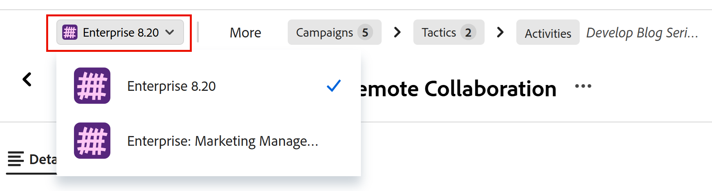

# Hierarchy and breadcrumb overview

<!--
The information on this page refers to functionality not yet generally available. It is available only in the Preview environment for all customers. After the monthly releases to Production, the same features are also available in the Production environment for customers who enabled fast releases.    

For information about fast releases, see [Enable or disable fast releases for your organization](/help/quicksilver/administration-and-setup/set-up-workfront/configure-system-defaults/enable-fast-release-process.md). 
-->

In qualità di responsabile del workspace, in Adobe Workfront Planning è possibile definire gerarchie flessibili ma strutturate tra tipi di record connessi e altri tipi di oggetti.

Hierarchies are connections between record types, or between record types and a Workfront project.

For information about creating hierarchies, see [Create workspace hierarchies](/help/quicksilver/planning/architecture/create-workspace-hierarchies.md).

The following are benefits of using hierarchies in your workspaces:

* To organize work in a way that reflects how your teams actually plan, operate, and deliver.
* For users to understand where they are, how record types connect, and how strategy flows into execution by referring to a set of breadcrumbs that indicate their place in the system.
* To offer a better navigation, and create clarity and continuity across all workflows.
* Definire flussi che si adattino al funzionamento dell&#39;organizzazione, supportando flessibilità e coerenza in tutte le fasi del lavoro.

## Considerations when working with hierarchies

* You can create up to 5 hierarchies for one workspace.
* In una gerarchia è possibile connettere fino a 4 tipi di record e di oggetti.
* In una gerarchia di workspace è possibile connettere solo i seguenti tipi di oggetto:
   * Tipi di record che appartengono all&#39;area di lavoro in cui si stanno creando le gerarchie.
   * Progetti Workfront. I progetti Workfront non possono essere aggiunti come elementi padre di altri tipi di record. Sono sempre l&#39;ultimo tipo di oggetto in una gerarchia.
* Non è possibile aggiungere i seguenti tipi di oggetto in una gerarchia:
   * Tipi di record di altre aree di lavoro, anche se impostati come tipi di record collegabili o globali. È possibile aggiungere tipi di record globali alle gerarchie solo quando sono stati aggiunti all&#39;area di lavoro da cui si sta creando la gerarchia.
   * All other Workfront objects.
   * Adobe Experience Manager Assets or Content Fragments.
* Hierarchies can include both Planning record types and Workfront projects at the same time.

  È possibile, ad esempio, disporre di un tipo di record Campaign con Tattiche di pianificazione e Progetti Workfront come elementi figlio nella stessa gerarchia dell&#39;area di lavoro.

* Se esiste già una connessione tra i tipi di record selezionati, il sistema riutilizza la connessione esistente.
* Se non esiste alcuna connessione, Workfront ne creerà una come parte dell’impostazione della gerarchia.
* The **Create corresponding field on linked record type** setting must be turned on for the connected field for records and object types that you want to include in a hierarchy.
* You cannot delete a record type if it is part of a hierarchy.
* You cannot delete a connection field if the record type referenced in the field is part of a hierarchy. You must first remove the record type from the hierarchy or delete the hierarchy before you can delete the record type.
* You can delete a lookup field from a connected record type. The information in the field cannot be recovered.
* Di seguito sono riportate le regole per l&#39;impostazione della gerarchia:
   * A record type can only have one parent record type in a given workspace.

     Ad esempio, un tipo di record Tattico non può avere come padre sia un tipo di record Campagna che un tipo di record Obiettivo nella stessa area di lavoro.
   * Un tipo di record può essere il padre in più gerarchie.

     Ad esempio, puoi avere tre gerarchie diverse in un’area di lavoro e ciascuna di esse può avere Campagne come tipo di record principale.
   * Un record può essere connesso a più record padre dello stesso tipo quando si connette uno a molti o molti a molti tipi di record.

     Ad esempio, la tattica A può appartenere sia alla campagna X che alla campagna Y.
   * Un tipo di record può connettersi a un solo tipo di record figlio alla volta. Un tipo di record figlio può anche essere padre di un altro tipo di record.

     Ad esempio, un tipo di record Campaign può essere padre di un solo altro tipo di record nella stessa gerarchia (Tactics) e Tactics può essere a sua volta padre di Programmi che possono essere padre di Progetti.
   * Un tipo di record non può essere il padre in una gerarchia e il figlio in un&#39;altra gerarchia nello stesso workspace.
   * I tipi di record globali possono essere visualizzati in più aree di lavoro all&#39;interno di più gerarchie, dopo essere stati aggiunti a tali aree.

     For example, if a Campaign is a global record type and part of a hierarchy in Workspace 1, it can be added as an existing record type to Workspace 2 and can be part of a hierarchy there. Tuttavia, non può far parte di una gerarchia in Workspace 2 solo se designato come tipo di record globale in Workspace 1, ma non aggiunto a Workspace 2.
   * Quando i tipi di record connessi fanno parte di gerarchie, è possibile collegare un record da un tipo di record figlio a un massimo di 10 record da un tipo di record padre.

     Ad esempio, se crei una gerarchia tra Campagne come record principale e Persona come record secondario, puoi collegare la stessa persona a un massimo di 10 campagne.

## Considerazioni durante la visualizzazione delle breadcrumb

Quando si creano gerarchie tra tipi di record, vengono generate breadcrumb per i record che appartengono a tali tipi di record.

Ad esempio, se crei una gerarchia e colleghi Campagne con Tattiche, quindi con Attività, quando passi a un record di qualsiasi tipo connesso nella gerarchia, puoi visualizzare la posizione nella gerarchia in cui si trova il record. If the record displays in multiple workspaces, you can view the paths in each workspace starting with the workspace name in the breadcrumb.

Considera i seguenti aspetti:

* Le breadcrumb vengono visualizzate nell’area di anteprima di un record e nella pagina dei dettagli dei record.
* Se un tipo di record fa parte di più gerarchie, è possibile passare da una gerarchia all&#39;altra dalla breadcrumb del record nella pagina del record.
* Se il tipo di record in una gerarchia dispone di più record, è possibile selezionare i record dalla breadcrumb.
* Le breadcrumb funzionano in Workfront e Planning.

  Ad esempio, quando si esamina un progetto connesso alle campagne e alle tattiche di Planning, nonché ai portfolio e ai programmi di Workfront, è possibile passare sia dal tipo di oggetto Planning che da quello di Workfront dalla breadcrumb.

  Per ulteriori informazioni, vedere [Creare gerarchie area di lavoro](/help/quicksilver/planning/architecture/create-workspace-hierarchies.md).
* Quando si modifica un record, le modifiche sono visibili da tutte le aree di lavoro e da tutte le gerarchie di cui fa parte il record.
