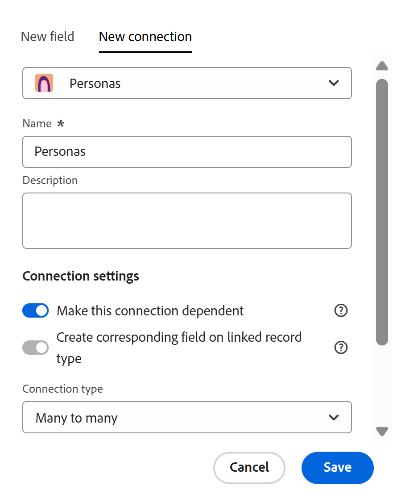

# Gestire le connessioni dipendenti

Le informazioni contenute in questa pagina si riferiscono a funzionalità non ancora generalmente disponibili. È disponibile solo nell’ambiente di anteprima per tutti i clienti. Dopo il rilascio in anteprima, le stesse funzioni sono disponibili mensilmente nell’ambiente di produzione per i clienti che hanno abilitato i rilasci rapidi. 

Per informazioni sulle versioni rapide, vedere [Abilitare o disabilitare le versioni rapide per l&#39;organizzazione](/help/quicksilver/administration-and-setup/set-up-workfront/configure-system-defaults/enable-fast-release-process.md). 

In qualità di responsabile dell&#39;area di lavoro, è possibile definire connessioni dipendenti durante la creazione di campi di connessione tra tipi di record in Adobe Workfront Planning.

Quando si aggiungono campi collegati, è possibile attivare un&#39;impostazione che indica che i valori del tipo di record connesso dipendono dai valori del tipo di record di origine, ovvero quello in cui si sta aggiungendo la connessione, ogni volta che entrambi i campi vengono visualizzati insieme in un terzo tipo di record.

Ad esempio, potrebbe essere utile assicurarsi che in un campo Area vengano visualizzati solo i valori associati all&#39;area geografica selezionata. Questa impostazione viene configurata direttamente nella configurazione del campo connessione: quando si aggiunge una connessione da un tipo di record Geo a un tipo di record dipendente (come Area), una nuova impostazione consente ai manager dell’area di lavoro di contrassegnarla come dipendente dal tipo di record Geo, utilizzando le relazioni già stabilite tra tali tipi di record.

Una volta configurato, qualsiasi tipo di record che fa riferimento a entrambi i campi (ad esempio una campagna) vedrà immediatamente l’effetto: la selezione di un valore Geo restringe il selettore Regione solo alle aree effettivamente collegate a tale Geo. In questo modo la struttura dei record viene applicata automaticamente, eliminando combinazioni non corrispondenti e riducendo la pulizia manuale.

## Requisiti di accesso

+++ Espandi per visualizzare i requisiti di accesso per la funzionalità in questo articolo.

<table style="table-layout:auto"> 
<col> 
</col> 
<col> 
</col> 
<tbody> 
    <tr> 
<tr> 
</tr> 
<tr> 
   <td role="rowheader">
Pacchetto Adobe Workfront
</td> 
   <td> 

Per connettere i tipi di record dalla stessa area di lavoro: 

<ul> 
<li>
Qualsiasi pacchetto Workfront o Workflow con qualsiasi pacchetto Planning
</li>

Oppure

<li>
Qualsiasi pacchetto Planning acquistato come prodotto standalone
</li>
</ul>

Per connettere tipi di record da aree di lavoro diverse:

<ul>

<li>
Qualsiasi flusso di lavoro e un pacchetto Planning Prime o Ultimate
</li>

Oppure

<li>
Qualsiasi pacchetto Planning Prime o Ultimate acquistato come prodotto standalone
</li>
</ul>

Per ulteriori informazioni su ciò che è incluso in ogni pacchetto Workfront Planning, contattare il rappresentante del proprio account Workfront. 
 
   </td> 
<tr> 
<td> 
   
 Prodotti aggiuntivi
 </td> 
   <td> 
   
 Oltre ad Adobe Workfront, se si desidera connettere tipi di record con oggetti delle applicazioni seguenti è necessario disporre dei seguenti elementi:

   <ul><li>
Una licenza Adobe Experience Manager Assets e un’integrazione tra AEM Assets e Workfront per collegare le risorse AEM ai tipi di record Planning.

   
Per informazioni, consulta <a href="/help/quicksilver/documents/adobe-workfront-for-experience-manager-assets-essentials/workfront-for-aem-asset-essentials.md">Adobe Workfront for Experience Manager Assets and Assets Essentials: article index</a>. 
</li>
   <li>
 Una licenza Adobe GenStudio for Performance Marketing per collegare tipi di record a oggetti e marchi GenStudio

   
Per informazioni, vedere <a href="https://experienceleague.adobe.com/en/docs/genstudio-for-performance-marketing/user-guide/get-started">Introduzione ad Adobe GenStudio for Performance Marketing</a>.
</li></ul>
   </td> 
  </tr> 
  <tr> 
   <td role="rowheader">
Licenza di Adobe Workfront
</td> 
   <td>
Standard

   </td> 
  </tr> 
  <tr> 
   <td role="rowheader">
Autorizzazioni sugli oggetti
</td> 
   <td>   
Gestire le autorizzazioni per un’area di lavoro
  
   
Gli amministratori di sistema dispongono delle autorizzazioni per tutte le aree di lavoro, incluse quelle non create
  </td> 
  </tr>  
</tbody> 
</table>

Per ulteriori informazioni sui requisiti di accesso a Workfront, vedere [Requisiti di accesso nella documentazione di Workfront](/help/quicksilver/administration-and-setup/add-users/access-levels-and-object-permissions/access-level-requirements-in-documentation.md).

+++

<!--
Sent a slack message to Norayr, Predator, Snowstorm, Armine for info for this section: 
-->

## Considerazioni per i campi collegati dipendenti

* È possibile impostare campi collegati dipendenti solo tra tipi di record con una relazione di campo connessione stabilita. Non è possibile definire una logica di dipendenza tra tipi di record non correlati.

* È possibile avere un campo collegato dipendente tra tipi di record in aree di lavoro separate.

* Non è possibile avere un campo collegato dipendente tra i tipi di record di Planning e i tipi di oggetto Workfront o AEM.

* L&#39;impostazione di dipendenza viene configurata una connessione alla volta, all&#39;interno dell&#39;impostazione stessa del campo di connessione, anziché come regola globale.

* Il comportamento di filtro tra i due record connessi viene attivato solo quando entrambi i campi di origine e dipendenti sono presenti insieme in un terzo tipo di record. La dipendenza non ha alcun effetto se in un tipo di record viene visualizzato solo uno dei due campi.

* Il selettore del campo dipendente è limitato ai valori già collegati al valore di origine selezionato a livello di record e non può mostrare o suggerire valori non collegati.

* Se il valore del campo di origine cambia, il campo dipendente viene cancellato automaticamente anziché lasciato in uno stato non valido, impedendo la persistenza di combinazioni non corrispondenti.

  Ricevi un messaggio in linea o un avviso popup che spiega perché il campo dipendente è stato cancellato.

* Ogni campo dipendente può avere fino a 3 campi di controllo diretto.

* I livelli di dipendenza sono limitati a 6 connessioni. Ciò significa che è possibile collegare fino a 7 tipi di record.

* Affinché la catena di dipendenze funzioni, tutti i campi dipendenti devono esistere contemporaneamente sullo stesso tipo di record.

## Creare una connessione dipendente

1. In qualità di responsabile dell&#39;area di lavoro, passare a un tipo di record in Workfront Planning e aprirlo nella vista tabella.
1. Fai clic sull&#39;icona **+** nell&#39;angolo superiore destro della visualizzazione tabella per aggiungere un nuovo campo.
1. Fare clic su **Nuova connessione**, quindi iniziare ad aggiungere una nuova connessione per un secondo tipo di record.

   >[!TIP]
   >
   >È possibile creare una connessione dipendente solo tra due tipi di record di Planning. Non è possibile creare connessioni dipendenti tra tipi di record e oggetti da Workfront o AEM.
1. Nella sezione **Impostazioni connessione**, attivare **Rendi la connessione dipendente**.

   >[!TIP]
   >
   >L&#39;attivazione dell&#39;impostazione **Rendi la connessione dipendente** attiva automaticamente **Crea un campo corrispondente nel tipo di record collegato**. È previsto un limite di 500 campi per tipo di record.

   

1. Continuare a configurare la connessione, come descritto nell&#39;articolo [Tipi di record di connessione](/help/quicksilver/planning/architecture/connect-record-types.md).
1. Fai clic su **Salva**.

   Si verificano le seguenti situazioni:

   * Viene creata la connessione tra i due tipi di record e i relativi valori dipenderanno gli uni dagli altri quando vengono visualizzati insieme sullo stesso tipo di record.
   * Per il secondo tipo di record viene creato un campo corrispondente che visualizza il primo tipo di record.
   * Quando entrambi i tipi di record sono connessi a un terzo tipo di record, i valori visualizzati come scelte per il secondo campo record connesso sono quelli connessi al primo record. I valori visualizzati come scelte per il primo tipo di record sono quelli connessi al secondo tipo di record.

     Per informazioni, vedere la sezione [Esempio di tipi di record connessi dipendenti](#example-of-dependent-connected-record-types) in questo articolo.
   * Nell&#39;intestazione di colonna dei campi del record connesso è presente un&#39;indicazione che indica che il campo si trova in una relazione di connessione dipendente.

     

1. (Facoltativo e consigliato) Passare a un terzo tipo di record e aggiungere sia il primo che il secondo tipo di record come campi record connessi.

   

## Esempio di tipi di record collegati dipendenti

Questa sezione fornisce un semplice esempio di come impostare i tipi di record dipendenti e di come funzionano per un terzo tipo di record.

1. In un&#39;area di lavoro che è possibile gestire, creare i seguenti tipi di record:

   * Campaign
   * Paesi
   * Continenti

1. Nel tipo di record **Paesi**, aggiungi i seguenti record:

   * Francia
   * Stati Uniti
   * Giappone
1. Nel tipo di record **Continents** aggiungere i record seguenti:

   * Europa
   * America
   * Asia

1. Dal tipo di record **Paesi**, crea un campo dipendente connesso per **Continenti**.

   In questo modo vengono aggiunti i campi record collegati seguenti:

   * Il campo record **Countries** connesso per il tipo di record **Continents**.
   * Il campo record connesso **Continents** per il tipo di record **Countries**.

1. Esegui una delle operazioni seguenti:

   * Nella visualizzazione della tabella dei tipi di record **Paesi**, aggiungere i seguenti valori per il campo del record connesso Continenti:

     * Europa per la Francia
     * America per Stati Uniti
     * Asia per il Giappone
   * Nella visualizzazione della tabella dei tipi di record **Continenti**, aggiungere i seguenti valori per il campo record connesso **Paesi**:

     * Francia per l&#39;Europa
     * Stati Uniti per l&#39;America
     * Giappone per l&#39;Asia
1. Aggiungere i campi connessi **Paesi** e **Continenti** alla visualizzazione della tabella dei tipi di record **Campaign**.
1. Selezionare **Giappone** per il campo **Paesi** nel tipo di record **Campagna**. Tieni presente che l&#39;unico valore disponibile per il campo connesso **Continents** nella campagna è **Asia**.

   Oppure

   Seleziona **Europa** per il campo **Continenti** nel tipo di record Campagna.

   Tieni presente che l&#39;unico valore disponibile per il campo connesso **Paesi** nella campagna è **Francia**.

