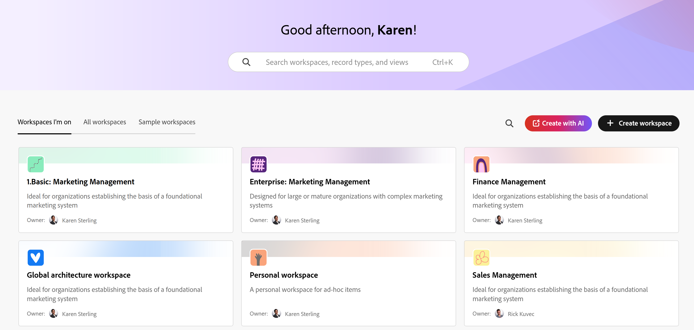

# Panoramica delle aree di lavoro

<!--
The information on this page refers to functionality not yet generally available. It is available only in the Preview environment for all customers. After the monthly releases to Production, the same features are also available in the Production environment for customers who enabled fast releases.    

For information about fast releases, see [Enable or disable fast releases for your organization](/help/quicksilver/administration-and-setup/set-up-workfront/configure-system-defaults/enable-fast-release-process.md). 
-->

{{planning-important-intro}}

Un’area di lavoro è una raccolta di tipi di record utilizzati da un’unità organizzativa che rappresenta il ciclo di vita lavorativa e i processi dell’unità. È possibile personalizzare completamente le aree di lavoro in Adobe Workfront Planning.

## Considerazioni sulle aree di lavoro

* Puoi creare aree di lavoro per specifiche unità organizzative all’interno dell’organizzazione, in base al funzionamento univoco di ciascuna unità.
* Workfront Planning non include aree di lavoro preconfigurate. Devi crearli in base alle esigenze della tua organizzazione.
* È possibile creare aree di lavoro nei modi seguenti:

   * Da zero
   * Utilizzo di un modello. I modelli contengono un numero preconfigurato di tipi di record e i relativi campi.
   * Utilizzo di Planning Designer basato sull’intelligenza artificiale. Questa funzione è attualmente in Beta.
   * Utilizzo di un bundle di modelli per più aree di lavoro.

  Per informazioni, consulta [Creare le aree di lavoro](/help/quicksilver/planning/architecture/create-workspaces.md).

* Le aree di lavoro sono strutture all’interno delle quali lavorano le unità organizzative (un team, un gruppo, un reparto o una divisione). Non possono essere associati a campi. Solo i tipi di record all&#39;interno di un&#39;area di lavoro possono essere associati ai campi.

  Per informazioni, vedere [Panoramica sui tipi di record](/help/quicksilver/planning/architecture/overview-of-record-types.md).
* A seconda della licenza Workfront in uso, le aree di lavoro vengono visualizzate nelle schede seguenti nell&#39;area Planning:

   * Per gli amministratori di sistema, le aree di lavoro vengono visualizzate nelle seguenti schede:

      * **Aree di lavoro in cui si trova**: visualizza le aree di lavoro create dall&#39;utente o condivise con l&#39;utente.
      * **Altre aree di lavoro**: mostra tutte le altre aree di lavoro nel sistema.

   * Per tutti gli altri utenti, le aree di lavoro create e quelle condivise con gli altri utenti vengono visualizzate nell&#39;area Workspace.

* I tipi di record contenuti in un&#39;area di lavoro devono riflettere il ciclo di vita lavorativa e i concetti di un&#39;unità organizzativa.

  Ad esempio, se gli oggetti di lavoro di un’unità sono campagne, prodotti e aree geografiche, il workspace di tale unità deve contenere i tipi di record Campaign, Product e Region.
* Quando crei un’area di lavoro, solo tu disponi dell’autorizzazione per accedere a essa e gestirla. È necessario condividerlo con altri utenti affinché possano collaborare con te nello stesso spazio.

  Per informazioni, vedere [Condividere un&#39;area di lavoro](/help/quicksilver/planning/access/share-workspaces.md).

  Gli amministratori di sistema possono gestire tutte le aree di lavoro, anche quelle che non hanno creato.

<!--make this live with the GA: * There is no limit for how many workspaces you can create in your environment. However, we recommend not to have too many workspaces, as they could become hard to manage and your workflows might be too fragmented.-->

* Il numero di oggetti del workspace che è possibile creare nell&#39;istanza di Workfront Planning è limitato. Per informazioni, vedere [Panoramica delle limitazioni degli oggetti di Adobe Workfront Planning](/help/quicksilver/planning/general/limitations-overview.md).
