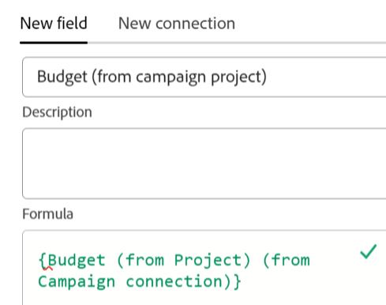

<!--Should the structure of this article be like this other one: https://experienceleague.adobe.com/docs/workfront/using/administration-and-setup/customize/custom-forms/custom-form-builder/use-the-custom-form-builder/add-a-custom-field-to-a-custom-form.html?lang=en ??-->

<!--will they add a way to create fields elsewhere than in a table?! - how will that change the structure of this article? -->

<!--Do we need this for FORMULAS: when we release permissions to RECORDS and we release referring lookup fields in a formula field, update considerations to say that lookup fields from linked records depends on the permissions to the record; if they have no permissions to view a linked record, they won't be able to use that records's lookup fields in a formula - not sure is needed??-->

# Crea campi

<span class="preview">Le informazioni evidenziate in questa pagina si riferiscono a funzionalità non ancora generalmente disponibili. È disponibile solo nell’ambiente di anteprima per tutti i clienti. Dopo i rilasci mensili in Produzione, le stesse funzioni sono disponibili nell’ambiente di Produzione per i clienti che hanno abilitato i rilasci rapidi. </span>

<span class="preview">Per informazioni sulle versioni rapide, vedere [Abilitare o disabilitare le versioni rapide per l&#39;organizzazione](/help/quicksilver/administration-and-setup/set-up-workfront/configure-system-defaults/enable-fast-release-process.md). </span>


{{planning-important-intro}}

In Adobe Workfront Planning è possibile creare campi personalizzati per i tipi di record. È quindi possibile associare i campi ai record di Workfront Planning per migliorare le informazioni sui record.

È necessario creare tipi di record prima di poter creare campi da associare. Per informazioni, vedere [Creare tipi di record](/help/quicksilver/planning/architecture/create-record-types.md).

In Workfront Planning è possibile creare i campi nei modi seguenti:

* Da zero
* Collegando i tipi di record
* Creazione di un tipo di record
* Creazione di un&#39;area di lavoro da un modello
* Importando i tipi di record utilizzando un file Excel o CSV
* Importando copie dei campi Workfront esistenti

Per ulteriori informazioni sui campi di Workfront Planning, vedere [Panoramica campo](/help/quicksilver/planning/fields/fields-overview.md).

## Requisiti di accesso

+++ Espandere per visualizzare i requisiti di accesso.

Per eseguire i passaggi descritti in questo articolo, è necessario disporre dei seguenti diritti di accesso:

<table style="table-layout:auto"> 
<col> 
</col> 
<col> 
</col> 
<tbody> 
    <tr> 
<tr> 
<td> 
   <p> Prodotti</p> </td> 
   <td> 
   <ul><li><p> Adobe Workfront</p></li> 
   <li><p> Adobe Workfront Planning<p></li></ul></td> 
  </tr>   
<tr> 
   <td role="rowheader"><p>Piano Adobe Workfront*</p></td> 
   <td> 
<p>Uno dei seguenti piani di Workfront:</p> 
<ul><li>Seleziona</li> 
<li>Prime</li> 
<li>Ultimate</li></ul> 
<p>Workfront Planning non è disponibile per i piani Workfront legacy</p> 
   </td> 
<tr> 
   <td role="rowheader"><p>Pacchetto Adobe Workfront Planning*</p></td> 
   <td> 
<p>Qualsiasi </p> 
<p>Per ulteriori informazioni su quanto incluso in ogni piano di Workfront Planning, contattare l'account manager Workfront. </p> 
   </td> 
 <tr> 
   <td role="rowheader"><p>Piattaforma Adobe Workfront</p></td> 
   <td> 
<p>Per poter accedere a Workfront Planning, l’istanza di Workfront della tua organizzazione deve essere integrata in Adobe Unified Experience.</p> 
<p>Per ulteriori informazioni, vedere <a href="/help/quicksilver/workfront-basics/navigate-workfront/workfront-navigation/adobe-unified-experience.md">Esperienza unificata Adobe per Workfront</a>. </p> 
   </td> 
   </tr> 
  </tr> 
  <tr> 
   <td role="rowheader"><p>Licenza Adobe Workfront*</p></td> 
   <td><p> Standard </p>
   <p>Workfront Planning non è disponibile per le licenze Workfront legacy</p> 
  </td> 
  </tr> 
  <tr> 
   <td role="rowheader"><p>Configurazione del livello di accesso</p></td> 
   <td> <p>Nessun controllo del livello di accesso per Adobe Workfront Planning</p>   
</td> 
  </tr> 
<tr> 
   <td role="rowheader"><p>Autorizzazioni oggetto</p></td> 
   <td>   <p>Gestisci le autorizzazioni per un'area di lavoro <span class="preview"> e tipo di record</span> </a> </p>  
   <p>Gli amministratori di sistema dispongono delle autorizzazioni per tutte le aree di lavoro, incluse quelle che non hanno creato.</p> </td> 
  </tr> 
<tr> 
   <td role="rowheader"><p>Modello layout</p></td> 
   <td> <p>Nell'ambiente di produzione, tutti gli utenti, inclusi gli amministratori di sistema, devono essere assegnati a un modello di layout che includa Planning.</p>
<p><span class="preview">Nell'ambiente di anteprima, per impostazione predefinita, Planning è abilitato per utenti standard e amministratori di sistema.</span></p></td> 
  </tr> 
</tbody> 
</table>

*Per ulteriori informazioni sui requisiti di accesso a Workfront, vedere [Requisiti di accesso nella documentazione di Workfront](/help/quicksilver/administration-and-setup/add-users/access-levels-and-object-permissions/access-level-requirements-in-documentation.md).

+++

## Crea campi da zero {#create-fields-from-scratch}

<!--in a table (not sure if this can be done elsewhere?!-->

<!--the first 3 steps are the same as in Import fields from Workfront-->

{{step1-to-planning}}

1. Fare clic sull&#39;area di lavoro per la quale si desidera creare i record.

   Viene aperto il workspace e vengono visualizzati i tipi di record.

1. Fare clic sulla scheda di un tipo di record.

   Tutti i record esistenti associati al tipo di record vengono visualizzati nelle righe della vista tabella.

   >[!TIP]
   >
   >    Se non viene visualizzato alcun record, è possibile che non siano ancora presenti record oppure che sia stato applicato un filtro che limita la visualizzazione sullo schermo.

   Tutti i campi esistenti associati al tipo di record vengono visualizzati nelle colonne della vista tabella.

   >[!TIP]
   >
   >    Alcuni campi potrebbero essere nascosti. Fare clic su Campi e attivare l&#39;attivazione/disattivazione dei campi che si desidera visualizzare come colonne nella visualizzazione tabella.

1. Fai clic sull&#39;icona **+** nell&#39;angolo superiore destro della vista tabella

   Oppure

   Passa il puntatore del mouse sull&#39;intestazione di una colonna, fai clic sulla freccia rivolta verso il basso dopo il nome del campo, quindi fai clic su **Inserisci a sinistra** o **Inserisci a destra** per aggiungere il nuovo campo.
1. Nella scheda **Nuovo campo**, cercare un tipo di campo nella casella **Tipo di campo** oppure selezionare uno dei tipi di campo seguenti:

   Nella scheda **Nuovo campo**, cercare un tipo di campo nella casella **Tipo di campo** utilizzando una parola chiave correlata oppure selezionare uno dei tipi di campo elencati di seguito.

   >[!TIP]
   >
   >    È possibile digitare &quot;Budget&quot; e i tipi di campo Numero e Valuta vengono visualizzati in un breve elenco.


   * [Testo a riga singola](#single-line-text)
   * [Paragrafo](#paragraph)
   * [Selezione multipla](#multi-select)
   * [Selezione singola](#single-select)
   * [Data](#date)
   * [Numero](#number)
   * [Percentuale](#percentage)
   * [Valuta](#currency)
   * [Casella di controllo](#checkbox)
   * [Formula](#formula)
   * [Persone](#people)
   * [Creato da](#created-by)
   * [Data di creazione](#created-date)
   * [Ultima modifica eseguita da](#last-modified-by)
   * [Data ultima modifica](#last-modified-date)
     <!--* [Object](#object-field-type)-->

   >[!IMPORTANT]
   >
   >Non è possibile modificare il tipo di campo dopo averlo salvato.

   <!--Add this to the IMPORTANT above and make it a NOTE - should do directly to Prod:
    * You can use any keyword that might be related to any of the field type names. For example, a search for "Budget" will display the Number or Currency field type.-->

1. Continua ad aggiungere ogni campo, come descritto nelle sezioni seguenti.

### Testo a riga singola {#single-line-text}

I campi di testo a riga singola acquisiscono informazioni alfanumeriche limitate. Ad esempio, puoi acquisire le informazioni relative al Proprietario, alle parti interessate, al team o all’unità organizzativa in un campo di testo a riga singola. Il contenuto di un campo di testo a riga singola può contenere fino a 1.000 caratteri. <!-- used to be 250 but just tested with 1000 and it allowed this as a maximum. -->

1. Inizia a creare un campo come descritto nella sezione [Creare campi da zero](#create-fields-from-scratch) in questo articolo, quindi seleziona il tipo di campo **Testo a riga singola**.

   

1. Aggiungi le seguenti informazioni nella scheda **Nuovo campo**:
   * **Nome**: il nome del tipo di campo che verrà visualizzato in una tabella o nella pagina Dettagli del record. <!--ensure they updated this; and update the screen shot: it used to be "Label"-->
   * **Descrizione**: informazioni aggiuntive sul campo. La descrizione di un campo viene visualizzata quando si passa il cursore sull&#39;intestazione di colonna del campo in una tabella o quando si fa clic sull&#39;icona delle informazioni accanto al nome del campo nella pagina dei dettagli del record.
1. Fai clic su **Crea**.

   Il nuovo campo a riga singola viene aggiunto come colonna al tipo di record e i relativi valori possono essere associati ai record.


### Paragrafo {#paragraph}

I campi Paragrafo acquisiscono informazioni alfanumeriche aggiuntive su un record, simili al campo Descrizione.

>[!TIP]
>
>* È possibile avere un massimo di 20 campi paragrafo per un tipo di record.
>
>* Il contenuto di un campo paragrafo può contenere fino a 10.000 caratteri.
>* È possibile utilizzare la formattazione Rich Text per migliorare il contenuto dei campi paragrafo visualizzati nella visualizzazione Tabella o nella pagina Dettagli di un record. Per informazioni, vedere [Modifica record](/help/quicksilver/planning/records/edit-records.md).
>


1. Inizia a creare un campo come descritto nella sezione [Creare campi da zero](#create-fields-from-scratch) in questo articolo, quindi seleziona il tipo di campo **Paragrafo**.

   


1. Aggiungi le seguenti informazioni nella scheda **Nuovo campo**:
   * **Nome**: il nome del tipo di campo che verrà visualizzato in una tabella o nella pagina Dettagli del record. <!--ensure they updated this; and update the screen shot: it used to be "Label"-->
   * **Descrizione**: informazioni aggiuntive sul campo. La descrizione di un campo viene visualizzata quando si passa il puntatore del mouse sulla colonna del campo in una tabella o quando si fa clic sull&#39;icona delle informazioni accanto al nome del campo nella pagina dei dettagli del record.
1. Fai clic su **Crea**.

   Il nuovo campo paragrafo viene aggiunto come colonna al tipo di record e i relativi valori possono essere associati ai record.


### Selezione multipla {#multi-select}

È possibile utilizzare un campo a selezione multipla per acquisire informazioni aggiuntive in qualsiasi formato selezionando più opzioni da un menu a discesa.

1. Inizia a creare un campo come descritto nella sezione [Creare campi da zero](#create-fields-from-scratch) in questo articolo, quindi seleziona il tipo di campo **Selezione multipla**.

   


1. Aggiungi le seguenti informazioni nella scheda **Nuovo campo**:
   * **Nome**: il nome del tipo di campo che verrà visualizzato in una tabella o nella pagina Dettagli del record. <!--ensure they updated this; and update the screen shot: it used to be "Label"-->
   * **Descrizione**: informazioni aggiuntive sul campo. La descrizione di un campo viene visualizzata quando si passa il puntatore del mouse sulla colonna del campo in una tabella o quando si fa clic sull&#39;icona delle informazioni accanto al nome del campo nella pagina dei dettagli del record.
   * **Opzioni**: le opzioni che gli utenti possono selezionare quando aggiornano questo campo. È possibile utilizzare sia numeri che lettere per il nome di ciascuna scelta.
1. Fai clic su **Aggiungi scelta** per aggiungere altre scelte. Non esiste alcun limite al numero di scelte che è possibile aggiungere a un campo a selezione multipla.
1. (Facoltativo) Trascina e rilascia manualmente ciascuna scelta nell’ordine desiderato, oppure seleziona la
   **Ordinare le opzioni A-Z** se si desidera che le scelte vengano elencate automaticamente in ordine alfabetico. <!--Add this if they added this functionality: You cannot edit this option after you save the field.-->
1. (Facoltativo) Per rimuovere una scelta, fai clic sull&#39;icona **x** a destra di essa.
1. Fate clic sul campione di colore a sinistra di una scelta per espandere il selettore di colore e personalizzare il colore di ciascuna opzione.

1. Fai clic su **Campioni** per selezionare un colore predefinito

   Oppure

   Fai clic su **Personalizzato** per selezionare un colore personalizzato utilizzando un selettore di colori o un codice esadecimale.
1. Fate clic all&#39;esterno della casella del colore per chiuderla.
1. Fai clic su **Crea**.

   Il nuovo campo a selezione multipla viene aggiunto come colonna al tipo di record e i relativi valori possono essere associati ai record.

### Selezione singola {#single-select}

I campi a selezione singola acquisiscono informazioni aggiuntive in qualsiasi formato selezionando un’opzione da un menu a discesa.

1. Inizia a creare un campo come descritto nella sezione [Creare campi da zero](#create-fields-from-scratch) in questo articolo, quindi seleziona il tipo di campo **Selezione singola**.

   


1. Aggiungi le seguenti informazioni nella scheda **Nuovo campo**:
   * **Nome**: il nome del tipo di campo che verrà visualizzato in una tabella o nella pagina Dettagli del record. <!--ensure they updated this; and update the screen shot: it used to be "Label"-->
   * **Descrizione**: informazioni aggiuntive sul campo. La descrizione di un campo viene visualizzata quando si passa il puntatore del mouse sulla colonna del campo in una tabella o quando si fa clic sull&#39;icona delle informazioni accanto al nome del campo nella pagina dei dettagli del record.
   * **Opzioni**: le opzioni disponibili per la selezione dal menu a discesa dopo il salvataggio del campo. È possibile utilizzare sia numeri che lettere per il nome di ciascuna scelta.

1. Fai clic su **Aggiungi scelta** per aggiungere altre scelte. Non esiste alcun limite al numero di scelte che è possibile aggiungere a un campo a selezione singola.
1. (Facoltativo) Trascinare manualmente ogni scelta nell&#39;ordine desiderato oppure selezionare l&#39;opzione **Ordina scelte dalla A alla Z** se si desidera che le scelte vengano elencate automaticamente in ordine alfabetico. <!--Add this if they added this functionality: You cannot edit this option after you save the field.-->
1. (Facoltativo) Per rimuovere una scelta, fai clic sull&#39;icona **x** a destra di essa.
1. Fate clic sul campione di colore a sinistra di una scelta per espandere il selettore di colore e personalizzare il colore di ciascuna opzione.
1. Fai clic su **Campioni** per selezionare un colore predefinito

   Oppure

   Fai clic su **Personalizzato** per selezionare un colore personalizzato utilizzando un selettore di colori o un codice esadecimale.

1. Fate clic all&#39;esterno della casella del colore per chiuderla.
1. Fai clic su **Crea**.

   Il nuovo campo a selezione singola viene aggiunto come colonna al tipo di record e i relativi valori possono essere associati ai record.

### Data {#date}

È possibile utilizzare un campo data per acquisire informazioni aggiuntive in formato data e ora.

1. Inizia a creare un campo come descritto nella sezione [Crea campi da zero](#create-fields-from-scratch) in questo articolo, quindi seleziona il tipo di campo **Data**.

   


1. Aggiungi le seguenti informazioni nella scheda **Nuovo campo**:
   * **Nome**: il nome del tipo di campo che verrà visualizzato in una tabella o nella pagina record. <!--ensure they updated this; and update the screen shot: it used to be "Label"-->
   * **Descrizione**: informazioni aggiuntive sul campo. La descrizione di un campo viene visualizzata quando si passa il puntatore del mouse sulla colonna del campo in una tabella o quando si fa clic sull&#39;icona delle informazioni accanto al nome del campo nella pagina dei dettagli del record.
   * **Formato data**: tipo di formato data che si desidera visualizzare in questo campo. <!--update this casing - submitted bug for it-->

     Selezionare uno dei formati seguenti:
      * **Impostazioni locali**: corrisponde alle impostazioni locali del browser.
      * **Standard**: 05/16/2023
      * **Lungo**: 16 maggio 2023
      * **Europeo**: 16/05/2023
      * **ISO**: 16/05/2023
      * **Ora di inclusione**: selezionare questa opzione se si desidera includere un indicatore orario. Questa opzione è deselezionata per impostazione predefinita. Non è possibile includere un&#39;ora dopo aver salvato il campo.

     Selezionare una delle opzioni seguenti:

      * **24ore**: ad esempio: 18:00
      * **12hr**: ad esempio: 18:00

1. Fai clic su **Crea**.

   Il nuovo campo data viene aggiunto come colonna al tipo di record e i relativi valori possono essere associati ai record.

### Numero {#number}

I tipi di campo numerico acquisiscono informazioni in formato numerico.

>[!TIP]
>
>I campi numerici vengono visualizzati come tipo di campo di testo a riga singola in un generatore di moduli di richiesta.
>
>Tuttavia, il formato del campo viene mantenuto e i valori di questi campi vengono visualizzati come numeri dopo l’invio della richiesta, nel tipo di record e nella pagina dei dettagli della richiesta.
>>Per informazioni, vedere [Creare e gestire un modulo di richiesta in Adobe Workfront Planning](/help/quicksilver/planning/requests/create-request-form.md).


1. Inizia a creare un campo come descritto nella sezione [Crea campi da zero](#create-fields-from-scratch) in questo articolo, quindi seleziona il tipo di campo **Numero**.

   
1. Aggiungi le seguenti informazioni nella scheda **Nuovo campo**:

   * **Nome**: il nome del tipo di campo che verrà visualizzato in una tabella o nella pagina record.
   * **Descrizione**: informazioni aggiuntive sul campo. La descrizione di un campo viene visualizzata quando si passa il puntatore del mouse sulla colonna del campo in una tabella o quando si fa clic sull&#39;icona delle informazioni accanto al nome del campo nella pagina dei dettagli del record.
   * **Precisione**: il numero di posizioni decimali che si desidera registrare per il campo. Puoi visualizzare fino a 6 posizioni decimali.
   * **Consenti numeri negativi**: selezionare questa opzione se si desidera consentire i numeri negativi in questo campo. Questa opzione è deselezionata per impostazione predefinita.

   >[!NOTE]
   >
   >    Se si seleziona Consenti numeri negativi e i valori negativi vengono memorizzati nei record a cui è associato il campo, non sarà più possibile deselezionare l&#39;impostazione in futuro.

1. Fai clic su **Crea**.

   Il nuovo campo numerico viene aggiunto come colonna al tipo di record e i relativi valori possono essere associati ai record.

### Percentuale {#percentage}

I tipi di campo Percentuale acquisiscono le informazioni in un formato numerico seguito da un segno di percentuale.

>[!TIP]
>
>I campi percentuali vengono visualizzati come tipo di campo di testo a riga singola nel generatore di moduli di richiesta.
>
>Tuttavia, il formato del campo viene mantenuto e i valori di questi campi vengono visualizzati come percentuali dopo l’invio della richiesta, nel tipo di record e nella pagina dei dettagli della richiesta.
>>Per informazioni, vedere [Creare e gestire un modulo di richiesta in Adobe Workfront Planning](/help/quicksilver/planning/requests/create-request-form.md).


1. Inizia a creare un campo come descritto nella sezione [Crea campi da zero](#create-fields-from-scratch) in questo articolo, quindi seleziona il tipo di campo **Percentuale**.

   

1. Aggiungi le seguenti informazioni nella scheda **Nuovo campo**:
   * **Nome**: il nome del tipo di campo che verrà visualizzato in una tabella o nella pagina record.
   * **Descrizione**: informazioni aggiuntive sul campo. La descrizione di un campo viene visualizzata quando si passa il puntatore del mouse sulla colonna del campo in una tabella o quando si fa clic sull&#39;icona delle informazioni accanto al nome del campo nella pagina dei dettagli del record.
   * **Precisione**: il numero di posizioni decimali che si desidera registrare per il campo. Puoi visualizzare fino a 6 posizioni decimali.
   * **Consenti numeri negativi**: selezionare questa opzione se si desidera consentire valori percentuali negativi in questo campo. Questa opzione è deselezionata per impostazione predefinita.

     >[!NOTE]
     >
     >Se si seleziona Consenti numeri negativi e i valori negativi vengono memorizzati nei record a cui è associato il campo, non sarà più possibile deselezionare l&#39;impostazione in futuro.

   * **Mostra come**: dal menu a discesa, scegliere come visualizzare i valori percentuali nella vista tabella. Selezionare una delle opzioni seguenti:
      * **Numero**: il valore percentuale viene visualizzato come numero seguito dal segno percentuale.
      * **Barra**: il valore percentuale viene visualizzato come una barra accanto al numero percentuale. Il colore di riempimento della barra indica il valore percentuale. Questa è la selezione predefinita.
      * **Cerchio**: il valore percentuale viene visualizzato come contorno di un cerchio accanto al numero percentuale. Il colore di riempimento del contorno del cerchio indica il valore percentuale.

   >[!NOTE]
   >
   >* La selezione effettuata nel campo Mostra come si applica solo al valore percentuale visibile nella vista tabella. Il valore percentuale del campo viene visualizzato come numero seguito dal segno di percentuale in qualsiasi altro punto di Workfront Planning. Ciò si applica anche al campo di tipo percentuale quando viene visualizzato come campo di ricerca nelle visualizzazioni tabella di altri record.
   >* È possibile modificare la selezione di Mostra come quando si modifica il campo in un secondo momento.

1. Fai clic su **Crea**.

   Il nuovo campo percentuale viene aggiunto come colonna al tipo di record e i relativi valori possono essere associati ai record.

### Valuta {#currency}

I tipi di campo Valuta acquisiscono le informazioni in un formato numerico preceduto da un simbolo di valuta.

>[!TIP]
>
>I campi Valuta vengono visualizzati come tipo di campo di testo a riga singola in un generatore di moduli di richiesta.
>
>Tuttavia, il formato del campo viene mantenuto e i valori di questi campi vengono visualizzati come valuta dopo l’invio della richiesta, nel tipo di record e nella pagina dei dettagli della richiesta.
>>Per informazioni, vedere [Creare e gestire un modulo di richiesta in Adobe Workfront Planning](/help/quicksilver/planning/requests/create-request-form.md).

1. Inizia a creare un campo come descritto nella sezione [Crea campi da zero](#create-fields-from-scratch) in questo articolo, quindi seleziona il tipo di campo **Valuta**.

   

1. Aggiungi le seguenti informazioni nella scheda **Nuovo campo**:
   * **Nome**: il nome del tipo di campo che verrà visualizzato in una tabella o nella pagina record. <!--ensure they updated this; and update the screen shot: it used to be "Label"-->
   * **Descrizione**: informazioni aggiuntive sul campo. La descrizione di un campo viene visualizzata quando si passa il puntatore del mouse sulla colonna del campo in una tabella o quando si fa clic sull&#39;icona delle informazioni accanto al nome del campo nella pagina dei dettagli del record.
   * **Valuta**: tipo di valuta che si desidera visualizzare in questo campo. Questa è una lista di valute secondo l&#39;Organizzazione Internazionale di Standardizzazione (ISO).
   * **Precisione**: il numero di posizioni decimali che si desidera registrare per il campo. Puoi visualizzare fino a 6 decimali.
   * **Consenti numeri negativi**: selezionare questa opzione se si desidera consentire valori di valuta negativi in questo campo. Questa opzione è deselezionata per impostazione predefinita.

   >[!NOTE]
   >
   >    Se si seleziona Consenti numeri negativi e i valori negativi vengono memorizzati nei record a cui è associato il campo, non sarà più possibile deselezionare l&#39;impostazione in futuro.

1. Fai clic su **Crea**.

   Il nuovo campo valuta viene aggiunto come colonna al tipo di record e i relativi valori possono essere associati ai record.

### Casella di controllo

È possibile utilizzare il tipo di campo Casella di controllo per aggiungere una singola opzione a un record. È possibile utilizzare questo campo per indicare un attributo o uno stato specifico per quel record specifico. È ad esempio possibile utilizzarlo come flag per tenere traccia di completamento, approvazione o qualsiasi altro attributo binario per ogni record.

1. Inizia a creare un campo come descritto nella sezione [Creare campi da zero](#create-fields-from-scratch) in questo articolo, quindi seleziona il tipo di campo **Casella di controllo**.

   

1. Aggiungi le seguenti informazioni nella scheda **Nuovo campo**:
   * **Nome**: il nome del tipo di campo che verrà visualizzato in una tabella o nella pagina record. <!--ensure they updated this; and update the screen shot: it used to be "Label"-->
   * **Descrizione**: informazioni aggiuntive sul campo. La descrizione di un campo viene visualizzata quando si passa il puntatore del mouse sulla colonna del campo in una tabella o quando si fa clic sull&#39;icona delle informazioni accanto al nome del campo nella pagina dei dettagli del record.
1. Fai clic su **Crea**.

   Il nuovo campo casella di controllo viene aggiunto come colonna al tipo di record e i relativi valori possono essere associati ai record.

### Formula

I campi formula generano un nuovo valore utilizzando i valori esistenti di altri campi di un tipo di record e una funzione che indica come devono essere calcolati i valori esistenti.

Per ulteriori informazioni, vedere [Panoramica dei campi formula](/help/quicksilver/planning/fields/formula-fields.md).

1. Inizia a creare un campo come descritto nella sezione [Crea campi da zero](#create-fields-from-scratch) in questo articolo, quindi seleziona il tipo di campo **Formula**.

   

1. Aggiungi le seguenti informazioni nella scheda **Nuovo campo**:

   * **Nome**: immettere un nome per il nuovo campo.
   * **Descrizione**: aggiungi informazioni sul nuovo campo. La descrizione di un campo viene visualizzata quando si passa il puntatore del mouse sulla colonna del campo in una tabella o quando si fa clic sull&#39;icona delle informazioni accanto al nome del campo nella pagina dei dettagli del record.
   * **Formula**: inizia a digitare almeno un carattere per accedere a un&#39;espressione, quindi selezionalo quando viene visualizzato nell&#39;elenco.

1. Fai clic sull’espressione selezionata per visualizzarne la definizione e la formattazione.

   

   Per ulteriori informazioni sulle espressioni supportate, vedere [Panoramica dei campi formula](/help/quicksilver/planning/fields/formula-fields.md).


   >[!TIP]
   >
   >Verrà visualizzato un messaggio di avviso quando si modifica o si crea un campo formula che potrebbe causare un riferimento circolare a se stesso o a campi condivisi. Non è possibile salvare un campo formula che fa riferimento a se stesso o a elementi a cui viene fatto riferimento nel calcolo.


1. Aggiungere i nomi dei campi visualizzati in Workfront Planning per farvi riferimento in una formula.

   >[!NOTE]
   >
   >* Non è possibile aggiungere campi di tipo a selezione multipla in una formula.
   >
   >* È possibile fare riferimento a un campo che si trova a una distanza massima di 4 campi (e oggetti) dal tipo di record corrente. Ad esempio, se si crea un campo formula per un tipo di record Attività (1) e l&#39;Attività è connessa al tipo di record Campagna (2) che è connesso a un progetto Workfront (3), è possibile fare riferimento al campo Budget del progetto (4) nella formula che si sta creando per il tipo di record Attività.
   >
   >
   >

1. Nel campo **Formato**, selezionare una delle seguenti opzioni per identificare il formato del risultato visualizzato nel campo di tipo formula:

   * **Testo**: il risultato del campo formula viene visualizzato come testo normale.
   * **Numero**: il risultato del campo formula viene visualizzato sotto forma di numero.
   * **Percentuale**: il risultato del campo formula viene visualizzato come numero seguito da un simbolo di percentuale.
   * **Valuta**: il risultato del campo formula viene visualizzato come numero preceduto o seguito da un simbolo di valuta.
   * **Tag**: il risultato del campo formula viene visualizzato come tag con il nome dell&#39;oggetto.

     >[!TIP]
     >
     >È consigliabile utilizzare i tag per i campi in cui sono visualizzati array. In questo caso, ogni membro dell’array viene visualizzato come un tag separato.

     

   * **Data**: il risultato del campo formula viene visualizzato come una data.

     Nel campo **Formato** viene visualizzata un&#39;anteprima del risultato.

     >[!WARNING]
     >
     >Se il risultato della formula non corrisponde al formato selezionato, il campo visualizza un messaggio di errore.

1. Fai clic su **Crea**.

   Il nuovo campo formula viene aggiunto come colonna al tipo di record e i relativi valori possono essere associati ai record.

### Persone

Utilizzare il tipo di campo Persone per aggiungere un utente <!--, job role, or team--> a un record. Questo è un campo di tipo-ahead ed è possibile aggiungere solo utenti<!--, roles, or teams--> già esistenti nell&#39;istanza di Workfront.

>[!TIP]
>
>* Quando aggiungi il nome di un utente in un campo Persone, il nome dell’utente e la sua mansione principale vengono visualizzati nel campo.
>
>* I campi Persone vengono visualizzati come tipo di campo di riferimento (o connessione) in un generatore di moduli di richiesta.
>
>Per informazioni, vedere [Creare e gestire un modulo di richiesta in Adobe Workfront Planning](/help/quicksilver/planning/requests/create-request-form.md).

1. Inizia a creare un campo come descritto nella sezione [Crea campi da zero](#create-fields-from-scratch) in questo articolo, quindi seleziona il tipo di campo **Persone**.

   

1. Aggiungi le seguenti informazioni nella scheda **Nuovo campo**:
   * **Nome**: il nome del tipo di campo che verrà visualizzato in una tabella o nella pagina record.
   * **Descrizione**: informazioni aggiuntive sul campo. La descrizione di un campo viene visualizzata quando si passa il puntatore del mouse sulla colonna del campo in una tabella o quando si fa clic sull&#39;icona delle informazioni accanto al nome del campo nella pagina dei dettagli del record.
   * **Consenti più valori**: selezionare questa opzione se si desidera consentire agli utenti di aggiungere più utenti in questo campo. Questa opzione è deselezionata per impostazione predefinita.

   >[!NOTE]
   >
   >    Se si seleziona Consenti più valori e più utenti vengono memorizzati nei record a cui è associato il campo, non sarà più possibile deselezionare l&#39;impostazione in futuro durante la modifica del campo.

1. Fai clic su **Crea**.

   Il nuovo campo di tipo Persone viene aggiunto come colonna al tipo di record e i relativi valori possono essere associati ai record.

### Creato da

È possibile utilizzare il tipo di campo Creato da per aggiungere l&#39;utente che ha creato il record a un record. Questo campo è di sola lettura e viene compilato automaticamente con il nome dell&#39;utente che ha eseguito l&#39;accesso al momento della creazione del record.

1. Inizia a creare un campo come descritto nella sezione [Crea campi da zero](#create-fields-from-scratch) in questo articolo, quindi seleziona il tipo di campo **Creato da**.

   

1. Aggiungi le seguenti informazioni nella scheda **Nuovo campo**:

   * **Nome**: il nome del tipo di campo che verrà visualizzato in una tabella o nella pagina record. <!--this might change and they might prepopulate it with "Created by"-->
   * **Descrizione**: informazioni aggiuntive sul campo. La descrizione di un campo viene visualizzata quando si passa il puntatore del mouse sulla colonna del campo in una tabella o quando si fa clic sull&#39;icona delle informazioni accanto al nome del campo nella pagina dei dettagli del record.

1. Fai clic su **Crea**.

   Il nuovo campo Creato per tipo viene aggiunto come colonna al tipo di record e i relativi valori vengono precompilati con il nome dell’utente che ha creato ciascun record.


### Data di creazione

È possibile utilizzare il tipo di campo Data di creazione per aggiungere la data di creazione del record a un record. Questo campo è di sola lettura e viene compilato automaticamente con la data (e facoltativamente con l’ora) di creazione del record.

1. Inizia a creare un campo come descritto nella sezione [Crea campi da zero](#create-fields-from-scratch) in questo articolo, quindi seleziona il tipo di campo **Data di creazione**.

   

   <!--check the image above - added bug fix for UI text changes-->

1. Aggiungi le seguenti informazioni nella scheda **Nuovo campo**:

   * **Nome**: il nome del tipo di campo che verrà visualizzato in una tabella o nella pagina record. <!--this might change and they might prepopulate it with "Created date"-->
   * **Descrizione**: informazioni aggiuntive sul campo. La descrizione di un campo viene visualizzata quando si passa il puntatore del mouse sulla colonna del campo in una tabella o quando si fa clic sull&#39;icona delle informazioni accanto al nome del campo nella pagina dei dettagli del record.
   * **Formato data**: selezionare uno dei formati seguenti:

      * **Impostazioni locali**: corrisponde alle impostazioni locali del browser.
      * **Standard**: 05/16/2023
      * **Lungo**: 16 maggio 2023
      * **Europeo**: 16/05/2023
      * **ISO**: 16/05/2023
   * **Includi un campo orario**: selezionare questa opzione se si desidera includere un indicatore orario. Questa opzione è deselezionata per impostazione predefinita. <!--submitted a UI text change for this - check the UI-->

     Selezionare una delle opzioni seguenti:

      * **24ore**: ad esempio: 18:00
      * **12hr**: ad esempio: 18:00

1. Fai clic su **Crea**.

   Il nuovo campo Data creazione viene aggiunto come colonna al tipo di record e i relativi valori vengono precompilati con la data (o la data e l’ora) di creazione del record.


### Ultima modifica eseguita da

È possibile utilizzare il tipo di campo Ultima modifica per per aggiungere a un record l&#39;ultimo utente che ha modificato il record. Questo campo è di sola lettura e viene compilato automaticamente con il nome dell&#39;utente che ha eseguito l&#39;accesso l&#39;ultimo aggiornamento del record.

1. Inizia a creare un campo come descritto nella sezione [Crea campi da zero](#create-fields-from-scratch) in questo articolo, quindi seleziona il tipo di campo **Ultima modifica di**.

   

1. Aggiungi le seguenti informazioni nella scheda **Nuovo campo**:

   * **Nome**: il nome del tipo di campo che verrà visualizzato in una tabella o nella pagina record. <!--this might change and they might prepopulate it with "Created by"-->
   * **Descrizione**: informazioni aggiuntive sul campo. La descrizione di un campo viene visualizzata quando si passa il puntatore del mouse sulla colonna del campo in una tabella o quando si fa clic sull&#39;icona delle informazioni accanto al nome del campo nella pagina dei dettagli del record.

1. Fai clic su **Crea**.

   Il nuovo campo Ultima modifica per tipo viene aggiunto come colonna al tipo di record e i relativi valori vengono precompilati con il nome dell’ultimo utente che ha modificato ogni record.


### Data ultima modifica

È possibile utilizzare il tipo di campo Data ultima modifica per aggiungere la data dell&#39;ultima modifica di un record a un record. Questo campo è di sola lettura e viene compilato automaticamente con la data (e facoltativamente con l&#39;ora) dell&#39;ultima modifica del record.

1. Inizia a creare un campo come descritto nella sezione [Crea campi da zero](#create-fields-from-scratch) in questo articolo, quindi seleziona il tipo di campo **Data di creazione**.

   

   <!--check the image above - added bug fix for UI text changes-->

1. Aggiungi le seguenti informazioni nella scheda **Nuovo campo**:

   * **Nome**: il nome del tipo di campo che verrà visualizzato in una tabella o nella pagina record. <!--this might change and they might prepopulate it with "Created date"-->
   * **Descrizione**: informazioni aggiuntive sul campo. La descrizione di un campo viene visualizzata quando si passa il puntatore del mouse sulla colonna del campo in una tabella o quando si fa clic sull&#39;icona delle informazioni accanto al nome del campo nella pagina dei dettagli del record.
   * **Formato data**: selezionare uno dei formati seguenti:

      * **Impostazioni locali**: corrisponde alle impostazioni locali del browser.
      * **Standard**: 05/16/2023
      * **Lungo**: 16 maggio 2023
      * **Europeo**: 16/05/2023
      * **ISO**: 16/05/2023

   * **Includi un campo orario**: selezionare questa opzione se si desidera includere un indicatore orario. Questa opzione è deselezionata per impostazione predefinita. <!--submitted a UI text change for this - check the UI-->

     Selezionare una delle opzioni seguenti:

      * **24ore**: ad esempio: 18:00
      * **12hr**: ad esempio: 18:00

1. Fai clic su **Crea**.

   Il nuovo campo Ultima modifica del tipo di data viene aggiunto come colonna al tipo di record e i relativi valori vengono precompilati con la data (o data e ora) dell’ultima modifica apportata al record.

<!--

## Object field type

You can use the Object field type when you need to store several fields that might include several pieces of information. For example, you can store the source, code, error message, or details of an object in one field. In this case, instead of having several separate single-line text fields for that, you can use an Object field to store all information in one place. 

For example, when using an Object-type field, you can store the following type of information: 

```
"{
""source"": ""string"",
""code"": ""string"",
""subCode"": ""string"",
""message"": ""string"",
""details"": ""string""
}"

```

You can also store an array of values in one field and you would rather rely on user input for each element of the array, instead of using a multi-select field type for the same purpose. For example, you can store information in the following format: 

`["EMEA", "APAC"] `

Consider the following when using Object-type fields:

* In addition to strings and arrays, you can store other value formats like HTML.
* There is no format validation for this field. 
* Object-type fields have a limit of 10,000 characters.

Create an Object field: 

1. Start creating a field as described in the section [Create fields from scratch](#create-fields-from-scratch) in this article, then select the **Created date** field type.

    

1. Add the following information in the **New field** tab:

     * **Name**: The name of the field type, as it will appear in a table or the record page. (***********this might change and they might prepopulate it with "Created date"********)
     * **Description**: Additional information about the field. The description of a field displays when you hover over the field's column in a table, or when you click the information icon next to the field name in the record's details page.

1. Click **Create**.

    The new Object-type field is added as a column to the record type.

-->

## Creare i campi collegando i tipi di record

È possibile creare campi record collegati quando si aggiunge una nuova connessione tra due tipi di record o un tipo di record e un tipo di oggetto di altre applicazioni.

Per informazioni sulla connessione dei tipi di record di Workfront Planning, vedere [Connetti tipi di record](/help/quicksilver/planning/architecture/connect-record-types.md).

<!--## Create fields by importing record types using an Excel or CSV file

For more information, see [Create record types](/help/quicksilver/planning/architecture/create-record-types.md).-->

## Creare campi creando un tipo di record

Quando si crea un tipo di record, per impostazione predefinita vengono creati anche diversi campi associati al nuovo tipo di record. Per ulteriori informazioni, vedere [Creare tipi di record](/help/quicksilver/planning/architecture/create-record-types.md).

## Creare campi creando un’area di lavoro da un modello

Adobe Workfront Planning crea campi per i tipi di record quando si crea un&#39;area di lavoro da un modello.

Per informazioni, vedere [Creare aree di lavoro](/help/quicksilver/planning/architecture/create-workspaces.md).


## Creare campi durante l’importazione di tipi di record da un file CSV o Excel

È possibile importare i campi quando si importano tipi di record utilizzando un file CSV o Excel.

Per informazioni, vedere [Creare tipi di record](/help/quicksilver/planning/architecture/create-record-types.md).

## Creare campi importandoli da Workfront

Puoi importare copie dei campi Workfront esistenti.

L&#39;importazione di campi da Workfront crea una copia di ogni campo per un tipo di record di Workfront Planning.

Dopo aver copiato i campi, questi sono indipendenti l&#39;uno dall&#39;altro e non si scambiano informazioni.

Per informazioni, vedere [Importare campi da Workfront](/help/quicksilver/planning/fields/import-fields-from-workfront.md).


