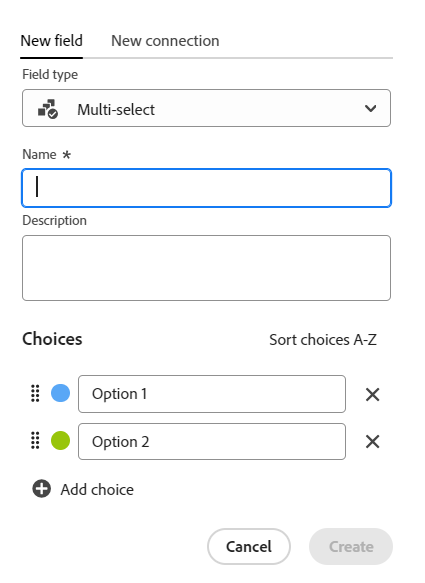

<!--update the metadata with real information when making this available in TOC and in the left nav-->

<!---
title: Create fields
description: In Adobe Workfront Planning, you can create custom fields for each kind of operational record type or taxonomy. You can then associate the field with records.
hidefromtoc: yes
hide: yes
author: Alina
feature: (*******************WE NEED A NEW ONE*******************)
role: User, Administrator (************is this right???************)
recommendations: noDisplay, noCatalog
--->

<!--Should the structure of this article be like this one: https://experienceleague.adobe.com/docs/workfront/using/administration-and-setup/customize/custom-forms/custom-form-builder/use-the-custom-form-builder/add-a-custom-field-to-a-custom-form.html?lang=en ??-->

<!--will they add a way to create fields elsewhere than in a table?! - how will that change the structure of this article? -->

<!--Do we need this for FORMULAS: when we release permissions to RECORDS and we release referring lookup fields in a formula field, update considerations to say that lookup fields from linked records depends on the permissions to the record; if they have no permissions to view a linked record, they won't be able to use that records's lookup fields in a formula - not sure is needed??-->

# Crea campi

{{planning-important-intro}}

In Adobe Workfront Planning è possibile creare campi personalizzati per i tipi di record. È quindi possibile associare i campi ai record di Workfront Planning per migliorare le informazioni sui record.

È necessario creare tipi di record prima di poter creare campi da associare. Per informazioni, vedere [Creare tipi di record](/help/quicksilver/planning/architecture/create-record-types.md).

In Workfront Planning è possibile creare i campi nei modi seguenti:

* Da zero
* Collegando i tipi di record
* Importando i tipi di record utilizzando un file Excel o CSV
* Creazione di un tipo di record
* Creazione di un&#39;area di lavoro da un modello

Per ulteriori informazioni sui campi di Workfront Planning, vedere [Panoramica campo](/help/quicksilver/planning/fields/fields-overview.md).

## Requisiti di accesso

+++ Espandere per visualizzare i requisiti di accesso per Workfront Planning.

<table style="table-layout:auto">
 <col>
 </col>
 <col>
 </col>
 <tbody>
    <tr>
<tr>
<td>
   
 Prodotto
 </td>
   <td>
   
 Adobe Workfront
 </td>
  </tr>  
 <td role="rowheader">
Contratto Adobe Workfront
</td>
   <td>

L'organizzazione deve essere iscritta alla fase di accesso anticipato per Workfront Planning 

   </td>
  </tr>
  <tr>
   <td role="rowheader">
piano Adobe Workfront
</td>
   <td>

Qualsiasi

   </td>
  </tr>
  <tr>
   <td role="rowheader">
Licenza Adobe Workfront*
</td>
   <td>
   
Nuovo: Standard
 
   
Corrente: Piano

  </td>
  </tr>

<tr>
   <td role="rowheader">
Configurazioni del livello di accesso
</td>
   <td> 
Nessun controllo del livello di accesso per Workfront Planning
  
</td>
  </tr>

<tr>
   <td role="rowheader">
Autorizzazioni
</td>
   <td> 
Gestione delle autorizzazioni per un'area di lavoro</a> 
  
   
Gli amministratori di sistema dispongono delle autorizzazioni per tutte le aree di lavoro, incluse quelle che non hanno creato.

</td>
  </tr>
<tr>
   <td role="rowheader">
Modello di layout
</td>
   <td> 
L'amministratore del Workfront o del gruppo deve aggiungere l'area Planning nel modello di layout. Per informazioni, vedere <a href="/help/quicksilver/planning/access/access-overview.md">Panoramica dell'accesso</a>. 
  
</td>
  </tr>

</tbody>
</table>

*Per informazioni, consulta [Requisiti di accesso nella documentazione di Workfront](/help/quicksilver/administration-and-setup/add-users/access-levels-and-object-permissions/access-level-requirements-in-documentation.md).

+++

<!--Maybe enable this at GA - but Planning is not supposed to have Access controls in the Workfront Access Level: 
>[!NOTE]
>
>If you don't have access, ask your Workfront administrator if they set additional restrictions in your access level. For information on how a Workfront administrator can change your access level, see [Create or modify custom access levels](/help/quicksilver/administration-and-setup/add-users/configure-and-grant-access/create-modify-access-levels.md). -->

## Crea campi da zero {#create-fields-from-scratch}

<!--in a table (not sure if this can be done elsewhere?!-->

{{step1-to-planning}}

1. Fare clic sull&#39;area di lavoro per la quale si desidera creare i record.

   Viene aperto il workspace e vengono visualizzati i tipi di record.

1. Fare clic sulla scheda di un tipo di record.

   Tutti i record esistenti associati al tipo di record vengono visualizzati nelle righe della vista tabella.

   >[!TIP]
   >
   >    Se non viene visualizzato alcun record, è possibile che non siano ancora presenti record oppure che sia stato applicato un filtro che limita la visualizzazione sullo schermo.

   Tutti i campi esistenti associati al tipo di record vengono visualizzati nelle colonne della vista tabella.

   >[!TIP]
   >
   >    Alcuni campi potrebbero essere nascosti. Fare clic su Campi e attivare l&#39;attivazione/disattivazione dei campi che si desidera visualizzare come colonne nella visualizzazione tabella.

1. Fai clic sull&#39;icona **+** nell&#39;angolo superiore destro della vista tabella

   Oppure

   Passa il puntatore del mouse sull&#39;intestazione di una colonna, fai clic sulla freccia rivolta verso il basso dopo il nome del campo, quindi fai clic su **Inserisci a sinistra** o **Inserisci a destra** per aggiungere il nuovo campo.
1. Nella scheda **Nuovo campo**, cercare un tipo di campo nella casella **Tipo di campo** oppure selezionare uno dei tipi di campo seguenti:

   * [Testo a riga singola](#single-line-text)
   * [Paragrafo](#paragraph)
   * [Selezione multipla](#multi-select)
   * [Selezione singola](#single-select)
   * [Data](#date)
   * [Numero](#number)
   * [Percentuale](#percentage)
   * [Valuta](#currency)
   * [Casella di controllo](#checkbox)
   * [Formula](#formula)
   * [Persone](#people)
   * [Creato da](#created-by)
   * [Data di creazione](#created-date)
   * [Ultima modifica eseguita da](#last-modified-by)
   * [Data ultima modifica](#last-modified-date)

   >[!IMPORTANT]
   >
   >    Non è possibile modificare il tipo di campo dopo averlo salvato.

1. Continua ad aggiungere ogni campo, come descritto nelle sezioni seguenti.

### Testo a riga singola {#single-line-text}

I campi di testo a riga singola acquisiscono informazioni alfanumeriche limitate. Ad esempio, puoi acquisire le informazioni relative al Proprietario, alle parti interessate, al team o all’unità organizzativa in un campo di testo a riga singola. Il contenuto di un campo di testo a riga singola può contenere un massimo di 250 caratteri. <!-- asked Lilit if we can change this to "Single-line" since this can have numbers and text.-->

1. Inizia a creare un campo come descritto nella sezione [Creare campi da zero](#create-fields-from-scratch) in questo articolo, quindi seleziona il tipo di campo **Testo a riga singola**.

   

1. Aggiungi le seguenti informazioni nella scheda **Nuovo campo**:
   * **Nome**: il nome del tipo di campo che verrà visualizzato in una tabella o nella pagina Dettagli del record. <!--ensure they updated this; and update the screen shot: it used to be "Label"-->
   * **Descrizione**: informazioni aggiuntive sul campo. La descrizione di un campo viene visualizzata quando si passa il cursore sull&#39;intestazione di colonna del campo in una tabella.
1. Fai clic su **Crea**.

   Il nuovo campo a riga singola viene aggiunto come colonna al tipo di record e i relativi valori possono essere associati ai record.

### Paragrafo {#paragraph}

I campi Paragrafo acquisiscono informazioni alfanumeriche aggiuntive su un record, simili al campo Descrizione.

>[!TIP]
>
>* Il contenuto di un campo paragrafo può contenere fino a 1.000 caratteri.
>
>* È possibile utilizzare la formattazione Rich Text per migliorare il contenuto dei campi paragrafo visualizzati nella visualizzazione Tabella o nella pagina Dettagli di un record. Per informazioni, vedere [Modifica record](/help/quicksilver/planning/records/edit-records.md).

1. Inizia a creare un campo come descritto nella sezione [Creare campi da zero](#create-fields-from-scratch) in questo articolo, quindi seleziona il tipo di campo **Paragrafo**.

   

1. Aggiungi le seguenti informazioni nella scheda **Nuovo campo**:
   * **Nome**: il nome del tipo di campo che verrà visualizzato in una tabella o nella pagina Dettagli del record. <!--ensure they updated this; and update the screen shot: it used to be "Label"-->
   * **Descrizione**: informazioni aggiuntive sul campo. La descrizione di un campo viene visualizzata quando si passa il cursore sulla colonna del campo in una tabella.
1. Fai clic su **Crea**.

   Il nuovo campo paragrafo viene aggiunto come colonna al tipo di record e i relativi valori possono essere associati ai record.

### Selezione multipla {#multi-select}

È possibile utilizzare un campo a selezione multipla per acquisire informazioni aggiuntive in qualsiasi formato selezionando più opzioni da un menu a discesa.

1. Inizia a creare un campo come descritto nella sezione [Creare campi da zero](#create-fields-from-scratch) in questo articolo, quindi seleziona il tipo di campo **Selezione multipla**.

   

1. Aggiungi le seguenti informazioni nella scheda **Nuovo campo**:
   * **Nome**: il nome del tipo di campo che verrà visualizzato in una tabella o nella pagina Dettagli del record. <!--ensure they updated this; and update the screen shot: it used to be "Label"-->
   * **Descrizione**: informazioni aggiuntive sul campo. La descrizione di un campo viene visualizzata quando si passa il cursore sulla colonna del campo in una tabella.
   * **Opzioni**: le opzioni disponibili per la selezione dal menu a discesa dopo il salvataggio del campo. È possibile utilizzare sia numeri che lettere per il nome di ciascuna scelta.
1. Fai clic su **Aggiungi scelta** per aggiungere tutte le scelte necessarie. Non esiste alcun limite al numero di scelte che è possibile aggiungere a un campo a selezione multipla.
1. (Facoltativo) Trascina e rilascia manualmente ciascuna scelta nell’ordine desiderato, oppure seleziona la
   **Ordinare le opzioni A-Z** se si desidera che le scelte vengano elencate automaticamente in ordine alfabetico. <!--Add this if they added this functionality: You cannot edit this option after you save the field.-->
1. (Facoltativo) Per rimuovere una scelta, fai clic sull&#39;icona **x** a destra di essa.
1. Fate clic sul campione di colore a sinistra di una scelta per espandere il selettore di colore e personalizzare il colore di ciascuna opzione.
1. Fai clic su **Crea**.

   Il nuovo campo a selezione multipla viene aggiunto come colonna al tipo di record e i relativi valori possono essere associati ai record.

### Selezione singola {#single-select}

I campi a selezione singola acquisiscono informazioni aggiuntive in qualsiasi formato selezionando un’opzione da un menu a discesa.

1. Inizia a creare un campo come descritto nella sezione [Creare campi da zero](#create-fields-from-scratch) in questo articolo, quindi seleziona il tipo di campo **Selezione singola**.

   

1. Aggiungi le seguenti informazioni nella scheda **Nuovo campo**:
   * **Nome**: il nome del tipo di campo che verrà visualizzato in una tabella o nella pagina Dettagli del record. <!--ensure they updated this; and update the screen shot: it used to be "Label"-->
   * **Descrizione**: informazioni aggiuntive sul campo. La descrizione di un campo viene visualizzata quando si passa il cursore sulla colonna del campo in una tabella.
   * **Opzioni**: le opzioni disponibili per la selezione dal menu a discesa dopo il salvataggio del campo. È possibile utilizzare sia numeri che lettere per il nome di ciascuna scelta.

1. Fai clic su **Aggiungi scelta** per aggiungere tutte le scelte necessarie. Non esiste alcun limite al numero di scelte che è possibile aggiungere a un campo a selezione singola.
1. (Facoltativo) Trascinare manualmente ogni scelta nell&#39;ordine desiderato oppure selezionare l&#39;opzione **Ordina scelte dalla A alla Z** se si desidera che le scelte vengano elencate automaticamente in ordine alfabetico. <!--Add this if they added this functionality: You cannot edit this option after you save the field.-->
1. (Facoltativo) Per rimuovere una scelta, fai clic sull&#39;icona **x** a destra di essa.
1. Fate clic sul campione di colore a sinistra di una scelta per espandere il selettore di colore e personalizzare il colore di ciascuna opzione.
1. Fai clic su **Crea**.

   Il nuovo campo a selezione singola viene aggiunto come colonna al tipo di record e i relativi valori possono essere associati ai record.

### Data {#date}

È possibile utilizzare un campo data per acquisire informazioni aggiuntive in formato data e ora.

1. Inizia a creare un campo come descritto nella sezione [Crea campi da zero](#create-fields-from-scratch) in questo articolo, quindi seleziona il tipo di campo **Data**.

   

1. Aggiungi le seguenti informazioni nella scheda **Nuovo campo**:
   * **Nome**: il nome del tipo di campo che verrà visualizzato in una tabella o nella pagina record. <!--ensure they updated this; and update the screen shot: it used to be "Label"-->
   * **Descrizione**: informazioni aggiuntive sul campo. La descrizione di un campo viene visualizzata quando si passa il cursore sulla colonna del campo in una tabella.
   * **Formato data**: tipo di formato data che si desidera visualizzare in questo campo. <!--update this casing - submitted bug for it-->

     Selezionare uno dei formati seguenti:
      * **Impostazioni locali**: corrisponde alle impostazioni locali del browser.
      * **Standard**: 05/16/2023
      * **Lungo**: 16 maggio 2023
      * **Europeo**: 16/05/2023
      * **ISO**: 16/05/2023
   * **Includi un campo orario**: selezionare questa opzione se si desidera includere un indicatore orario. Questa opzione è deselezionata per impostazione predefinita. <!--update this setting name - submitted bug for it to be changed-->

     Selezionare una delle opzioni seguenti:

      * **24ore**: ad esempio: 18:00
      * **12hr**: ad esempio: 18:00

1. Fai clic su **Crea**.

   Il nuovo campo data viene aggiunto come colonna al tipo di record e i relativi valori possono essere associati ai record.

### Numero {#number}

I tipi di campo numerico acquisiscono informazioni in formato numerico.

1. Inizia a creare un campo come descritto nella sezione [Crea campi da zero](#create-fields-from-scratch) in questo articolo, quindi seleziona il tipo di campo **Numero**.

   
1. Aggiungi le seguenti informazioni nella scheda **Nuovo campo**:

   * **Nome**: il nome del tipo di campo che verrà visualizzato in una tabella o nella pagina record.
   * **Descrizione**: informazioni aggiuntive sul campo. La descrizione di un campo viene visualizzata quando si passa il cursore sulla colonna del campo in una tabella.
   * **Precisione**: il numero di posizioni decimali che si desidera registrare per il campo. Puoi visualizzare fino a 6 decimali.
   * **Consenti numeri negativi**: selezionare questa opzione se si desidera consentire i numeri negativi in questo campo. Questa opzione è deselezionata per impostazione predefinita.

   >[!NOTE]
   >
   >    Se si seleziona Consenti numeri negativi e i valori negativi vengono memorizzati nei record a cui è associato il campo, non sarà più possibile deselezionare l&#39;impostazione in futuro.

1. Fai clic su **Crea**.

   Il nuovo campo numerico viene aggiunto come colonna al tipo di record e i relativi valori possono essere associati ai record.

### Percentuale {#percentage}

I tipi di campo Percentuale acquisiscono le informazioni in un formato numerico seguito da un segno di percentuale.

1. Inizia a creare un campo come descritto nella sezione [Crea campi da zero](#create-fields-from-scratch) in questo articolo, quindi seleziona il tipo di campo **Percentuale**.

   

1. Aggiungi le seguenti informazioni nella scheda **Nuovo campo**:
   * **Nome**: il nome del tipo di campo che verrà visualizzato in una tabella o nella pagina record.
   * **Descrizione**: informazioni aggiuntive sul campo. La descrizione di un campo viene visualizzata quando si passa il cursore sulla colonna del campo in una tabella.
   * **Precisione**: il numero di posizioni decimali che si desidera registrare per il campo. Puoi visualizzare fino a 6 decimali.
   * **Consenti numeri negativi**: selezionare questa opzione se si desidera consentire valori percentuali negativi in questo campo. Questa opzione è deselezionata per impostazione predefinita.

   >[!NOTE]
   >
   >    Se si seleziona Consenti numeri negativi e i valori negativi vengono memorizzati nei record a cui è associato il campo, non sarà più possibile deselezionare l&#39;impostazione in futuro.

1. Fai clic su **Crea**.

   Il nuovo campo percentuale viene aggiunto come colonna al tipo di record e i relativi valori possono essere associati ai record.

### Valuta {#currency}

I tipi di campo Valuta acquisiscono le informazioni in un formato numerico preceduto da un simbolo di valuta.

1. Inizia a creare un campo come descritto nella sezione [Crea campi da zero](#create-fields-from-scratch) in questo articolo, quindi seleziona il tipo di campo **Valuta**.

   

1. Aggiungi le seguenti informazioni nella scheda **Nuovo campo**:
   * **Nome**: il nome del tipo di campo che verrà visualizzato in una tabella o nella pagina record. <!--ensure they updated this; and update the screen shot: it used to be "Label"-->
   * **Descrizione**: informazioni aggiuntive sul campo. La descrizione di un campo viene visualizzata quando si passa il cursore sulla colonna del campo in una tabella.
   * **Valuta**: tipo di valuta che si desidera visualizzare in questo campo. Questa è una lista di valute secondo l&#39;Organizzazione Internazionale di Standardizzazione (ISO).
   * **Precisione**: il numero di posizioni decimali che si desidera registrare per il campo. Puoi visualizzare fino a 6 decimali.
   * **Consenti numeri negativi**: selezionare questa opzione se si desidera consentire valori di valuta negativi in questo campo. Questa opzione è deselezionata per impostazione predefinita.

   >[!NOTE]
   >
   >    Se si seleziona Consenti numeri negativi e i valori negativi vengono memorizzati nei record a cui è associato il campo, non sarà più possibile deselezionare l&#39;impostazione in futuro.

1. Fai clic su **Crea**.

   Il nuovo campo valuta viene aggiunto come colonna al tipo di record e i relativi valori possono essere associati ai record.

### Casella di controllo

È possibile utilizzare il tipo di campo Casella di controllo per aggiungere una singola opzione a un record. È possibile utilizzare questo campo per indicare un attributo o uno stato specifico per quel record specifico. È ad esempio possibile utilizzarlo come flag per tenere traccia di completamento, approvazione o qualsiasi altro attributo binario per ogni record.

1. Inizia a creare un campo come descritto nella sezione [Creare campi da zero](#create-fields-from-scratch) in questo articolo, quindi seleziona il tipo di campo **Casella di controllo**.

   

1. Aggiungi le seguenti informazioni nella scheda **Nuovo campo**:
   * **Nome**: il nome del tipo di campo che verrà visualizzato in una tabella o nella pagina record. <!--ensure they updated this; and update the screen shot: it used to be "Label"-->
   * **Descrizione**: informazioni aggiuntive sul campo. La descrizione di un campo viene visualizzata quando si passa il cursore sulla colonna del campo in una tabella.
1. Fai clic su **Crea**.

   Il nuovo campo casella di controllo viene aggiunto come colonna al tipo di record e i relativi valori possono essere associati ai record.

### Formula

I campi formula generano un nuovo valore utilizzando i valori esistenti di altri campi di un tipo di record e una funzione che indica come devono essere calcolati i valori esistenti.

Per ulteriori informazioni, vedere [Panoramica dei campi formula](/help/quicksilver/planning/fields/formula-fields.md).

1. Inizia a creare un campo come descritto nella sezione [Crea campi da zero](#create-fields-from-scratch) in questo articolo, quindi seleziona il tipo di campo **Formula**.

   

1. Aggiungi le seguenti informazioni nella scheda **Nuovo campo**:

   * **Nome**: immettere un nome per il nuovo campo.
   * **Descrizione**: aggiungi informazioni sul nuovo campo.
   * **Formula**: inizia a digitare almeno un carattere per accedere a un&#39;espressione, quindi selezionalo quando viene visualizzato nell&#39;elenco.

1. Fai clic sull’espressione selezionata per visualizzarne la definizione e la formattazione.

   

   Per ulteriori informazioni sulle espressioni supportate, vedere [Panoramica dei campi formula](/help/quicksilver/planning/fields/formula-fields.md).

1. Aggiungere i nomi dei campi visualizzati in Workfront Planning per farvi riferimento in una formula.

   >[!NOTE]
   >
   >* Non è possibile aggiungere campi di tipo a selezione multipla in una formula.
   >
   >* È possibile fare riferimento a un campo fino a 4 livelli di distanza dal tipo di record corrente. Ad esempio, se si crea un campo formula per un tipo di record Attività e l&#39;attività è connessa al tipo di record Prodotto connesso al tipo di record Campagna connesso a un progetto Workfront, è possibile fare riferimento al budget del progetto nella formula che si sta creando per il tipo di record Attività.

<!--1. In the **Format** field, select from the following choices to identify the format of the result displayed in the formula-type field:

    * **Text**: The result of the formula field displays as plain text. 
    * **Number**: The result of the formula field displays as a number. 
    * **Percent**: The result of the formula field displays as a number followed by a percentage symbol.  
    * **Currency**: The result of the formula field displays as a number preceded or followed by a currency symbol.  
    * **Tags**: The result of the formula field displays as a tag with the object's name. 
    * **Date**: The result of the formula field displays as a date. 

        A preview of what the result will look like displays under the **Format** field. 

        

        >[!WARNING]
        >
        >If the result of the formula does not match the selected format, the field will show an error message where it displays. 

-->
1. Fai clic su **Crea**.

   Il nuovo campo formula viene aggiunto come colonna al tipo di record e i relativi valori possono essere associati ai record.

### Persone

Utilizzare il tipo di campo Persone per aggiungere un utente <!--, job role, or team--> a un record. Questo è un campo di tipo-ahead ed è possibile aggiungere solo utenti<!--, roles, or teams--> già esistenti nell&#39;istanza di Workfront.

1. Inizia a creare un campo come descritto nella sezione [Crea campi da zero](#create-fields-from-scratch) in questo articolo, quindi seleziona il tipo di campo **Persone**.

   

1. Aggiungi le seguenti informazioni nella scheda **Nuovo campo**:
   * **Nome**: il nome del tipo di campo che verrà visualizzato in una tabella o nella pagina record.
   * **Descrizione**: informazioni aggiuntive sul campo. La descrizione di un campo viene visualizzata quando si passa il cursore sulla colonna del campo in una tabella.
   * **Consenti più valori**: selezionare questa opzione se si desidera consentire agli utenti di aggiungere più utenti in questo campo. Questa opzione è deselezionata per impostazione predefinita.

   >[!NOTE]
   >
   >    Se si seleziona Consenti più valori e più utenti vengono memorizzati nei record a cui è associato il campo, non sarà più possibile deselezionare l&#39;impostazione in futuro durante la modifica del campo.

1. Fai clic su **Crea**.

   Il nuovo campo di tipo Persone viene aggiunto come colonna al tipo di record e i relativi valori possono essere associati ai record.

### Creato da

È possibile utilizzare il tipo di campo Creato da per aggiungere l&#39;utente che ha creato il record a un record. Questo campo è di sola lettura e viene compilato automaticamente con il nome dell&#39;utente che ha eseguito l&#39;accesso al momento della creazione del record.

1. Inizia a creare un campo come descritto nella sezione [Crea campi da zero](#create-fields-from-scratch) in questo articolo, quindi seleziona il tipo di campo **Creato da**.

   

1. Aggiungi le seguenti informazioni nella scheda **Nuovo campo**:

   * **Nome**: il nome del tipo di campo che verrà visualizzato in una tabella o nella pagina record. <!--this might change and they might prepopulate it with "Created by"-->
   * **Descrizione**: informazioni aggiuntive sul campo. La descrizione di un campo viene visualizzata quando si passa il cursore sulla colonna del campo in una tabella.

1. Fai clic su **Crea**.

   Il nuovo campo Creato per tipo viene aggiunto come colonna al tipo di record e i relativi valori vengono precompilati con il nome dell’utente che ha creato ciascun record.

### Data di creazione

È possibile utilizzare il tipo di campo Data di creazione per aggiungere la data di creazione del record a un record. Questo campo è di sola lettura e viene compilato automaticamente con la data (e facoltativamente con l’ora) di creazione del record.

1. Inizia a creare un campo come descritto nella sezione [Crea campi da zero](#create-fields-from-scratch) in questo articolo, quindi seleziona il tipo di campo **Data di creazione**.

   

   <!--check the image above - added bug fix for UI text changes-->

1. Aggiungi le seguenti informazioni nella scheda **Nuovo campo**:

   * **Nome**: il nome del tipo di campo che verrà visualizzato in una tabella o nella pagina record. <!--this might change and they might prepopulate it with "Created date"-->
   * **Descrizione**: informazioni aggiuntive sul campo. La descrizione di un campo viene visualizzata quando si passa il cursore sulla colonna del campo in una tabella.
   * **Formato data**: selezionare uno dei formati seguenti:

      * **Impostazioni locali**: corrisponde alle impostazioni locali del browser.
      * **Standard**: 05/16/2023
      * **Lungo**: 16 maggio 2023
      * **Europeo**: 16/05/2023
      * **ISO**: 16/05/2023
   * **Includi un campo orario**: selezionare questa opzione se si desidera includere un indicatore orario. Questa opzione è deselezionata per impostazione predefinita. <!--submitted a UI text change for this - check the UI-->

     Selezionare una delle opzioni seguenti:

      * **24ore**: ad esempio: 18:00
      * **12hr**: ad esempio: 18:00

1. Fai clic su **Crea**.

   Il nuovo campo Data creazione viene aggiunto come colonna al tipo di record e i relativi valori vengono precompilati con la data (o la data e l’ora) di creazione del record.

### Ultima modifica eseguita da

È possibile utilizzare il tipo di campo Ultima modifica per per aggiungere a un record l&#39;ultimo utente che ha modificato il record. Questo campo è di sola lettura e viene compilato automaticamente con il nome dell&#39;utente che ha eseguito l&#39;accesso l&#39;ultimo aggiornamento del record.

1. Inizia a creare un campo come descritto nella sezione [Crea campi da zero](#create-fields-from-scratch) in questo articolo, quindi seleziona il tipo di campo **Ultima modifica di**.

   

1. Aggiungi le seguenti informazioni nella scheda **Nuovo campo**:

   * **Nome**: il nome del tipo di campo che verrà visualizzato in una tabella o nella pagina record. <!--this might change and they might prepopulate it with "Created by"-->
   * **Descrizione**: informazioni aggiuntive sul campo. La descrizione di un campo viene visualizzata quando si passa il cursore sulla colonna del campo in una tabella.

1. Fai clic su **Crea**.

   Il nuovo campo Ultima modifica per tipo viene aggiunto come colonna al tipo di record e i relativi valori vengono precompilati con il nome dell’ultimo utente che ha modificato ogni record.

### Data ultima modifica

È possibile utilizzare il tipo di campo Data ultima modifica per aggiungere la data dell&#39;ultima modifica di un record a un record. Questo campo è di sola lettura e viene compilato automaticamente con la data (e facoltativamente con l&#39;ora) dell&#39;ultima modifica del record.

1. Inizia a creare un campo come descritto nella sezione [Crea campi da zero](#create-fields-from-scratch) in questo articolo, quindi seleziona il tipo di campo **Data di creazione**.

   

   <!--check the image above - added bug fix for UI text changes-->

1. Aggiungi le seguenti informazioni nella scheda **Nuovo campo**:

   * **Nome**: il nome del tipo di campo che verrà visualizzato in una tabella o nella pagina record. <!--this might change and they might prepopulate it with "Created date"-->
   * **Descrizione**: informazioni aggiuntive sul campo. La descrizione di un campo viene visualizzata quando si passa il cursore sulla colonna del campo in una tabella.
   * **Formato data**: selezionare uno dei formati seguenti:

      * **Impostazioni locali**: corrisponde alle impostazioni locali del browser.
      * **Standard**: 05/16/2023
      * **Lungo**: 16 maggio 2023
      * **Europeo**: 16/05/2023
      * **ISO**: 16/05/2023
   * **Includi un campo orario**: selezionare questa opzione se si desidera includere un indicatore orario. Questa opzione è deselezionata per impostazione predefinita. <!--submitted a UI text change for this - check the UI-->

     Selezionare una delle opzioni seguenti:

      * **24ore**: ad esempio: 18:00
      * **12hr**: ad esempio: 18:00

1. Fai clic su **Crea**.

   Il nuovo campo Ultima modifica del tipo di data viene aggiunto come colonna al tipo di record e i relativi valori vengono precompilati con la data (o data e ora) dell’ultima modifica apportata al record.

## Creare i campi collegando i tipi di record

È possibile creare campi record collegati quando si aggiunge una nuova connessione tra due tipi di record o un tipo di record e un tipo di oggetto di altre applicazioni.

Per informazioni sulla connessione dei tipi di record di Workfront Planning, vedere [Connetti tipi di record](/help/quicksilver/planning/architecture/connect-record-types.md)

## Creare campi importando tipi di record tramite un file Excel o CSV

Per ulteriori informazioni, vedere [Creare tipi di record](/help/quicksilver/planning/architecture/create-record-types.md).

## Creare campi creando un tipo di record

Quando si crea un tipo di record, per impostazione predefinita vengono creati anche diversi campi associati al nuovo tipo di record. Per ulteriori informazioni, vedere [Creare tipi di record](/help/quicksilver/planning/architecture/create-record-types.md).

## Creare campi creando un’area di lavoro da un modello

Adobe Workfront Planning crea campi per i tipi di record quando si crea un&#39;area di lavoro da un modello.

Per informazioni, vedere [Creare aree di lavoro](/help/quicksilver/planning/architecture/create-workspaces.md).