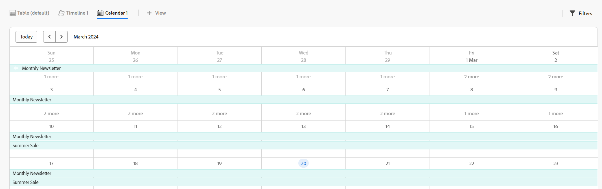

# Panoramica di Adobe Workfront Planning

<!--this article is linked to the WF Planning landing page - do not change URL or move it; send the team a new URL after we add the redirects for this page-->

<!--do not use the snippet for IMPORTANT as it links to this article-->

<!--The highlighted information on this page refers to functionality not yet generally available. It is available only in the Preview environment for all customers. After the monthly releases to Production, the same features are also available in the Production environment for customers who enabled fast releases.    

For information about fast releases, see [Enable or disable fast releases for your organization](/help/quicksilver/administration-and-setup/set-up-workfront/configure-system-defaults/enable-fast-release-process.md).  -->

>[!IMPORTANT]
>
>Le informazioni contenute in questo articolo si riferiscono ad Adobe Workfront Planning, una funzionalità aggiuntiva di Adobe Workfront.
>
>Per poter accedere a tutte le funzionalità di Workfront Planning, è necessario disporre dei seguenti elementi:
>
>* Un nuovo pacchetto Workfront e una nuova licenza. Workfront Planning non è disponibile per i pacchetti o le licenze legacy di Workfront.
>* Un pacchetto di Workfront Planning.
>* L’istanza di Workfront della tua organizzazione deve essere integrata in Adobe Unified Experience.
>
> Per un elenco completo dei requisiti per accedere a Workfront Planning, vedere [Panoramica dell&#39;accesso ad Adobe Planning](/help/quicksilver/planning/access/access-overview.md).
> 

Questo articolo contiene informazioni generali su Workfront Planning.

Per l&#39;elenco completo degli articoli che contengono la documentazione per Workfront Planning, vedere [Adobe Workfront Planning: indice articolo](/help/quicksilver/planning/planning-information.md).

## Introduzione ad Adobe Workfront Planning

Adobe Workfront Planning è una funzionalità aggiuntiva di Adobe Workfront. Lo scopo di Workfront Planning è quello di offrire una visibilità completa dei dettagli operativi di un&#39;organizzazione e di rispondere alle domande aziendali critiche in ogni fase del ciclo di vita della gestione del lavoro.

Workfront Planning è in grado di rispondere a domande quali:

* Quante campagne sono in esecuzione nell’area EMEA per il quarto trimestre?
* Esistono sovrapposizioni di pubblico tra campagne simultanee?
* Quanto stanno andando bene i programmi di sensibilizzazione in questo momento?
* Come si presentano le risorse per una determinata campagna? Chi di loro deve ancora essere approvato?

Per rispondere a queste domande, la leadership ha bisogno di una soluzione che possa fornire una visione olistica di ogni fase del lavoro, dalla pianificazione all&#39;esecuzione, dalla consegna alla misurazione dei risultati. Attualmente, le organizzazioni dispongono di strumenti che possono coprire alcune parti del processo, ma molte non hanno buone connessioni con tutte le fasi del lavoro, né possono fornire risultati in modo affidabile.

Di seguito sono riportate alcune delle funzionalità principali:

* Risolvere il problema della gestione del lavoro in tutte le fasi e per tutte le parti interessate che partecipano al processo di lavoro.
* Personalizzare completamente i flussi di lavoro, dalla scelta dei tipi di oggetto (o di record) utilizzati dall&#39;organizzazione alla configurazione del modo in cui questi oggetti si collegano l&#39;uno all&#39;altro.
* Collegamento a tipi di oggetto da altri sistemi, creando un framework coerente per tutti i processi.

<!--
## Currently available Workfront Planning features
(*****for GA just make a list of what features ARE included in Planning and eliminate the last 2 columns; also update the title of this section*****)

(*****at GA: update the link below to the new place for release notes *****)

For information about new features and when they are released, see [Adobe Workfront Planning release activity for 2024](/help/quicksilver/planning/general/release-activity.md). 

The following features are currently available in Workfront Planning:

* Create workspaces             
* Create record types             
* Create record custom fields             
(************ * Import record types and fields using an Excel or CSV file*****)
          
* Display records in a table view            
* Display records in a timeline view            
* Display records in a calendar view            
* Filter, sort, and group records in a table view
* Filter, group, and color code records in the timeline view
* Filter records in the calendar view 
* Search for records in the table and timeline views             
* Connect records that belong to the same workspace  
* Connect records that belong to different workspaces   
* Connect Workfront Planning records to Workfront projects, programs, portfolios, companies, groups             
* Connect Workfront Planning records to Adobe Experience Manager assets          
    You must have an Adobe Experience Manager Assets license and an integration between AEM Assets and Workfront.
    For information, see [Adobe Workfront for Experience Manager Assets and Assets Essentials: article index](/help/quicksilver/documents/adobe-workfront-for-experience-manager-assets-essentials/workfront-for-aem-asset-essentials.md). 
* View record information in the Details tab
* View record connections in the Connections tab
* Customize the layout of a record's page             
* Share workspaces             
* Share views             
* Share views publicly with any external resource, even people who are not Workfront users         
* Duplicate views             
* Submit requests to create records            
* Export record details to Word and PDF.
* Add comments to records             
* Receive in-app notifications             
* Receive email notifications             
* Add thumbnails and cover pages to records             
* View the history of changes on a record             
* Rich Text formatting for Paragraph fields             
* Access Planning records from Workfront objects             
* Connect and disconnect Planning records from Workfront objects 
* Create Planning records by submitting a request form            
* Workfront Planning public API             
* Adobe Workfront Planning modules for Adobe Workfront Fusion             
* Workfront Planning AI Assistant
* Reporting on Workfront Planning information
    You can report on Planning information using the Canvas Dashboard. For information, see [Canvas Dashboards overview](/help/quicksilver/reports-and-dashboards/canvas-dashboards/canvas-dashboards-overview.md). 

-->

<!--OLD: 

|       Feature                                      |     Available now  |     Coming soon   |     In research  |
|----------------------------------------------------|:-----------------------------:|:--------------------------------:|:----------------:|
|     Create workspaces                              |   ✓                           |                                  |                  |
|     Create record types                |   ✓                           |                                  |                  |
|     Create record custom fields                    |   ✓                           |                                  |                  |
|     Import record types and fields using an Excel  or CSV file                              |                              |           ✓                       |                  |
|     Link records                                   |   ✓                           |                                  |                  |
|     View records in a table                        |   ✓                           |                                  |                  |
|     View records in a timeline                     |   ✓                           |                                  |                  |
|     View records in a calendar                     |   ✓                           |                                  |                  |
|     Filter records                                 |   ✓                           |                                  |                  |
|     Group records in the timeline view             |   ✓                           |                                  |                  |
|     Group records in the table view                | ✓                              |                                 |                  |
|     Sort records in the table view                                 |  ✓                             |                                 |                  |
|     Sort records in the timeline view                                 |                               |   ✓                              |                  |
|     Sort groupings in the table view                                 |                               |   ✓                              |                  |
|     Sort groupings in the timeline view                                 |                               |   ✓                              |                  |
|   Search for records in the table view    | ✓    |   |
|   Search for records in the timeline view    | ✓    |   |
|     Connect Workfront Planning records to Workfront projects, programs, portfolios, companies, groups  |   ✓                            |                                 |                  |
|     Connect Workfront Planning records to Adobe Experience Manager assets                                  |      ✓                         |                                  |                 |
|     Connect Planning records from different workspaces                                  |      ✓                         |                                  |                 | 
|     Record page with detailed information                            |   ✓                           |                                  |                  |
|     Update the layout of the record's page              |    ✓                           |                                 |                  |
|  Share workspaces | ✓| |  |
|  Share views |✓ | |  |
|  Share views publicly with external resources |✓ | |  |
|  Duplicate views |✓ | |  |
|     Submit requests                                |                               |          ✓                        |                 |
|     Export record details to Word                                 |    ✓                           |                                  |                 |
|     Export record details to PDF                                 |                               |                                  |       ✓          |
|     Customize the color and icon of a record                                 |      ✓                         |                                  |                 |
|     Add comments to records                                 | ✓                              |                                  |                 |
|     Receive in-app notifications                                 | ✓                              |                                  |                 |
|     Receive email notifications                                 | ✓                              |                                  |                 |
|     Add thumbnails to records                                 | ✓                              |                                  |                 |
|     View history of changes on a record                                 | ✓                              |                                  |                 |
|     Rich Text formatting for Paragraph fields                                 |      ✓                         |                                  |                 | 
|     Adobe Workfront Planning modules for Adobe Workfront Fusion                                 |      ✓                         |                                  |                 | 
|     Copy and paste information from one field to another                                  |      ✓                         |                                  |                 | 
|     Access Planning records from Workfront objects                                  |      ✓                         |                                  |                 |
|     Connect Planning records from Workfront objects                                  |      ✓                         |                                  |                 |
|     Workfront Planning public API                                 |      ✓                         |                                  |                 |
|     Workfront Planning AI Assistant*                                 |      ✓                         |                                  |                 |
|     Reporting on Workfront Planning information (Canvas Dashboard)                              |                               |       ✓                           |                 |
-->

## Abilita Workfront Planning per gli utenti nell’istanza Workfront

Dopo l&#39;acquisto di un pacchetto Workfront Planning da parte dell&#39;organizzazione, in qualità di amministratore di Workfront, è necessario verificare che siano presenti i seguenti elementi prima che gli utenti possano accedere a Workfront Planning:

* Assegnare ai seguenti utenti un modello di layout che includa Planning nel menu principale:

   * Assegnate il modello di layout agli utenti Light e Contribute.

     Per impostazione predefinita, Planning è abilitato per gli utenti standard e gli amministratori di sistema.

  Per ulteriori informazioni, vedere [Personalizzare il menu principale utilizzando un modello di layout](/help/quicksilver/administration-and-setup/customize-workfront/use-layout-templates/customize-main-menu.md) e [Assegnare gli utenti a un modello di layout](/help/quicksilver/administration-and-setup/customize-workfront/use-layout-templates/assign-users-to-layout-template.md).

* Assegnare agli utenti una licenza di Workfront e le autorizzazioni di Workfront Planning che consentano loro di visualizzare o creare oggetti in Workfront Planning. Per ulteriori informazioni su come concedere l&#39;accesso a Workfront Planning e consentire ad altri utenti di utilizzarlo, vedere [Panoramica sull&#39;accesso ad Adobe Workfront Planning](/help/quicksilver/planning/access/access-overview.md).

## Terminologia di Workfront Planning

Sebbene Workfront Planning faccia parte di Workfront, viene fornito con concetti e terminologia proprietari. Prima di iniziare la configurazione di Workfront Planning per la tua organizzazione, assicurati di conoscere questi concetti.

Il framework per Workfront Planning è completamente personalizzabile. È possibile creare tutti i tipi di record, i relativi attributi e qualsiasi campo ad essi associato in base alle esigenze specifiche dell&#39;organizzazione.

Il numero di oggetti di Workfront Planning che è possibile creare è limitato. Per ulteriori informazioni, vedere [Panoramica sulle limitazioni degli oggetti di Adobe Workfront Planning](/help/quicksilver/planning/general/limitations-overview.md).

Di seguito sono riportati gli oggetti e i concetti principali di Workfront Planning:

* **Workspace**: raccolta di tipi di record che definiscono il ciclo di vita operativo di una determinata organizzazione. Un’area di lavoro è l’area di lavoro di un’unità organizzativa.

  

  Per ulteriori informazioni, vedere [Creare aree di lavoro](/help/quicksilver/planning/architecture/create-workspaces.md).

* **Tipo di record**: nome dei tipi di oggetto in Workfront Planning.

  I tipi di record popolano le aree di lavoro.

  A differenza di Workfront, dove i tipi di oggetto sono predefiniti, in Workfront Planning è possibile creare tipi di oggetto personalizzati.

  Ad esempio, in Workfront sono già stati creati i tipi di oggetto Programma, Portfolio, Progetto, Attività o Problema.

  In Workfront Planning è possibile creare qualsiasi tipo di record che soddisfi i flussi di lavoro dell&#39;organizzazione. Successivamente è possibile definire la relazione tra i tipi di record o le dipendenze tra le maschere.

  Per ulteriori informazioni, vedere [Panoramica sui tipi di record](/help/quicksilver/planning/architecture/overview-of-record-types.md).

* **Record**: istanza di un tipo di record.

  

  Dopo aver aggiunto un tipo di record a un&#39;area di lavoro, è possibile iniziare ad aggiungere record di tale tipo nella pagina del tipo di record.

  Ad esempio, &quot;Campagna&quot; può essere un tipo di record e &quot;Campagna estiva per l’area EMEA&quot; è un record del tipo di record Campagna.

  Per ulteriori informazioni, vedere [Creare record](/help/quicksilver/planning/records/create-records.md).

* **Modello Workspace**: è possibile creare un&#39;area di lavoro utilizzando modelli predefiniti. È possibile utilizzare i tipi di record e i campi predefiniti inclusi in un modello oppure aggiungere record personalizzati.

  

  Adobe Workfront Planning contiene i seguenti modelli:

   * Base: Marketing Management
   * Avanzato: Marketing Management
   * Enterprise: Marketing Management
   * Gestione vendite
   * Gestione del prodotto

  Per ulteriori informazioni, vedere [Elenco dei modelli di area di lavoro](/help/quicksilver/planning/architecture/workspace-templates.md).

* **Campi**: i campi sono attributi che è possibile aggiungere ai tipi di record. I campi contengono informazioni sul tipo di record. <!--check the shot below, "Connection" needs to be in lowercase-->

  

  Considerazioni sui campi record:

   * I campi aggiunti per un tipo di record vengono automaticamente associati a tutti i record di quel tipo e possono essere utilizzati per acquisire dati su tali record.

   * I campi vengono visualizzati come colonne nella visualizzazione Tabella applicata a una pagina del tipo di record. Vengono inoltre visualizzati nella pagina del record.

   * I campi sono univoci per un tipo di record e non vengono trasferiti da un tipo di record a un altro.

   * I campi sono completamente personalizzabili e sono accessibili solo in Workfront Planning. Non è possibile accedere ai campi di Workfront Planning da Workfront.

  Per ulteriori informazioni, vedere [Creare i campi](/help/quicksilver/planning/fields/create-fields.md).

  Per impostazione predefinita, un nuovo tipo di record è associato ai seguenti campi predefiniti:

   * Nome
   * Descrizione
   * Data di inizio
   * Data di fine
   * Stato

  Puoi creare campi personalizzati dei seguenti tipi:

   * Testo a riga singola
   * Paragrafo
   * Selezione multipla
   * Selezione singola
   * Data
   * Numero
   * Percentuale
   * Valuta
   * Casella di controllo
   * Formula
   * People
   * Creato da
   * Data di creazione
   * Ultima modifica eseguita da
   * Data ultima modifica

* **Tipi di record connessi**, **Record connessi** e **Campi connessi**: è possibile creare una connessione tra le seguenti entità in Workfront Planning:

   * Due tipi di record di Workfront Planning.
   * Tipo di record e tipo di oggetto progetto, programma, portfolio, società o gruppo di Workfront.
   * Un tipo di record e una risorsa o cartella Adobe Experience Manager.

     È necessario disporre di una licenza Adobe Experience Manager per collegare i tipi di record agli oggetti Experience Manager.

     

  Dopo aver stabilito una connessione tra i tipi di record, è possibile collegare tra loro singoli record o oggetti di tali tipi. La connessione tra i record viene visualizzata come campo record connesso o come connessione.

  La connessione dei tipi di record è utile quando si dispone di diversi tipi di oggetti di lavoro che influiscono l&#39;uno sull&#39;altro. Ad esempio, puoi utilizzare le campagne e ogni campagna può gestire più marchi. Per indicare questa relazione, puoi collegare le campagne ai brand. Inoltre, il lavoro per ogni campagna potrebbe essere pianificato in più progetti in Workfront. Per indicare questo, puoi collegare le campagne ai relativi progetti. La connessione di tipi di record e la successiva connessione di singoli record consente di ottenere questa relazione in Workfront Planning.

* **Campi di ricerca** (o campi collegati): dopo aver stabilito la connessione tra due tipi di record e aver connesso i singoli record, è possibile fare riferimento ai campi dei record connessi dal record da cui si sta effettuando la connessione.

  Se ad esempio si connette un tipo di record Campagna a un tipo di oggetto Progetto Workfront, è possibile visualizzare il campo Budget dei progetti connessi nei record della campagna.

  

  >[!TIP]
  >
  > Non è possibile aggiungere i tipi di campo seguenti come campi di ricerca dal record o dai tipi di oggetto collegati:
  >
  >* People
  >* Creato da
  >* Ultima modifica eseguita da
  >* Campi typeahead di Workfront (inclusi campi come Proprietario progetto o Sponsor progetto)

  Per informazioni sulla connessione di tipi di record, record e sulla creazione di campi collegati, vedere gli articoli seguenti:

   * [Connetti tipi di record](/help/quicksilver/planning/architecture/connect-record-types.md)
   * [Connetti record](/help/quicksilver/planning/records/connect-records.md)

<!--not yet:* Fields are reusable across Record Types.  -->

* **Visualizzazioni**: i record vengono visualizzati nella rispettiva pagina del tipo di record in diversi tipi di visualizzazioni.

  

  Le visualizzazioni contengono impostazioni personalizzate di un tipo di visualizzazione specifico, ad esempio l&#39;elenco di campi (colonne), un elenco di record (righe), il relativo ordine, un filtro applicato o applicabile e un raggruppamento.

  Di seguito sono riportati i tipi di visualizzazione che è possibile applicare alla pagina del tipo di record:

   * **Vista tabella**: visualizza i record e i relativi campi, inclusi i campi connessi e di ricerca, in un formato tabella. Le righe della tabella sono i singoli record e le colonne sono i campi record. La vista tabella è quella predefinita.

     

   * **Visualizzazione sequenza temporale**: visualizza i record contenenti almeno due campi di tipo Data in una sequenza temporale cronologica. È possibile visualizzare fino a 5 tipi di record collegati e i relativi record nella visualizzazione timeline.

     

   * **Visualizzazione calendario**: visualizza i record con almeno due campi di tipo Data in un formato calendario.
     

Per ulteriori informazioni, vedere [Gestire le visualizzazioni dei record](/help/quicksilver/planning/views/manage-record-views.md).

## Individuazione di Adobe Workfront Planning

Per individuare Adobe Planning, verificare che l&#39;organizzazione abbia ricevuto l&#39;accesso a Workfront Planning e che l&#39;amministratore del sistema o del gruppo abbia aggiunto l&#39;area Pianificazione al menu principale. Per informazioni, vedere [Panoramica dell&#39;accesso ad Adobe Planning](/help/quicksilver/planning/access/access-overview.md).

Per individuare Workfront Planning:

1. Accedi a Workfront.

{{step1-click-main-menu}}

1. Fare clic sull&#39;icona **Planning** .

   Viene visualizzata la pagina principale di Workfront Planning.

   

   >[!TIP]
   >
   >    L&#39;amministratore di Workfront può aggiungere l&#39;area Pianificazione all&#39;opzione Seleziona pagina di destinazione nel modello di layout, in modo da poter aprire Planning non appena si accede a Workfront. Per informazioni, vedere [Personalizzare la pagina di destinazione utilizzando un modello di layout](/help/quicksilver/administration-and-setup/customize-workfront/use-layout-templates/customize-landing-page.md).

1. (Condizionale e facoltativo) Se sei un amministratore di Workfront, fai clic su una delle seguenti schede:
   * **Aree di lavoro in cui si trova**: visualizza le aree di lavoro create dall&#39;utente o condivise con l&#39;utente.
   * **Altre aree di lavoro**: visualizza tutte le altre aree di lavoro nel sistema.

   Per tutti gli altri utenti, entrambe le aree di lavoro create o condivise con gli utenti vengono visualizzate nell&#39;area **Aree di lavoro**.

1. (Facoltativo e consigliato) Per creare la struttura di lavoro, continua con alcune delle azioni seguenti:

   1. Crea un’area di lavoro da zero o utilizzando un modello. Per informazioni, vedere [Creare aree di lavoro](/help/quicksilver/planning/architecture/create-workspaces.md).

   1. Aggiungi sezioni al nuovo workspace. Per informazioni, vedere [Modifica aree di lavoro](/help/quicksilver/planning/architecture/edit-workspaces.md).
   1. Rinomina le sezioni esistenti nel nuovo workspace.
   1. Aggiungere tipi di record al nuovo workspace. Per informazioni, vedere [Creare tipi di record](/help/quicksilver/planning/architecture/create-record-types.md).

   1. Fare clic sul nome di un tipo di record per aprire la pagina del tipo di record. Per impostazione predefinita, la pagina del tipo di record viene visualizzata nella vista Tabella.

      È inoltre possibile creare una vista Timeline o Calendario. Per informazioni, vedere [Gestire le visualizzazioni dei record](/help/quicksilver/planning/views/manage-record-views.md).

   1. Nella vista tabella, iniziare ad aggiungere record aggiungendo righe

      Oppure

      Inizia ad aggiungere campi record aggiungendo colonne.

      Per informazioni, vedere i seguenti articoli:

      * [Crea record](/help/quicksilver/planning/records/create-records.md)
      * [Crea campi](/help/quicksilver/planning/fields/create-fields.md).

## Attività sulla versione di Workfront Planning

<!--update this with the new release activity page - the article index for all Planning releases-->

Le nuove funzioni vengono rilasciate regolarmente in Workfront Planning.

Per un elenco aggiornato delle funzionalità rilasciate, vedere [Attività di Adobe Workfront Planning: indice articolo](/help/quicksilver/product-announcements/product-releases/planning-release-activity/planning-release-activity-article-index.md).

## Risorse aggiuntive per Workfront Planning

* [Adobe Workfront Planning: indice articolo](/help/quicksilver/planning/planning-information.md): indice di tutti gli articoli che contengono la documentazione su Workfront Planning, raggruppati per area di interesse.
* [Panoramica dell&#39;Assistente di Adobe Workfront Planning AI](/help/quicksilver/planning/general/planning-ai-assistant-overview.md): con l&#39;Assistente di Workfront AI per Planning è possibile cercare record oppure creare, aggiornare ed eliminare record utilizzando i comandi e consentendo all&#39;assistente di eseguire il lavoro desiderato.

  <!--
    >[!NOTE]
    >
    >    The Workfront AI Assistant has been temporarily removed and it will be available at a later date.-->

* [Moduli Adobe Workfront Planning per Workfront Fusion](https://experienceleague.adobe.com/it/docs/workfront-fusion/using/references/apps-and-their-modules/adobe-connectors/workfront-planning-modules): con i moduli Adobe Workfront Planning è possibile attivare uno scenario quando si verificano eventi in Workfront Planning. Puoi anche creare, leggere, aggiornare ed eliminare record oppure eseguire una chiamata API personalizzata all’account Adobe Workfront Planning.

* [Nozioni di base sulle API di Adobe Workfront Planning](/help/quicksilver/planning/general/planning-api-basics.md): l&#39;API di Adobe Workfront Planning ha l&#39;obiettivo di semplificare la creazione di integrazioni con Planning introducendo un&#39;architettura REST-ful che funziona tramite HTTP.

* [Introduzione all&#39;integrazione di Adobe Workfront Planning e Adobe GenStudio for Performance Marketing](/help/quicksilver/planning/planning-and-genstudio-integration/get-started-with-workfront-planning-and-genstudio-integration.md): è possibile gestire i record da GenStudio for Performance Marketing nell&#39;area di lavoro di GenStudio in Workfront Planning.

* **Funzionalità di reporting di Workfront Planning**: è ora possibile visualizzare le informazioni di Workfront Planning in un rapporto in Workfront utilizzando il dashboard Workfront Canvas. Per informazioni, vedere [Panoramica dei dashboard di Canvas](/help/quicksilver/reports-and-dashboards/canvas-dashboards/canvas-dashboards-overview.md).

