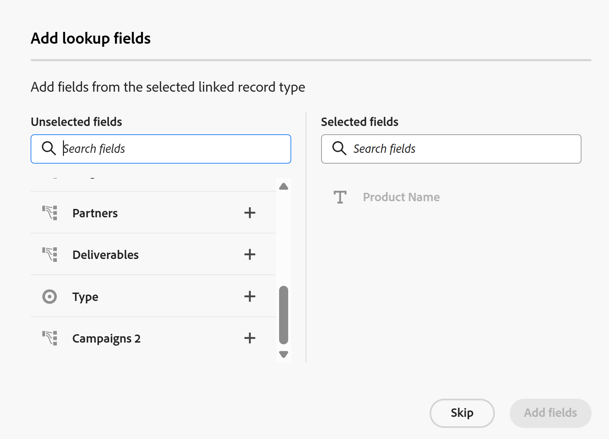

# Introduzione alla Pianificazione di Adobe Workfront

<!--

this article is linked to the WF Planning landing page - do not change URL or move it; send the team a new URL after we add the redirects for this page

-->

<!--do not use the snippet for IMPORTANT as it links to this article-->

<!--
The highlighted information on this page refers to functionality not yet generally available. It is available only in the Preview environment for all customers. After the release to Preview, the same features are also available monthly in the Production environment for customers who enabled fast releases.    

For information about fast releases, see [Enable or disable fast releases for your organization](/help/quicksilver/administration-and-setup/set-up-workfront/configure-system-defaults/enable-fast-release-process.md). 
-->

>[!IMPORTANT]
>
>Le informazioni contenute in questo articolo si riferiscono ad Adobe Workfront Planning. Workfront Planning è un prodotto standalone o una funzionalità acquistata in più da Adobe Workfront.
>
>
>Questo articolo contiene informazioni generali su Workfront Planning quando i clienti acquistano anche un pacchetto Workfront o Workflow.
>
>Per l&#39;elenco completo degli articoli che contengono la documentazione per Workfront Planning, vedere [Informazioni generali e indice degli articoli per Adobe Workfront Planning](/help/quicksilver/planning/planning-information.md).
>
>Per informazioni su Workfront Planning come prodotto autonomo, vedere [Introduzione ad Adobe Workfront Planning come prodotto autonomo](/help/quicksilver/planning/planning-sta/planning-sta-overview.md).

## Disponibilità di Workfront Planning

<!--
the bullets repeat in the "Access needed for Planning STA" article
-->

Workfront Planning è accessibile quando l&#39;organizzazione acquista uno dei seguenti pacchetti Workfront:

* Workfront Workflow e Workfront Planning acquistati insieme. Ogni utente dell’organizzazione dispone di un flusso di lavoro e di una licenza Planning. In questo modo tutti gli utenti hanno pieno accesso a tutte le funzioni di Workfront per entrambi i moduli.

* Flusso di lavoro di Workfront per tutti gli utenti dell&#39;organizzazione e pianificazione di Workfront solo per alcuni utenti dell&#39;organizzazione. In questo modo gli utenti avranno pieno accesso a tutte le funzioni di Workflow e avranno un accesso più limitato alle funzioni di Planning per gli utenti ai quali è stata assegnata una licenza Planning.

* Workfront Planning come prodotto autonomo per gli utenti dell&#39;organizzazione. In questo modo gli utenti non potranno accedere alle funzioni di Workfront Workflow né alle funzioni di Planning.

Per informazioni sulle funzionalità incluse in Planning come prodotto autonomo, vedere [Introduzione ad Adobe Workfront Planning come prodotto autonomo](/help/quicksilver/planning/planning-sta/planning-sta-overview.md).

## Introduzione alla Pianificazione di Adobe Workfront

Se acquistata insieme a una licenza del flusso di lavoro, Adobe Workfront Planning è una funzionalità aggiuntiva di Adobe Workfront. Lo scopo della Pianificazione di Workfront è quello di offrire una visibilità completa dei dettagli operativi di un’organizzazione e di rispondere alle domande aziendali critiche in ciascuna fase del ciclo di vita della gestione del lavoro.

La Pianificazione di Workfront è in grado di rispondere a domande come:

* Quante campagne sono in esecuzione nell’area EMEA per il quarto trimestre?
* Esistono sovrapposizioni di pubblico tra campagne simultanee?
* Qual è l’andamento attuale dei programmi di sensibilizzazione?
  <!--* What do the assets look like for a particular campaign? Which of them must still be approved?-->

Per rispondere a queste domande, la leadership ha bisogno di una soluzione che possa fornire una visione olistica di ciascuna fase del lavoro, dalla pianificazione all’esecuzione, dalla consegna alla misurazione dei risultati. Attualmente, le organizzazioni dispongono di strumenti che possono coprire alcune parti del processo, ma molte non dispongono di collegamenti validi con tutte le fasi del lavoro, né possono fornire risultati in modo affidabile.

Le seguenti sono alcune delle funzionalità principali:

* Risolvere il problema della gestione del lavoro in tutte le fasi e per tutti gli stakeholder che partecipano al processo di lavoro.
* Personalizzare completamente i flussi di lavoro, dalla scelta dei tipi di oggetto (o di record) utilizzati dall’organizzazione alla configurazione del modo in cui tali oggetti si collegano l’uno all’altro.
* Collegamento a tipi di oggetto da altri sistemi, creando un framework coerente per tutti i processi.

## Abilitare la Pianificazione di Workfront per gli utenti nell’istanza Workfront

Dopo l’acquisto di un pacchetto di Pianificazione di Workfront da parte dell’organizzazione, in qualità di amministratore di Workfront, prima che gli utenti possano accedere a Pianificazione di Workfront devi verificare quanto segue:

* Assegnare un modello di layout che includa Planning agli utenti con un livello di accesso Collaboratore o Light.

  Per impostazione predefinita, la Pianificazione è abilitata per gli utenti standard e gli amministratori di sistema.

  Per ulteriori informazioni, consulta [Personalizzare il menu principale utilizzando un modello layout](/help/quicksilver/administration-and-setup/customize-workfront/use-layout-templates/customize-main-menu.md) e [Assegnare gli utenti a un modello layout](/help/quicksilver/administration-and-setup/customize-workfront/use-layout-templates/assign-users-to-layout-template.md).

* Assegnare agli utenti le licenze di Workfront e Planning e le autorizzazioni di Workfront Planning che consentano loro di visualizzare o creare oggetti in Workfront Planning.

  Per ulteriori informazioni su come concedere l’accesso alla Pianificazione di Workfront e consentire ad altri utenti di utilizzarla, consulta [Panoramica dell’accesso alla Pianificazione di Adobe Workfront](/help/quicksilver/planning/access/access-overview.md).

## Terminologia della Pianificazione di Workfront

Sebbene la Pianificazione di Workfront faccia parte di Workfront, ha concetti e terminologia proprietari. Prima di iniziare la configurazione della Pianificazione di Workfront per la tua organizzazione, assicurati di conoscere questi concetti.

Il framework per la Pianificazione di Workfront è completamente personalizzabile. Puoi creare tutti i tipi di record, i relativi attributi e qualsiasi campo ad essi associato per rispondere alle esigenze specifiche della tua organizzazione.

Il numero di oggetti della Pianificazione di Workfront che è possibile creare è limitato. Per ulteriori informazioni, consulta [Panoramica delle limitazioni degli oggetti della Pianificazione di Adobe Workfront](/help/quicksilver/planning/general/limitations-overview.md).

Di seguito sono riportati gli oggetti e i concetti principali della Pianificazione di Workfront:

* [Aree di lavoro](#workspaces)
* [Tipi di record](#record-types)
* [Record](#records)
* [Modelli dell’area di lavoro](#workspace-templates)
* [Campi](#fields)
* [Tipi di record, record e campi collegati](#connected-record-types-records-and-fields)
* [Campi di ricerca](#lookup-fields)
* [Gerarchie](#hierarchies)
* [Viste](#views)
* [Automazioni](#automations)
* [Moduli di richiesta](#request-forms)

### Aree di lavoro

Le aree di lavoro rappresentano il framework di un’unità organizzativa. Si tratta di insiemi di tipi di record che definiscono il ciclo di vita operativo di una determinata organizzazione.

Per ulteriori informazioni, consulta [Creare aree di lavoro](/help/quicksilver/planning/architecture/create-workspaces.md).

### Tipi di record

I tipi di record sono i tipi di oggetto in Workfront Planning.

I tipi di record popolano le aree di lavoro.

A differenza di Workfront, dove i tipi di oggetto sono predefiniti, in Pianificazione di Workfront puoi creare i tuoi tipi di oggetto.

Ad esempio, in Workfront sono già stati creati i tipi di oggetto Programma, Portfolio, Progetto, Attività o Problema.

Nella Pianificazione di Workfront, puoi creare qualsiasi tipo di record che soddisfi i flussi di lavoro della tua organizzazione. Successivamente, puoi definire come i tipi di record si relazionano l’uno con l’altro o le dipendenze dei moduli.

Per ulteriori informazioni, consulta [Panoramica dei tipi di record](/help/quicksilver/planning/architecture/overview-of-record-types.md).

### Record

Un record è un&#39;istanza di un tipo di record.

Dopo aver aggiunto un tipo di record a un’area di lavoro, puoi iniziare ad aggiungere record di tale tipo nella pagina del tipo di record.

Ad esempio, “Campagna” può essere un tipo di record e “Campagna estiva per l’area EMEA” è un record del tipo di record Campagna.

Per ulteriori informazioni, consulta [Creare record](/help/quicksilver/planning/records/create-records.md).

### Modelli dell’area di lavoro

È possibile creare un&#39;area di lavoro utilizzando modelli predefiniti. Puoi utilizzare i tipi di record e i campi predefiniti inclusi in un modello oppure aggiungerne di personali.

La Pianificazione di Adobe Workfront contiene i seguenti modelli:

* Iniziativa operativa Studio
* Communications Planning Studio
* Base: Gestione del marketing
* Avanzato: Gestione del marketing
* Enterprise: Gestione del marketing
* Gestione vendite
* Gestione del prodotto

Gli amministratori di sistema possono inoltre installare 6 aree di lavoro quando utilizzano il modello multispazio basato sulle best practice. Il modello per più spazi contiene i seguenti modelli che generano contemporaneamente 6 aree di lavoro distinte ma collegate:

* 1.Classificazioni globali e tassonomie
* 2.Fréscopa Global Marketing
* 3.Marketing sociale Fréscopa
* 4.Fréscopa Media e PR
* 5.Eventi globali di Fréscopa
* 6.Leadership della società esecutiva Fréscopa

Per ulteriori informazioni, consulta i seguenti articoli:

* [Elenco dei modelli di area di lavoro](/help/quicksilver/planning/architecture/workspace-templates.md).
* [Crea aree di lavoro](/help/quicksilver/planning/architecture/create-workspaces.md).

### Campi

I campi sono attributi che è possibile aggiungere ai tipi di record. I campi contengono informazioni sul tipo di record.

Considerazioni sui campi dei record:

* I campi aggiunti per un tipo di record vengono automaticamente associati a tutti i record di quel tipo e possono essere utilizzati per acquisire dati su tali record.

* I campi vengono visualizzati come colonne nella visualizzazione Tabella applicata a una pagina del tipo di record. Vengono inoltre visualizzati nella pagina del record.

* I campi sono univoci per un tipo di record e non si trasferiscono da un tipo di record a un altro.

* I campi sono completamente personalizzabili e accessibili solo nella Pianificazione di Workfront. Non puoi accedere ai campi della Pianificazione di Workfront da Workfront.

Per ulteriori informazioni, consulta [Creare i campi](/help/quicksilver/planning/fields/create-fields.md).

Per impostazione predefinita, un nuovo tipo di record è associato ai seguenti campi predefiniti:

* Nome
* Descrizione
* Data di inizio
* Data di fine
* Stato

Puoi creare campi personalizzati dei seguenti tipi:

* Testo su riga singola
* Paragrafo
* Selezione multipla
* Selezione singola
* Data
* Numero
* Percentuale
* Valuta
* Casella di controllo
* Formula
* Persone
* Creato da
* Data di creazione
* Ultima modifica eseguita da
* Data ultima modifica
* Approvato da
* Data di approvazione
* ID record

<!--update the screen shot above-->

### Tipi di record, record e campi collegati

In Workfront Planning è possibile creare una connessione tra le seguenti entità:

* Due tipi di record della Pianificazione di Workfront.
* Un tipo di record e un progetto, programma, portfolio, società o tipo di oggetto di gruppo di Workfront.
* Un tipo di record e una risorsa o cartella di Adobe Experience Manager.

  Devi disporre di una licenza Adobe Experience Manager per collegare i tipi di record agli oggetti di Experience Manager.

  

* Un tipo di record e un brand di Adobe GenStudio for Performance Marketing.

  Devi disporre di una licenza di Adobe GenStudio for Performance Marketing per collegare i tipi di record ai brand GenStudio.

  

Dopo aver stabilito una connessione tra i tipi di record o tra i tipi di record e di oggetti, è possibile collegare tra loro singoli record o oggetti di tali tipi. La connessione tra i record viene visualizzata come campo record collegato o come connessione.

La connessione dei tipi di record è utile quando disponi di diversi tipi di oggetti di lavoro che si influenzano a vicenda. Ad esempio, potresti utilizzare le campagne e ciascuna campagna potrebbe gestire più brand. Per indicare questa relazione, puoi collegare le campagne ai brand. Inoltre, il lavoro per ciascuna campagna potrebbe essere pianificato in più progetti in Workfront. Per indicarlo, puoi collegare le campagne ai relativi progetti. Collegare i tipi di record e successivamente i singoli record consente di ottenere questa relazione nella Pianificazione di Workfront.

### Campi di ricerca

Dopo aver stabilito la connessione tra due tipi di record e aver collegato i singoli record, è possibile fare riferimento ai campi dei record collegati dal record da cui si sta effettuando la connessione.

Se ad esempio colleghi un tipo di record Campagna a un tipo di oggetto Progetto Workfront, puoi visualizzare il campo Budget dei progetti collegati nei record della campagna.

>[!TIP]
>
>* Non puoi aggiungere i seguenti tipi di campo come campi di ricerca dal record o dai tipi di oggetto collegati:
>
>   * Creato da
>   * Ultima modifica eseguita da
>   * Campi di digitazione di Workfront (inclusi campi come Proprietario del progetto o Sponsor del progetto)
>

Per informazioni sulla connessione di tipi di record, record e sulla creazione di campi collegati, consulta gli articoli seguenti:

* [Collegare tipi di record](/help/quicksilver/planning/architecture/connect-record-types.md)
* [Collegare i record](/help/quicksilver/planning/records/connect-records.md)

<!--
not yet:* Fields are reusable across Record Types.
-->

### Gerarchie

Dopo aver connesso i tipi di record all&#39;interno di un&#39;area di lavoro, è possibile creare gerarchie per organizzare tali connessioni. Le gerarchie organizzano i tipi di record e di oggetti in relazioni padre-figlio e possono contenere fino a quattro tipi di oggetti.

Se non esiste già una connessione tra due tipi di record, è possibile crearla durante l&#39;impostazione della gerarchia. Una volta definita, la gerarchia stabilisce un percorso strutturato tra tipi di record correlati all’interno dell’area di lavoro.

Le gerarchie generano breadcrumb per i rispettivi record visualizzati nelle intestazioni. In questo modo, gli utenti sanno dove si trovano nella gerarchia in qualsiasi fase del flusso di lavoro.

Per informazioni generali sulle gerarchie e sulle breadcrumb, vedere [Panoramica sulle gerarchie e sulle breadcrumb](/help/quicksilver/planning/architecture/hierarchy-and-breadcrumb-overview.md).

### Viste

I record vengono visualizzati nella rispettiva pagina del tipo di record in diversi tipi di visualizzazioni.

Le viste contengono impostazioni personalizzate di un tipo di vista specifico, ad esempio l’elenco di campi (colonne), un elenco di record (righe), il relativo ordine (ordinamento), un filtro applicato o applicabile e un raggruppamento.

Di seguito sono riportati i tipi di viste che puoi applicare alla pagina del tipo di record:

* **Vista tabella**: mostra i record e i relativi campi, inclusi i campi collegati e di ricerca, in un formato tabella. Le righe della tabella sono i singoli record e le colonne sono i campi dei record. La vista tabella è quella predefinita.

  

* **Vista timeline**: mostra i record che dispongono almeno di due campi di tipo Data in una timeline cronologica. Puoi visualizzare fino a 5 tipi di record collegati e i relativi record nella vista timeline.

  

* **Vista calendario**: mostra i record che dispongono almeno di due campi di tipo Data in un formato calendario.
  

<!--
add List view here when it's possible to display Planning RTs in it??
-->

Per ulteriori informazioni, consulta [Gestire le viste dei record](/help/quicksilver/planning/views/manage-record-views.md).

### Automazioni

In Adobe Workfront Planning è possibile configurare automazioni che, se attivate, creano record in Workfront Planning quando attivate da un record di Planning. I record creati vengono automaticamente connessi ai record da cui si sta attivando l’automazione.

È possibile configurare e attivare l&#39;automazione nella pagina del tipo di record in Workfront Planning.

Ad esempio, puoi creare un’automazione che accetta una campagna di Workfront Planning e crea un marchio da associare alla campagna.

Per informazioni sulla modalità di creazione degli oggetti utilizzando un&#39;automazione esistente, vedere [Creare oggetti utilizzando le automazioni dei record di Adobe Workfront Planning](/help/quicksilver/planning/records/create-wf-objects-using-planning-automations.md).

### Moduli di richiesta

È possibile creare un modulo di richiesta e associarlo a un tipo di record in Adobe Workfront Planning. È quindi possibile condividere il modulo con altri utenti, che possono inviare richieste per creare record di quel tipo.

Per ulteriori informazioni, vedere [Creare e gestire un modulo di richiesta in Adobe Workfront Planning](/help/quicksilver/planning/requests/create-request-form.md).

## Individuare Pianificazione di Adobe Workfront

Per individuare Pianificazione di Adobe, verifica che l’organizzazione abbia ricevuto il relativo accesso e che l’amministratore del sistema o del gruppo abbia aggiunto l’area della Pianificazione al menu principale. Per informazioni, consulta [Panoramica dell’accesso alla Pianificazione di Adobe](/help/quicksilver/planning/access/access-overview.md).

Per individuare la Pianificazione di Workfront:

1. Accedi a Workfront.

{{step1-click-main-menu-shell-only}}

1. Fai clic sull’icona **Pianificazione** .

   Si apre la pagina principale della Pianificazione di Workfront.

   

   >[!TIP]
   >
   >    L’amministratore di Workfront può aggiungere l’area della Pianificazione all’opzione Seleziona pagina di destinazione nel modello layout, in modo da consentirti di aprire la Pianificazione quando effettui l’accesso a Workfront. Per informazioni, consulta [Personalizzare la pagina di destinazione utilizzando un modello layout](/help/quicksilver/administration-and-setup/customize-workfront/use-layout-templates/customize-landing-page.md).

1. (Condizionale e facoltativo) Se sei un amministratore di Workfront, fai clic su una delle seguenti schede:
   * **Aree di lavoro in uso**: mostra le aree di lavoro create da te o condivise con te.
   * **Altre aree di lavoro**: mostra tutte le altre aree di lavoro nel sistema.

   Per tutti gli altri utenti, entrambe le aree di lavoro create o condivise con loro, vengono mostrate nell’area **Aree di lavoro**.

1. (Facoltativo e consigliato) Per creare la struttura di lavoro, continua con alcune delle azioni seguenti:

   1. Crea un’area di lavoro da zero o utilizzando un modello. Per informazioni, consulta [Creare le aree di lavoro](/help/quicksilver/planning/architecture/create-workspaces.md).

   1. Aggiungi sezioni alla nuova area di lavoro. Per informazioni, consulta [Modificare le aree di lavoro](/help/quicksilver/planning/architecture/edit-workspaces.md).
   1. Rinomina le sezioni esistenti nella nuova area di lavoro.
   1. Aggiungi tipi di record alla nuova area di lavoro. Per informazioni, consulta [Creare tipi di record](/help/quicksilver/planning/architecture/create-record-types.md).

   1. Fai clic sul nome di un tipo di record per aprire la pagina del tipo di record. Per impostazione predefinita, la pagina del tipo di record si apre nella vista tabella.

      Puoi inoltre creare una vista Timeline o Calendario. Per informazioni, consulta [Gestire le viste dei record](/help/quicksilver/planning/views/manage-record-views.md).

   1. Nella vista tabella, inizia a inserire record aggiungendo righe

      Oppure

      Inizia a inserire campi record aggiungendo colonne.

      Per ulteriori informazioni, consulta:

      * [Creare record](/help/quicksilver/planning/records/create-records.md)
      * [Creare campi](/help/quicksilver/planning/fields/create-fields.md).

## Risorse aggiuntive per la Pianificazione di Workfront

* [Informazioni generali e indice degli articoli per Adobe Workfront Planning](/help/quicksilver/planning/planning-information.md): indice di tutti gli articoli che contengono la documentazione su Workfront Planning, raggruppato per area di interesse.
* [Introduzione ad Adobe Workfront Planning come prodotto standalone](/help/quicksilver/planning/planning-sta/planning-sta-overview.md): informazioni generali su Workfront Planning, se acquistato come prodotto standalone.
* [Panoramica dell’Assistente IA della Pianificazione di Adobe Workfront](/help/quicksilver/planning/general/planning-ai-assistant-overview.md): con l’Assistente IA della Pianificazione di Workfront puoi cercare record oppure creare, aggiornare ed eliminare record utilizzando i comandi e consentendo all’assistente di eseguire il lavoro al tuo posto.

  <!--
    >[!NOTE]
    >
    >The Workfront AI Assistant has been temporarily removed and it will be available at a later date.
    -->

* [Moduli di Pianificazione di Adobe Workfront per Workfront Fusion](https://experienceleague.adobe.com/it/docs/workfront-fusion/using/references/apps-and-their-modules/adobe-connectors/workfront-planning-modules): con i moduli di Pianificazione di Adobe Workfront puoi attivare uno scenario quando si verificano eventi nella Pianificazione di Workfront. Puoi anche creare, leggere, aggiornare ed eliminare record oppure eseguire una chiamata API personalizzata al tuo account Pianificazione di Adobe Workfront. Per accedere a Workfront Fusion è necessario acquistare una licenza aggiuntiva.

* [Nozioni di base sulle API della Pianificazione di Adobe Workfront](/help/quicksilver/planning/general/planning-api-basics.md): l’obiettivo dell’API della Pianificazione di Adobe Workfront consiste nel semplificare la creazione di integrazioni con Pianificazione introducendo un’architettura REST-ful che funziona tramite HTTP.

* [Introduzione all’integrazione della Pianificazione di Adobe Workfront e Adobe GenStudio for Performance Marketing](/help/quicksilver/planning/planning-and-genstudio-integration/get-started-with-workfront-planning-and-genstudio-integration.md): puoi gestire i record da GenStudio for Performance Marketing nell’area di lavoro di GenStudio nella Pianificazione di Workfront. È necessario acquistare una licenza GenStudio for Performance Marketing.

* [Panoramica dei dashboard di Canvas](/help/quicksilver/reports-and-dashboards/canvas-dashboards/canvas-dashboards-overview.md): è possibile visualizzare le informazioni di Workfront Planning in un report in Workfront utilizzando il dashboard di Workfront Canvas. Per poter accedere al dashboard Canvas, è necessario acquistare una licenza Workfront Workflow.

<!--
## Currently available Workfront Planning features
(*****for GA just make a list of what features ARE included in Planning and eliminate the last 2 columns; also update the title of this section*****)

(*****at GA: update the link below to the new place for release notes *****)

For information about new features and when they are released, see [Adobe Workfront Planning release activity for 2024](/help/quicksilver/planning/general/release-activity.md). 

The following features are currently available in Workfront Planning:

* Create workspaces             
* Create record types             
* Create record custom fields             
(************ * Import record types and fields using an Excel or CSV file*****)
          
* Display records in a table view            
* Display records in a timeline view            
* Display records in a calendar view            
* Filter, sort, and group records in a table view
* Filter, group, and color code records in the timeline view
* Filter records in the calendar view 
* Search for records in the table and timeline views             
* Connect records that belong to the same workspace  
* Connect records that belong to different workspaces   
* Connect Workfront Planning records to Workfront projects, programs, portfolios, companies, groups             
* Connect Workfront Planning records to Adobe Experience Manager assets          
    You must have an Adobe Experience Manager Assets license and an integration between AEM Assets and Workfront.
    For information, see [Adobe Workfront for Experience Manager Assets and Assets Essentials: article index](/help/quicksilver/documents/adobe-workfront-for-experience-manager-assets-essentials/workfront-for-aem-asset-essentials.md). 
* View record information in the Details tab
* View record connections in the Connections tab
* Customize the layout of a record's page             
* Share workspaces             
* Share views             
* Share views publicly with any external resource, even people who are not Workfront users         
* Duplicate views             
* Submit requests to create records            
* Export record details to Word and PDF.
* Add comments to records             
* Receive in-app notifications             
* Receive email notifications             
* Add thumbnails and cover pages to records             
* View the history of changes on a record             
* Rich Text formatting for Paragraph fields             
* Access Planning records from Workfront objects             
* Connect and disconnect Planning records from Workfront objects 
* Create Planning records by submitting a request form            
* Workfront Planning public API             
* Adobe Workfront Planning modules for Adobe Workfront Fusion             
* Workfront Planning AI Assistant
* Reporting on Workfront Planning information
    You can report on Planning information using the Canvas Dashboard. For information, see [Canvas Dashboards overview](/help/quicksilver/reports-and-dashboards/canvas-dashboards/canvas-dashboards-overview.md). 

-->

<!--
<table style="table-layout:auto"> 

|       Feature                                      |     Available now  |     Coming soon   |     In research  |
|----------------------------------------------------|:-----------------------------:|:--------------------------------:|:----------------:|
|     Create workspaces                              |   ✓                           |                                  |                  |
|     Create record types                |   ✓                           |                                  |                  |
|     Create record custom fields                    |   ✓                           |                                  |                  |
|     Import record types and fields using an Excel  or CSV file                              |                              |           ✓                       |                  |
|     Link records                                   |   ✓                           |                                  |                  |
|     View records in a table                        |   ✓                           |                                  |                  |
|     View records in a timeline                     |   ✓                           |                                  |                  |
|     View records in a calendar                     |   ✓                           |                                  |                  |
|     Filter records                                 |   ✓                           |                                  |                  |
|     Group records in the timeline view             |   ✓                           |                                  |                  |
|     Group records in the table view                | ✓                              |                                 |                  |
|     Sort records in the table view                                 |  ✓                             |                                 |                  |
|     Sort records in the timeline view                                 |                               |   ✓                              |                  |
|     Sort groupings in the table view                                 |                               |   ✓                              |                  |
|     Sort groupings in the timeline view                                 |                               |   ✓                              |                  |
|   Search for records in the table view    | ✓    |   |
|   Search for records in the timeline view    | ✓    |   |
|     Connect Workfront Planning records to Workfront projects, programs, portfolios, companies, groups  |   ✓                            |                                 |                  |
|     Connect Workfront Planning records to Adobe Experience Manager assets                                  |      ✓                         |                                  |                 |
|     Connect Planning records from different workspaces                                  |      ✓                         |                                  |                 |
|     Record page with detailed information                            |   ✓                           |                                  |                  |
|     Update the layout of the record's page              |    ✓                           |                                 |                  |
|  Share workspaces | ✓| |  |
|  Share views |✓ | |  |
|  Share views publicly with external resources |✓ | |  |
|  Duplicate views |✓ | |  |
|     Submit requests                                |                               |          ✓                        |                 |
|     Export record details to Word                                 |    ✓                           |                                  |                 |
|     Export record details to PDF                                 |                               |                                  |       ✓          |
|     Customize the color and icon of a record                                 |      ✓                         |                                  |                 |
|     Add comments to records                                 | ✓                              |                                  |                 |
|     Receive in-app notifications                                 | ✓                              |                                  |                 |
|     Receive email notifications                                 | ✓                              |                                  |                 |
|     Add thumbnails to records                                 | ✓                              |                                  |                 |
|     View history of changes on a record                                 | ✓                              |                                  |                 |
|     Rich Text formatting for Paragraph fields                                 |      ✓                         |                                  |                 |
|     Adobe Workfront Planning modules for Adobe Workfront Fusion                                 |      ✓                         |                                  |                 |
|     Copy and paste information from one field to another                                  |      ✓                         |                                  |                 |
|     Access Planning records from Workfront objects                                  |      ✓                         |                                  |                 |
|     Connect Planning records from Workfront objects                                  |      ✓                         |                                  |                 |
|     Workfront Planning public API                                 |      ✓                         |                                  |                 |
|     Workfront Planning AI Assistant*                                 |      ✓                         |                                  |                 |
|     Reporting on Workfront Planning information (Canvas Dashboard)                              |                               |       ✓                           |                 |
</table>

-->