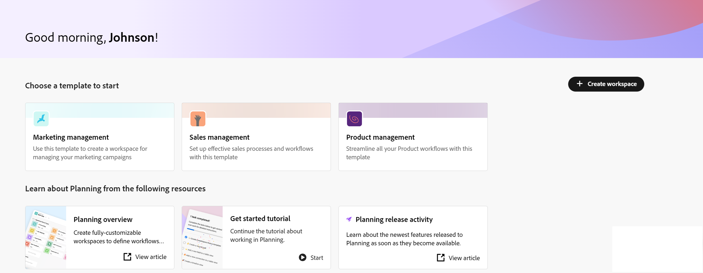
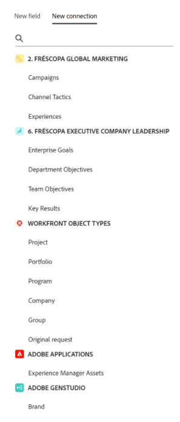

# Panoramica sulla terminologia di Workfront Planning

<!--do not use the snippet for IMPORTANT as it links to this article-->

<!--
The highlighted information on this page refers to functionality not yet generally available. It is available only in the Preview environment for all customers. After the release to Preview, the same features are also available monthly in the Production environment for customers who enabled fast releases.    

For information about fast releases, see [Enable or disable fast releases for your organization](/help/quicksilver/administration-and-setup/set-up-workfront/configure-system-defaults/enable-fast-release-process.md). 
-->

>[!IMPORTANT]
>
>Le informazioni contenute in questo articolo si riferiscono ad Adobe Workfront Planning. Workfront Planning è un prodotto standalone o una funzionalità acquistata in più da Adobe Workfront.
>
>
>Questo articolo contiene informazioni generali su Workfront Planning quando i clienti acquistano anche un pacchetto Workfront o Workflow.
>
>Per l&#39;elenco completo degli articoli che contengono la documentazione per Workfront Planning, vedere [Informazioni generali e indice degli articoli per Adobe Workfront Planning](/help/quicksilver/planning/planning-information.md).
>
>Per informazioni su Workfront Planning come prodotto autonomo, vedere [Introduzione ad Adobe Workfront Planning come prodotto autonomo](/help/quicksilver/planning/planning-sta/planning-sta-overview.md).

Sebbene la Pianificazione di Workfront faccia parte di Workfront, ha concetti e terminologia proprietari. Prima di iniziare la configurazione della Pianificazione di Workfront per la tua organizzazione, assicurati di conoscere questi concetti.

Il framework per la Pianificazione di Workfront è completamente personalizzabile. Puoi creare tutti i tipi di record, i relativi attributi e qualsiasi campo ad essi associato per rispondere alle esigenze specifiche della tua organizzazione.

Il numero di oggetti della Pianificazione di Workfront che è possibile creare è limitato. Per ulteriori informazioni, consulta [Panoramica delle limitazioni degli oggetti della Pianificazione di Adobe Workfront](/help/quicksilver/planning/general/limitations-overview.md).

Di seguito sono riportati gli oggetti e i concetti principali della Pianificazione di Workfront:

* [Aree di lavoro](#workspaces)
* [Tipi di record](#record-types)
* [Record](#records)
* [Modelli dell’area di lavoro](#workspace-templates)
* [Campi](#fields)
* [Tipi di record, record e campi collegati](#connected-record-types-records-and-fields)
* [Campi di ricerca](#lookup-fields)
* [Gerarchie](#hierarchies)
* [Viste](#views)
* [Automazioni](#automations)
* [Moduli di richiesta](#request-forms)

## Aree di lavoro

Le aree di lavoro rappresentano il framework di un’unità organizzativa. Si tratta di insiemi di tipi di record che definiscono il ciclo di vita operativo di una determinata organizzazione.

Per ulteriori informazioni, consulta [Creare aree di lavoro](/help/quicksilver/planning/architecture/create-workspaces.md).

## Tipi di record

I tipi di record sono i tipi di oggetto in Workfront Planning.

I tipi di record popolano le aree di lavoro.

A differenza di Workfront, dove i tipi di oggetto sono predefiniti, in Pianificazione di Workfront puoi creare i tuoi tipi di oggetto.

Ad esempio, in Workfront sono già stati creati i tipi di oggetto Programma, Portfolio, Progetto, Attività o Problema.

Nella Pianificazione di Workfront, puoi creare qualsiasi tipo di record che soddisfi i flussi di lavoro della tua organizzazione. Successivamente, puoi definire come i tipi di record si relazionano l’uno con l’altro o le dipendenze dei moduli.

Per ulteriori informazioni, consulta [Panoramica dei tipi di record](/help/quicksilver/planning/architecture/overview-of-record-types.md).

## Record

Un record è un&#39;istanza di un tipo di record.

Dopo aver aggiunto un tipo di record a un’area di lavoro, puoi iniziare ad aggiungere record di tale tipo nella pagina del tipo di record.

Ad esempio, “Campagna” può essere un tipo di record e “Campagna estiva per l’area EMEA” è un record del tipo di record Campagna.

Per ulteriori informazioni, consulta [Creare record](/help/quicksilver/planning/records/create-records.md).

## Modelli dell’area di lavoro

È possibile creare un&#39;area di lavoro utilizzando modelli predefiniti. Puoi utilizzare i tipi di record e i campi predefiniti inclusi in un modello oppure aggiungerne di personali.

La Pianificazione di Adobe Workfront contiene i seguenti modelli:

* Iniziativa operativa Studio
* Communications Planning Studio
* Base: Gestione del marketing
* Avanzato: Gestione del marketing
* Enterprise: Gestione del marketing
* Gestione vendite
* Gestione del prodotto

Gli amministratori di sistema possono inoltre installare 6 aree di lavoro quando utilizzano il modello multispazio basato sulle best practice. Il modello per più spazi contiene i seguenti modelli che generano contemporaneamente 6 aree di lavoro distinte ma collegate:

* 1.Classificazioni globali e tassonomie
* 2.Fréscopa Global Marketing
* 3.Marketing sociale Fréscopa
* 4.Fréscopa Media e PR
* 5.Eventi globali di Fréscopa
* 6.Leadership della società esecutiva Fréscopa

Per ulteriori informazioni, consulta i seguenti articoli:

* [Elenco dei modelli di area di lavoro](/help/quicksilver/planning/architecture/workspace-templates.md).
* [Crea aree di lavoro](/help/quicksilver/planning/architecture/create-workspaces.md).

## Campi

I campi sono attributi che è possibile aggiungere ai tipi di record. I campi contengono informazioni sul tipo di record.

Considerazioni sui campi dei record:

* I campi aggiunti per un tipo di record vengono automaticamente associati a tutti i record di quel tipo e possono essere utilizzati per acquisire dati su tali record.

* I campi vengono visualizzati come colonne nella visualizzazione Tabella applicata a una pagina del tipo di record. Vengono inoltre visualizzati nella pagina del record.

* I campi sono univoci per un tipo di record e non si trasferiscono da un tipo di record a un altro.

* I campi sono completamente personalizzabili e accessibili solo nella Pianificazione di Workfront. Non puoi accedere ai campi della Pianificazione di Workfront da Workfront.

Per ulteriori informazioni, consulta [Creare i campi](/help/quicksilver/planning/fields/create-fields.md).

Per impostazione predefinita, un nuovo tipo di record è associato ai seguenti campi predefiniti:

* Nome
* Descrizione
* Data di inizio
* Data di fine
* Stato

Puoi creare campi personalizzati dei seguenti tipi:

* Testo su riga singola
* Paragrafo
* Selezione multipla
* Selezione singola
* Data
* Numero
* Percentuale
* Valuta
* Casella di controllo
* Formula
* Persone
* Creato da
* Data di creazione
* Ultima modifica eseguita da
* Data ultima modifica
* Approvato da
* Data di approvazione
* ID record

<!--update the screen shot above-->

## Tipi di record, record e campi collegati

In Workfront Planning è possibile creare una connessione tra le seguenti entità:

* Due tipi di record della Pianificazione di Workfront.
* Un tipo di record e un progetto, programma, portfolio, società o tipo di oggetto di gruppo di Workfront.
* Un tipo di record e una risorsa o cartella di Adobe Experience Manager.

  Devi disporre di una licenza Adobe Experience Manager per collegare i tipi di record agli oggetti di Experience Manager.

  

* Un tipo di record e un brand di Adobe GenStudio for Performance Marketing.

  Devi disporre di una licenza di Adobe GenStudio for Performance Marketing per collegare i tipi di record ai brand GenStudio.

  

Dopo aver stabilito una connessione tra i tipi di record o tra i tipi di record e di oggetti, è possibile collegare tra loro singoli record o oggetti di tali tipi. La connessione tra i record viene visualizzata come campo record collegato o come connessione.

La connessione dei tipi di record è utile quando disponi di diversi tipi di oggetti di lavoro che si influenzano a vicenda. Ad esempio, potresti utilizzare le campagne e ciascuna campagna potrebbe gestire più brand. Per indicare questa relazione, puoi collegare le campagne ai brand. Inoltre, il lavoro per ciascuna campagna potrebbe essere pianificato in più progetti in Workfront. Per indicarlo, puoi collegare le campagne ai relativi progetti. Collegare i tipi di record e successivamente i singoli record consente di ottenere questa relazione nella Pianificazione di Workfront.

## Campi di ricerca

Dopo aver stabilito la connessione tra due tipi di record e aver collegato i singoli record, è possibile fare riferimento ai campi dei record collegati dal record da cui si sta effettuando la connessione.

Se ad esempio colleghi un tipo di record Campagna a un tipo di oggetto Progetto Workfront, puoi visualizzare il campo Budget dei progetti collegati nei record della campagna.

>[!TIP]
>
>* Non puoi aggiungere i seguenti tipi di campo come campi di ricerca dal record o dai tipi di oggetto collegati:
>
>   * Creato da
>   * Ultima modifica eseguita da
>   * Campi di digitazione di Workfront (inclusi campi come Proprietario del progetto o Sponsor del progetto)
>

Per informazioni sulla connessione di tipi di record, record e sulla creazione di campi collegati, consulta gli articoli seguenti:

* [Collegare tipi di record](/help/quicksilver/planning/architecture/connect-record-types.md)
* [Collegare i record](/help/quicksilver/planning/records/connect-records.md)

<!--
not yet:* Fields are reusable across Record Types.
-->

## Gerarchie

Dopo aver connesso i tipi di record all&#39;interno di un&#39;area di lavoro, è possibile creare gerarchie per organizzare tali connessioni. Le gerarchie organizzano i tipi di record e di oggetti in relazioni padre-figlio e possono contenere fino a quattro tipi di oggetti.

Se non esiste già una connessione tra due tipi di record, è possibile crearla durante l&#39;impostazione della gerarchia. Una volta definita, la gerarchia stabilisce un percorso strutturato tra tipi di record correlati all’interno dell’area di lavoro.

Le gerarchie generano breadcrumb per i rispettivi record visualizzati nelle intestazioni. In questo modo, gli utenti sanno dove si trovano nella gerarchia in qualsiasi fase del flusso di lavoro.

Per informazioni generali sulle gerarchie e sulle breadcrumb, vedere [Panoramica sulle gerarchie e sulle breadcrumb](/help/quicksilver/planning/architecture/hierarchy-and-breadcrumb-overview.md).

## Viste

I record vengono visualizzati nella rispettiva pagina del tipo di record in diversi tipi di visualizzazioni.

Le viste contengono impostazioni personalizzate di un tipo di vista specifico, ad esempio l’elenco di campi (colonne), un elenco di record (righe), il relativo ordine (ordinamento), un filtro applicato o applicabile e un raggruppamento.

Di seguito sono riportati i tipi di viste che puoi applicare alla pagina del tipo di record:

* **Vista tabella**: mostra i record e i relativi campi, inclusi i campi collegati e di ricerca, in un formato tabella. Le righe della tabella sono i singoli record e le colonne sono i campi dei record. La vista tabella è quella predefinita.

  

* **Vista timeline**: mostra i record che dispongono almeno di due campi di tipo Data in una timeline cronologica. Puoi visualizzare fino a 5 tipi di record collegati e i relativi record nella vista timeline.

  

* **Vista calendario**: mostra i record che dispongono almeno di due campi di tipo Data in un formato calendario.
  

<!--
add List view here when it's possible to display Planning RTs in it??
-->

Vista aggiuntiva:

* **Vista a elenco**: è possibile visualizzare gli oggetti in una vista a elenco nelle seguenti aree di Workfront Planning:

  * Progetti con pagine collegate.
  * Elenco moduli di richiesta

  

Per ulteriori informazioni, consulta [Gestire le viste dei record](/help/quicksilver/planning/views/manage-record-views.md).

## Automazioni

In Adobe Workfront Planning è possibile configurare automazioni che, se attivate, creano record in Workfront Planning quando attivate da un record di Planning. I record creati vengono automaticamente connessi ai record da cui si sta attivando l’automazione.

È possibile configurare e attivare l&#39;automazione nella pagina del tipo di record in Workfront Planning.

Ad esempio, puoi creare un’automazione che accetta una campagna di Workfront Planning e crea un marchio da associare alla campagna.

Per informazioni sulla modalità di creazione degli oggetti utilizzando un&#39;automazione esistente, vedere [Creare oggetti utilizzando le automazioni dei record di Adobe Workfront Planning](/help/quicksilver/planning/records/create-wf-objects-using-planning-automations.md).

## Moduli di richiesta

È possibile creare un modulo di richiesta e associarlo a un tipo di record in Adobe Workfront Planning. È quindi possibile condividere il modulo con altri utenti, che possono inviare richieste per creare record di quel tipo.

Per ulteriori informazioni, vedere [Creare e gestire un modulo di richiesta in Adobe Workfront Planning](/help/quicksilver/planning/requests/create-request-form.md).