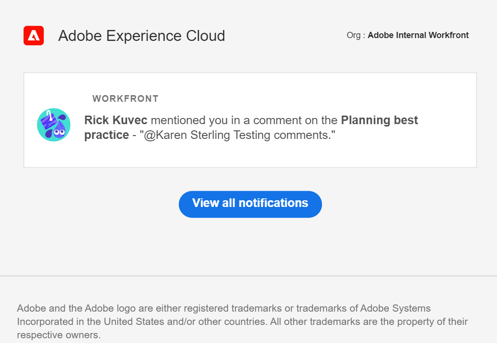

# Gestire le notifiche e-mail di Pianificazione di Adobe Workfront

<!--
The highlighted information on this page refers to functionality not yet generally available. It is available only in the Preview environment for all customers. After the release to Preview, the same features are also available monthly in the Production environment for customers who enabled fast releases.    

For information about fast releases, see [Enable or disable fast releases for your organization](/help/quicksilver/administration-and-setup/set-up-workfront/configure-system-defaults/enable-fast-release-process.md). 
-->

{{planning-important-intro}}

È possibile ricevere notifiche e-mail da Workfront Planning quando si verificano i seguenti scenari:

* Qualcuno assegna un tag a te o ai tuoi team in un commento record

  Per informazioni sull&#39;assegnazione di tag ad altri utenti in un commento record, vedere [Gestire i commenti record](/help/quicksilver/planning/records/manage-record-comments.md).
* Qualcuno richiede l&#39;autorizzazione per accedere a una vista, un&#39;area di lavoro, un tipo di record o un record
* Qualcuno conferma che l’accesso è stato concesso per una vista, un’area di lavoro, un tipo di record o un record
* Inviare una richiesta di Workfront Planning. Per informazioni, vedere [Creare e gestire un modulo di richiesta in Adobe Workfront Planning](/help/quicksilver/planning/requests/create-request-form.md)
* Qualcuno approva o rifiuta una richiesta di Workfront Planning inviata dall&#39;utente. Per informazioni, vedere [Approvare una richiesta in Adobe Workfront Planning](/help/quicksilver/planning/requests/approve-request.md)
* Lo stato viene modificato in una richiesta di Workfront Planning sottomessa.

## Requisiti di accesso

+++ Espandi per visualizzare i requisiti di accesso per la funzionalità in questo articolo. 

<table style="table-layout:auto"> 
<col> 
</col> 
<col> 
</col> 
<tbody> 
    <tr> 
<tr> 
</tr>   
<tr> 
   <td role="rowheader">
Pacchetto Adobe Workfront
</td> 
   <td> 

Qualsiasi pacchetto Workfront e Planning
 
Qualsiasi flusso di lavoro e qualsiasi pacchetto di Planning

Per ulteriori informazioni su ciò che è incluso in ogni pacchetto Workfront Planning, contattare il rappresentante del proprio account Workfront. 
 
   </td> 
  <tr> 
   <td role="rowheader">
Licenza di Adobe Workfront
</td> 
   <td>
Chiaro o superiore

   </td> 
  </tr> 
  <tr> 
   <td role="rowheader">
Autorizzazioni sugli oggetti
</td> 
   <td>   
Visualizza o autorizzazioni superiori per un'area di lavoro</a> 
  
   
Gli amministratori di sistema dispongono delle autorizzazioni per tutte le aree di lavoro, incluse quelle non create
 </td> 
  </tr> 
</tbody> 
</table>

Per ulteriori informazioni sui requisiti di accesso a Workfront, vedere [Requisiti di accesso nella documentazione di Workfront](/help/quicksilver/administration-and-setup/add-users/access-levels-and-object-permissions/access-level-requirements-in-documentation.md).

+++

<!--
OLD: 

<table style="table-layout:auto"> 
<col> 
</col> 
<col> 
</col> 
<tbody> 
    <tr> 
<tr> 
<td> 
   
 Products
 </td> 
   <td> 
   <ul><li>
 Adobe Workfront
</li> 
   <li>
 Adobe Workfront Planning
</li></ul></td> 
  </tr>   
<tr> 
   <td role="rowheader">
Adobe Workfront plan*
</td> 
   <td> 

Any of the following Workfront plans:
 
<ul><li>Select</li> 
<li>Prime</li> 
<li>Ultimate</li></ul> 

Workfront Planning is not available for legacy Workfront plans
 
   </td> 
<tr> 
   <td role="rowheader">
Adobe Workfront Planning package*
</td> 
   <td> 

Any 
 

For more information about what is included in each Workfront Planning plan, contact your Workfront account manager. 
 
   </td> 
 <tr> 
   <td role="rowheader">
Adobe Workfront platform
</td> 
   <td> 

Your organization's instance of Workfront must be onboarded to the Adobe Unified Experience.
 

The users in your organization receive notifications from Workfront Planning only when your organization is onboarded to the Adobe Unified Experience. 

For more information, see <a href="/help/quicksilver/workfront-basics/navigate-workfront/workfront-navigation/adobe-unified-experience.md">Adobe Unified Experience for Workfront</a>. 
 
   </td> 
   </tr> 
  </tr> 
  <tr> 
   <td role="rowheader">
Adobe Workfront license*
</td> 
   <td>
 Standard, Light, or Contributor

   
Workfront Planning is not available for legacy Workfront licenses
 
  </td> 
  </tr> 
  <tr> 
   <td role="rowheader">
Access level configuration
</td> 
   <td> 
There are no access level controls for Adobe Workfront Planning
   
</td> 
  </tr> 
<tr> 
   <td role="rowheader">
Object permissions
</td> 
   <td>   
View or higher permissions to a workspace</a> 
  
   
System Administrators have permissions to all workspaces, including the ones they did not create
 </td> 
  </tr> 
<tr>
   <td role="rowheader">
Layout template
</td>
   <td> Users with a Light or Contributor license must be assigned a layout template that includes Planning.
   
Standard users and System Administrators have the Planning areas enabled by default.

</li></ul>
  
</td>
  </tr>

</tbody> 
</table>
-->

## Gestisci le notifiche e-mail quando qualcuno ti assegna i tag in un commento

1. (Condizionale e facoltativo) Dopo che un utente ha aggiunto un tag a te o al tuo team in un commento di un record, vai alla notifica e-mail che ti informa del tag e del commento. Il mittente dell’e-mail è Adobe Experience Cloud.

   

1. (Facoltativo) Fai clic sul messaggio nella casella **Workfront** all&#39;interno dell&#39;e-mail.

   La pagina dei dettagli del record viene visualizzata in Workfront. È possibile aggiornare il record o rispondere al commento.

1. (Condizionale) Se disponibile, fare clic su **Visualizza tutte le notifiche**. <!--check with Lilit - do non-IMS users have this button??-->
La pagina **Notifiche** viene aperta in Adobe Experience Cloud. Vengono visualizzate tutte le notifiche provenienti da tutte le applicazioni Adobe Experience Cloud.

## Gestire le notifiche e-mail quando si richiedono e si concedono le autorizzazioni

1. (Condizionale e facoltativo) Dopo che qualcuno ti ha richiesto o concesso le autorizzazioni per accedere a un oggetto Planning, vai all’e-mail che ti informa della richiesta di autorizzazione. Il mittente dell’e-mail è Adobe Experience Cloud.

1. (Facoltativo) Fai clic sul messaggio nella casella **Workfront** all&#39;interno dell&#39;e-mail.

   L’oggetto per cui hai richiesto le autorizzazioni si apre in Workfront.

1. (Condizionale) Se disponibile, fare clic su **Visualizza tutte le notifiche**.
La pagina **Notifiche** viene aperta in Adobe Experience Cloud. Vengono visualizzate tutte le notifiche provenienti da tutte le applicazioni Adobe Experience Cloud.

Per informazioni sulla richiesta, la concessione o il rifiuto delle autorizzazioni, vedere [Richiedere le autorizzazioni per una visualizzazione o un&#39;area di lavoro](/help/quicksilver/planning/access/request-permissions.md).

Per informazioni sulla gestione delle notifiche di Workfront Planning, vedere [Gestione preferenze di notifica di Adobe Workfront Planning](/help/quicksilver/planning/notifications/manage-notification-preferences.md).

## Gestire le notifiche e-mail relative all&#39;invio, all&#39;approvazione o al rifiuto di richieste di Workfront Planning

1. (Facoltativo) Vai all’e-mail che Workfront ti invia dopo che hai inviato una richiesta o dopo che una richiesta che hai inviato è stata approvata o rifiutata. Il mittente dell’e-mail è Adobe Workfront.

1. (Facoltativo) Fai clic su **Apri richiesta**. Verrà aperta la richiesta in Workfront Planning.

1. Nell&#39;angolo superiore destro della richiesta, fare clic sul pulsante **Rivedi e approva**, quindi fare clic su una delle opzioni seguenti:

   * **Approva** per approvare la richiesta. Quando si approva una richiesta di Planning, viene creato un record.
   * **Rifiuta** per rifiutare la richiesta. Quando si rifiuta una richiesta in Workfront Planning, non viene creato alcun record. La richiesta viene salvata nell&#39;area Richieste con stato **Rifiutata**.

   

1. Fai clic sull&#39;icona **Notifiche**  nell&#39;angolo superiore destro della schermata per accedere alla pagina **Notifiche**.

   Per informazioni sulla gestione delle notifiche di Workfront Planning, vedere [Gestione preferenze di notifica di Adobe Workfront Planning](/help/quicksilver/planning/notifications/manage-notification-preferences.md).
