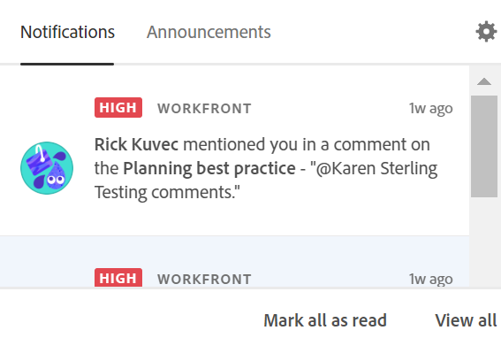

# Gestione delle notifiche in-app di Adobe Workfront Planning

{{planning-important-intro}}

È possibile ricevere notifiche in-app da Workfront Planning quando si verificano i seguenti scenari:

* Qualcuno assegna un tag a te o ai tuoi team in un commento record

  Per informazioni sull&#39;assegnazione di tag ad altri utenti in un commento record, vedere [Gestire i commenti record](/help/quicksilver/planning/records/manage-record-comments.md).
* Qualcuno richiede l’autorizzazione per accedere a una vista o a un’area di lavoro
* Qualcuno conferma che l&#39;accesso è stato concesso per una visualizzazione o un&#39;area di lavoro <!--Isk confirmed there is no notification for denying permissions - did not test-->

## Requisiti di accesso

+++ Espandere per visualizzare i requisiti di accesso.

<table style="table-layout:auto"> 
<col> 
</col> 
<col> 
</col> 
<tbody> 
    <tr> 
<tr> 
<td> 
   
 Prodotti
 </td> 
   <td> 
   <ul><li>
 Adobe Workfront
</li> 
   <li>
 Adobe Workfront Planning
</li></ul></td> 
  </tr>   
<tr> 
   <td role="rowheader">
Piano Adobe Workfront*
</td> 
   <td> 

Uno dei seguenti piani di Workfront:
 
<ul><li>Seleziona</li> 
<li>Prime</li> 
<li>Ultimate</li></ul> 

Workfront Planning non è disponibile per i piani Workfront legacy
 
   </td> 
<tr> 
   <td role="rowheader">
Pacchetto Adobe Workfront Planning*
</td> 
   <td> 

Qualsiasi 
 

Per ulteriori informazioni su quanto incluso in ogni piano di Workfront Planning, contattare l'account manager Workfront. 
 
   </td> 
 <tr> 
   <td role="rowheader">
Piattaforma Adobe Workfront
</td> 
   <td> 

L’istanza di Workfront della tua organizzazione deve essere integrata in Adobe Unified Experience.
 

Gli utenti dell’organizzazione ricevono notifiche da Workfront Planning solo quando l’organizzazione è integrata in Adobe Unified Experience. 

Per ulteriori informazioni, vedere <a href="/help/quicksilver/workfront-basics/navigate-workfront/workfront-navigation/adobe-unified-experience.md">Esperienza unificata Adobe per Workfront</a>. 
 
   </td> 
   </tr> 
  </tr> 
  <tr> 
   <td role="rowheader">
Licenza Adobe Workfront*
</td> 
   <td>
 Standard, Light o Contributor

   
Workfront Planning non è disponibile per le licenze Workfront legacy
 
  </td> 
  </tr> 
  <tr> 
   <td role="rowheader">
Configurazione del livello di accesso
</td> 
   <td> 
Nessun controllo del livello di accesso per Adobe Workfront Planning
   
</td> 
  </tr> 
<tr> 
   <td role="rowheader">
Autorizzazioni oggetto
</td> 
   <td>   
Visualizza o autorizzazioni superiori per un'area di lavoro</a> 
  
   
Gli amministratori di sistema dispongono delle autorizzazioni per tutte le aree di lavoro, incluse quelle non create
  </td> 
  </tr> 
<tr>
   <td role="rowheader">
Modello layout
</td>
   <td> Agli utenti con una licenza Light o Contributor deve essere assegnato un modello di layout che includa Planning.
   
Per impostazione predefinita, le aree Pianificazione sono attivate dagli utenti standard e dagli amministratori di sistema.

</li></ul>
</td>
  </tr>
</tbody> 
</table>

*Per ulteriori informazioni sui requisiti di accesso a Workfront, vedere [Requisiti di accesso nella documentazione di Workfront](/help/quicksilver/administration-and-setup/add-users/access-levels-and-object-permissions/access-level-requirements-in-documentation.md).

+++

<!--
OLD:

+++ Expand to view access requirements. 

<table style="table-layout:auto">
 <col>
 </col>
 <col>
 </col>
 <tbody>
    <tr>
<tr>
<td>
   
 Product
 </td>
   <td>
   
 Adobe Workfront
 
   
In order to receive notifications from Workfront Planning, your organization's instance of Workfront must be onboarded to the Adobe Unified Experience. For information, see <a href="/help/quicksilver/workfront-basics/navigate-workfront/workfront-navigation/adobe-unified-experience.md">Adobe Unified Experience for Workfront</a>.
</td>
  </tr>  
 <td role="rowheader">
Adobe Workfront agreement
</td>
   <td>

Your organization must be enrolled in the early access stage for Workfront Planning 

   </td>
  </tr>
  <tr>
   <td role="rowheader">
Adobe Workfront plan
</td>
   <td>

Any

   </td>
  </tr>
  <tr>
   <td role="rowheader">
Adobe Workfront license
</td>
   <td>
   
Any
 
  </td>
  </tr>
  
  <tr>
   <td role="rowheader">
Access level configuration
</td>
   <td> 
There are no access level controls in Workfront Planning. 
  
</td>
  </tr>
<tr>
   <td role="rowheader">
Permissions
</td>
   <td> 
View or higher permissions to a workspace</a> 
  
   
System Administrators have permissions to all workspaces, including the ones they did not create

</td>
  </tr>

<tr>
   <td role="rowheader">
Layout template
</td>
   <td> 
Your Workfront or group administrator must add the Planning area in your layout template. For information, see <a href="/help/quicksilver/planning/access/access-overview.md">Access overview</a>. 
  
</td>
  </tr>
 </tbody>
</table>

+++
-->

## Gestire le notifiche in-app quando qualcuno ti assegna i tag in un commento

1. (Condizionale) Dopo che un utente ha aggiunto un tag a te o ai tuoi team in un commento su un record, passa all&#39;icona **Notifiche** in-app  in Adobe Experience Cloud.

   

1. Fai clic sulla notifica.

   La pagina dei dettagli del record viene visualizzata in Workfront Planning. È possibile aggiornare il record o rispondere al commento.

1. (Facoltativo) Fai clic su **Segna tutto come letto** per indicare che hai letto tutte le notifiche.
1. (Facoltativo) Fai clic su **Visualizza tutto** per passare alla pagina **Notifiche** in Adobe Experience Cloud.

## Gestire le notifiche in-app quando si richiedono e si concedono le autorizzazioni

Ricevi notifiche in-app quando qualcuno ti richiede o ti concede autorizzazioni per una visualizzazione o un’area di lavoro.

Per informazioni sulla richiesta, la concessione o il rifiuto delle autorizzazioni per una visualizzazione o un&#39;area di lavoro, vedere [Richiedere le autorizzazioni per una visualizzazione o un&#39;area di lavoro](/help/quicksilver/planning/access/request-permissions.md).

Per informazioni sulla gestione delle notifiche di Workfront Planning, vedere [Gestione preferenze di notifica di Adobe Workfront Planning](/help/quicksilver/planning/notifications/manage-notification-preferences.md).
