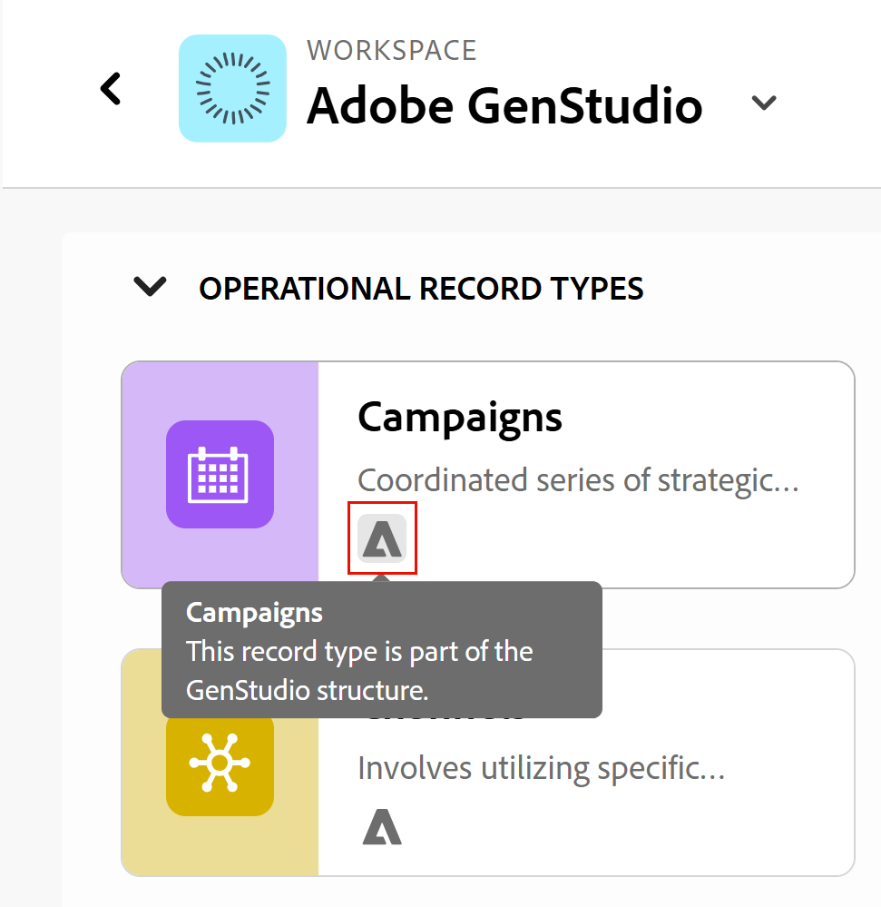

<!--Better metadata, at publishing:
---
title: Manage the GenStudio Workspace in Adobe Workfront Planning
description: The GenStudio for Performance Marketing workspace is available in Adobe Workfront Planning when your company has purchased both products and your instance of Workfront is integrated with your company's instance of GenStudio. You can view the GenStudio workspace from Planning and update information in both systems.
feature: Workfront Planning
role: User, Admin
author: Alina
recommendations: noDisplay, noCatalog
---
-->

<!--MUST update the access requirements below - not complete!!!!!!!!!-->

# Gestire l’area di lavoro di GenStudio in Adobe Workfront Planning

<!--The information on this page refers to functionality not yet generally available. It is available only in the Preview environment for all customers. After the monthly releases to Production, the same features are also available in the Production environment for customers who enabled fast releases.    

For information about fast releases, see [Enable or disable fast releases for your organization](/help/quicksilver/administration-and-setup/set-up-workfront/configure-system-defaults/enable-fast-release-process.md). -->

L’area di lavoro Adobe GenStudio for Performance Marketing è disponibile in Adobe Workfront Planning quando la tua azienda ha acquistato entrambi i prodotti e l’istanza di Workfront è integrata con l’istanza aziendale di GenStudio.

È possibile visualizzare l&#39;area di lavoro di GenStudio da Planning e aggiornare le informazioni in entrambi i sistemi.

Per informazioni sull&#39;utilizzo e la gestione dell&#39;area di lavoro di GenStudio da GenStudio Performance Marketing, vedere [Guida utente di Adobe GenStudio for Performance Marketing](https://experienceleague.adobe.com/it/docs/genstudio-for-performance-marketing/user-guide/home).

Per informazioni generali sull&#39;integrazione tra GenStudio e Workfront Planning, vedere [Introduzione all&#39;integrazione tra Adobe Workfront Planning e Adobe GenStudio for Performance Marketing](/help/quicksilver/planning/planning-and-genstudio-integration/get-started-with-workfront-planning-and-genstudio-integration.md).

>[!IMPORTANT]
>
>I passaggi descritti in questo articolo illustrano come aggiornare l&#39;area di lavoro di GenStudio da Workfront Planning quando si dispone delle autorizzazioni di gestione.
>&#x200B;> Non tutte le funzionalità sono disponibili quando si dispone delle autorizzazioni Contribute per l&#39;area di lavoro di GenStudio.
>
>Se la società dispone di più istanze di Workfront, tutti gli utenti ottengono le autorizzazioni Contribute nell&#39;area di lavoro di GenStudio in Workfront Planning.

## Requisiti di accesso

+++ Espandi per visualizzare i requisiti di accesso per la funzionalità in questo articolo. 

<table style="table-layout:auto"> 
<col> 
</col> 
<col> 
</col> 
<tbody> 
    <tr> 
    <td role="rowheader">
Pacchetto Adobe Workfront
</td> 
   <td> 

Qualsiasi pacchetto Workfront

Qualsiasi pacchetto Planning

</td> </tr>
   <tr> 
<td> 
   
 Prodotti aggiuntivi
 </td> 
   <td> 
   
 Adobe GenStudio for Performance Marketing
</td> 
  </tr>
  <tr> 
   <td role="rowheader">
Licenza Adobe Workfront
</td> 
   <td>
 Standard

  </td> 
  </tr>

<tr> 
   <td role="rowheader">
Ruoli utente di Adobe GenStudio for Performance Marketing
</td> 
   <td>
<ul><li>Qualsiasi ruolo utente di GenStudio per accedere a Campagne, Prodotti e Utenti tipo</li>
   <li>GenSudio System Manager per accedere alle attivazioni <!--and Events--></li></ul>
   Per informazioni, vedere <a href="https://experienceleague.adobe.com/it/docs/genstudio-for-performance-marketing/user-guide/intro/user-roles">Ruoli utente e autorizzazioni</a>. 
   

  </td> 
  </tr>   
<tr> 
   <td role="rowheader">
Autorizzazioni oggetto
</td> 
   <td>  
   
In Workfront Planning: 

   <ul>
   <li>
Gestisci le autorizzazioni per l’area di lavoro di GenStudio per aggiungere nuovi campi o tipi di record all’area di lavoro di GenStudio
</li>
   <li>
Autorizzazioni di Contribute all'area di lavoro di GenStudio per aggiungere, aggiornare o eliminare record nell'area di lavoro di GenStudio
 </li>  
   </ul>
   
Nessun utente può rimuovere tipi di record o campi GenStudio for Performance Marketing dall'area di lavoro di GenStudio in Workfront Planning

   
In Adobe GenStudio for Performance Marketing: 

   <ul>
   <li>
 Qualsiasi autorizzazione in Adobe GenStudio for Performance Marketing
</li>
   <li>
 Creare le autorizzazioni in Adobe GenStudio for Performance Marketing per creare elementi
</li></ul>
   </td> 
  </tr> 
</tbody> 
</table>

Per informazioni sull&#39;accesso ad Adobe Workfront Planning, vedere [Panoramica dell&#39;accesso ad Adobe Workfront Planning](/help/quicksilver/planning/access/access-overview.md).

Per ulteriori informazioni su Adobe GenStudio for Performance Marketing, consulta [Guida utente di Adobe GenStudio for Performance Marketing](https://experienceleague.adobe.com/it/docs/genstudio-for-performance-marketing/user-guide/home).

+++   

## Considerazioni sulla gestione di un&#39;area di lavoro GenStudio in Workfront Planning

* Prima di poter visualizzare un&#39;area di lavoro GenStudio in Workfront Planning, è necessario acquistare Adobe GenStudio for Performance Marketing.

* A seconda del numero di istanze di Workfront dell&#39;organizzazione, si dispone automaticamente delle seguenti autorizzazioni per l&#39;area di lavoro di GenStudio in Planning:

  <!--this table is also in the Get started article-->

  <table style="table-layout:auto"> 
   <col> 
   </col> 
   <col> 
   </col> 
   <tbody> 
      <tr> 
      <td role="rowheader">
Un’istanza di Workfront
</td> 
      <td> 
   
L'area di lavoro di GenStudio è visibile nell'istanza di Workfront Planning

   
Gli amministratori di Workfront dispongono delle autorizzazioni di gestione per l'area di lavoro di GenStudio in Planning

   
Tutti gli altri utenti dispongono dell'accesso Contribute all'area di lavoro di GenStudio in Planning

   </td> </tr>
      <tr> 
   <td> 
      
 Più istanze di Workfront
 </td> 
      <td> 
      
L’area di lavoro di GenStudio è visibile da tutte le istanze di Workfront

   
Tutti gli utenti con accesso a GenStudio for Performance Marketing e Workfront Planning dispongono delle autorizzazioni Contribute per GenStudio in Planning
 </td> 
   </tr>
      </tbody> 
   </table>

* L&#39;aggiornamento della configurazione dell&#39;area di lavoro, dei tipi di record, delle visualizzazioni e dei campi per un&#39;area di lavoro di GenStudio è identico all&#39;aggiornamento di un&#39;area di lavoro di Workfront Planning con i relativi elementi.

<!--
## Manage GenStudio workspace from Workfront Planning

CAN YOU DO THIS?? 
- OPTIONS FROM THE WORKSPACE CARD ??
- OPTIONS FROM THE MORE MENU ON A WORKSPACE ??
-->

## Gestione dell&#39;area di lavoro di GenStudio da Workfront Planning

>[!NOTE]
>
>Prima di gestire l&#39;area di lavoro di GenStudio, vedere l&#39;articolo [Introduzione all&#39;integrazione di Workfront Planning e GenStudio for Performance Marketing](/help/quicksilver/planning/planning-and-genstudio-integration/get-started-with-workfront-planning-and-genstudio-integration.md) per ulteriori informazioni.
>

1. Accedi a Workfront come utente che ha anche accesso a GenStudio.
1. Fai clic sull&#39;icona **[!UICONTROL Main Menu]**  nell&#39;angolo superiore sinistro, quindi fai clic su **[!UICONTROL Planning]**.

   Viene visualizzata la pagina principale di Workfront Planning.

1. Fai clic su **Altre aree di lavoro** e trova un&#39;area di lavoro con un&#39;indicazione creata dal **sistema** e con il tag **GenStudio** sulla relativa scheda.

   

1. Fare clic sulla **scheda dell&#39;area di lavoro GenStudio** per aprire l&#39;area di lavoro GenStudio in Workfront Planning.
1. Per impostazione predefinita, in Workfront Planning vengono creati e visualizzati i seguenti tipi di record di GenStudio:

   * Campagne
   * Prodotti
   * Persone
   * Attivazioni
   * Canali
   * Aree geografiche

   Nella scheda del tipo di record di GenStudio è presente un&#39;indicazione del fatto che sono stati originariamente creati in GenStudio.

   <!--check screen shot-->

   

1. Fai clic sul menu **Altro**  a destra del nome dell&#39;area di lavoro, quindi fai clic su una delle seguenti opzioni:

   * **Modifica**

     Per informazioni, vedere [Modifica aree di lavoro](/help/quicksilver/planning/architecture/edit-workspaces.md).
     <!--* **Delete** - this will generate an error message, per Iskuhi, so don't document as an option/ possibility-->

     <!--For information, see [Delete workspaces](/help/quicksilver/planning/architecture/delete-workspaces.md). -->

1. Fai clic su **Condividi** nell&#39;angolo superiore destro per condividere l&#39;area di lavoro con altri.

   Per informazioni, vedere [Condividi aree di lavoro](/help/quicksilver/planning/access/share-workspaces.md)

1. Fare clic su una delle schede dei tipi di record per visualizzare i record di quel tipo.

   Per gestire il tipo di record, le visualizzazioni e i campi, vedere la sezione [Gestione dei tipi di record di GenStudio da Workfront Planning](#manage-genstudio-record-types-from-workfront-planning) in questo articolo.

## Gestire tipi di record, visualizzazioni e record dall&#39;area di lavoro di GenStudio in Workfront Planning

>[!NOTE]
>
>Prima di gestire l&#39;area di lavoro di GenStudio, vedere l&#39;articolo [Introduzione all&#39;integrazione di Workfront Planning e GenStudio for Performance Marketing](/help/quicksilver/planning/planning-and-genstudio-integration/get-started-with-workfront-planning-and-genstudio-integration.md) per ulteriori informazioni.
>

1. Passare all&#39;area di lavoro di GenStudio in Workfront Planning e aprire una pagina del tipo di record, come descritto nella sezione [Gestione dell&#39;area di lavoro di GenStudio da Workfront Planning](#manage-the-genstudio-workspace-from-workfront-planning) in questo articolo.

1. Fai clic sul menu **Altro**  a destra del nome di un tipo di record, quindi fai clic su una delle seguenti opzioni:

   * **Modifica**

     Per informazioni, vedere [Modifica tipi di record](/help/quicksilver/planning/architecture/edit-record-types.md).
   * **Gestione automazioni**

     Per informazioni, vedere [Configurare le automazioni di Adobe Workfront Planning](/help/quicksilver/planning/records/configure-automations-to-create-records.md).
   * **Gestire i moduli di richiesta**

     Puoi creare più moduli di richiesta. I moduli di richiesta saranno disponibili nell’area Richieste di Workfront e puoi anche condividerli pubblicamente o con un collegamento.

     Per informazioni, vedere [Creare e gestire un modulo di richiesta in Adobe Workfront Planning](/help/quicksilver/planning/requests/create-request-form.md).

1. Per condividere una visualizzazione o il tipo di record, eseguire le operazioni seguenti:

   * Fai clic su **Condividi** nell&#39;angolo superiore destro della pagina del tipo di record, quindi fai clic su una delle seguenti opzioni:
      * **Condividi il tipo di record**
Per informazioni, vedere [Condividi tipi di record](/help/quicksilver/planning/access/share-record-types.md).
      * **Condividi la visualizzazione corrente**
Per informazioni, vedere [Condividi visualizzazioni](/help/quicksilver/planning/access/share-views.md).
      * **Copia collegamento visualizzazione**
Un collegamento alla visualizzazione viene copiato negli Appunti.
      * **Esporta la visualizzazione corrente**
Per informazioni, vedere [Esportare i record dalla vista tabella](/help/quicksilver/planning/records/export-records-from-the-table-view.md).

1. Per gestire le visualizzazioni del tipo di record, effettuare le seguenti operazioni:

   * Fare clic su **+ Visualizza** per creare una visualizzazione per il tipo di record GenStudio.

     Per informazioni, vedere [Gestire le visualizzazioni dei record](/help/quicksilver/planning/views/manage-record-views.md).

   * Fai clic sull&#39;icona **Schermo intero**  per aprire qualsiasi visualizzazione in modalità a schermo intero.

   * Gestisci gli elementi di una visualizzazione da qualsiasi visualizzazione.

     È ad esempio possibile modificare il filtro, i raggruppamenti, l&#39;ordinamento e le impostazioni di una visualizzazione, se disponibili.

     Per informazioni, vedere [Gestire le visualizzazioni dei record](/help/quicksilver/planning/views/manage-record-views.md).

1. Per aggiungere record, eseguire una delle operazioni seguenti:

   * Fai clic su **Nuovo record** da qualsiasi visualizzazione per creare record da zero

   * Importare record utilizzando un file Excel o CSV nella vista a tabella

   * Per aggiungere record, fai clic in un punto qualsiasi della timeline o delle visualizzazioni del calendario.

     Per informazioni, vedere [Creare record](/help/quicksilver/planning/records/create-records.md).

     I record sono visibili sia da Workfront che da GenStudio.

     >[!NOTE]
     >
     >Non è possibile aggiungere record per il tipo di record Attivazioni.

1. Per modificare i record, effettuare una delle seguenti operazioni:

   * Modifica record in linea dalla vista tabella

   * Fare clic su un record da qualsiasi visualizzazione per aprire la relativa pagina dei dettagli.

     Per informazioni, vedere [Modifica record](/help/quicksilver/planning/records/edit-records.md).

     Le modifiche apportate dall&#39;area di lavoro di GenStudio in Planning sono immediatamente visibili da GenStudio.

1. Selezionare un record nella vista tabella, quindi fare clic su **Elimina**.

   Per informazioni, vedere [Elimina record](/help/quicksilver/planning/records/delete-records.md).

   I record eliminati vengono rimossi immediatamente da GenStudio.

   >[!TIP]
   >
   >I record eliminati possono essere recuperati dalla vista tabella Cestino eliminato di recente in Workfront Planning. I record eliminati da GenStudio possono essere recuperati anche dal contenitore Eliminato di recente in Workfront Planning.

   Per informazioni, vedere [Ripristinare i record eliminati](/help/quicksilver/planning/records/restore-deleted-records.md)

1. Fai clic sull’icona + nell’angolo superiore destro della vista tabella per creare quanto segue:

   * Campi record

     Per informazioni, vedere [Creare i campi](/help/quicksilver/planning/fields/create-fields.md)

   * Registra connessioni

     Per informazioni, vedere [Connetti tipi di record](/help/quicksilver/planning/architecture/connect-record-types.md)

     I campi creati dall’area di lavoro di GenStudio sono visibili nelle seguenti aree:

      * Visualizzazioni di Workfront Planning
      * Dettagli record di Workfront Planning
      * Dettagli record GenStudio

     >[!TIP]
     >
     >I campi creati in Workfront Planning non sono visibili nella vista a elenco in GenStudio.

1. Passa il puntatore del mouse su un campo nella vista a tabella, quindi fai clic sul menu a discesa per effettuare una delle seguenti operazioni:

   * Ordina per
   * Nascondi
   * Modifica le impostazioni
     <!--* Delete it - not possible now, per Iskuhi; the link is there but it will generate an error-->

     <!--GenStudio-native fields are note removed from GenStudio. -->

     >[!NOTE]
     >
     >Puoi modificare la configurazione di un campo e aggiungere altri campi solo se disponi delle autorizzazioni di gestione in GenStudio.

