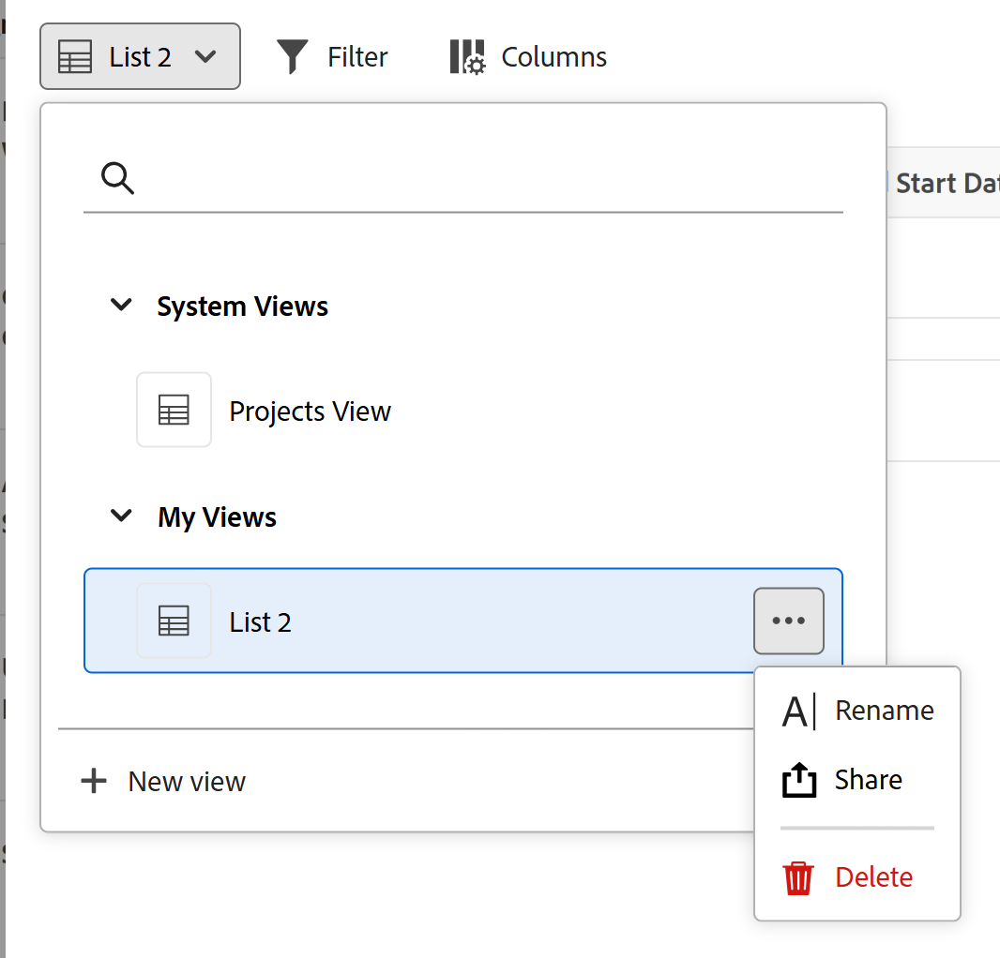

# Aggiungere una pagina Record connessi a un record

<!--
The highlighted information on this page refers to functionality not yet generally available. It is available only in the Preview environment for all customers. After the monthly releases to Production, the same features are also available in the Production environment for customers who enabled fast releases.    

For information about fast releases, see [Enable or disable fast releases for your organization](/help/quicksilver/administration-and-setup/set-up-workfront/configure-system-defaults/enable-fast-release-process.md). 
-->

È possibile visualizzare informazioni da record o oggetti connessi aggiungendo una scheda per una pagina Record connessi a un record in Adobe Workfront Planning. In questo modo i record connessi in una vista tabella vengono aggiunti alla scheda.

Quando si aggiunge una pagina Record connessi a un record, tenere presente quanto segue:

* È possibile aggiungere una pagina Record collegati a un record dopo aver connesso tipi di record o di oggetti al tipo di record dalla relativa vista tabella.

* È possibile aggiungere una pagina Record collegati dall&#39;area di anteprima di un record o dalla pagina del record.

* È possibile disporre di una sola pagina di record connessi per un tipo di record specifico.

  Ad esempio, se crei una pagina di record connessi per una campagna e desideri visualizzarne gli utenti tipo collegati, puoi avere una sola pagina di record connessi per gli utenti tipo.

* Nelle pagine Record collegati vengono visualizzati solo gli oggetti o i record collegati di un oggetto o di un tipo di record. Nella pagina non vengono visualizzati tutti i record di quel tipo.

* A seconda dell&#39;oggetto o del tipo di record visualizzato nella pagina record connessi, è possibile visualizzarli utilizzando le visualizzazioni seguenti:

   * È possibile visualizzare i record di Planning connessi nei seguenti tipi di viste:
      * Tabella
      * Timeline
      * Calendario
   * È possibile visualizzare i progetti Workfront connessi in una vista a elenco.

* È possibile aggiungere pagine Record collegati per i tipi di oggetto o record connessi seguenti:

   * Tipi di record di Workfront Planning
   * Progetti Workfront

     Puoi visualizzare i progetti Workfront collegati anche se non disponi delle autorizzazioni necessarie per accedervi in Workfront.

## Requisiti di accesso

+++ Espandi per visualizzare i requisiti di accesso per la funzionalità in questo articolo. 

<table style="table-layout:auto"> 
<col> 
</col> 
<col> 
</col> 
<tbody> 
    <tr> 
<tr> 
</tr>   
<tr> 
   <td role="rowheader">
Pacchetto Adobe Workfront
</td> 
   <td> 

Qualsiasi pacchetto Workfront e Planning

Qualsiasi flusso di lavoro e qualsiasi pacchetto di Planning

Per ulteriori informazioni su ciò che è incluso in ogni pacchetto Workfront Planning, contattare il rappresentante del proprio account Workfront. 
 
   </td> 
<tr>
<td> 
   
 Prodotti aggiuntivi
 </td> 
   <td> 
   
 Oltre ad Adobe Workfront, per aggiungere una pagina di record connessa per gli oggetti delle seguenti applicazioni è necessario disporre dei seguenti elementi:

   <ul><li>
Una licenza Adobe Experience Manager e un’integrazione tra Adobe Experience Manager e Workfront per collegare oggetti AEM con tipi di record Planning.

   
Per informazioni, consulta <a href="/help/quicksilver/documents/adobe-workfront-for-experience-manager-assets-essentials/workfront-for-aem-asset-essentials.md">Adobe Workfront for Experience Manager Assets and Assets Essentials: article index</a>. 
</li>
   <li>
 Una licenza Adobe GenStudio for Performance Marketing per collegare i tipi di record ai marchi GenStudio

   
Per informazioni, vedere <a href="https://experienceleague.adobe.com/en/docs/genstudio-for-performance-marketing/user-guide/get-started">Introduzione ad Adobe GenStudio for Performance Marketing</a>.
</li></ul>
   </td> 
  </tr>

<tr> 
   <td role="rowheader">
Licenza di Adobe Workfront
</td> 
   <td>
Standard

   </td> 
  </tr> 
  <tr>
   <td role="rowheader">
Autorizzazioni sugli oggetti
</td>
   <td>
   
Contribuire o concedere autorizzazioni superiori a un’area di lavoro e a un tipo di record 
  
   
Gli amministratori di sistema dispongono delle autorizzazioni per tutte le aree di lavoro, incluse quelle non create
 
  </td>
  </tr>   
</tbody> 
</table>

Per ulteriori informazioni sui requisiti di accesso a Workfront, vedere [Requisiti di accesso nella documentazione di Workfront](/help/quicksilver/administration-and-setup/add-users/access-levels-and-object-permissions/access-level-requirements-in-documentation.md).

+++   

## Aggiungere una pagina Record connessi a un record

Prima di aggiungere una pagina record connessa a un record, è necessario collegare i tipi di record ad altri tipi di record o progetti Workfront.

1. Fare clic sul nome del record per aprirlo da qualsiasi visualizzazione di una pagina del tipo di record.
1. Fare clic su **Aggiungi pagina** da una delle seguenti aree:

   * Finestra di anteprima del record
   * Pagina dei dettagli del record, dopo aver fatto clic sull&#39;icona **Apri in una nuova scheda**  nell&#39;angolo superiore destro della pagina di anteprima.

   Viene visualizzata la casella **Crea pagina**.

   

1. Aggiungi **Nome pagina**, fai clic su **Pagina record connessi** per il **Tipo pagina**, quindi fai clic su **Crea**.
1. (Facoltativo) Fare clic sul nome di un record o di un tipo di oggetto connesso nell&#39;elenco oppure cercarlo, quindi fare clic su di esso quando viene visualizzato nell&#39;elenco per creare la pagina per il record o il tipo di oggetto.

   >[!TIP]
   >
   >È possibile creare una pagina di record connessi per tipo di record. Se un tipo di record connesso dispone già di una pagina, non viene più visualizzato come opzione.
   >

1. (Facoltativo e condizionale) Se più campi collegati del record o del tipo di oggetto per cui si sta creando la pagina vengono visualizzati, fare clic sul campo di cui si desidera visualizzare i record o gli oggetti nella pagina dei record connessi dall&#39;elenco **Seleziona campo di riferimento**.

   

   Alla pagina dei record connessi viene aggiunta una delle pagine seguenti:

   * Visualizzazione tabella di un tipo di record
   * Visualizzazione elenco di un tipo di oggetto progetto

   I record o i progetti connessi al record corrente vengono visualizzati nella vista a tabella o a elenco.

   >[!TIP]
   >
   >È necessario aggiungere i record connessi nella tabella o nell&#39;area Dettagli di un record prima di visualizzarli in una pagina dei record connessi. In caso contrario, la tabella o l&#39;elenco sono vuoti.

   I primi cinque campi dei record connessi vengono visualizzati per impostazione predefinita. Per impostazione predefinita, non viene visualizzato alcun campo di ricerca.

   

1. (Condizionale) A seconda del tipo di record visualizzato nella pagina record connesso, eseguire una delle operazioni seguenti:

   * Gestisci record di Planning
Per informazioni, vedere la sezione [Gestire la pagina dei record connessi per i record di Planning](#manage-the-connected-records-page-for-planning-records) in questo articolo.
   * Gestire i progetti Workfront
Per informazioni, vedere la sezione [Gestire la pagina dei record connessi per i progetti Workfront](#manage-the-connected-records-page-for-workfront-projects) in questo articolo.

1. (Facoltativo) Fare doppio clic sul nome della scheda **Record connessi**

   Oppure

   Passa il puntatore del mouse sul nome della scheda, quindi fai clic su **Altro** , quindi fai clic su **Rinomina** per rinominare la scheda della pagina dei nuovi record connessi.

1. (Facoltativo) Passa il puntatore del mouse sul nome della scheda della pagina dei record connessi, fai clic su **Altro** , quindi fai clic su **Elimina** per rimuoverlo dalla scheda.

### Gestione della pagina dei record connessi per i record di Planning

<!--

#### Manage the connected records page for Planning records in the Production environment

When you create a connected records page for  connected Planning records in the Production environment, do the following: (****or AEM Assets - AEM is not available yet?? see note below********)

1. Go to a record type page and click the name of a record. This opens the record's preview page.
1. Click the tab for a connected records page that display Planning records.
   The records connected to the record you selected display in the table view. 
1. Click **Connect** at the bottom of the table view to connect existing records, select them from the connection box, then click outside the box to close it. The records are automatically added to the table and connected to the record you selected. The records must exist before you can add them.

   For more information, see [Connect records](/help/quicksilver/planning/records/connect-records.md).

1. Edit any information from the connected records inline in the table view. 
1. Hover over a connected record's name, then click the **More** menu 

   Or 
   
   Select one of the records, then click one of the following options in the blue bar at the bottom of the list: 

   * **View** to open the record page in a new tab
   * **Copy link** to copy a link to the record page
   * **Edit thumbnail** to open the **Record thumbnail** box and edit the record's thumbnail image
   * **Duplicate** to duplicate the connected record. The duplicated record is also connected to the current record.
   * **Insert record above or below** to add new records to the connected record type. New records added here are also connected to the current record. This option is not available in the blue bar when selecting a record in the table.
   * **Delete** to delete the record. Deleting a connected record deletes it from its record type and from everywhere where the record is connected. The deleted records move to the **Recently deleted** bin of their record type.

      For information about editing records in the table view, see [Edit records](/help/quicksilver/planning/records/edit-records.md). 

      >[!TIP]
      >
      >You can select more than one record or object to delete them.
      >

1. Inline edit any of the records in the table on the connected records page.
1. Use any of the following view elements in the toolbar of a connected record page to manage the table view:

   * **Filters**
   * **Sort**
   * **Grouping**
   * **Fields**, to display, hide, or rearrange fields
   * **Row height**
   * **Search**

   For information, see [Manage the table view](/help/quicksilver/planning/views/manage-the-table-view.md). 

   >[!NOTE]
   >
   >You cannot create, edit, or delete fields in the table view of a connected record's tab.
   >

#### Manage the connected records page for Planning records in the Preview environment

When you create a connected records page for connected Planning records in the Preview environment, do the following: (***********or AEM Assets -- AEM is not available yet?? see note below**********)

-->

1. Passare a una pagina del tipo di record e fare clic sul nome di un record. Verrà aperta la pagina di anteprima del record.
1. Fare clic sulla scheda di una pagina di record connessi in cui vengono visualizzati i record di Planning.
I record collegati al record selezionato vengono visualizzati nella vista tabella.
1. Fare clic su **Connetti record** nell&#39;angolo superiore destro della pagina dei record connessi per connettere i record esistenti, selezionarli dalla casella di connessione, quindi fare clic all&#39;esterno della casella per chiuderla. I record vengono aggiunti automaticamente alla tabella e collegati al record selezionato. I record devono esistere prima di poterli aggiungere.

   Per ulteriori informazioni, vedere [Connetti record](/help/quicksilver/planning/records/connect-records.md).

1. Fai clic su **Nuova riga** nella parte inferiore della tabella per aggiungere nuovi record. I nuovi record vengono automaticamente connessi ai record selezionati.
1. Modificare le informazioni dei record collegati in linea nella vista tabella.
1. Passa il puntatore del mouse sul nome di un record connesso, quindi fai clic sul menu **Altro** 

   Oppure

   Selezionare uno dei record, quindi fare clic su una delle opzioni seguenti nella barra blu nella parte inferiore dell&#39;elenco:

   * **Visualizza** per aprire la pagina record in una nuova scheda
   * **Copia collegamento** per copiare un collegamento nella pagina record
   * **Modifica miniatura** per aprire la casella **Miniatura record** e modificare l&#39;immagine miniatura del record
   * **Duplicato** per duplicare il record connesso. Il record duplicato è anche collegato al record corrente.
   * **Inserire un record superiore o inferiore** per aggiungere nuovi record al tipo di record connesso. Anche i nuovi record aggiunti qui sono collegati al record corrente. Questa opzione non è disponibile nella barra blu quando si seleziona un record nella tabella.
   * **Elimina** per eliminare il record. Se si elimina un record connesso, questo viene eliminato dal relativo tipo di record e da qualsiasi posizione in cui il record è connesso. I record eliminati vengono spostati nel contenitore **Eliminati di recente** del relativo tipo di record.

     Per informazioni sulla modifica dei record nella vista tabella, vedere [Modifica record](/help/quicksilver/planning/records/edit-records.md).

     >[!TIP]
     >
     >È possibile selezionare più record o oggetti per eliminarli.

1. Modifica in linea qualsiasi record della tabella nella pagina dei record connessi.
1. Utilizzare uno degli elementi di visualizzazione riportati di seguito nella barra degli strumenti di una pagina di record connessa per gestire la visualizzazione tabella.

   * **Filtri**
   * **Ordina**
   * **Raggruppamento**
   * **Campi**, per visualizzare, nascondere o ridisporre i campi
   * **Altezza riga**
   * **Ricerca**

   Per informazioni, vedere [Gestire la visualizzazione della tabella](/help/quicksilver/planning/views/manage-the-table-view.md).

   >[!NOTE]
   >
   >Non è possibile creare, modificare o eliminare campi nella visualizzazione per tabella della scheda di un record connesso.
   >

1. Fare clic sul menu a discesa delle visualizzazioni nell&#39;angolo superiore destro della pagina dei record connessi e fare clic su **Nuova visualizzazione** per aggiungere una nuova visualizzazione alla pagina, quindi eseguire le operazioni seguenti:

   1. Aggiungi **Nome visualizzazione**.
   1. Nell&#39;area **Tipo di visualizzazione** selezionare uno dei tipi di visualizzazione seguenti:

      * Tabella
Per informazioni, vedere [Gestire la visualizzazione della tabella](/help/quicksilver/planning/views/manage-the-table-view.md)
      * Timeline
Per informazioni, vedere [Gestire la visualizzazione della sequenza temporale](/help/quicksilver/planning/views/manage-the-timeline-view.md).
      * Calendario
Per informazioni, vedere [Gestire la visualizzazione del calendario](/help/quicksilver/planning/views/manage-the-calendar-view.md).

        Per ulteriori informazioni, vedere la sezione [Gestire più visualizzazioni dalla pagina dei record connessi](#manage-multiple-views-from-the-connected-records-page) in questo articolo.

   1. Fai clic su **Crea**.
Una nuova vista viene aggiunta al menu a discesa delle viste.

   1. (Facoltativo) Passa il puntatore del mouse sul nome di una visualizzazione creata, fai clic sul menu **Altro** , quindi fai clic su una delle seguenti opzioni:

      * **Rinomina**, per aggiungere un nuovo nome alla visualizzazione.
      * **Condividi**

        Per ulteriori informazioni, vedere [Condividi visualizzazioni](/help/quicksilver/planning/access/share-views.md).
      * **Esporta**

      * **Elimina**
Per informazioni, vedere [Eliminare le visualizzazioni dei record](/help/quicksilver/planning/views/delete-record-views.md).

        

        >[!NOTE]
        >
        >Non è possibile eliminare una visualizzazione Sistema creata da Workfront.

### Gestione della pagina dei record collegati per i progetti Workfront

Quando si crea una pagina record connessi per progetti Workfront connessi, eseguire le operazioni seguenti per gestire la pagina:

1. Passare a una pagina del tipo di record e fare clic sul nome di un record. Verrà aperta la pagina di anteprima del record.
1. Fare clic sulla scheda di una pagina relativa ai record connessi in cui sono visualizzati i progetti Workfront.

   

   I progetti connessi al record selezionato vengono visualizzati nella vista a elenco.

   Per informazioni sulla gestione o la modifica degli oggetti nella visualizzazione elenco, vedere [Gestire la visualizzazione elenco](/help/quicksilver/planning/views/manage-the-list-view.md).

<!-- 
removed this part, so we won't have to have duplicate information to keep up with for the list view in Planning: 
1. Click **Connect records** in the upper-right corner of the connected record page to connect existing projects.

   For information, see [Connect records](/help/quicksilver/planning/records/connect-records.md).
1. Double-click inside a cell in the list view to edit a project's fields. Some fields are read-only. 
1. Do one of the following to edit the list view: 

   * Click **New row** to create a project without a template. The new project is automatically connected to the current record.

      For more information, see [Create Workfront objects from Workfront Planning as you connect them to records](/help/quicksilver/planning/records/create-workfront-objects-from-workfront-planning.md).
   * Click **Create records **in the upper-right corner of the view to add existing projects. Projects are immediately connected to the selected record. 

   * Hover over a project name in the list and click the **More** menu [More menu](assets/more-menu.png) and click **View** to open the project in another tab
     
      Or

      Select one or more projects, and from the actions bar at the bottom of the list, click **Delete** or **Disconnect** to remove the item from the list.
      

   * Click the views dropdown menu, and click **New view** to add a new view for the page, then do the following, or click the **More** menu  to the right of a new name, then **Rename**, **Share**, or **Delete** the view. 

      You cannot rename, share or delete System Views or views you do not have Manage permissions to.

      

   * Click one of the following to update the view's elements: 

      * **Filter** to limit the amount of information in the list
      * **Columns** to hide columns or change their order
      * The **+** icon in the upper-right corner of the table view to add existing fields to the list. Fields must exist before you can add them. 

   For more information about managing objects in a list view, see [Manage the list view](/help/quicksilver/planning/views/manage-the-list-view.md).
-->

<!--
 this is repetitive from an earlier section above: 

## Manage multiple views from the connected records page

You can add and manage multiple view types from the connected records page of a record. 

The views you create in the Connected records page of a record type are available everywhere in Workfront Planning where that record type page displays. Views created for the same record type anywhere else in Workfront Planning are also accessible in all connected records pages of that record type. 

To manage multiple views from the connected records page: 

1. (Conditional) When displaying Planning records in the connected records page, click the dropdown menu to the right of the view name, then click **New view** to add a view, then select from the following options: 

   * **Table**. For more information, see [Manage the table view](/help/quicksilver/planning/views/manage-the-table-view.md). 
   * **Timeline**. For more information, see [Manage the timeline view](/help/quicksilver/planning/views/manage-the-timeline-view.md).
   * **Calendar**. For more information, see [Manage the calendar view](/help/quicksilver/planning/views/manage-the-calendar-view.md). 

1. (Optional) Hover over the name of a view in the Connected records page, then click the **More** menu , then click one of the following: 

   * **Rename**
   * **Share**. For more information, see [Share views](/help/quicksilver/planning/access/share-views.md).

   >[!TIP]
   >
   >Sharing views from Connected records pages makes them accessible to users in all areas of Workfront Planning where the view displays. 
   >Also, if a view is shared from any other area of Workfront Planning, it is also available to the same users in Connected records pages. 

   * **Export** 
   * **Delete**

   <!--
   not possible right now: * **Duplicate**. For more information, see [Duplicate record views](/help/quicksilver/planning/views/duplicate-record-views.md).
      >[!TIP]
      >
      >Duplicating a view from Connected records pages makes it available in all other areas of Workfornt planning, when viewing the same record types.
      -->

<!--
No longer possible: 1. (Optional and conditional) When you create a connected records page for the following Workfront object types:
         * Portfolios
         * Programs
         * Groups
         * Companies
      Do any of the following in the table view of the connected records page: 
      * Click the name of a object. This opens the object's page in a new tab. 
      * Click **Connect** at the bottom of the table view to connect existing objects, select them from the connection box, then click outside the box to close it. The objects are automatically added to the table. The objects must exist before you can add them.
      For more information, see [Connect records](/help/quicksilver/planning/records/connect-records.md).
      * Select one of the objects in the table view, then click one of the following options in the blue bar at the bottom of the list: 
      * **View** to open the record page in a new tab
      * **Copy link** to copy a link to the record page
      * **Disconnect** to disconnect the object from the record you are viewing. 
      TIP      
      You can select more than one record or object to disconnect them.
      -->
