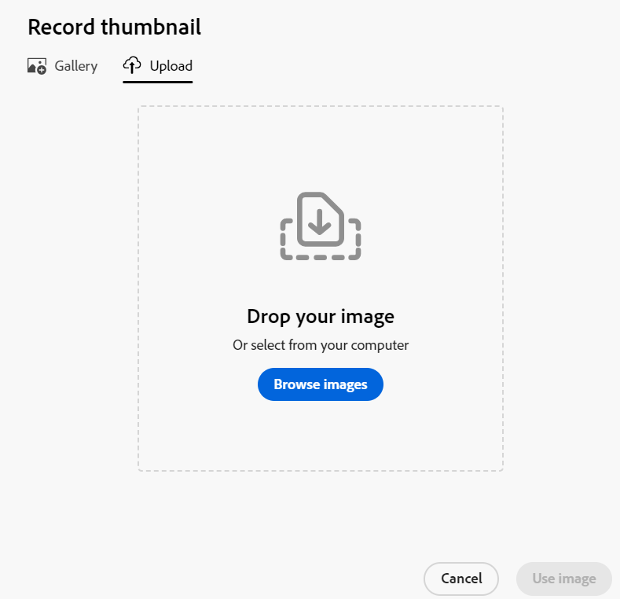

<!--update the metadata with real information-->

# Aggiungere una miniatura a un record

{{planning-important-intro}}

È possibile associare record a miniature univoche in Adobe Workfront Planning per renderle facilmente riconoscibili.

È necessario creare i tipi di record prima di iniziare a creare e modificare i record.
Per informazioni, consulta [Crea tipi di record](/help/quicksilver/planning/architecture/create-record-types.md).

## Requisiti di accesso

<!--************double-check permissions here - asking Isk and Lilit what permissions users need for adding thumbnails-->

Per eseguire i passaggi descritti in questo articolo, è necessario disporre dei seguenti diritti di accesso:

<table style="table-layout:auto">
 <col>
 </col>
 <col>
 </col>
 <tbody>
    <tr>
<tr>
<td>
   
 Prodotto
 </td>
   <td>
   
 Adobe Workfront
 </td>
  </tr>  
 <td role="rowheader">
Contratto Adobe Workfront
</td>
   <td>

L'organizzazione deve essere iscritta alla fase di accesso anticipato per Workfront Planning 

   </td>
  </tr>
  <tr>
   <td role="rowheader">
piano Adobe Workfront
</td>
   <td>

Qualsiasi

   </td>
  </tr>
  <tr>
   <td role="rowheader">
Licenza Adobe Workfront*
</td>
   <td>
   
Nuovo: Standard
 
   
Corrente: Piano

</td>
  </tr>

<tr>
   <td role="rowheader">
Configurazioni del livello di accesso
</td>
   <td> 
Nessun controllo di accesso per Workfront Planning 
  
</td>
  </tr>
<tr>
   <td role="rowheader">
Autorizzazioni
</td>
   <td> 
Gestire le autorizzazioni per un’area di lavoro 
  
   
Gli amministratori di sistema dispongono delle autorizzazioni per tutte le aree di lavoro, incluse quelle non create

</td>
  </tr>
<tr>
   <td role="rowheader">
Modello di layout
</td>
   <td>  
A tutti gli utenti, inclusi gli amministratori di Workfront, deve essere assegnato un modello di layout che includa l'area Planning nel menu principale. 
 
Per informazioni, consulta <a href="/help/quicksilver/planning/access/access-overview.md">Panoramica degli accessi</a>. 
  
</td>
  </tr>

</tbody>
</table>

*Per ulteriori informazioni, vedere [Requisiti di accesso nella documentazione di Workfront](/help/quicksilver/administration-and-setup/add-users/access-levels-and-object-permissions/access-level-requirements-in-documentation.md).

## Considerazioni sulle miniature dei record

Per distinguere visivamente i record in una vista tabella, è possibile associare a ciascun record un&#39;immagine miniatura univoca.

Considera quanto segue:

* Una miniatura è univoca per un record e non si applica a tutti i record dello stesso tipo.
* È possibile aggiungere solo file di immagine come miniature.
  <!--above: when you know exactly what type of files are allowed, add the exact extensions above-->
* È possibile aggiungere un&#39;immagine di anteprima ai singoli record nella vista tabella o dalla pagina o dalla casella di anteprima del record.
* Workfront carica automaticamente una miniatura ogni volta che crei un record. In seguito potrai modificare questa immagine.
* Le miniature appartengono alle informazioni del record e vengono visualizzate nelle aree in cui vengono visualizzati i record. Ad esempio, le miniature vengono visualizzate insieme alle informazioni del record nelle seguenti aree:

   * Campo principale di un record nella visualizzazione tabella
   * Barra dei record nella visualizzazione timeline.
   * L&#39;anteprima e la pagina dei dettagli del record.

## Aggiungere una miniatura a un record

È possibile aggiungere una miniatura nei modi seguenti:

* [Aggiungere una miniatura a un record dalla vista tabella](#add-a-thumbnail-to-a-record-from-the-table-view)
* [Aggiungere una miniatura a un record dalla pagina dei dettagli](#add-a-thumbnail-to-a-record-from-the-details-page)

### Aggiungere una miniatura a un record dalla vista tabella

{{step1-to-planning}}

1. Fare clic sull&#39;area di lavoro per i record ai quali si desidera aggiungere le miniature, quindi fare clic sulla scheda del tipo di record.

   Verrà aperta la pagina del tipo di record.
1. Selezionare una vista tabella dal menu **Visualizza** menu a discesa. Tutti i record del tipo selezionato vengono visualizzati in una tabella.
1. Passa il puntatore del mouse sulle informazioni del campo principale, fai clic sul pulsante **Altro** menu , quindi fai clic su **Miniatura**.

   

   >[!TIP]
   >
   >   Il campo principale è il campo che viene visualizzato nella prima colonna di una visualizzazione tabella. Il campo principale è sempre bloccato e non può essere nascosto o spostato. L&#39;opzione Miniatura non è disponibile nel menu Altro quando il campo principale è un campo formula.

   Il **Carica** La scheda si apre per impostazione predefinita in **Miniatura record** casella.

   Per ulteriori informazioni sul caricamento della miniatura, consulta la sezione [Aggiungere una miniatura a un record dalla pagina dei dettagli](#add-a-thumbnail-to-a-record-from-the-details-page) in questo articolo, a partire dal passaggio 6. <!--see if this is accurate-->

<!--
    

  *****update screen shot with correct casing****

1. Drag and drop a file to add as a thumbnail
   
   Or
   
   Click **Browse images**, then browse for an image file to add. The file must be saved on your computer. 
1. (Optional) After the image uploads in the **Record thumbnail** box, use the sizing tool to crop and resize the image.
1. (Optional) Click the **Upload new image** icon  to upload another image. 
1. (Optional) To remove a thumbnail before it is saved, click  **Remove uploaded image** icon  to the right of the image. 
1. (Optional) Click the **Gallery** tab, then click an image. The gallery of images cannot be modified.

   
1. Click **Use image** to add the image as a thumbnail. 
   This closes the **Record thumbnail** box.
   The thumbnail displays in areas of Workfront Planning where the record displays. 

   >[!TIP]
   >
   >   You must enable the Thumbnail field in the table view to display thumbnails in this view. It is disabled by default.

1. (Optional) To remove the thumbnail after it is saved, hover over the primary field and click the **More** menu > **Thumbnail** > the **Remove** icon , then click **Save changes**. -->

### Aggiungere una miniatura a un record dalla pagina dei dettagli

{{step1-to-planning}}

1. Fare clic sull&#39;area di lavoro per i record ai quali si desidera aggiungere le miniature, quindi fare clic sulla scheda del tipo di record.

   Verrà aperta la pagina del tipo di record.
1. In qualsiasi visualizzazione, fare clic su un record per aprirlo.

   Viene visualizzata la casella di anteprima dei dettagli.
1. (Facoltativo) Fai clic su **Apri in una nuova scheda** icona  nell’angolo superiore destro.

   Viene visualizzata la pagina dei dettagli del record.
1. Passa il puntatore sull&#39;immagine o sull&#39;icona della miniatura , quindi fare clic su **Altro** menu  > **Modifica miniatura**.

   Il **Carica** La scheda si apre per impostazione predefinita in **Miniatura record** casella.

   

1. Trascina un file da aggiungere come miniatura

   Oppure

   Clic **Sfoglia immagini**, quindi cerca un file di immagine da aggiungere. Il file deve essere salvato nel computer.

1. (Facoltativo) Dopo che l’immagine viene caricata in **Miniatura record** utilizzare lo strumento di ridimensionamento per ritagliare e ridimensionare l&#39;immagine.
1. (Facoltativo) Fai clic su **Carica nuova immagine** icona  per caricare un&#39;altra immagine.
1. (Facoltativo) Fai clic su **Galleria** , quindi fare clic su un&#39;immagine. Impossibile modificare la raccolta di immagini.

   

1. (Facoltativo) Per rimuovere la miniatura prima del salvataggio, fare clic sul pulsante **Rimuovi** icona  a destra dell&#39;immagine.

1. Clic **Usa immagine** per aggiungere l&#39;immagine come miniatura.
Questo chiude il **Miniatura record** casella.
La miniatura viene visualizzata nelle aree di Workfront Planning in cui viene visualizzato il record.

   >[!TIP]
   >
   >   Per visualizzare le miniature in questa visualizzazione, è necessario attivare il campo Miniatura nella visualizzazione Tabella. Per impostazione predefinita, è disabilitata.

1. (Facoltativo) Per rimuovere la miniatura dopo averla salvata, fai clic su un record in una visualizzazione qualsiasi per aprire la pagina dei dettagli, quindi passa il puntatore sull&#39;immagine miniatura e fai clic sul pulsante **Altro** menu > **Rimuovi** icona . L&#39;immagine di anteprima viene rimossa.

<!--
### Generate a thumbnail for a record

{{step1-to-planning}}

1. Click the workspace for whose records you want to add thumbnails, then click the record type card. 

   This opens the record type page. 
1. Select a table view from the **View** drop-down menu. All records of the type you selected display in a table. 
1. Hover over the primary field information, click the **More** menu , then click **Thumbnail**. 

   

      >[!TIP]
      >
      >   The primary field is the field that displays in the first column of a table view. The primary field is always frozen and cannot be hidden or relocated. 

   The **Record thumbnail** box opens.

(*************** update the screenshot below*************)
    

1. Click the **Generate** tab, and type a prompt describing the type of image you want to add in the space provided. 
1. Click **Generate**. 

   A set of four suggested images displays. 

1. Click an image to select it, then click **Use image**. 

   The Record thumbnail box closes and the thumbnail is attached to the record. All users who can view the records can now see the selected thumbnail. 
1. (Optional) Click the **More** menu  to the right of the record name in the table view, then click **Thumbnail**. 

   The generated image opens in the **Upload** tab where you can modify or remove it, as described in the section [Upload a thumbnail to a record](#upload-a-thumbnail-to-a-record) in this article. 
-->