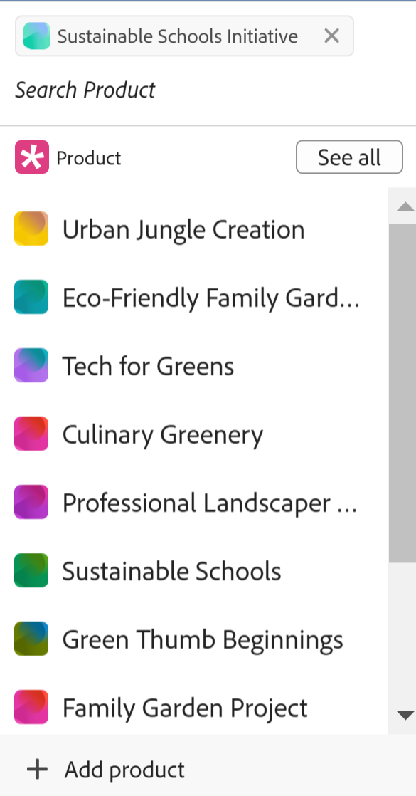
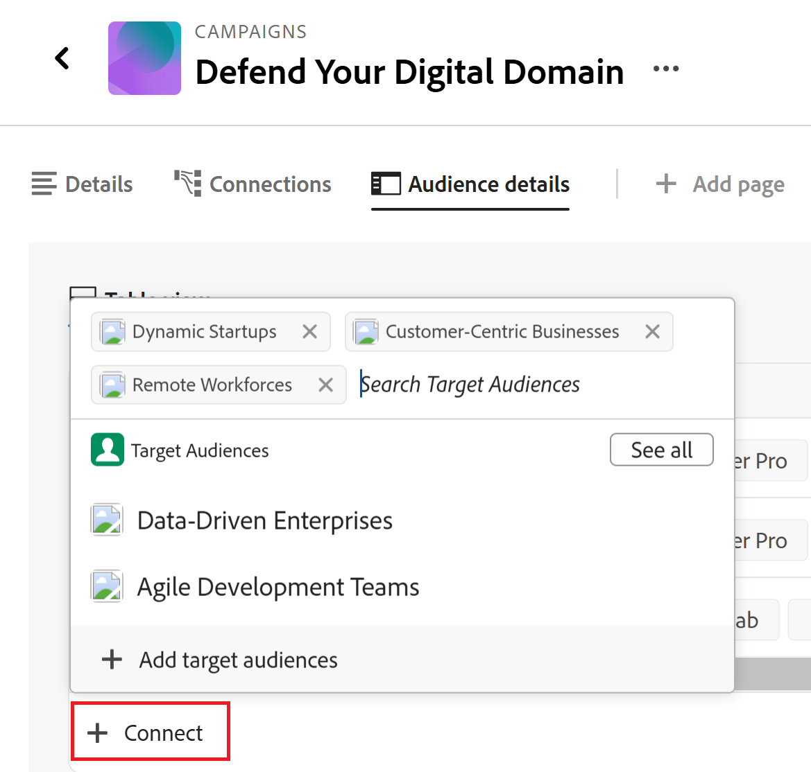

# Connetti record

Le informazioni evidenziate in questa pagina si riferiscono a funzionalità non ancora generalmente disponibili. È disponibile solo nell’ambiente di anteprima per tutti i clienti. Dopo i rilasci mensili in Produzione, le stesse funzioni sono disponibili nell’ambiente di Produzione per i clienti che hanno abilitato i rilasci rapidi. 

Per informazioni sulle versioni rapide, vedere [Abilitare o disabilitare le versioni rapide per l&#39;organizzazione](/help/quicksilver/administration-and-setup/set-up-workfront/configure-system-defaults/enable-fast-release-process.md). 

{{planning-important-intro}}

È possibile collegare tra loro record di Adobe Workfront Planning o a oggetti di altre applicazioni. È possibile visualizzare le informazioni di un record in un altro record quando si collegano i record.

Questo articolo descrive come collegare i record. Per ulteriori informazioni generali sulla connessione dei record, vedere [Panoramica sui record collegati](/help/quicksilver/planning/records/connected-records-overview.md).

È innanzitutto necessario collegare due tipi di record tra loro o un tipo di record a un tipo di oggetto di un&#39;altra applicazione. In questo modo vengono creati campi record connessi. È quindi possibile collegare record tra loro o record ad altri oggetti da altre applicazioni nei campi dei record connessi.

La connessione dei record è simile alla connessione dei record agli oggetti di un&#39;altra applicazione.

Per informazioni sulla connessione di tipi di record tra loro o a tipi di oggetto da altre applicazioni, vedere [Connettere tipi di record](/help/quicksilver/planning/architecture/connect-record-types.md).

Per un esempio di connessione dei tipi di record, vedere [Esempio di connessione dei tipi di record e dei record](/help/quicksilver/planning/architecture/example-connect-record-types-and-records.md).

È possibile connettere i seguenti elementi:

* Record di Adobe Workfront Planning tra loro
* Adobe Workfront Planning registra gli oggetti di altre applicazioni.

  È possibile collegare record con oggetti dei tipi elencati di seguito dalle applicazioni seguenti:

   * Adobe Workfront

      * Progetti
      * Portfolio
      * Programmi
      * Aziende
      * Gruppi

   * Adobe Experience Manager Assets

      * File immagine
      * Cartelle

  <!--when you add more objects, fix the Access Requirements below which right now refer only to projects-->

## Requisiti di accesso

+++ Espandere per visualizzare i requisiti di accesso.

<table style="table-layout:auto"> 
<col> 
</col> 
<col> 
</col> 
<tbody> 
    <tr> 
<tr> 
<td> 
   
 Prodotti
 </td> 
   <td> 
   <ul><li>
 Adobe Workfront
</li> 
   <li>
 Adobe Workfront Planning
</li>
   <li>
Adobe Experience Manager Assets, se si desidera collegare risorse AEM a record Planning

   
Devi disporre di una licenza Adobe Experience Manager Assets e di un’integrazione tra AEM Assets e Workfront.
    Per informazioni, consulta <a href="/help/quicksilver/documents/adobe-workfront-for-experience-manager-assets-essentials/workfront-for-aem-asset-essentials.md">Adobe Workfront for Experience Manager Assets and Assets Essentials: article index</a>. 

   </li>  
   </ul></td> 
  </tr>   
<tr> 
   <td role="rowheader">
Piano Adobe Workfront*
</td> 
   <td> 

Uno dei seguenti piani di Workfront:
 
<ul><li>Seleziona</li> 
<li>Prime</li> 
<li>Ultimate</li></ul> 

Workfront Planning non è disponibile per i piani Workfront legacy
 
   </td> 
<tr> 
   <td role="rowheader">
Pacchetto Adobe Workfront Planning*
</td> 
   <td> 

Qualsiasi 
 

Per ulteriori informazioni su quanto incluso in ogni piano di Workfront Planning, contattare l'account manager Workfront. 
 
   </td> 
 <tr> 
   <td role="rowheader">
Piattaforma Adobe Workfront
</td> 
   <td> 

Per poter accedere a Workfront Planning, l’istanza di Workfront della tua organizzazione deve essere integrata in Adobe Unified Experience.
 

Per ulteriori informazioni, vedere <a href="/help/quicksilver/workfront-basics/navigate-workfront/workfront-navigation/adobe-unified-experience.md">Esperienza unificata Adobe per Workfront</a>. 
 
   </td> 
   </tr> 
  </tr> 
  <tr> 
   <td role="rowheader">
Licenza Adobe Workfront*
</td> 
   <td> Standard
   
Workfront Planning non è disponibile per le licenze Workfront legacy
 
  </td> 
  </tr> 
  <tr> 
   <td role="rowheader">
Configurazione del livello di accesso
</td> 
   <td> 
Non sono presenti controlli del livello di accesso per gli oggetti di Adobe Workfront Planning
 
   
Visualizza o autorizzazioni superiori per i tipi di oggetto da collegare da Workfront.
   
</td> 
  </tr> 
<tr> 
   <td role="rowheader">
Autorizzazioni oggetto
</td> 
   <td>   
Autorizzazioni Contribute o superiori per un'area di lavoro e un tipo di record per la connessione dei record 
  
   
Visualizzare o autorizzazioni superiori per un'area di lavoro e un tipo di record per visualizzare tutte le connessioni a oggetti e campi da altre applicazioni, indipendentemente dall'accesso all'altra applicazione. 

   
Visualizza o autorizzazioni superiori per gli oggetti che si desidera collegare da Workfront o Experience Manager Assets. 

   
Gli amministratori di sistema dispongono delle autorizzazioni per tutte le aree di lavoro, incluse quelle che non hanno creato.
 </td> 
  </tr> 
</tbody> 
</table>

*Per ulteriori informazioni sui requisiti di accesso a Workfront, vedere [Requisiti di accesso nella documentazione di Workfront](/help/quicksilver/administration-and-setup/add-users/access-levels-and-object-permissions/access-level-requirements-in-documentation.md).

+++

## Considerazioni sulla connessione dei record

* Per collegare i record ad altri record o oggetti, è necessario disporre dei seguenti elementi:

   * Almeno un&#39;area di lavoro, tipo di record e record.

     Per ulteriori informazioni, consulta i seguenti articoli:

      * [Creare aree di lavoro](/help/quicksilver/planning/architecture/create-workspaces.md)
      * [Crea tipi di record](/help/quicksilver/planning/architecture/create-record-types.md)
      * [Crea record](/help/quicksilver/planning/records/create-records.md)

   * Connessioni tra tipi di record o tra tipi di record e oggetti di altre applicazioni. Per informazioni, vedere [Tipi di record di connessione](/help/quicksilver/planning/architecture/connect-record-types.md).

* È possibile collegare tra loro uno o più record o oggetti. Dipende dal tipo di connessione selezionato durante la connessione dei tipi di record o di oggetto. Per informazioni, vedere [Panoramica sui tipi di record di connessione](/help/quicksilver/planning/architecture/connect-record-types-overview.md).

## Connetti record da Workfront Planning

È possibile collegare record da Workfront Planning nelle seguenti aree di un record Planning:

* Campi record connessi nella visualizzazione tabella.
* La casella di anteprima o la pagina del record nei campi del record connesso della scheda Dettagli.
* La casella di anteprima o la pagina del record nella scheda Connessioni.
* Pagina del record in una scheda della pagina Record collegati.

### Collegare i record di Workfront Planning dalla vista tabella o dall&#39;area Dettagli di un record

{{step1-to-planning}}

1. Fare clic sull&#39;area di lavoro di cui si desidera connettere i record.

   Viene aperto il workspace e i tipi di record vengono visualizzati come schede.
1. Fare clic sulla scheda di un tipo di record per aprire la pagina del tipo di record.
1. Fare clic sul nome di una vista tabella per aprirla.
1. (Facoltativo) Aggiungere record al tipo di record selezionato aggiungendo una nuova riga alla tabella. Per informazioni, vedere [Creare record](/help/quicksilver/planning/records/create-records.md).
1. (Condizionale) Dopo aver collegato il tipo di record selezionato con un altro tipo di record, vai al campo connesso di un record e fai clic all&#39;interno del campo oppure fai clic su **Connetti** per aggiungere il record.

   

1. Esegui una delle operazioni seguenti:

   * Fare clic sul nome di un record connesso nell&#39;elenco per aggiungerlo al record selezionato. Il record viene aggiunto automaticamente.
   * Iniziare a digitare il nome di un record e fare clic su di esso quando viene visualizzato nell&#39;elenco. Il record viene aggiunto automaticamente.

   >[!TIP]
   >
   >Se al momento della connessione dei tipi di record è stata selezionata solo l&#39;immagine del record, nel campo connesso verrà visualizzata solo la miniatura o l&#39;icona del record. Per ulteriori informazioni, vedere [Connetti tipi di record](/help/quicksilver/planning/architecture/connect-record-types.md).
   >

1. (Condizionale) Se si seleziona Da uno a molti o Da uno a uno per il tipo di connessione quando si collegano i tipi di record e si tenta di connettere un record o un oggetto già connesso altrove, verrà visualizzato un messaggio di avviso che segnala che la connessione di nuovo lo rimuoverà dalla connessione originale. Fai clic su **Connetti** per consentire la rimozione e la connessione del record oppure su **Annulla** per tornare al campo e selezionare un altro record.
1. (Facoltativo) Se non riesci a trovare un oggetto da connettere e vuoi aggiungerlo, fai clic su **+ Aggiungi**

   Oppure

   Inizia a digitare un nome per l&#39;oggetto, quindi fai clic su **+ Aggiungi** per crearlo e aggiungerlo.

   Per ulteriori informazioni, vedere la sezione &quot;Creare record durante la connessione da altri record&quot; nell&#39;articolo [Creare record](/help/quicksilver/planning/records/create-records.md).

   >[!TIP]
   >
   >    È possibile aprire la pagina di un record e connettere altri record eseguendo le operazioni seguenti nella vista a tabella:
   >1. Fare clic sul nome del record nella visualizzazione.
   >1. Trovare il campo record collegato e fare doppio clic sul campo (se sono già presenti record connessi)
   >Oppure
   >Fare clic su **Connetti record** (se il campo è vuoto) per aggiungere record dal record o dal tipo di oggetto connesso.
   >
   >

1. (Facoltativo) Fai clic su **Visualizza tutti** per visualizzare tutti i record.

1. (Condizionale) Se hai fatto clic su **Visualizza tutti** nel passaggio precedente, viene visualizzata la casella **Connetti oggetti**.

   

1. Iniziare a digitare il nome di un record nella casella di ricerca, quindi selezionarlo quando viene visualizzato nell&#39;elenco

   Oppure

   Selezionare il nome di uno o più record nella casella, quindi fare clic su **Connetti oggetti**.

   Sono aggiunti i seguenti elementi:

   * I record collegati vengono visualizzati nel campo record collegato del record selezionato in un passaggio precedente.
   * I campi collegati vengono compilati con le informazioni dei record collegati, se sono stati aggiunti campi di ricerca collegati al momento della connessione dei tipi di record.

   L&#39;aggiornamento dei record collegati aggiorna automaticamente i campi collegati per i record da cui si sta effettuando il collegamento. Non è possibile modificare manualmente i campi collegati.

   >[!TIP]
   >
   >* Utilizziamo &quot;campi collegati&quot; e &quot;campi di ricerca&quot; in modo intercambiabile.
   >
   >* Quando si sceglie di connettere più record durante la connessione dei tipi di record, i valori dei campi dei diversi oggetti vengono visualizzati separati da virgole o aggregati in base all&#39;aggregatore scelto durante la connessione dei tipi di record.
   >* Non è possibile aggiungere campi typeahead di Workfront (inclusi campi come Proprietario progetto o Sponsor progetto) come campi di ricerca.
   >
   >* Le informazioni relative al campo data degli oggetti di Workfront vengono visualizzate nel formato 24 ore in Workfront Planning, indipendentemente da come vengono visualizzate in Workfront.
   >
   >   Se, ad esempio, la Data inizio pianificata di un progetto viene visualizzata come 3:00 PM in Workfront, verrà visualizzata come 15:00 in Workfront Planning in un campo di ricerca importato.

1. (Facoltativo) Chiudere la pagina del tipo di record e passare all&#39;area di lavoro selezionata.
1. Fare clic sulla scheda del tipo di record a cui si è collegati.

   Ad esempio, se hai connesso il record **Campaign** al record Prodotto, fai clic sulla scheda **Prodotto**.

   La scheda del tipo di record deve aprirsi nella vista tabella. In caso contrario, selezionare una vista tabella.

   Il campo record collegato **Campagna** visualizza i nomi delle campagne collegate ai prodotti nella pagina Tipo record prodotto. L’aggiornamento delle informazioni della campagna aggiorna automaticamente il campo del record collegato della campagna per il tipo di record Prodotto.

### Collegare i record di Workfront Planning agli oggetti di Workfront dalla vista tabella o dall&#39;area Dettagli di un record

<!--when we will have more applications to link to from Planning, change the title to something like: Connect Workfront Planning records to objects from other applications-->

Dopo aver creato una connessione tra un tipo di record e un tipo di oggetto Workfront, è possibile collegare singoli record agli oggetti in Workfront. I campi Workfront connessi vengono automaticamente compilati nei record da cui si collegano gli oggetti.

>[!NOTE]
>
>Non è possibile connettere tipi di oggetto Workfront con tipi di record di Workfront Planning da Workfront.

{{step1-to-planning}}

1. Fare clic sull&#39;area di lavoro di cui si desidera connettere i record.

   Viene aperto il workspace e i tipi di record vengono visualizzati come schede.
1. Fare clic sulla scheda di un tipo di record per aprire la pagina del tipo di record.
1. Selezionare una visualizzazione **Tabella** dal menu a discesa **Visualizzazione**.

1. Fare clic su **Nuovo record** per aggiungere singoli record al tipo di record selezionato. Per informazioni, vedere [Creare record](/help/quicksilver/planning/records/create-records.md).

1. (Condizionale) Dopo aver connesso il tipo di record selezionato a un tipo di oggetto Workfront, passare al campo connesso di un record e fare clic sul campo oppure fare clic su **Connetti** per aggiungere oggetti Workfront.

   

1. Esegui una delle operazioni seguenti:

   * Fare clic su un oggetto dall&#39;elenco per aggiungerlo al record selezionato. Gli oggetti sono elencati in ordine alfabetico. L&#39;oggetto viene aggiunto automaticamente.
   * Iniziare a digitare il nome di un oggetto e fare clic su di esso quando viene visualizzato nell&#39;elenco. L&#39;oggetto viene aggiunto automaticamente.

   >[!TIP]
   >
   >È possibile aprire la pagina di un record dalla visualizzazione, fare doppio clic sul campo del record collegato oppure fare clic su **Connetti** nel campo per aggiungere oggetti dal tipo di oggetto connesso.

1. (Facoltativo) Se non riesci a trovare un oggetto da connettere e vuoi aggiungerlo, fai clic su **+ Aggiungi**

   Oppure

   Inizia a digitare un nome per l&#39;oggetto, quindi fai clic su **+ Aggiungi** per creare e aggiungere un nuovo progetto, portfolio o programma.

   Per informazioni, vedere [Creare oggetti Workfront da Workfront Planning](/help/quicksilver/planning/records/create-workfront-objects-from-workfront-planning.md)

1. (Facoltativo) Fai clic su **Visualizza tutti** per visualizzare tutti gli oggetti per i quali disponi almeno delle autorizzazioni di visualizzazione.

   Se hai fatto clic su **Visualizza tutti** nel passaggio precedente, viene visualizzata la casella **Connetti oggetti**.

   

1. Inizia a digitare il nome di un oggetto Workfront nella casella di ricerca, quindi selezionalo quando viene visualizzato nell’elenco

   Oppure

   Selezionare il nome di uno o più oggetti nella casella, quindi fare clic su **Connetti oggetti**.

   >[!IMPORTANT]
   >
   >* È possibile aggiungere solo oggetti Workfront a cui si ha accesso per la visualizzazione.
   >
   >* Dopo aver aggiunto gli oggetti Workfront, tutti gli utenti con autorizzazioni di visualizzazione o superiori all&#39;area di lavoro possono visualizzare gli oggetti Workfront e le relative informazioni di campo, indipendentemente dalle autorizzazioni o dall&#39;accesso in Workfront.

   Sono aggiunti i seguenti elementi:

   * Gli oggetti Workfront selezionati vengono aggiunti al campo record collegato.
   * Se sono stati aggiunti quando il tipo di record è stato connesso a Workfront, i campi collegati (o i campi di ricerca) degli oggetti Workfront vengono automaticamente compilati con le informazioni di Workfront.

   Per ulteriori informazioni sulla connessione di tipi di record con oggetti di un&#39;altra applicazione, vedere [Connettere tipi di record](/help/quicksilver/planning/architecture/connect-record-types.md).

1. (Facoltativo) Fare clic sul nome di un oggetto Workfront connesso a un record di Workfront Planning nel campo collegato di una vista tabella o nel campo collegato della pagina del record.

   Se si dispone almeno delle autorizzazioni di visualizzazione per l&#39;oggetto, verrà aperto l&#39;oggetto Workfront in Workfront.

   >[!TIP]
   >
   >* Quando si sceglie di connettere più record durante la connessione dei tipi di record, i valori dei campi di ricerca vengono visualizzati separati da virgole o aggregati in base all&#39;aggregatore scelto.
   >
   >* Non viene creato un campo record collegato per gli oggetti Workfront collegati in Workfront.

1. (Facoltativo) Nella vista a tabella del tipo di record, posizionare il puntatore del mouse sull&#39;intestazione di colonna dell&#39;oggetto Workfront collegato e fare clic sul menu a discesa, quindi scegliere **Modifica campi di ricerca**.

1. Aggiungi campi oggetto Workfront dall&#39;area **Campi non selezionati**

   Oppure

   Rimuovi i campi oggetto Workfront dall&#39;area **Campi selezionati**.

   Questa operazione consente di aggiungere o rimuovere campi collegati dai record di Workfront Planning. Le informazioni associate ai campi rimossi rimangono in Workfront.

### Collegare i record di Workfront Planning agli oggetti di Adobe Experience Manager dalla vista tabella o dall&#39;area Dettagli di un record

<!--when we will have more applications to link to from Planning, change the title to something like: Connect Workfront Planning records to objects from other applications-->

>[!IMPORTANT]
>
>È necessario disporre di una licenza Adobe Experience Manager Assets e l’istanza di Workfront dell’organizzazione deve essere integrata in Adobe Business Platform o Adobe Admin Console per poter collegare i record di Workfront Planning ad Adobe Experience Manager Assets.
>
>Se hai domande sull&#39;onboarding in Adobe Admin Console, consulta le [Domande frequenti su Adobe Unified Experience](/help/quicksilver/workfront-basics/navigate-workfront/workfront-navigation/unified-experience-faq.md).

Dopo aver creato una connessione tra un tipo di record e Adobe Experience Manager Assets, puoi collegare singoli record alle risorse di Experience Manager. I campi della risorsa connessi da Experience Manager Assets al momento della creazione della connessione vengono compilati automaticamente sul tipo di record da cui è stato effettuato il collegamento.

>[!NOTE]
>
>I record di pianificazione e i relativi campi sono accessibili da Experience Manager Assets quando l’amministratore Workfront configura la mappatura dei metadati tramite l’integrazione tra Workfront e Adobe Experience Manager Assets. Per ulteriori informazioni, consulta [Configurare la mappatura dei metadati delle risorse tra Adobe Workfront e Experience Manager Assets](https://experienceleague.adobe.com/it/docs/experience-manager-cloud-service/content/assets/integrations/configure-asset-metadata-mapping).

Per collegare i record con le risorse di Experience Manager:

{{step1-to-planning}}

1. Fare clic sull&#39;area di lavoro di cui si desidera connettere i record.

   Viene aperto il workspace e vengono visualizzati i tipi di record.
1. Fare clic sulla scheda di un tipo di record per aprire la pagina del tipo di record.
1. Selezionare una visualizzazione **Tabella** dal menu a discesa **Visualizzazione** nell&#39;angolo superiore destro della pagina del tipo di record.

1. (Facoltativo) Fare clic su **Nuovo record** per aggiungere nuovi record al tipo di record selezionato. Per informazioni, vedere [Creare record](/help/quicksilver/planning/records/create-records.md).
1. (Condizionale) Dopo aver connesso il tipo di record selezionato con Experience Manager Assets, passa al campo connesso di un record e fai clic sul campo oppure fai clic su **Connetti** per aggiungere risorse Experience Manager al record, quindi fai clic sull&#39;icona **+**.

   >[!TIP]
   >
   >  È possibile aggiungere fare clic sull&#39;icona **+** nel campo oggetto collegato nella pagina del record per connettere le risorse al record.

   Viene visualizzata la casella **Seleziona Assets**. <!--we might change this to Connect assets-->

   

1. Fai clic su per selezionare alcuni dei seguenti tipi di risorse:

   * Immagini
   * Cartelle

   Puoi selezionare più risorse.

   >[!IMPORTANT]
   >
   > Puoi collegare in Experience Manager solo le risorse a cui hai accesso. Una volta connessi, tutti gli utenti di Workfront Planning possono visualizzare le risorse in Workfront Planning, indipendentemente dal loro accesso in Experience Manager Assets.

1. Fai clic su **Seleziona**. <!-- we might change this to Connect-->

   Sono aggiunti i seguenti elementi:

   * Le risorse Experience Manager selezionate vengono aggiunte al campo record collegato.
   * I campi collegati (o campi di ricerca) vengono compilati con le informazioni delle risorse collegate di Experience Manager.

     Eventuali informazioni esistenti provenienti dai campi delle risorse Experience Manager vengono visualizzate automaticamente nei campi collegati o di ricerca.

     >[!TIP]
     >
     >* Quando si sceglie di connettere più record durante la connessione dei tipi di record, i valori dei diversi oggetti vengono visualizzati separati da virgole o aggregati in base all&#39;aggregatore scelto.
     >
     >* Per le risorse Experience Manager collegate nell’applicazione Experience Manager Assets non viene creato un campo record collegato ai record collegati di Workfront Planning.

1. (Facoltativo) Vai al tipo di record da cui hai collegato Experience Manager Assets e fai clic sul nome di una risorsa nel campo del record collegato. I dettagli Experience Manager della risorsa vengono visualizzati in una finestra a comparsa.

   

   Per un file di immagine vengono visualizzati i seguenti campi:

   * Miniatura dell&#39;immagine
   * Nome del file di immagine
   * Dimensioni
   * Dimensione
   * Descrizione
   * Percorso del file in Experience Manager
   * Tipo di risorsa
   * Data di creazione
   * Data modificata

1. (Facoltativo) Per aprire la pagina dei record di Experience Manager Assets in Experience Manager, vai alla pagina del tipo di record del record da cui stai effettuando il collegamento, fai clic sul nome di una risorsa nel campo del record collegato per aprire la finestra a comparsa, quindi fai clic sull&#39;icona **Apri in AEM**  per aprire la risorsa.

   Verrà aperta la risorsa Experience Manager in Adobe Experience Manager Assets.

1. (Facoltativo) Nella vista a tabella del tipo di record, passa il puntatore del mouse sull&#39;intestazione di colonna della risorsa Experience Manager collegata e fai clic sul menu a discesa, quindi fai clic su **Modifica campi di ricerca**.

1. Aggiungi campi oggetto Experience Manager Assets dall&#39;area **Campi non selezionati**

   Oppure

   Rimuovi i campi oggetto Workfront dall&#39;area **Campi selezionati**.

   Questa operazione consente di aggiungere o rimuovere campi collegati dai record. Le informazioni associate ai campi rimossi rimangono in Adobe Experience Assets.

### Collegare i record di Workfront Planning ad altri record o oggetti dalla scheda Connessioni della pagina dei record

1. Passare a una visualizzazione di un tipo di record connesso ad altri tipi di record o tipi di oggetto di Planning da altre applicazioni.
1. Seguire i passaggi descritti nelle sottosezioni precedenti per trovare un record nella visualizzazione che si desidera connettere ad altri record o oggetti.
1. Fare clic sul nome di un record.

   Viene visualizzata la pagina di anteprima.
1. (Facoltativo) Fai clic sull&#39;icona **Apri in una nuova scheda**  per aprire la pagina del record.
1. Fare clic sulla scheda **Connessioni** nell&#39;anteprima o nella pagina del record.

   

   Tutti i tipi di record o di oggetti collegati al tipo di record selezionato vengono visualizzati come sezioni. I record o gli oggetti collegati vengono visualizzati sotto i nomi dei record o dei tipi di oggetto sulle schede.

   >[!TIP]
   >
   >    Per impostazione predefinita, vengono visualizzati solo i record connessi con singoli record.

1. (Facoltativo) Fare clic su **Mostra tutte le connessioni** per visualizzare tutti i tipi di record connessi, inclusi quelli senza record connessi.

1. (Facoltativo) Fare clic sulla freccia rivolta verso il basso a sinistra di una sezione per comprimerla.

1. (Condizionale) Fare clic su **Connetti** per aggiungere altri record o oggetti dello stesso tipo.
1. (Facoltativo) Se non è possibile trovare un record o un oggetto da connettere e si desidera aggiungerlo, fare clic su **+ Aggiungi**

   Oppure

   Inizia a digitare un nome per l&#39;oggetto, quindi fai clic su **+ Aggiungi** per crearlo e aggiungerlo al record.

   Per ulteriori informazioni, vedere la sezione &quot;Creare record durante la connessione da altri record&quot; nell&#39;articolo [Creare record](/help/quicksilver/planning/records/create-records.md).
1. Seguire i passaggi descritti nelle sezioni precedenti per connettere i record da Workfront Planning o gli oggetti da Workfront o Experience Manager Assets.
I record e gli oggetti vengono aggiunti immediatamente.
1. (Facoltativo) Passa il puntatore del mouse sulla scheda connessa di un record o di un oggetto, quindi fai clic sull&#39;icona **Disconnetti record**  per disconnetterlo dal record selezionato.

   

   Il record viene immediatamente disconnesso da tutte le aree di Workfront Planning o da altre applicazioni in cui potrebbe essere visualizzato come connesso. Vengono rimossi anche eventuali valori dei campi di ricerca.

### Collegare i record dalla pagina Record connessi di un record

1. Passare a una visualizzazione di un tipo di record connesso ad altri tipi di record o tipi di oggetto di Planning da altre applicazioni.
1. Seguire i passaggi descritti nelle sottosezioni precedenti per trovare un record nella visualizzazione che si desidera connettere ad altri record o oggetti.
1. Fare clic sul nome di un record.

   Viene visualizzata la pagina di anteprima.
1. Fai clic sull&#39;icona **Apri in una nuova scheda**  per aprire la pagina del record.
1. Fare clic sulla scheda di una pagina Record connessi esistente nella pagina del record. È innanzitutto necessario creare una pagina Record connessi.

   Nella vista a tabella viene visualizzata una pagina del tipo di record connesso.

   Tutti i record collegati di un tipo vengono visualizzati nella tabella.
1. Fare clic su **Connetti**, **Connetti record** o **Nuova riga** per aggiungere o rimuovere record.

   

   Per informazioni, vedere [Gestire il layout della pagina record](/help/quicksilver/planning/records/manage-the-record-page.md).
1. (Facoltativo) Se non riesci a trovare un record connesso, fai clic su **+ Aggiungi** per crearlo e connetterlo.

## Connetti record da oggetti Workfront

Per connettere i record di Workfront Planning dagli oggetti di Workfront, è necessario disporre delle seguenti informazioni:

* Connessioni tra tipi di record e tipi di oggetto Workfront stabiliti in Workfront Planning.
* L&#39;amministratore del Workfront o del gruppo deve aggiungere uno degli elementi seguenti a un tipo di oggetto Workfront:

   * La sezione Pianificazione dei progetti, dei portfolio e dei programmi Workfront nel modello di layout.

   * Il campo personalizzato Connessioni di Planning a un modulo personalizzato per uno dei seguenti oggetti:

      * Progetto
      * Portfolio
      * Programma
      * Gruppo
      * Azienda

  Per ulteriori informazioni, vedere [Gestire le connessioni record dagli oggetti Workfront](/help/quicksilver/planning/records/manage-records-in-planning-section.md).
