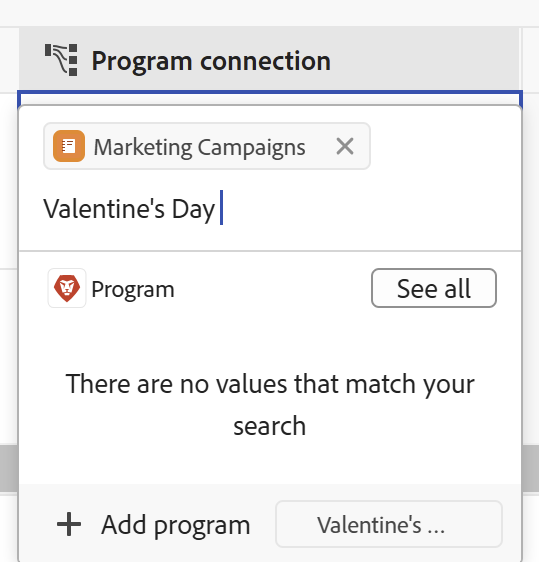

<!--update the metadata with real information when making this available in TOC and in the left nav-->

# Creazione di oggetti Workfront da Workfront Planning durante la connessione ai record

<!-- remove preview and production at release time-->

<!--The information highlighted on this page refers to functionality not yet generally available. It is available only in the Preview environment for all customers. After the monthly releases to Production, the same features are also available in the Production environment for customers who enabled fast releases.    

For information about fast releases, see [Enable or disable fast releases for your organization](/help/quicksilver/administration-and-setup/set-up-workfront/configure-system-defaults/enable-fast-release-process.md). -->

{{planning-important-intro}}

È possibile creare oggetti Adobe Workfront da Workfront Planning nei modi seguenti:

* Quando si collegano oggetti Workfront da record di Planning

  In questo articolo viene descritto come creare oggetti Workfront da Workfront Planning quando vengono collegati da record di Planning.
* Quando si utilizzano le automazioni dalla pagina di un record.

  Per informazioni sulla creazione di oggetti Workfront tramite automazioni, vedere [Creare oggetti tramite automazioni record di Adobe Workfront Planning](/help/quicksilver/planning/records/create-wf-objects-using-planning-automations.md).

>[!IMPORTANT]
>
>È possibile creare i seguenti oggetti di Workfront da Workfront Planning quando vengono collegati ai record di Planning:
>
>* Progetti
>* Portfolio
>* Programmi
>
>È possibile connettere i seguenti oggetti Workfront con i record di Planning, ma non è possibile crearli nel processo di connessione:
>
>* Gruppi
>* Aziende
>

Durante la connessione e la creazione di oggetti Workfront ai record di Workfront Planning, tenere presente quanto segue:

* È possibile collegare progetti, portfolio, programmi, gruppi e società Workfront da un campo di connessione dalle seguenti aree di Workfront Planning:

   * Visualizzazione tabella di un tipo di record
   * Pagina Dettagli o casella di anteprima di un record
   * Scheda Connessioni di un record

* È possibile creare progetti dalle seguenti aree di Workfront Planning:

   * Visualizzazione tabella di un tipo di record
   * Area Dettagli di un record nel campo connessione
   * Pagina Record connesso di un record

* È possibile creare portfolio e programmi dalle seguenti aree di Workfront Planning:

   * Visualizzazione tabella di un tipo di record
   * Area Dettagli di un record nel campo connessione

Per informazioni sulla connessione dei record di Planning con gli oggetti di Workfront, vedere [Connetti record](/help/quicksilver/planning/records/connect-records.md).

## Requisiti di accesso

+++ Espandi per visualizzare i requisiti di accesso per la funzionalità in questo articolo. 

<table style="table-layout:auto"> 
<col> 
</col> 
<col> 
</col> 
<tbody> 
    <tr> 
<tr> 
</tr>   
<tr> 
   <td role="rowheader">
Pacchetto Adobe Workfront
</td> 
   <td> 

Qualsiasi pacchetto Workfront e Planning
 
Qualsiasi flusso di lavoro e qualsiasi pacchetto di Planning

Per ulteriori informazioni su ciò che è incluso in ogni pacchetto Workfront Planning, contattare il rappresentante del proprio account Workfront. 
 
   </td>

<tr> 
  <tr> 
   <td role="rowheader">
Licenza Adobe Workfront
</td> 
   <td>
Standard

   </td> 
  </tr> 
  <tr> 
   <td role="rowheader">
Configurazione del livello di accesso
</td> 
   <td> 
Nessun controllo del livello di accesso per Adobe Workfront Planning
 
   
Accesso di modifica con accesso a Crea oggetti in Workfront per i tipi di oggetto che si desidera creare (progetti, portfolio, programmi). 
  
</td> 
  </tr> 
<tr> 
   <td role="rowheader">
Autorizzazioni oggetto
</td> 
   <td> 
Autorizzazioni Contribute o superiori per l'area di lavoro e il tipo di record in cui si desidera aggiungere record. 
  
   
Gli amministratori di sistema dispongono delle autorizzazioni per tutte le aree di lavoro, incluse quelle non create

   
Gestisci le autorizzazioni per gli oggetti Workfront (portfolio) per aggiungere oggetti figlio (progetti).

   </td> 
  </tr>   
</tbody> 
</table>

Per ulteriori informazioni sui requisiti di accesso a Workfront, vedere [Requisiti di accesso nella documentazione di Workfront](/help/quicksilver/administration-and-setup/add-users/access-levels-and-object-permissions/access-level-requirements-in-documentation.md).

+++ 

<!--Old:

<table style="table-layout:auto"> 
<col> 
</col> 
<col> 
</col> 
<tbody> 
    <tr> 
<tr> 
<td> 
   
 Products
 </td> 
   <td> 
   <ul><li>
 Adobe Workfront
</li> 
   <li>
 Adobe Workfront Planning
</li></ul></td> 
  </tr>   
<tr> 
   <td role="rowheader">
Adobe Workfront plan*
</td> 
   <td> 

Any of the following Workfront plans:
 
<ul><li>Select</li> 
<li>Prime</li> 
<li>Ultimate</li></ul> 

Workfront Planning is not available for legacy Workfront plans
 
   </td> 
<tr> 
   <td role="rowheader">
Adobe Workfront Planning package*
</td> 
   <td> 

Any 
 

For more information about what is included in each Workfront Planning plan, contact your Workfront account manager. 
 
   </td> 
 <tr> 
   <td role="rowheader">
Adobe Workfront platform
</td> 
   <td> 

Your organization's instance of Workfront must be onboarded to the Adobe Unified Experience to be able to access Workfront Planning.
 

For more information, see <a href="/help/quicksilver/workfront-basics/navigate-workfront/workfront-navigation/adobe-unified-experience.md">Adobe Unified Experience for Workfront</a>. 
 
   </td> 
   </tr> 
  </tr> 
  <tr> 
   <td role="rowheader">
Adobe Workfront license*
</td> 
   <td> Standard
   
Workfront Planning is not available for legacy Workfront licenses
 
  </td> 
  </tr> 
  <tr> 
   <td role="rowheader">
Access level configuration
</td> 
   <td> 
There are no access level controls for Adobe Workfront Planning
 
   
Edit access with access to Create objects in Workfront for the object types that you want to create (projects, portfolios, programs). 
  
</td> 
  </tr> 
<tr> 
   <td role="rowheader">
Object permissions
</td> 
   <td> 
Manage permissions to the workspace and record type where you want to add records. 
  
   
System Administrators have permissions to all workspaces, including the ones they did not create

   
Manage permissions to Workfront objects (portfolios) to add children objects (projects).

   </td> 
  </tr> 
</tbody> 
</table> 

 *For more information about Workfront access requirements, see [Access requirements in Workfront documentation](/help/quicksilver/administration-and-setup/add-users/access-levels-and-object-permissions/access-level-requirements-in-documentation.md).  -->

## Prerequisiti per la creazione di oggetti Workfront quando vengono collegati ai record di Workfront Planning

Prima di poter aggiungere nuovi progetti o portfolio collegandoli da record esistenti, è necessario disporre dei seguenti elementi:

* Tipi di record connessi a progetti, portfolio o programmi Workfront. Per informazioni, vedere [Tipi di record di connessione](/help/quicksilver/planning/architecture/connect-record-types.md).
* Record per i tipi di record connessi a oggetti Workfront. Per informazioni, vedere [Creare record](/help/quicksilver/planning/records/create-records.md).
* L&#39;accesso e le autorizzazioni corretti in Workfront Planning e Workfront, come descritto nella sezione [Requisiti di accesso](#access-requirements) in questo articolo.

## Creazione di progetti durante la connessione con i record di Workfront Planning

È possibile creare progetti quando si collegano a record in Workfront Planning nelle seguenti aree di Workfront Planning:

* Visualizzazione tabella di un tipo di record o area Dettagli di un record nel campo connessione
* Pagina Record connesso di un record nell&#39;area Dettagli di un record

### Creare progetti dall&#39;area Dettagli di un record o dalla vista tabella di un tipo di record

Per creare progetti mentre li si connette da altri record:

1. Passare alla pagina dei dettagli di un record o alla tabella del tipo di record e iniziare a collegare i record di Workfront Planning ai progetti Workfront, come descritto nell&#39;articolo [Connetti record](/help/quicksilver/planning/records/connect-records.md).

1. (Condizionale) Fai clic su **Aggiungi progetto**
Oppure
Inizia a digitare il nome di un progetto, quindi fai clic su **Aggiungi progetto** se non riesci a trovarlo. Il pulsante Aggiungi è seguito dal nome del progetto digitato.

   

   Viene visualizzata la casella **Crea progetto**.

1. (Facoltativo) Aggiorna il **nome progetto**. Per impostazione predefinita, il progetto prende il nome da quello che hai aggiunto come elemento di ricerca quando lo connetti dal record.
1. (Facoltativo) Seleziona un **modello di progetto**. Se non si seleziona un modello, Workfront crea un progetto vuoto, senza attività.
1. Fai clic su **Crea**.
1. (Condizionale) Se hai selezionato di creare un progetto da un modello, segui i passaggi descritti nell&#39;articolo [Creare un progetto utilizzando un modello](/help/quicksilver/manage-work/projects/create-projects/create-project-from-template.md) per completare l&#39;aggiunta del progetto.

   Il nuovo progetto viene creato e aggiunto al campo connesso del record selezionato.

1. (Facoltativo) Fare clic sul nome del nuovo progetto da Workfront Planning per aprire la pagina del progetto in Workfront e apportare ulteriori aggiornamenti al progetto.

### Creare progetti dalla pagina Record connessi di un record

1. Connettere il tipo di oggetto Project a un tipo di record di Workfront Planning nella vista tabella.

   Per informazioni, vedere [Tipi di record di connessione](/help/quicksilver/planning/architecture/connect-record-types.md).

1. Fare clic sul nome di un record in qualsiasi visualizzazione. Viene visualizzata la casella di anteprima Dettagli (Details).

1. Aggiungi **Pagina record connessi** per i progetti.

   Per informazioni, vedere la sezione &quot;Aggiungere una pagina di record connessi a un record&quot; nell&#39;articolo [Gestire il layout della pagina di record](/help/quicksilver/planning/records/manage-the-record-page.md).

   La pagina Record collegati viene visualizzata nella vista Tabella. I progetti connessi vengono visualizzati nella tabella.

   

1. Fare clic su **Nuova riga** nella tabella dei progetti per aggiungere un progetto.

   In quest’area è possibile aggiungere solo un progetto vuoto. Non è possibile aggiungere un progetto utilizzando un modello.
1. (Facoltativo) Fai clic sul nome del progetto nella vista a tabella per aprirlo in Workfront e aggiungere ulteriori informazioni.

## Creazione di portfolio durante la connessione con i record di Workfront Planning

È possibile creare i portfolio dalla vista tabella di un tipo di record o dalla pagina Dettagli di un record.

Per creare i portfolio durante la connessione dai record di Planning:

1. Andare alla pagina dei dettagli di un record o alla tabella del tipo di record e iniziare a collegare i record di Workfront Planning ai portfolio Workfront, come descritto nell&#39;articolo [Connetti record](/help/quicksilver/planning/records/connect-records.md).

1. (Condizionale) Fai clic su **Aggiungi portfolio**

   Oppure

   Inizia a digitare il nome di un portfolio, quindi fai clic su **Aggiungi portfolio** se non riesci a trovarlo. Il pulsante Aggiungi è seguito dal nome del portfolio digitato.

   

   Il portfolio viene creato e aggiunto al campo di connessione del record selezionato.

1. (Facoltativo) Fare clic sul nome del nuovo portfolio da Workfront Planning per aprire la pagina del portfolio in Workfront e apportare ulteriori aggiornamenti al portfolio.

## Creazione di programmi durante la connessione con i record di Workfront Planning

È possibile creare programmi dalla vista tabella di un tipo di record o dalla pagina Dettagli di un record.

Per creare i programmi mentre li si connette dai record di Planning, procedere come segue.

1. Andare alla pagina dei dettagli di un record o alla tabella del tipo di record e iniziare a collegare i record di Workfront Planning ai portfolio Workfront, come descritto nell&#39;articolo [Connetti record](/help/quicksilver/planning/records/connect-records.md).

1. Fai clic su **Aggiungi programma**

   Oppure

   Inizia a digitare il nome di un programma, quindi fai clic su **Aggiungi programma** se non riesci a trovarlo. Il pulsante Aggiungi è seguito dal nome del programma digitato.

   

   Viene visualizzata la casella **Crea programma**.

1. Aggiorna il **nome programma**. Questo è un campo obbligatorio.
1. Scegli un **Portfolio** dall&#39;elenco a discesa oppure inizia a digitare il nome di un portfolio, quindi selezionalo quando viene visualizzato nell&#39;elenco. Questo è un campo obbligatorio.
1. Fai clic su **Crea**.

   Il programma viene creato e aggiunto al campo di connessione del record selezionato.

1. (Facoltativo) Fare clic sul nome del nuovo programma da Workfront Planning per aprire la pagina del programma in Workfront e apportare ulteriori aggiornamenti.

