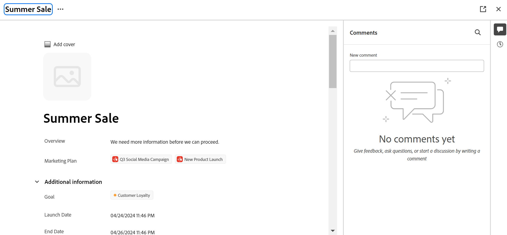
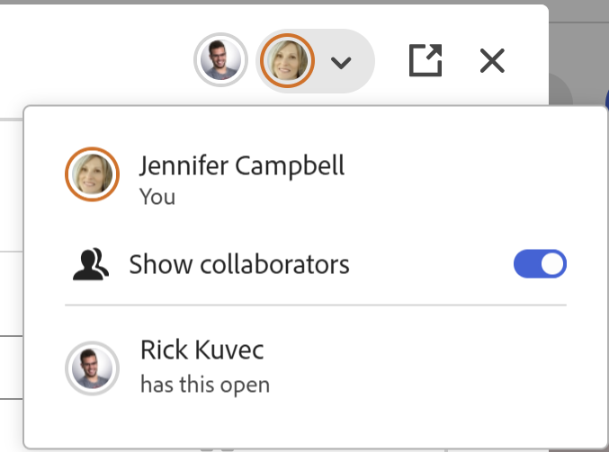

# Modifica record

Le informazioni evidenziate in questa pagina si riferiscono a funzionalità non ancora generalmente disponibili. È disponibile solo nell’ambiente di anteprima per tutti i clienti. Dopo i rilasci mensili in Produzione, le stesse funzioni sono disponibili nell’ambiente di Produzione per i clienti che hanno abilitato i rilasci rapidi. 

Per informazioni sulle versioni rapide, vedere [Abilitare o disabilitare le versioni rapide per l&#39;organizzazione](/help/quicksilver/administration-and-setup/set-up-workfront/configure-system-defaults/enable-fast-release-process.md). 

{{planning-important-intro}}

È possibile modificare le informazioni sui record in Adobe Workfront Planning modificando i valori dei campi associati ai record.

È necessario creare i tipi di record prima di iniziare a creare e modificare i record.

Per informazioni, vedere [Creare tipi di record](/help/quicksilver/planning/architecture/create-record-types.md).

Per informazioni sulla creazione di record, vedere [Crea record](/help/quicksilver/planning/records/create-records.md).

&lt;!— menziona qui che i campi nella visualizzazione Dettagli sono gli stessi di quelli nella visualizzazione tabella — questo articolo è collegato da Gestisci visualizzazioni record uno per fare riferimento a queste informazioni—>

## Requisiti di accesso

+++ Espandi per visualizzare i requisiti di accesso.

Per eseguire i passaggi descritti in questo articolo, è necessario disporre dei seguenti diritti di accesso:

<table style="table-layout:auto"> 
<col> 
</col> 
<col> 
</col> 
<tbody> 
    <tr> 
<tr> 
<td> 
   
 Prodotti
 </td> 
   <td> 
   <ul><li>
 Adobe Workfront
</li> 
   <li>
 Adobe Workfront Planning
</li></ul></td> 
  </tr>   
<tr> 
   <td role="rowheader">
Piano Adobe Workfront*
</td> 
   <td> 

Uno dei seguenti piani di Workfront:
 
<ul><li>Seleziona</li> 
<li>Prime</li> 
<li>Ultimate</li></ul> 

Workfront Planning non è disponibile per i piani Workfront legacy
 
   </td> 
<tr> 
   <td role="rowheader">
Pacchetto Adobe Workfront Planning*
</td> 
   <td> 

Qualsiasi 
 

Per ulteriori informazioni su quanto incluso in ogni piano di Workfront Planning, contattare l'account manager Workfront. 
 
   </td> 
 <tr> 
   <td role="rowheader">
Piattaforma Adobe Workfront
</td> 
   <td> 

Per poter accedere a tutte le funzionalità di Workfront Planning, l’istanza di Workfront della tua organizzazione deve essere integrata in Adobe Unified Experience.
 

Per ulteriori informazioni, vedere <a href="/help/quicksilver/workfront-basics/navigate-workfront/workfront-navigation/adobe-unified-experience.md">Esperienza unificata Adobe per Workfront</a>. 
 
   </td> 
   </tr> 
  </tr> 
  <tr> 
   <td role="rowheader">
Licenza Adobe Workfront*
</td> 
   <td> 
Standard
 
   
Workfront Planning non è disponibile per le licenze Workfront legacy
 
  </td> 
  </tr> 
  <tr> 
   <td role="rowheader">
Configurazione del livello di accesso
</td> 
   <td> 
Nessun controllo del livello di accesso per Adobe Workfront Planning
   
</td> 
  </tr> 
<tr> 
   <td role="rowheader">
Autorizzazioni oggetto
</td> 
   <td>  
Autorizzazioni Contribute o superiori per un'area di lavoro  e un tipo di record </a> 
  
   
Gli amministratori di sistema dispongono delle autorizzazioni per tutte le aree di lavoro, incluse quelle non create
  </td> 
  </tr> 
<tr> 
   <td role="rowheader">
Modello layout
</td> 
   <td> 
A tutti gli utenti, inclusi gli amministratori di Workfront, deve essere assegnato un modello di layout che includa l'area Planning nel menu principale. 
 </td> 
  </tr> 
</tbody> 
</table>

*Per ulteriori informazioni sui requisiti di accesso a Workfront, vedere [Requisiti di accesso nella documentazione di Workfront](/help/quicksilver/administration-and-setup/add-users/access-levels-and-object-permissions/access-level-requirements-in-documentation.md).

+++

<!--replace the layout template info in the table with this at release: 

In the Production environment, all users including the System Administrators must be assigned to a layout template that includes the Planning areas.

In the Preview environment, Standard users and System Administrators have the Planning area enabled by default.

-->

## Considerazioni sulla modifica dei record

* Se si dispone delle autorizzazioni necessarie per l&#39;area di lavoro, è possibile modificare i record creati o quelli creati da altri utenti.
* È possibile modificare i campi record dalle seguenti aree:

   * Anteprima del record in una visualizzazione record
   * Pagina dettagli record
   * In linea, in una vista a tabella.

* Quando un utente modifica un record in una visualizzazione, le modifiche sono immediatamente visibili in tutte le visualizzazioni e le pagine dei record a tutti gli altri utenti.

* I seguenti tipi di campi vengono aggiornati automaticamente e non è possibile modificarne i valori manualmente:
   * Campi collegati da altri record
   * Campi di tipo formula
   * Campi di sistema (Creato da, Data di creazione, Autore ultima modifica, Data ultima modifica)
* Se i record visualizzati sono collegati ad altri record, le nuove informazioni dei record che si sta modificando verranno applicate ai record collegati.
* Non è possibile modificare i record in blocco. <!--this will probably change-->
* Gli URL vengono riconosciuti come collegamenti nei tipi di campi di testo a riga singola solo quando iniziano con: http://, https://, ftp:// o www. .
* È possibile aggiungere un&#39;immagine di copertina a ogni record. L&#39;immagine è univoca per ogni record e non si applica a tutti i record contemporaneamente.
* È possibile modificare l&#39;ordine dei campi in una pagina record e aggiungere un&#39;immagine di copertina per un record. Per ulteriori informazioni, vedere [Gestire il layout della pagina record](/help/quicksilver/planning/records/manage-the-record-page.md).

## Modifica record

È possibile modificare un record dalle seguenti aree:

* [Dalla vista tabella di un tipo di record](#edit-a-record-inline-in-the-table-view-of-a-record-type)
* [Dall&#39;anteprima del record in una visualizzazione](#edit-a-record-from-the-records-preview-in-a-view)
* [Dalla pagina del record](#edit-a-record-from-the-records-page)
* [Da un oggetto Workfront nella sezione Planning](#edit-a-record-from-a-workfront-object-in-the-planning-section)

### Modificare un record in linea nella vista tabella di un tipo di record

Quando si modificano i record dalla vista tabella, viene indicato quale campo viene modificato da altri utenti al momento della visualizzazione del record.

Per ulteriori informazioni, vedere [Gestire le visualizzazioni dei record](/help/quicksilver/planning/views/manage-record-views.md).

{{step1-to-planning}}

1. Fare clic sull&#39;area di lavoro di cui si desidera modificare i record

   Viene aperto il workspace e i tipi di record vengono visualizzati come schede.
1. Fare clic su una scheda del tipo di record.

   Viene visualizzata la pagina del tipo di record.
1. (Condizionale) Fare clic sulla scheda di una visualizzazione tabella oppure fare clic su **+ Visualizzazione** per creare una visualizzazione tabella. La vista tabella deve essere quella predefinita, a meno che il tipo di record non sia stato visualizzato in un altro tipo di vista all&#39;ultimo accesso.

   I record associati al tipo di record selezionato vengono visualizzati nella vista tabella.
1. Fare clic all&#39;interno della riga di un record per iniziare a modificare le informazioni sul record in linea.

   

   >[!TIP]
   >
   >  Non è possibile modificare le informazioni per i campi seguenti, in quanto sono di sola lettura e Workfront li aggiorna automaticamente:
   >  
   >  * Campi collegati creati mediante la connessione di tipi di record. Per ulteriori informazioni, vedere [Connetti tipi di record](/help/quicksilver/planning/architecture/connect-record-types.md).
   >  * Campi dei tipi seguenti: Creato da, Data di creazione, Ultima modifica da, Data ultima modifica, Campi formula.

1. (Facoltativo e condizionale) Quando modifichi un campo di tipo Paragrafo, utilizza le seguenti **opzioni di formattazione Rich Text**:

   * Bold
   * Italic
   * Sottolinea
   * Aggiungi un collegamento
   * Aggiungere un elenco puntato
   * Aggiungere un elenco numerato

   

1. (Facoltativo) Fare doppio clic su un campo record connesso per aggiungere record o oggetti connessi a un altro record. Per ulteriori informazioni, vedere [Connetti record](/help/quicksilver/planning/records/connect-records.md).
1. Premi **Invio** sulla tastiera o fai clic all&#39;esterno di una riga per salvare le modifiche. Le modifiche vengono salvate automaticamente. Un indicatore **Salvato** viene visualizzato brevemente nell&#39;angolo superiore destro della visualizzazione tabella per indicare che le modifiche sono state salvate.

1. (Facoltativo) Per copiare e incollare informazioni da un campo all&#39;altro, effettuare una delle seguenti operazioni:

   * Copiare uno o più valori esistenti di un campo, quindi incollarli in un campo dello stesso tipo in un altro record
   * Fare clic sull&#39;intestazione di una colonna per selezionarla e copiarla, quindi fare clic sull&#39;intestazione di un&#39;altra colonna e incollare il contenuto della colonna copiata. Le colonne devono contenere tipi di campo simili.
   * Con il tasto Maiusc premuto, fai clic su per selezionare più righe in una tabella, copia le informazioni nelle righe selezionate, quindi fai clic su una riga diversa e incolla le informazioni selezionate nella nuova riga e nelle righe successive.
   * Copiare le informazioni da una cella, quindi selezionare più celle e incollare le stesse informazioni in più celle. È possibile selezionare più celle e incollare le stesse informazioni in più celle da righe e colonne adiacenti.
   * Selezionare l&#39;angolo inferiore destro di una cella esistente contenente le informazioni da copiare, quindi trascinarlo e rilasciarlo nelle celle adiacenti in cui si desidera incollare le stesse informazioni. Tutte le celle devono contenere lo stesso tipo di informazioni.

     

   * Copiare una o più celle da un&#39;origine esterna, ad esempio un file di Excel, quindi incollarle in uno dei seguenti tipi di campi:

      * Campi di connessione di Workfront Planning.
      * Campi Persone. Sono supportati solo i campi con un valore.

     Non è possibile copiare informazioni da un’origine esterna e incollarle in altri tipi di campi, inclusi i campi di connessione Workfront o AEM Assets.

   >[!NOTE]
   >
   >Considera quanto segue:
   >
   >* Utilizza le seguenti scelte rapide da tastiera per copiare e incollare le informazioni:
   >   * Copia: CTRL + C (⌘ + C per Mac)
   >   * Incolla: CTRL + V (⌘ + V per Mac)
   >
   >* Non è possibile copiare e incollare i valori dei campi nella pagina record. Questa funzionalità è supportata solo nella vista tabella di un tipo di record.
   >* Non è possibile copiare e incollare valori di campo per i tipi di campo seguenti:
   >
   >    * Campi di ricerca creati durante la connessione di tipi di record. È possibile copiare e incollare campi record collegati. Per ulteriori informazioni, vedere [Connetti tipi di record](/help/quicksilver/planning/architecture/connect-record-types.md).
   >    * Campi dei seguenti tipi: Creato da, Data di creazione, Ultima modifica da, Data ultima modifica

1. (Facoltativo) Utilizzare le seguenti scelte rapide da tastiera per annullare o ripetere la modifica o la copia e l&#39;incollamento delle informazioni del record:

   * CTRL + Z (⌘ + Z per Mac) per annullare una modifica
   * CTRL + MAIUSC + Z (⌘ + MAIUSC + Z per Mac) per ripetere una modifica

   >[!TIP]
   >
   >    È possibile utilizzare più volte le scelte rapide da tastiera in una riga per annullare più modifiche.

1. (Facoltativo) Aggiungi una miniatura a un record. Per informazioni, vedere [Aggiungere una miniatura a un record](/help/quicksilver/planning/records/add-thumbnails-to-records.md).

### Modificare un record dall&#39;anteprima del record in una visualizzazione

{{step1-to-planning}}

1. Fare clic sull&#39;area di lavoro di cui si desidera modificare i record

   Viene aperto il workspace e i tipi di record vengono visualizzati come schede.

1. Fare clic su una scheda del tipo di record.

   Viene visualizzata la pagina del tipo di record.

1. In una visualizzazione di qualsiasi tipo, fare clic sul record

   Oppure

   Nella vista tabella fare clic sull&#39;icona **Apri dettagli**  nella prima colonna. L&#39;anteprima del record viene visualizzata nella vista.

   

1. (Facoltativo) Fai clic sul menu **Altro** a destra del titolo del record, quindi fai clic su **Rinomina**. Il campo visualizzato come titolo del record verrà aggiornato.

   Il titolo del record è il campo principale del record visualizzato in una vista a tabella. Per informazioni, vedere [Panoramica del campo primario](/help/quicksilver/planning/fields/primary-field-overview.md).

1. Inizia a modificare le informazioni del campo nell’anteprima del record.

   >[!TIP]
   >
   >  Non è possibile modificare le informazioni per i campi seguenti, in quanto sono di sola lettura e Workfront li aggiorna automaticamente:
   >  
   >  * Ricercare campi da altri record creati tramite la connessione di tipi di record. Per ulteriori informazioni, vedere [Connetti tipi di record](/help/quicksilver/planning/architecture/connect-record-types.md).
   >  * Campi dei tipi seguenti: Creato da, Data di creazione, Ultima modifica da, Data ultima modifica, Campi formula.

1. (Facoltativo) Fare clic su **Aggiungi copertina** per aggiungere una copertina al record. Per ulteriori informazioni, vedere [Aggiungere una copertina a un record](/help/quicksilver/planning/records/add-a-cover-image-to-a-record.md).

1. (Facoltativo) Passa il puntatore sull&#39;icona della miniatura, quindi fai clic su **Altro**  > **Modifica miniatura** per aggiungere un&#39;immagine di miniatura. Per informazioni, vedere [Aggiungere una miniatura a un record](/help/quicksilver/planning/records/add-thumbnails-to-records.md).

   Workfront salva automaticamente le modifiche.

1. (Facoltativo) Fai clic sull&#39;**indicatore in tempo reale**  nell&#39;angolo superiore destro della casella di anteprima del record, quindi abilita l&#39;impostazione **Mostra collaboratori** per evidenziare i campi modificati in tempo reale da altri utenti.

   In quest’area vengono visualizzati i nomi e gli avatar di tutti gli utenti che accedono contemporaneamente al record.

   Quando l’impostazione è disattivata, gli avatar e i nomi sono elencati nell’area dell’indicatore in tempo reale e i campi in fase di modifica non vengono evidenziati.

   

1. (Facoltativo) Fai clic sull&#39;icona del menu **Esporta**  per esportare i dettagli del record. Per informazioni, vedere [Esportare i dettagli di un record](/help/quicksilver/planning/records/export-the-record-page.md).

1. (Facoltativo) Fai clic sull&#39;icona **Apri in una nuova scheda**  <!--check the icon; they are changing it--> nell&#39;angolo superiore destro dell&#39;anteprima del record per aprire la pagina del record in una nuova scheda. Continua a modificare il record come descritto in [Modifica un record dalla sezione della pagina del record](#edit-a-record-from-the-records-page) in questo articolo.

### Modificare un record dalla pagina del record

{{step1-to-planning}}

1. Fare clic sull&#39;area di lavoro di cui si desidera modificare i record

   Viene aperto il workspace e i tipi di record vengono visualizzati come schede.

1. Fare clic su una scheda del tipo di record.

   Viene visualizzata la pagina del tipo di record.

1. Esegui una delle operazioni seguenti:

   * Da qualsiasi visualizzazione, accedere all&#39;anteprima del record come descritto nella sezione [Modificare un record dall&#39;anteprima del record in una visualizzazione](#edit-a-record-from-the-records-preview-in-a-view) di questo articolo, quindi fare clic sull&#39;icona **Apri in una nuova scheda**  <!--check the icon; they are changing it--> nell&#39;angolo superiore destro dell&#39;anteprima del record per aprire la pagina del record in una nuova scheda.

   * Dalla visualizzazione **Tabella**, passa il puntatore sul nome di un record, quindi fai clic sul menu **Altro** , quindi fai clic su **Visualizza**

     

     Viene visualizzata la pagina del record.

     

1. (Facoltativo) Fai clic sul menu **Altro** a destra del titolo del record, quindi fai clic su **Rinomina**. Il campo visualizzato come titolo del record verrà aggiornato.

   Il titolo del record è il campo principale del record visualizzato in una vista a tabella. Per informazioni, vedere [Gestire la visualizzazione della tabella](/help/quicksilver/planning/views/manage-the-table-view.md).

1. Fare clic su un campo modificabile nella pagina record per modificarlo.

   >[!TIP]
   >
   >  Non è possibile modificare le informazioni per i campi seguenti, in quanto sono di sola lettura e Workfront li aggiorna automaticamente:
   >  
   >  * Campi collegati creati mediante la connessione di tipi di record. Per ulteriori informazioni, vedere [Connetti tipi di record](/help/quicksilver/planning/architecture/connect-record-types.md).
   >  * Campi dei tipi seguenti: Creato da, Data di creazione, Ultima modifica da, Data ultima modifica, Campi formula.

1. (Facoltativo) Per visualizzare la descrizione di un campo, fai clic sull’icona delle informazioni a destra di qualsiasi campo visualizzato.
1. (Facoltativo) Fai clic su **Aggiungi copertina** per aggiungere una copertina al record

   Oppure

   Passa il puntatore del mouse sull&#39;immagine di copertina esistente, quindi fai clic sul menu **Altro**  > **Carica** per aggiungere una nuova immagine di copertina per il record.

   Per ulteriori informazioni, vedere [Aggiungere una copertina a un record](/help/quicksilver/planning/records/add-a-cover-image-to-a-record.md).

1. (Facoltativo) Passa il puntatore del mouse su una miniatura esistente o sull&#39;**icona miniatura** , quindi fai clic sul menu **Altro**  > **Modifica miniatura** per aggiungere una miniatura per il record.

   Per ulteriori informazioni, vedere [Aggiungere una miniatura a un record](/help/quicksilver/planning/records/add-thumbnails-to-records.md).

   Workfront salva automaticamente le modifiche.

1. (Facoltativo) Fai clic sull&#39;**indicatore in tempo reale**  nell&#39;angolo superiore destro della pagina del record, quindi abilita l&#39;impostazione **Mostra collaboratori** per evidenziare i campi modificati in tempo reale da altri utenti.

   In quest’area vengono visualizzati i nomi e gli avatar di tutti gli utenti che accedono contemporaneamente al record.

   Quando l’impostazione è disattivata, gli avatar e i nomi sono elencati nell’area dell’indicatore in tempo reale e i campi in fase di modifica non vengono evidenziati.

   

1. (Facoltativo) Fai clic sull&#39;icona del menu **Esporta**  per esportare i dettagli del record. Per informazioni, vedere [Esportare i dettagli di un record](/help/quicksilver/planning/records/export-the-record-page.md).

## Modificare un record da un oggetto Workfront nella sezione Planning

Dopo aver collegato i record agli oggetti di Workfront, è possibile modificare i record di Workfront Planning in Workfront dalla sezione Planning dell&#39;oggetto.

Per ulteriori informazioni, vedere [Gestire le connessioni record dagli oggetti Workfront](/help/quicksilver/planning/records/manage-records-in-planning-section.md).
