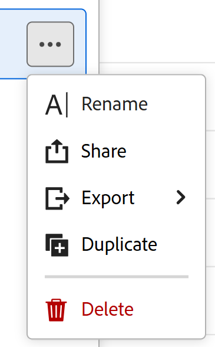

# Esporta record dalla vista tabella

<!--The information on this page refers to functionality not yet generally available. It is available only in the Preview environment for all customers. After the monthly releases to Production, the same features are also available in the Production environment for customers who enabled fast releases.    

For information about fast releases, see [Enable or disable fast releases for your organization](/help/quicksilver/administration-and-setup/set-up-workfront/configure-system-defaults/enable-fast-release-process.md). -->

{{planning-important-intro}}

È possibile esportare i record e le relative informazioni dalla vista tabella in un file Excel o CSV in Adobe Workfront Planning.

## Requisiti di accesso

+++ Espandi per visualizzare i requisiti di accesso per la funzionalità in questo articolo. 

<table style="table-layout:auto"> 
<col> 
</col> 
<col> 
</col> 
<tbody> 
    <tr> 
<tr> 
</tr>   
<tr> 
   <td role="rowheader">
Pacchetto Adobe Workfront
</td> 
   <td> 
<ul> 
<li>
Qualsiasi pacchetto Workfront e Planning
</li>
Oppure
<li>
Qualsiasi flusso di lavoro e qualsiasi pacchetto di Planning
</li></ul>

Per ulteriori informazioni su ciò che è incluso in ogni pacchetto Workfront Planning, contattare il rappresentante del proprio account Workfront. 
 
   </td> 
  <tr> 
   <td role="rowheader">
Licenza Adobe Workfront
</td> 
   <td>
Chiaro o superiore

   </td> 
  </tr> 
  <tr> 
   <td role="rowheader">
Autorizzazioni oggetto
</td> 
   <td> 
Visualizzare o modificare le autorizzazioni per un'area di lavoro e un tipo di record
   
   
Visualizzare o autorizzazioni superiori per una visualizzazione

</td> 
  </tr> 
  <tr>
   <td role="rowheader">
Modello layout
</td>
   <td> Agli utenti con una licenza Light o Contributor deve essere assegnato un modello di layout che includa Planning.
   
Per impostazione predefinita, le aree Pianificazione sono attivate dagli utenti standard e dagli amministratori di sistema.

</li></ul>
</td>
  </tr>  
</tbody> 
</table>

Per ulteriori informazioni sui requisiti di accesso a Workfront, vedere [Requisiti di accesso nella documentazione di Workfront](/help/quicksilver/administration-and-setup/add-users/access-levels-and-object-permissions/access-level-requirements-in-documentation.md).

+++   

<!--Old:
<table style="table-layout:auto"> 
<col> 
</col> 
<col> 
</col> 
<tbody> 
    <tr> 
<tr> 
<td> 
   
 Products
 </td> 
   <td> 
   <ul><li>
 Adobe Workfront
</li> 
   <li>
 Adobe Workfront Planning
</li></ul></td> 
  </tr>   
<tr> 
   <td role="rowheader">
Adobe Workfront plan*
</td> 
   <td> 

Any of the following Workfront plans:
 
<ul><li>Select</li> 
<li>Prime</li> 
<li>Ultimate</li></ul> 

Workfront Planning is not available for legacy Workfront plans
 
   </td> 
<tr> 
   <td role="rowheader">
Adobe Workfront Planning package*
</td> 
   <td> 

Any 
 

For more information about what is included in each Workfront Planning plan, contact your Workfront account manager. 
 
   </td> 
 <tr> 
   <td role="rowheader">
Adobe Workfront platform
</td> 
   <td> 

Your organization's instance of Workfront must be onboarded to the Adobe Unified Experience to be able to access Workfront Planning.
 

For more information, see <a href="/help/quicksilver/workfront-basics/navigate-workfront/workfront-navigation/adobe-unified-experience.md">Adobe Unified Experience for Workfront</a>. 
 
   </td> 
   </tr> 
  </tr> 
  <tr> 
   <td role="rowheader">
Adobe Workfront license*
</td> 
   <td>
 Light or higher 

   
Workfront Planning is not available for legacy Workfront licenses
 
  </td> 
  </tr> 
  <tr> 
   <td role="rowheader">
Access level configuration
</td> 
   <td> 
There are no access level controls for Adobe Workfront Planning
   
</td> 
  </tr> 
<tr> 
   <td role="rowheader">
Object permissions
</td> 
   <td>   
View or higher permissions to a view
  
   </td> 
  </tr> 
</tbody> 
</table> -->

## Esporta record dalla vista tabella

Quando esportate la vista tabella, tenete presente quanto segue:

* Le informazioni esportate in un file di Excel mantengono i filtri, i raggruppamenti e gli ordinamenti applicati alla vista tabella in Workfront Planning. I raggruppamenti non sono visibili nel file CSV.

* Le miniature e i colori di riga personalizzati non sono supportati nei file esportati.

* Vengono esportati solo i campi resi visibili nell’interfaccia di Workfront. I campi nascosti non vengono esportati.

Per esportare informazioni dalla vista tabella o da un tipo di record:

1. Passare a una pagina del tipo di record e fare clic su una scheda della vista tabella.
1. Esegui una delle operazioni seguenti:

   * Passa il puntatore del mouse sul nome della scheda di visualizzazione della tabella, quindi fai clic sul menu **Altro**  a destra del nome della visualizzazione, quindi fai clic su **Esporta**.

   

   * Fai clic su **Condividi** > **Esporta la visualizzazione corrente**. Questa opzione è disponibile solo quando viene visualizzata la vista tabella.

   

1. Selezionare uno dei formati seguenti:

   * **Excel**
   * **CSV**

   >[!IMPORTANT]
   >
   >Non è possibile esportare informazioni dalla vista tabella quando si visualizza una vista diversa sullo schermo. Per accedere all&#39;opzione Esporta nel menu Altro, è necessario visualizzare la vista tabella che si desidera esportare.

   Il file viene scaricato nel computer.

1. (Facoltativo) Vai alla cartella dei download sul tuo computer e trova il file scaricato.

   Il nome del file esportato è nel seguente formato:

   `Name of the view - name of the record type`

   Ad esempio, una visualizzazione tabella per il tipo di record Campagne genera un file denominato `Table view - Campaigns`.

   Nel file vengono visualizzate le seguenti informazioni:

   * Le intestazioni di colonna sono evidenziate in nero nel file Excel
   * Tutti i campi visibili nell’interfaccia di Workfront, ordinati e filtrati in base agli stessi criteri
   * I raggruppamenti vengono mantenuti nel file di Excel

   È ora possibile condividere i file esportati con altri utenti o allegarli a qualsiasi comunicazione.

