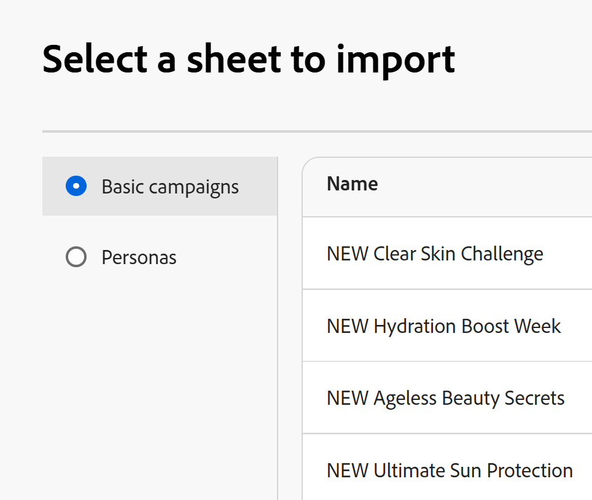

# Creare record importando informazioni da un file CSV o Excel

Le informazioni contenute in questa pagina si riferiscono a funzionalità non ancora generalmente disponibili. È disponibile solo nell’ambiente di anteprima per tutti i clienti. Dopo i rilasci mensili in Produzione, le stesse funzioni sono disponibili nell’ambiente di Produzione per i clienti che hanno abilitato i rilasci rapidi. 

Per informazioni sulle versioni rapide, vedere [Abilitare o disabilitare le versioni rapide per l&#39;organizzazione](/help/quicksilver/administration-and-setup/set-up-workfront/configure-system-defaults/enable-fast-release-process.md). 

{{planning-important-intro}}

I record sono singole istanze di tipi di record, che sono i tipi di oggetto di Adobe Workfront Planning. In Workfront Planning è possibile creare record importando informazioni da un file CSV o Excel.

Per ulteriori informazioni sulla creazione di record, vedere [Crea record](/help/quicksilver/planning/records/create-records.md).

## Requisiti di accesso

+++ Espandere per visualizzare i requisiti di accesso per Workfront Planning.

Per eseguire i passaggi descritti in questo articolo, è necessario disporre dei seguenti diritti di accesso:

<table style="table-layout:auto"> 
<col> 
</col> 
<col> 
</col> 
<tbody> 
    <tr> 
<tr> 
<td> 
   
 Prodotti
 </td> 
   <td> 
   <ul><li>
 Adobe Workfront
</li> 
   <li>
 Adobe Workfront Planning
</li></ul></td> 
  </tr>   
<tr> 
   <td role="rowheader">
Piano Adobe Workfront*
</td> 
   <td> 

Uno dei seguenti piani di Workfront:
 
<ul><li>Seleziona</li> 
<li>Prime</li> 
<li>Ultimate</li></ul> 

Workfront Planning non è disponibile per i piani Workfront legacy
 
   </td> 
<tr> 
   <td role="rowheader">
Pacchetto Adobe Workfront Planning*
</td> 
   <td> 

Qualsiasi 
 

Per ulteriori informazioni su quanto incluso in ogni piano di Workfront Planning, contattare l'account manager Workfront. 
 
   </td> 
 <tr> 
   <td role="rowheader">
Piattaforma Adobe Workfront
</td> 
   <td> 

Per poter accedere a tutte le funzionalità di Workfront Planning, l’istanza di Workfront della tua organizzazione deve essere integrata in Adobe Unified Experience.
 

Per ulteriori informazioni, vedere <a href="/help/quicksilver/workfront-basics/navigate-workfront/workfront-navigation/adobe-unified-experience.md">Esperienza unificata Adobe per Workfront</a>. 
 
   </td> 
   </tr> 
  </tr> 
  <tr> 
   <td role="rowheader">
Licenza Adobe Workfront*
</td> 
   <td> Standard
   
Workfront Planning non è disponibile per le licenze Workfront legacy
 
  </td> 
  </tr> 
  <tr> 
   <td role="rowheader">
Configurazione del livello di accesso
</td> 
   <td> 
Nessun controllo del livello di accesso per Adobe Workfront Planning
 
   
Modificare l'accesso in Workfront per i tipi di oggetto che si desidera creare (progetti, programmi e portafogli) quando si collegano i record. 
  
</td> 
  </tr> 
<tr> 
   <td role="rowheader">
Autorizzazioni oggetto
</td> 
   <td> 
Autorizzazioni di Contribute o di livello superiore per l'area di lavoro a cui si desidera aggiungere record. 
  
   
Gli amministratori di sistema dispongono delle autorizzazioni per tutte le aree di lavoro, incluse quelle non create

   
Gestisci le autorizzazioni per gli oggetti Workfront (portfolio) per aggiungere oggetti figlio (progetti).

   </td> 
  </tr> 
<tr> 
   <td role="rowheader">
Modello di layout
</td> 
   <td> 
A tutti gli utenti, inclusi gli amministratori di Workfront, deve essere assegnato un modello di layout che includa l'area Planning nel menu principale 
 </td> 
  </tr> 
</tbody> 
</table>

*Per ulteriori informazioni sui requisiti di accesso a Workfront, vedere [Requisiti di accesso nella documentazione di Workfront](/help/quicksilver/administration-and-setup/add-users/access-levels-and-object-permissions/access-level-requirements-in-documentation.md).

+++

## Considerazioni sull&#39;importazione di record utilizzando un file Excel o CSV

* Le intestazioni delle colonne di ciascun foglio diventano i campi associati ai record.
* Ogni riga di ogni foglio diventa un record univoco associato.
* Se il file di Excel contiene più fogli, vengono importate solo le informazioni di un foglio selezionate durante il processo di importazione.
* Il file non deve superare i seguenti valori:
   * 25.000 righe
   * 500 colonne
* Il file non deve superare i 5 MB.
* I fogli vuoti non sono supportati.
* I campi dei tipi seguenti non sono supportati e non possono essere mappati ai campi del foglio di importazione:
   * Connessioni e campi di ricerca dei record connessi <!--or connected Workfront objects-->
   * Campi formula
   * Data di creazione, Creato da
   * Data ultima modifica, Autore ultima modifica
   * Persone
   * Se viene importato un campo a selezione multipla o singola che dispone di più scelte rispetto a un campo simile in Planning, le opzioni aggiuntive vengono create durante l&#39;importazione. Solo gli utenti con le autorizzazioni di gestione per l&#39;area di lavoro possono importare nuove scelte.

## Creare record importando un file CSV o Excel

{{step1-to-planning}}

1. Fare clic sull&#39;area di lavoro in cui si desidera creare i record.

   Oppure

   Da un workspace, espandere la freccia rivolta verso il basso a destra del nome di un workspace esistente, cercare un workspace e selezionarlo quando viene visualizzato nell&#39;elenco.
1. Fare clic sulla scheda del tipo di record in cui si desidera importare i record.
1. Fai clic su **Nuovo record** nell&#39;angolo superiore destro della schermata.
1. Fai clic su **Carica dal file**, quindi su **Continua**. <!--add screen shot when all three buttons are added - with the Submit a request button-->
1. Trascina e rilascia un file Excel o CSV salvato in precedenza sul computer, oppure fai clic su **Seleziona un file CSV o Excel** per cercarne uno.
1. Fare clic su **Anteprima e modifica**.
1. (Condizionale) Se il file importato contiene più di un foglio, selezionare il pulsante di opzione del foglio da importare nella casella **Seleziona un foglio da importare**, quindi fare clic su **Avanti**. In caso contrario, procedere al passaggio successivo.

   
1. In **Mappare i campi di Planning nelle intestazioni di colonna** selezionare il **campo di Planning** che corrisponde meglio alle informazioni in ciascuna colonna del foglio.

   

   Ogni riga rappresenta un nuovo record. Nella casella Anteprima e modifica vengono visualizzati solo i primi 10 record.

1. (Facoltativo e condizionale) Se disponi delle autorizzazioni di gestione per l&#39;area di lavoro, seleziona **Crea opzioni mancanti** nell&#39;angolo inferiore sinistro dello schermo. Quando questa opzione è attivata, vengono aggiunte le scelte mancanti dei campi a selezione singola e multipla.

   >[!NOTE]
   >
   >Ad esempio, se il tipo di record selezionato dispone di un campo Stato a selezione singola con le opzioni Nuovo, In corso e Chiuso e un campo Stato importato da un file dispone anche di una scelta Stato in sospeso, viene aggiunta anche la scelta Stato in sospeso.
   >
   >Se non si dispone delle autorizzazioni Gestione per l&#39;area di lavoro, è possibile importare i record, ma le scelte aggiuntive non verranno create. Viene invece visualizzato il seguente messaggio nell&#39;angolo superiore destro della casella Mappa i campi di Planning sulle intestazioni di colonna: **Le scelte che non esistono nella connessione, i campi a selezione singola o multipla non verranno aggiunti**.

   <!--when we add connected records and the info icon in the tool changes, also add those items to this step and to the NOTE-->

1. Fai clic su **Importa**.

   Le informazioni seguenti vengono importate in Workfront Planning:

   * Nuovi record visualizzati nella parte inferiore della vista tabella del tipo di record selezionato.
   * Nuovi valori di campo per i campi esistenti associati a ciascun record.
   * Nuove scelte di un campo a selezione multipla o singola non esistente in Planning.  <!--when we add connected records - add those here too-->

   È possibile iniziare a gestire campi e record nella pagina dei tipi di record.

   Tutti coloro che hanno accesso a Workfront Planning e all&#39;area di lavoro ora possono visualizzare e modificare i record importati e le relative informazioni.
