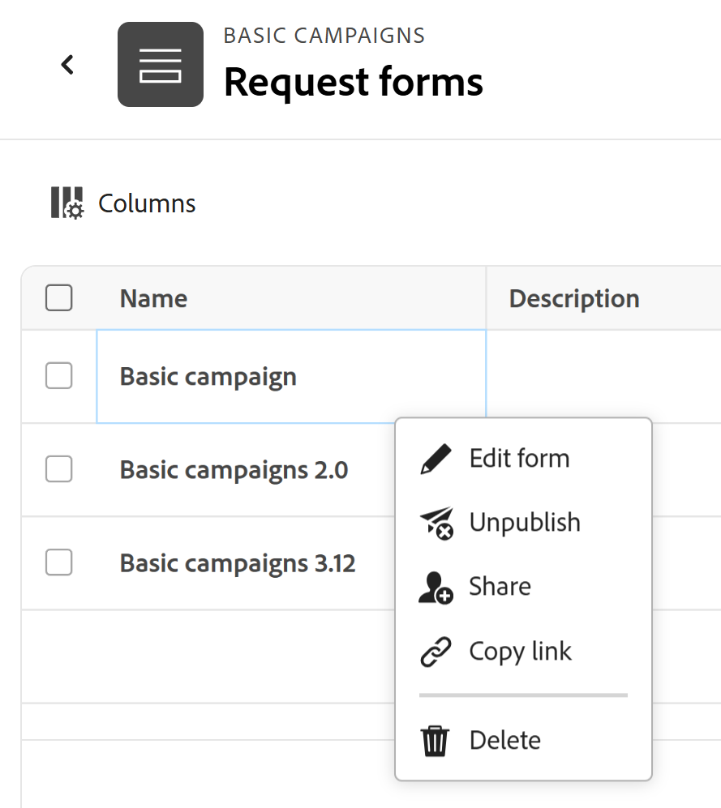

# Creazione e gestione di un modulo di richiesta in Adobe Workfront Planning

<!--update the metadata with real information when making this available in TOC and in the left nav-->

<!--take Preview and Production references at Production time-->

Le informazioni evidenziate in questa pagina si riferiscono a funzionalità non ancora generalmente disponibili. È disponibile solo nell’ambiente di anteprima per tutti i clienti. Dopo i rilasci mensili in Produzione, le stesse funzioni sono disponibili nell’ambiente di Produzione per i clienti che hanno abilitato i rilasci rapidi. 

Per informazioni sulle versioni rapide, vedere [Abilitare o disabilitare le versioni rapide per l&#39;organizzazione](/help/quicksilver/administration-and-setup/set-up-workfront/configure-system-defaults/enable-fast-release-process.md). 

{{planning-important-intro}}

È possibile creare un modulo di richiesta e associarlo a un tipo di record in Adobe Workfront Planning. È quindi possibile condividere il modulo con altri utenti, che possono inviare richieste per la creazione di record.

In questo articolo viene descritto come un manager area di lavoro può creare un modulo di richiesta associato a un tipo di record.

Per informazioni sull&#39;invio di una richiesta a un tipo di record per la creazione di un record, vedere [Inviare richieste di Adobe Workfront Planning per la creazione di record](/help/quicksilver/planning/requests/submit-requests.md).

## Requisiti di accesso

+++ Espandi per visualizzare i requisiti di accesso per la funzionalità in questo articolo.

Per eseguire i passaggi descritti in questo articolo, è necessario disporre dei seguenti diritti di accesso:

<table style="table-layout:auto">
 <col>
 </col>
 <col>
 </col>
 <tbody>
    <tr>
<tr>
<td>
   
 Prodotti
 </td>
   <td>
   <ul><li>
 Adobe Workfront
</li>
   <li>
 Adobe Workfront Planning
</li></ul></td>
  </tr>  
 <tr>
   <td role="rowheader">
Piano Adobe Workfront*
</td>
   <td>

Uno dei seguenti piani di Workfront:

<ul><li>Seleziona</li>
<li>Prime</li>
<li>Ultimate</li></ul>

Workfront Planning non è disponibile per i piani Workfront legacy

   </td>

<tr>
   <td role="rowheader">
Pacchetto Adobe Workfront Planning*
</td>
   <td>

Qualsiasi 
  

Per ulteriori informazioni su quanto incluso in ogni piano di Workfront Planning, contattare l'account manager Workfront. </td>

<tr>
   <td role="rowheader">
Piattaforma Adobe Workfront
</td>
   <td>

Per poter accedere a tutte le funzionalità di Workfront Planning, l’istanza di Workfront della tua organizzazione deve essere integrata in Adobe Unified Experience.

Per ulteriori informazioni, vedere <a href="/help/quicksilver/workfront-basics/navigate-workfront/workfront-navigation/adobe-unified-experience.md">Esperienza unificata Adobe per Workfront</a>. 

   </td>

</tr>
  </tr>
  <tr>
   <td role="rowheader">
Licenza Adobe Workfront*
</td>
   <td>
   
Standard

   
Workfront Planning non è disponibile per le licenze Workfront legacy

  </td>
  </tr>
  <tr>
   <td role="rowheader">
Configurazione del livello di accesso
</td>
   <td> 
Nessun controllo del livello di accesso per Adobe Workfront Planning
  
</td>
  </tr>
<tr>
   <td role="rowheader">
Autorizzazioni oggetto
</td>
   <td>
   <ul>
   <li>
Gestisci le autorizzazioni per un'area di lavoro  e tipo di record 
</li>
    <li>
Gli amministratori di sistema possono gestire le aree di lavoro che non hanno creato. 
</li>
    </ul>
   
Per informazioni sulle autorizzazioni di condivisione per gli oggetti di Workfront Planning, vedere  
   <a href="/help/quicksilver/planning/access/sharing-permissions-overview.md">Panoramica delle autorizzazioni di condivisione in Adobe Workfront Planning</a> 
  </td>
  </tr>
<tr>
   <td role="rowheader">
Modello layout
</td>
   <td> 
A tutti gli utenti, inclusi gli amministratori di Workfront, deve essere assegnato un modello di layout che includa l'area Planning nel menu principale. 
  
</td>
  </tr>
 </tbody>
</table>

*Per ulteriori informazioni sui requisiti di accesso a Workfront, vedere [Requisiti di accesso nella documentazione di Workfront](/help/quicksilver/administration-and-setup/add-users/access-levels-and-object-permissions/access-level-requirements-in-documentation.md).

+++

<!--replace the layout template info in the table with this at release: 

In the Production environment, all users including the System Administrators must be assigned to a layout template that includes the Planning areas.

In the Preview environment, Standard users and System Administrators have the Planning area enabled by default.

-->

## Limitazioni della visualizzazione di campi e valori nei moduli di richiesta

Dopo l’invio di una richiesta, la visualizzazione di determinati campi nel modulo di richiesta e la successiva visualizzazione dei relativi valori nei record o nella pagina dei dettagli della richiesta sono soggette a limitazioni.

Per informazioni sull&#39;invio di richieste Workfront Planning, vedere [Inviare richieste Adobe Workfront Planning per la creazione di record](/help/quicksilver/planning/requests/submit-requests.md).

* Di seguito sono riportate le limitazioni relative alla visualizzazione di determinati campi nei moduli di richiesta, nei record creati da un modulo di richiesta o nella pagina dei dettagli della richiesta:

   * Non è possibile aggiungere campi dei tipi seguenti a un modulo di richiesta:

      * Creato da e Ultima modifica da
      * Data di creazione e data dell’ultima modifica
      * Formula
      * Campi di ricerca di oggetti Workfront
      * Campi di ricerca dei record connessi di Workfront Planning

* Di seguito sono riportate le differenze tra la visualizzazione dei formati dei campi nel generatore di moduli di richiesta e la formattazione dei valori dei campi nel record o nella pagina dei dettagli della richiesta:

   * I campi Valuta, Numero e Percentuale vengono visualizzati come un tipo di campo di testo a riga singola nel generatore di moduli.

     Tuttavia, il formato del campo viene mantenuto e i valori del campo vengono visualizzati come valuta, numeri e percentuali dopo l’invio della richiesta, nel tipo di record e nella pagina dei dettagli della richiesta.

* Di seguito viene descritto come alcuni valori di campo vengono visualizzati nei moduli di richiesta e nelle pagine dei dettagli della richiesta:

   * La formattazione speciale per i campi Valuta, Numero e Percentuale non viene mantenuta. Ad esempio, la precisione decimale non viene mantenuta per i valori di questi campi in queste aree.
   * I valori dei campi Persone vengono visualizzati come ID.
   * I campi formula che non fanno riferimento ad altri campi o calcoli non visualizzano alcun valore. Ad esempio, un campo con una formula `STRING` visualizza un valore &quot;N/D&quot;.
   * I campi formula che fanno riferimento ai campi Valuta visualizzano i valori senza tenere conto dei tassi di cambio.
   * I valori dei campi Paragrafo visualizzano un valore &quot;N/A&quot; nel modulo di richiesta e visualizzano tag HTML invece del testo formattato nella pagina dei dettagli della richiesta.

## Creare un modulo di richiesta per un tipo di record

{{step1-to-planning}}

1. Fare clic sull&#39;area di lavoro in cui si desidera aggiungere i record.

   Viene aperto il workspace e i tipi di record vengono visualizzati come schede.

1. Fare clic su una scheda del tipo di record. Per informazioni sulla creazione di un tipo di record, vedere [Creare tipi di record](/help/quicksilver/planning/architecture/create-record-types.md).

   La pagina del tipo di record viene visualizzata nella visualizzazione a cui si è effettuato l&#39;ultimo accesso. Per impostazione predefinita, nella vista tabella viene visualizzata una pagina del tipo di record.

1. Fai clic sul menu **Altro**  a destra del nome del tipo di record nell&#39;intestazione della pagina, quindi fai clic su **Crea modulo di richiesta** o **Gestisci moduli di richiesta**, se disponi già di un modulo e desideri crearne di nuovi.
1. (Condizionale) Se si desidera aggiungere un altro modulo, fare clic su **Nuovo modulo di richiesta**.
1. Aggiorna il nome del modulo di richiesta. Per impostazione predefinita, il nome del modulo è **Modulo senza titolo**. <!--check this; you logged a bug to rename it to 'Untitled request form' but was it fixed?-->
1. (Facoltativo) Aggiungi una **Descrizione** per il modulo di richiesta.

   <!--Not possible yet: The Description is visible when you access the request form from the Requests area of Workfront.-->

1. Fai clic su **Crea**. Il modulo di richiesta per il tipo di record selezionato viene aperto nella scheda Modulo.

   

   Per impostazione predefinita, il modulo di richiesta contiene le seguenti informazioni:

   * Campi record disponibili nella vista tabella del tipo di record selezionato. <!--they are working on removing the limitation below-->

   * **Sezione predefinita**: questa è l&#39;interruzione di sezione predefinita che Workfront applica al modulo di richiesta. Tutti i campi record vengono visualizzati nell&#39;area **Sezione predefinita**.
   * Campo **Oggetto**: campo che identificherà la richiesta in Workfront. Impossibile modificare la configurazione e il valore del campo Oggetto.

     >[!NOTE]
     >
     >* Il campo **Subject** richiede un valore quando è visibile nel modulo di richiesta. Tuttavia, è possibile rimuovere il campo **Oggetto**, se necessario, e i richiedenti non lo visualizzeranno nel modulo al momento dell&#39;invio della richiesta.
     >* Quando in un modulo di richiesta manca il campo Oggetto, ma è presente un campo Nome per il nome del record futuro, al nome della richiesta viene automaticamente assegnato lo stesso nome del record creato.
     >* Quando nel modulo di richiesta mancano i campi Oggetto e Nome, la richiesta viene denominata in base al seguente pattern: `< Record name > request form < Entry date of the request >`; il record è denominato **Senza titolo**.

   * Tutti i campi associati al tipo di record.

     I campi contenuti nel modulo di richiesta saranno visibili a tutti coloro che inviano una richiesta a questo tipo di record.

1. (Facoltativo) Passa il puntatore del mouse su tutti i campi del modulo che desideri rimuovere, quindi fai clic sull&#39;icona **x** per rimuoverli. Vengono aggiunti alla scheda **Campi** a sinistra del modulo.

   Rimuovere ad esempio il campo **Oggetto**, in quanto non è visibile in Workfront Planning. <!--remove this example if this becomes visible in Planning?-->

1. (Facoltativo) Per rimuovere la **sezione predefinita** dal modulo, eseguire le operazioni seguenti:

   1. Rimuovi tutti i campi dalla sezione predefinita.
   1. Fai clic su **Elementi di contenuto** e aggiungi una nuova sezione, quindi aggiungi un nome per la sezione.
   1. Aggiungi campi alla nuova sezione.
   1. Fai clic sull&#39;icona **x** per rimuovere la **sezione predefinita**.
1. Fare clic su un campo qualsiasi, quindi utilizzare i controlli nel pannello destro del modulo per definirne le dimensioni o una delle seguenti informazioni:

   * **Etichetta**: questo è il nome del campo che verrà visualizzato nel modulo di richiesta. Questo non modifica il nome del campo record.
   * **Istruzioni**: aggiungere ulteriori informazioni sul campo.
   * **Imposta un campo obbligatorio**: se selezionata, il campo deve avere un valore. In caso contrario, il modulo non può essere inviato.
   * **Aggiungi logica**: definisci quali condizioni devono essere soddisfatte affinché il campo venga visualizzato o nascosto.

   >[!TIP]
   >
   >   Il tipo di campo di ciascun campo viene visualizzato nella parte superiore del pannello di destra, dopo aver selezionato il campo nel modulo.
   >     

1. (Facoltativo) Fai clic sulla scheda **Elementi di contenuto** sul lato sinistro del modulo e aggiungi i seguenti elementi:

   * **Testo descrittivo**
   * **Interruzione di sezione**

   Per ulteriori informazioni sulla creazione di un modulo personalizzato, vedere [Creare un modulo personalizzato](/help/quicksilver/administration-and-setup/customize-workfront/create-manage-custom-forms/form-designer/design-a-form/design-a-form.md).

1. (Facoltativo) Fare clic su **Anteprima** per visualizzare la modalità di visualizzazione del modulo per gli altri utenti che lo utilizzeranno per inviare un nuovo record.

1. (Facoltativo) Fai clic sulla scheda **Configurazione**, quindi aggiungi almeno un utente al campo **Approvatori** per approvare nuove richieste per questo modulo record.

   

   <!--below bullet list is duplicated in the Add approval to a request form article-->

   * Quando si associa un modulo di richiesta agli approvatori, prima di generare un nuovo record è necessario che tutte le nuove richieste vengano approvate da tutti gli approvatori.
   * Puoi aggiungere uno o più approvatori a un modulo di richiesta.
   * Se almeno un approvatore rifiuta la richiesta, la richiesta viene rifiutata e il record non viene creato.
   * Tutti gli approvatori devono prendere una decisione prima che una richiesta venga approvata o rifiutata.

     Per ulteriori informazioni sull&#39;aggiunta di approvazioni ai moduli di richiesta, vedere [Aggiungere approvazione a un modulo di richiesta](/help/quicksilver/planning/requests/add-approval-to-request-form.md).

1. (Facoltativo) Fai clic sul menu **Altro**  a destra del nome del modulo nell&#39;intestazione, quindi fai clic su **Modifica** per aggiornare il nome del modulo.
1. Fai clic su **Pubblica** per pubblicare il modulo e ottenere un collegamento univoco.

   Si verificano le seguenti situazioni:

   * Il pulsante **Pubblica** è stato rimosso.
   * Il pulsante **Annulla pubblicazione** è stato aggiunto al modulo. Facendo clic su di esso, il modulo non sarà accessibile.
   * Un pulsante **Condividi** è stato aggiunto al modulo.

1. Fai clic su **Condividi** per condividere il modulo con altri.

   

1. Selezionare una delle opzioni seguenti per indicare i tipi di utenti che possono accedere al modulo:

   * Chiunque con accesso alla visualizzazione, o superiore, all’area di lavoro
   * Chiunque con accesso per contribuire, o superiore, all’area di lavoro
   * Chiunque abbia il collegamento

   >[!WARNING]
   >
   >* Quando si seleziona **Chiunque disponga del collegamento** può accedere al modulo e inviare un nuovo record, anche persone esterne all&#39;organizzazione che non dispongono di un account Workfront.
   >
   >* Un modulo contenente i seguenti tipi di campi non può essere condiviso pubblicamente:
   >
   >     * Connessioni Workfront o AEM Assets
   >     * Persone
   >

1. (Condizionale) Se hai selezionato **Qualcuno con il collegamento** nel passaggio precedente, seleziona **Data di scadenza collegamento** dal calendario disponibile.

   Gli utenti riceveranno un errore dopo la scadenza del collegamento e, prima di poter accedere nuovamente al modulo, è necessario aggiornare la data del collegamento e generare un nuovo collegamento da condividere.

   È possibile selezionare date future entro 180 giorni dalla data corrente.

   >[!TIP]
   >
   >Dopo la scadenza della data di condivisione, il modulo di richiesta non è più disponibile nell’area Richieste di Workfront e i collegamenti condivisi con altri utenti non sono più accessibili.

1. (Facoltativo) Fai clic su **Salva e copia collegamento** per salvare i dettagli di condivisione del modulo. Se il modulo è stato salvato in precedenza, fare clic su **Copia collegamento**.

   Le opzioni di condivisione del modulo vengono salvate e il collegamento viene copiato negli Appunti. Ora puoi condividerlo con altri utenti.

   Per informazioni sulla creazione di record mediante un collegamento a un modulo di richiesta, vedere [Inviare richieste Adobe Workfront Planning](/help/quicksilver/planning/requests/submit-requests.md).

1. Fai clic su **Salva** nell&#39;angolo inferiore destro della scheda **Modulo** per salvare il modulo.

1. Fare clic sulla freccia rivolta a sinistra a sinistra del nome della maschera nell&#39;intestazione per chiudere la maschera.

   Viene aperta la vista tabella **Moduli di richiesta** alla quale viene aggiunto il modulo.

1. (Facoltativo) Passa il puntatore del mouse sul nome di un modulo di richiesta nella visualizzazione tabella, quindi fai clic sul menu **Altro**  a destra del nome del modulo e fai clic su una delle seguenti opzioni:

   * **Modifica modulo**: fare clic qui per modificare ulteriormente le informazioni nel modulo.
   * **Annulla pubblicazione**: fare clic qui per annullare la pubblicazione del modulo che lo rimuove dall&#39;area Richieste di Workfront.
   * **Condividi**: fare clic qui per modificare gli utenti che hanno accesso al modulo.
   * **Copia collegamento**: fare clic qui per copiare rapidamente il collegamento del modulo di richiesta senza aprire il modulo.
   * **Elimina**: fare clic qui per eliminare il modulo. Tutte le richieste e i record aggiunti utilizzando il modulo non vengono eliminati. Impossibile recuperare il modulo.

   

1. Fare clic sulla freccia rivolta a sinistra a sinistra di **Moduli di richiesta** nell&#39;intestazione per chiudere la tabella dei moduli di richiesta.

   Viene visualizzata la pagina del tipo di record.
1. (Facoltativo e condizionale) Fare clic sul menu **Altro**  a destra del nome del tipo di record nell&#39;intestazione, quindi eseguire una delle operazioni seguenti:

   1. Fai clic su **Aggiorna modulo di richiesta** per apportare modifiche al modulo di richiesta, quindi fai clic su un modulo di richiesta per aprirlo e modificarlo.
   1. Fai clic su **Copia collegamento al modulo di richiesta** per condividere il collegamento al modulo con altri utenti.

1. (Facoltativo) Vai all&#39;area **Richieste** in Workfront e trova il modulo condiviso per inviare una richiesta. Per informazioni, vedere [Inviare le richieste di Adobe Workfront Planning per la creazione di record](/help/quicksilver/planning/requests/submit-requests.md).

