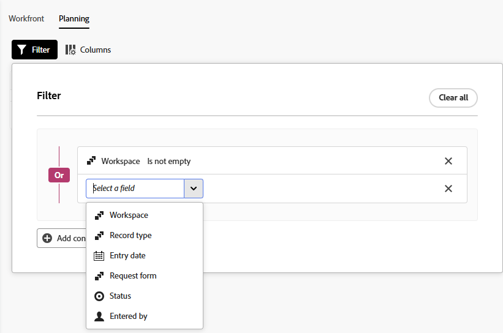

# Inviare richieste di Adobe Workfront Planning per creare record

<!--update title when there will be more functionality added to the Planning requests, besides creating records-->
<!--take Preview and Prod references out when releasing to Prod all-->

Le informazioni evidenziate in questa pagina si riferiscono a funzionalità non ancora generalmente disponibili. È disponibile solo nell’ambiente di anteprima per tutti i clienti. Dopo i rilasci mensili in Produzione, le stesse funzioni sono disponibili nell’ambiente di Produzione per i clienti che hanno abilitato i rilasci rapidi. 

Per informazioni sulle versioni rapide, vedere [Abilitare o disabilitare le versioni rapide per l&#39;organizzazione](/help/quicksilver/administration-and-setup/set-up-workfront/configure-system-defaults/enable-fast-release-process.md). 

{{planning-important-intro}}

Dopo che un responsabile dell&#39;area di lavoro crea un modulo di richiesta per un tipo di record in Adobe Workfront Planning, è possibile utilizzare il modulo per inviare richieste che creeranno record per il tipo di record associato al modulo.

È possibile inviare una richiesta di Workfront Planning dalle aree seguenti:

* Dall’area Richieste di Workfront.
* Da un collegamento diretto al modulo di richiesta condiviso.
* Dalla pagina del tipo di record, quando si aggiunge o si richiede un nuovo record. Per informazioni, vedere [Creare record](/help/quicksilver/planning/records/create-records.md).

Questo articolo descrive come inviare una richiesta per aggiungere nuovi record a un tipo di record dall’area Richieste di Workfront o da un collegamento condiviso.

Gli utenti Workfront e gli utenti esterni possono inviare richieste ai tipi di record Planning e creare record. <!--double check on the external users-->

Per informazioni su come un manager area di lavoro può creare un modulo di richiesta e associarlo a un tipo di record, vedere [Creare e gestire un modulo di richiesta in Adobe Workfront Planning](/help/quicksilver/planning/requests/create-request-form.md).

## Requisiti di accesso

+++ Espandi per visualizzare i requisiti di accesso per la funzionalità descritta in questo articolo. 

<table style="table-layout:auto"> 
<col> 
</col> 
<col> 
</col> 
<tbody> 
<tr> 
   <td role="rowheader">
Pacchetti Adobe Workfront
</td> 
   <td> 

Qualsiasi pacchetto Workfront e qualsiasi pacchetto Planning

Oppure

Qualsiasi pacchetto del flusso di lavoro e qualsiasi pacchetto Planning

Per ulteriori informazioni su ciò che è incluso in ogni pacchetto Workfront Planning, contattare il rappresentante del proprio account Workfront.

   </td> </tr>

</tr> 
  <tr> 
   <td role="rowheader">
Licenza Adobe Workfront
</td> 
   <td>
Qualsiasi
 
  </td> 
  </tr> 
  <tr> 
   <td role="rowheader">
Autorizzazioni oggetto
</td> 
   <td>   
Visualizza o autorizzazioni superiori per un’area di lavoro e un tipo di record, se sei un utente di Workfront
  </td> 
  </tr>  
</tbody> 
</table>

Per ulteriori informazioni sui requisiti di accesso a Workfront, vedere [Requisiti di accesso nella documentazione di Workfront](/help/quicksilver/administration-and-setup/add-users/access-levels-and-object-permissions/access-level-requirements-in-documentation.md).

+++

## Prerequisiti

Prima di inviare una richiesta a un modulo di richiesta Workfront Planning, è necessario disporre dei seguenti elementi:

* In Workfront Planning devono esistere gli elementi seguenti:

   * Un’area di lavoro
   * Un tipo di record
   * Modulo di richiesta associato a un tipo di record.

     Per informazioni, vedere [Creare un modulo di richiesta in Adobe Workfront Planning](/help/quicksilver/planning/requests/create-request-form.md).

* Il modulo di richiesta deve essere condiviso in modo da potervi accedere. Esistono i seguenti scenari:

   * Internamente, il modulo deve essere condiviso con utenti che dispongono di autorizzazioni di visualizzazione o di livello superiore per l&#39;area di lavoro.

     Gli utenti di Workfront possono accedere al modulo da un collegamento o trovare il modulo di richiesta nell’area Richieste di Workfront.

   * Se non disponi di un account Workfront, significa che un collegamento al modulo è stato condiviso con persone esterne.

     Gli utenti di Workfront possono anche accedere a un collegamento condiviso con persone esterne.

* Il collegamento al modulo non deve essere scaduto.

## Considerazioni sull&#39;invio di richieste a Workfront Planning

* Non è possibile modificare una richiesta in Workfront dopo averla inviata.
* Ogni richiesta sottomessa crea un record per il tipo di record associato al modulo utilizzato, se il modulo non è associato a un&#39;approvazione o se l&#39;approvazione è stata concessa da tutti gli approvatori.
* I record creati mediante l&#39;invio di moduli di richiesta non possono essere distinti dai record aggiunti tramite qualsiasi altro metodo in Workfront Planning.

  Per informazioni, vedere [Creare record](/help/quicksilver/planning/records/create-records.md).
* Le richieste inviate vengono visualizzate nell’area Richieste di Workfront.
* Le richieste Planning inviate sono visibili solo nella nuova esperienza di richiesta. Non è possibile visualizzare le richieste Planning nell’esperienza di richiesta legacy.
* Esistono limitazioni nella visualizzazione di determinati tipi di campo in un modulo di richiesta o nella pagina dei dettagli della richiesta dopo l’invio di un modulo.

  Per informazioni, vedere [Creare e gestire un modulo di richiesta in Adobe Workfront Planning](/help/quicksilver/planning/requests/create-request-form.md).

<!--Not sure how to change the request status, but dev also said: Changing the names of the statuses might lead to some inconsistency between unified-approvals-service and intake-approvals-flow.-->

## Inviare una richiesta a Workfront Planning nell&#39;area Richieste di Workfront

{{step1-to-requests}}

1. Abilita **Passa a una nuova esperienza** nell&#39;angolo superiore destro dello schermo.
L&#39;abilitazione di questa impostazione rende disponibili i moduli di richiesta di Workfront Planning nell&#39;area **Richieste** di Workfront.

   >[!TIP]
   >
   >Questa impostazione è disponibile solo quando sono presenti le seguenti condizioni:
   >
   >* La società ha acquistato un pacchetto Workfront Planning.
   >* La tua istanza di Workfront è integrata in Adobe Unified Experience.
   >* Puoi accedere alla visualizzazione di almeno un’area di lavoro.
   >

1. Fai clic sulla barra **Quale richiesta desideri inviare** per aprire un elenco di moduli di richiesta.
1. Selezionare un modulo di richiesta dall&#39;elenco o iniziare a digitare il nome del modulo di richiesta, quindi selezionarlo quando viene visualizzato nell&#39;elenco.

   Viene visualizzata una finestra con il nome del modulo di richiesta nella parte superiore.
1. Aggiorna i campi disponibili nel modulo di richiesta. I campi con un asterisco rosso sono obbligatori.
1. Fai clic su **Invia**.

   Il modulo di richiesta si chiude e si torna all&#39;area **Richieste**.

   Il modulo viene inviato e si verificano gli eventi seguenti:

   * Se il modulo di richiesta non è stato associato a un&#39;approvazione, la richiesta viene aggiunta all&#39;elenco Richieste nell&#39;area Richieste Workfront e widget Richieste personali e viene aggiunto un nuovo record al tipo di record associato al modulo.

   * Se il modulo di richiesta era associato a un’approvazione, la richiesta viene aggiunta all’elenco Richieste nell’area Richieste Workfront e nel widget Richieste personali. Un nuovo record viene aggiunto alla pagina del tipo di record solo dopo che è stato approvato dagli approvatori.

     Per informazioni, vedere [Aggiungere un&#39;approvazione a un modulo di richiesta](/help/quicksilver/planning/requests/add-approval-to-request-form.md).

   * La richiesta è visibile solo al proprietario, all&#39;approvatore e agli utenti che dispongono almeno delle autorizzazioni di visualizzazione per l&#39;area di lavoro. Gli amministratori di Workfront possono visualizzare tutte le richieste inviate a qualsiasi area di lavoro del sistema.

   * Ricevi una notifica in-app e un messaggio e-mail che informa che la richiesta è stata inviata correttamente o è stata inviata per la revisione.
   * Se il modulo di richiesta era associato a un’approvazione, gli approvatori ricevono una notifica in-app e un messaggio e-mail per rivedere e approvare la richiesta.

     >[!NOTE]
     >
     >Le notifiche e-mail e in-app sono visibili solo quando l’istanza di Workfront della tua organizzazione viene integrata in Adobe Unified Experience.
     >
     >L’e-mail di conferma o di notifica dell’approvazione contiene un collegamento alla richiesta.

1. (Facoltativo) Fai clic su **Visualizza la richiesta** nel messaggio di conferma, per aprire la richiesta, oppure fai clic sull&#39;icona **X** per chiudere la conferma.
1. (Facoltativo) Effettuate una delle seguenti operazioni:

   * Fai clic su **Filtri** e inizia ad aggiungere le condizioni per le richieste da visualizzare nell&#39;elenco Richieste.

     

     Puoi filtrare in base ai seguenti campi:

      * **Workspace**: area di lavoro a cui è associato il modulo di richiesta.
      * **Tipo di record**: il tipo di record a cui è associato il modulo di richiesta.
      * **Data di ingresso**: la data in cui la richiesta è stata inviata.
      * **Modulo di richiesta**: nome del modulo di richiesta utilizzato per inviare la richiesta.
      * **Stato**: lo stato della richiesta.
      * **Inserito da**: nome dell&#39;utente che ha aggiunto la richiesta. Se la richiesta è stata aggiunta da un utente esterno a Workfront, il campo **Immesso da** visualizza `N/A`.

        È possibile unire più filtri con **And** o **Or**.
L’elenco delle richieste viene filtrato automaticamente, man mano che aggiungi le condizioni del filtro.

   * Fai clic su **Colonne** e nascondi, mostra o ridisponi le colonne nell&#39;elenco richieste.

     >[!TIP]
     >
     >Impossibile aggiungere altre colonne.
     >
     >Impossibile visualizzare il campo **Oggetto**.

     

1. Fai clic sul nome di una richiesta nell’elenco.

   Viene visualizzata la pagina dei dettagli della richiesta.

   

1. (Facoltativo) Immettere un commento nell&#39;area Commenti.
1. (Condizionale) Se il modulo di richiesta non è associato a un&#39;approvazione o se la richiesta è stata approvata, fare clic sul nome della richiesta, quindi sul nome del record nel campo **Record**.

   La pagina del record viene visualizzata in Workfront Planning.

   >[!TIP]
   >
   >* Se il campo principale del record non è stato aggiornato nel modulo di richiesta, il nome del record nel campo Record della richiesta viene visualizzato come **Senza titolo**.
   >
   >* Se il modulo di richiesta è associato a un’approvazione, questa deve essere concessa prima di poter accedere al record dalla pagina della richiesta.

1. (Facoltativo) Fare clic sul nome del tipo di record ****.

   La pagina del tipo di record viene visualizzata in Workfront Planning.

## Inviare una richiesta a Workfront Planning da un collegamento condiviso a un modulo di richiesta

1. Passare al collegamento condiviso con l&#39;utente da un tipo di record di Workfront Planning.

1. Aggiorna i campi disponibili nel modulo. I campi con un asterisco sono obbligatori.

   >[!TIP]
   >
   >   Se il campo **Oggetto** è disponibile, non sarà visibile in Workfront Planning dopo l&#39;invio della richiesta.
   >
   >È consigliabile aggiornare il maggior numero possibile di campi nella richiesta per rendere il nuovo record identificabile quando viene aggiunto al tipo di record in Workfront Planning.

1. Fai clic su **Invia**.

   Il modulo viene inviato e si verificano gli eventi seguenti:

   * Se il modulo di richiesta non è stato associato a un&#39;approvazione, la richiesta viene aggiunta all&#39;elenco Richieste nell&#39;area Richieste Workfront e widget Richieste personali e viene aggiunto un nuovo record al tipo di record associato al modulo.

   * Se il modulo di richiesta era associato a un’approvazione, la richiesta viene aggiunta all’elenco Richieste nell’area Richieste Workfront e nel widget Richieste personali. Un nuovo record viene aggiunto alla pagina del tipo di record solo dopo l&#39;approvazione di tutti gli approvatori.

     Per informazioni, vedere [Aggiungere un&#39;approvazione a un modulo di richiesta](/help/quicksilver/planning/requests/add-approval-to-request-form.md).

     >[!IMPORTANT]
     >
     >Puoi visualizzare solo le richieste inviate da te o da altri utenti alle aree di lavoro per le quali disponi almeno delle autorizzazioni di visualizzazione. Gli amministratori di Workfront possono visualizzare tutte le richieste inviate a qualsiasi area di lavoro del sistema. <!--ensure this is correct; asking team in slack-->

   * Ricevi una notifica in-app e un messaggio e-mail che informa che la richiesta è stata inviata correttamente o è stata inviata per la revisione.
   * Se il modulo di richiesta era associato a un’approvazione, gli approvatori ricevono una notifica in-app e un messaggio e-mail per rivedere e approvare la richiesta.

     >[!NOTE]
     >
     >Le notifiche e-mail e in-app sono visibili solo quando l’istanza di Workfront della tua organizzazione viene integrata in Adobe Unified Experience.

   <!--  After the request was approved and the record was created, the Approved by and Approved date fields display information about the approval on the record.-->

1. (Facoltativo) Fai clic su **Visualizza la richiesta** per aprire la richiesta in Workfront.

   <!--Or-->

   <!--Click [Submit another request](https://pulsar.devtest.workfront-dev.com/intake/6740a1ff44bf3a5600cf4481/request) to open the request form and add a new request.-->

1. (Facoltativo) Fai clic su **Menu principale** > **Richieste** per visualizzare la richiesta, quindi fai clic sul nome della richiesta.

   Viene visualizzata la pagina dei dettagli della richiesta.

   

1. (Facoltativo) Immettere un commento nell&#39;area Commenti.
1. (Condizionale) Se il modulo di richiesta non è associato a un&#39;approvazione o se la richiesta è stata approvata, fare clic sul nome della richiesta, quindi sul nome del record nel campo **Oggetto creato**.

   La pagina del record viene visualizzata in Workfront Planning.

   >[!TIP]
   >
   >* Se il nome del record non è stato aggiunto al modulo di richiesta, il nome del record nel campo Record della richiesta viene visualizzato come **Senza titolo**.
   >
   >* Se il modulo di richiesta è associato a un’approvazione, questa deve essere concessa prima di poter accedere al record dalla pagina della richiesta.

1. (Facoltativo) Fare clic sul nome del **tipo di oggetto**.

   La pagina del tipo di record viene visualizzata in Workfront Planning.

## Creare una richiesta copiando una richiesta esistente

È possibile copiare una richiesta nell’elenco delle richieste in Workfront, quindi modificarne i dettagli e inviarla come nuova richiesta.

Questa funzione è disponibile solo nella nuova esperienza di richiesta.

Per istruzioni, consulta [Copiare e inviare richieste](/help/quicksilver/manage-work/requests/create-requests/copy-and-submit-requests.md).

## Creare bozze e richieste da bozze esistenti

Puoi creare una bozza di una richiesta, quindi tornare alla bozza e inviarla come richiesta in un secondo momento.

Questa funzione è disponibile solo nella nuova esperienza di richiesta.

Per istruzioni, consulta [Creare richieste da bozze](/help/quicksilver/manage-work/requests/create-requests/create-requests-from-drafts.md).

