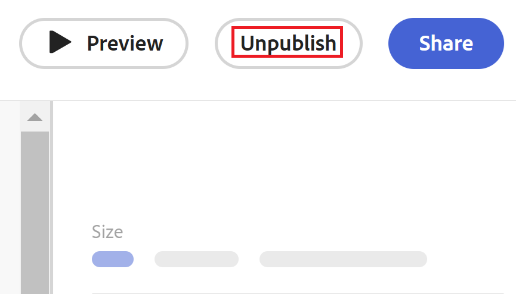

# Annullare la pubblicazione di un modulo di richiesta in Adobe Workfront Planning

<!--take Preview and Production references at Production time-->

<!--

The highlighted information on this page refers to functionality not yet generally available. It is available only in the Preview environment for all customers. After the monthly releases to Production, the same features are also available in the Production environment for customers who enabled fast releases.    

For information about fast releases, see [Enable or disable fast releases for your organization](/help/quicksilver/administration-and-setup/set-up-workfront/configure-system-defaults/enable-fast-release-process.md). 

-->

{{planning-important-intro}}

Puoi annullare la pubblicazione di un modulo di richiesta se non è più necessario o pertinente. Annullando la pubblicazione, verranno rimosse le autorizzazioni di accesso al modulo per tutti gli utenti.

È inoltre possibile modificare le entità con cui si condivide un modulo di richiesta, se si desidera mantenerlo disponibile a un gruppo più piccolo di persone.

## Requisiti di accesso

+++ Espandi per visualizzare i requisiti di accesso per la funzionalità descritta in questo articolo. 

<table style="table-layout:auto"> 
<col> 
</col> 
<col> 
</col> 
<tbody> 
<tr> 
   <td role="rowheader">
Pacchetti Adobe Workfront
</td> 
   <td> 

Qualsiasi pacchetto Workfront e qualsiasi pacchetto Planning

Oppure

Qualsiasi pacchetto del flusso di lavoro e qualsiasi pacchetto Planning

Per ulteriori informazioni su ciò che è incluso in ogni pacchetto Workfront Planning, contattare il rappresentante del proprio account Workfront.

   </td> </tr>

</tr> 
  <tr> 
   <td role="rowheader">
Licenza Adobe Workfront
</td> 
   <td>
Standard
 
  </td> 
  </tr> 
  <tr> 
   <td role="rowheader">
Autorizzazioni oggetto
</td> 
   <td>   
Gestione delle autorizzazioni per un'area di lavoro e tipo di record</a> 
  
   
Gli amministratori di sistema dispongono delle autorizzazioni per tutte le aree di lavoro, incluse quelle non create
  </td> 
  </tr>  
</tbody> 
</table>

Per ulteriori informazioni sui requisiti di accesso a Workfront, vedere [Requisiti di accesso nella documentazione di Workfront](/help/quicksilver/administration-and-setup/add-users/access-levels-and-object-permissions/access-level-requirements-in-documentation.md).

+++

## Modificare la condivisione di un modulo di richiesta

Se si condivide una richiesta di accesso pubblica con tutti, inclusi gli utenti esterni all&#39;organizzazione, è possibile limitare l&#39;accesso a determinati utenti che visualizzano o gestiscono l&#39;area di lavoro a cui è associato il modulo.

Per modificare la condivisione di un modulo di richiesta:

{{step1-to-planning}}

1. Fare clic sull&#39;area di lavoro in cui si desidera condividere un modulo.

   Viene aperto il workspace e i tipi di record vengono visualizzati come schede.

1. Fare clic su una scheda del tipo di record. Per informazioni sulla creazione di un tipo di record, vedere [Creare tipi di record](/help/quicksilver/planning/architecture/create-record-types.md).

   La pagina del tipo di record viene visualizzata nella visualizzazione a cui si è effettuato l&#39;ultimo accesso. Per impostazione predefinita, nella vista tabella viene visualizzata una pagina del tipo di record.

1. Fai clic sul menu **Altro**  a destra del nome del tipo di record nell&#39;intestazione della pagina, quindi fai clic su **Gestisci moduli di richiesta**.

   Tutte le maschere di richiesta associate al tipo di record vengono visualizzate in una vista tabella.
1. Passa il mouse sul nome di un modulo di richiesta, quindi fai clic sul menu **Altro**  a destra del nome, quindi fai clic su **Condividi**.
1. Aggiornare le scelte di condivisione selezionando una delle opzioni seguenti:

   * Chiunque con accesso alla visualizzazione, o superiore, all’area di lavoro
   * Chiunque con accesso per contribuire, o superiore, all’area di lavoro
   * Chiunque abbia il collegamento

   Per ulteriori informazioni, vedere [Creare e gestire un modulo di richiesta in Adobe Workfront Planning](/help/quicksilver/planning/requests/create-request-form.md).
1. (Facoltativo) Se hai modificato la condivisione del modulo di richiesta e desideri condividerlo con il nuovo gruppo di persone con un nuovo collegamento, fai clic su **Copia collegamento**.

## Annullare la pubblicazione di un modulo di richiesta per un tipo di record

Quando un modulo di richiesta diventa irrilevante e non desideri più che qualcuno vi acceda, puoi annullarne la pubblicazione.

{{step1-to-planning}}

1. Fare clic sull&#39;area di lavoro in cui si desidera aggiungere i record.

   Viene aperto il workspace e i tipi di record vengono visualizzati come schede.

1. Fare clic su una scheda del tipo di record. Per informazioni sulla creazione di un tipo di record, vedere [Creare tipi di record](/help/quicksilver/planning/architecture/create-record-types.md).

   La pagina del tipo di record viene visualizzata nella visualizzazione a cui si è effettuato l&#39;ultimo accesso. Per impostazione predefinita, nella vista tabella viene visualizzata una pagina del tipo di record.

1. Fai clic sul menu **Altro**  a destra del nome del tipo di record nell&#39;intestazione della pagina, quindi fai clic su **Gestisci moduli di richiesta**.

   Tutte le maschere di richiesta associate al tipo di record vengono visualizzate in una vista tabella.
1. Passa il puntatore del mouse sul nome di un modulo di richiesta, quindi fai clic sul menu **Altro**  a destra del nome, quindi fai clic su **Annulla pubblicazione**

Oppure

Fai clic sul nome del modulo di richiesta per aprirlo, quindi fai clic su **Annulla pubblicazione** nell&#39;angolo superiore destro del modulo di richiesta.

Nella parte inferiore della schermata viene visualizzata una conferma che notifica l’annullamento della pubblicazione del modulo.

Il collegamento o pulsante **Annulla pubblicazione** diventa **Pubblica**.

1. (Condizionale) Se dopo l&#39;apertura del modulo hai annullato la pubblicazione, fai clic su **Salva**.

   Gli utenti non possono più accedere al modulo di richiesta da un collegamento o dalla coda richieste nell’area Richieste di Workfront.

   Tutti i record aggiunti in precedenza utilizzando il modulo di richiesta rimangono nella pagina del tipo di record.

   Eventuali richieste aggiunte in precedenza rimangono nell’area Richieste di Workfront.
