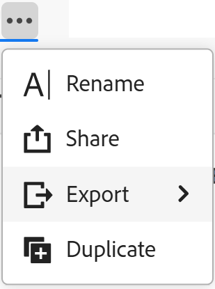

# Eliminare le visualizzazioni record

Le informazioni evidenziate in questa pagina si riferiscono a funzionalità non ancora generalmente disponibili. È disponibile solo nell’ambiente di anteprima per tutti i clienti. Dopo i rilasci mensili in Produzione, le stesse funzioni sono disponibili nell’ambiente di Produzione per i clienti che hanno abilitato i rilasci rapidi. 

Per informazioni sulle versioni rapide, vedere [Abilitare o disabilitare le versioni rapide per l&#39;organizzazione](/help/quicksilver/administration-and-setup/set-up-workfront/configure-system-defaults/enable-fast-release-process.md). 

{{planning-important-intro}}

È possibile eliminare una vista record non più utilizzata in Adobe Workfront Planning.

La vista viene eliminata per tutti gli utenti che dispongono delle autorizzazioni per accedervi. Non è possibile recuperare le viste eliminate.

## Requisiti di accesso

+++ Espandere per visualizzare i requisiti di accesso.

Per eseguire i passaggi descritti in questo articolo, è necessario disporre dei seguenti diritti di accesso:

<table style="table-layout:auto"> 
<col> 
</col> 
<col> 
</col> 
<tbody> 
    <tr> 
<tr> 
<td> 
   
 Prodotti
 </td> 
   <td> 
   <ul><li>
 Adobe Workfront
</li> 
   <li>
 Adobe Workfront Planning
</li></ul></td> 
  </tr>   
<tr> 
   <td role="rowheader">
Piano Adobe Workfront*
</td> 
   <td> 

Uno dei seguenti piani di Workfront:
 
<ul><li>Seleziona</li> 
<li>Prime</li> 
<li>Ultimate</li></ul> 

Workfront Planning non è disponibile per i piani Workfront legacy
 
   </td> 
<tr> 
   <td role="rowheader">
Pacchetto Adobe Workfront Planning*
</td> 
   <td> 

Qualsiasi 
 

Per ulteriori informazioni su quanto incluso in ogni piano di Workfront Planning, contattare l'account manager Workfront. 
 
   </td> 
 <tr> 
   <td role="rowheader">
Piattaforma Adobe Workfront
</td> 
   <td> 

Per poter accedere a Workfront Planning, l’istanza di Workfront della tua organizzazione deve essere integrata in Adobe Unified Experience.
 

Per ulteriori informazioni, vedere <a href="/help/quicksilver/workfront-basics/navigate-workfront/workfront-navigation/adobe-unified-experience.md">Esperienza unificata Adobe per Workfront</a>. 
 
   </td> 
   </tr> 
  </tr> 
  <tr> 
   <td role="rowheader">
Licenza Adobe Workfront*
</td> 
   <td>
 Standard 

   
Workfront Planning non è disponibile per le licenze Workfront legacy
 
  </td> 
  </tr> 
  <tr> 
   <td role="rowheader">
Configurazione del livello di accesso
</td> 
   <td> 
Nessun controllo del livello di accesso per Adobe Workfront Planning
   
</td> 
  </tr> 
<tr> 
   <td role="rowheader">
Autorizzazioni oggetto
</td> 
   <td>   
Gestire le autorizzazioni per una visualizzazione
  
   
Autorizzazioni di visualizzazione a una visualizzazione per modificare temporaneamente le impostazioni di visualizzazione o per duplicarla
 </td> 
  </tr> 
<tr> 
   <td role="rowheader">
Modello layout
</td> 
   <td> 
Nell'ambiente di produzione, tutti gli utenti, inclusi gli amministratori di sistema, devono essere assegnati a un modello di layout che includa Planning.

Nell'ambiente di anteprima, per impostazione predefinita, Planning è abilitato per utenti standard e amministratori di sistema.
</td> 
  </tr> 
</tbody> 
</table>

*Per ulteriori informazioni sui requisiti di accesso a Workfront, vedere [Requisiti di accesso nella documentazione di Workfront](/help/quicksilver/administration-and-setup/add-users/access-levels-and-object-permissions/access-level-requirements-in-documentation.md).

+++

## Eliminare una visualizzazione record

{{step1-to-planning}}

1. Fai clic sulla scheda di un’area di lavoro.

   Viene aperto il workspace e i tipi di record vengono visualizzati come schede.

1. Fare clic su una scheda del tipo di record.

   Viene visualizzata la pagina del tipo di record.

   Per impostazione predefinita, tutti i record del tipo selezionato vengono visualizzati nella vista tabella.

1. Passa il puntatore del mouse su uno dei nomi della visualizzazione nella scheda della visualizzazione, quindi fai clic su **Altro**  a sinistra del nome della visualizzazione, quindi fai clic su **Elimina**.

   

   >[!TIP]
   >
   >Per trovare la visualizzazione da eliminare, potrebbe essere necessario fare clic su **Altro** a destra dell&#39;ultima scheda.

1. Fai clic su **Elimina** per confermare. <!--ensure there is not another saving step here?!-->

   La vista viene eliminata per tutti gli utenti che possono accedere all&#39;area record.
