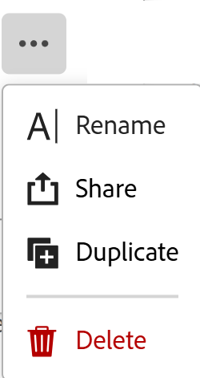

# Visualizzazioni record duplicate

<!--remove preview and production references-->

Le informazioni evidenziate in questa pagina si riferiscono a funzionalità non ancora generalmente disponibili. È disponibile solo nell’ambiente di anteprima per tutti i clienti. Dopo i rilasci mensili in Produzione, le stesse funzioni sono disponibili nell’ambiente di Produzione per i clienti che hanno abilitato i rilasci rapidi. 

Per informazioni sulle versioni rapide, vedere [Abilitare o disabilitare le versioni rapide per l&#39;organizzazione](/help/quicksilver/administration-and-setup/set-up-workfront/configure-system-defaults/enable-fast-release-process.md). 

{{planning-important-intro}}

Se si desidera mantenere più versioni di una vista e apportare lievi modifiche tra le versioni, è possibile duplicare una vista in Adobe Workfront Planning.

La duplicazione di una vista crea copie identiche di una vista esistente.

Le autorizzazioni di condivisione della vista originale non vengono trasferite alla vista duplicata.

La duplicazione delle viste è identica per tutti i tipi di viste in Workfront Planning.

## Requisiti di accesso

+++ Espandi per visualizzare i requisiti di accesso per la funzionalità in questo articolo. 

<table style="table-layout:auto"> 
<col> 
</col> 
<col> 
</col> 
<tbody> 
    <tr> 
<tr> 
</tr>   
<tr> 
   <td role="rowheader">
Pacchetto Adobe Workfront
</td> 
   <td> 
<ul> 
<li>
Qualsiasi pacchetto Workfront e Planning
</li>
Oppure
<li>
Qualsiasi flusso di lavoro e qualsiasi pacchetto di Planning
</li></ul>

Per ulteriori informazioni su ciò che è incluso in ogni pacchetto Workfront Planning, contattare il rappresentante del proprio account Workfront. 
 
   </td> 
  <tr> 
   <td role="rowheader">
Licenza Adobe Workfront
</td> 
   <td>
Standard

   </td> 
  </tr> 
  <tr> 
   <td role="rowheader">
Autorizzazioni oggetto
</td> 
   <td>   
Gestire le autorizzazioni per una visualizzazione
  
   
Autorizzazioni di visualizzazione per una visualizzazione che consentono di modificare temporaneamente le impostazioni di visualizzazione o di duplicarla.
 </td> 
  </tr>   
</tbody> 
</table>

Per ulteriori informazioni sui requisiti di accesso a Workfront, vedere [Requisiti di accesso nella documentazione di Workfront](/help/quicksilver/administration-and-setup/add-users/access-levels-and-object-permissions/access-level-requirements-in-documentation.md).

+++

<!--Old:
<table style="table-layout:auto"> 
<col> 
</col> 
<col> 
</col> 
<tbody> 
    <tr> 
<tr> 
<td> 
   
 Products
 </td> 
   <td> 
   <ul><li>
 Adobe Workfront
</li> 
   <li>
 Adobe Workfront Planning
</li></ul></td> 
  </tr>   
<tr> 
   <td role="rowheader">
Adobe Workfront plan*
</td> 
   <td> 

Any of the following Workfront plans:
 
<ul><li>Select</li> 
<li>Prime</li> 
<li>Ultimate</li></ul> 

Workfront Planning is not available for legacy Workfront plans
 
   </td> 
<tr> 
   <td role="rowheader">
Adobe Workfront Planning package*
</td> 
   <td> 

Any 
 

For more information about what is included in each Workfront Planning plan, contact your Workfront account manager. 
 
   </td> 
 <tr> 
   <td role="rowheader">
Adobe Workfront platform
</td> 
   <td> 

Your organization's instance of Workfront must be onboarded to the Adobe Unified Experience to be able to access Workfront Planning.
 

For more information, see <a href="/help/quicksilver/workfront-basics/navigate-workfront/workfront-navigation/adobe-unified-experience.md">Adobe Unified Experience for Workfront</a>. 
 
   </td> 
   </tr> 
  </tr> 
  <tr> 
   <td role="rowheader">
Adobe Workfront license*
</td> 
   <td>
 Standard 

   
Workfront Planning is not available for legacy Workfront licenses
 
  </td> 
  </tr> 
  <tr> 
   <td role="rowheader">
Access level configuration
</td> 
   <td> 
There are no access level controls for Adobe Workfront Planning
   
</td> 
  </tr> 
<tr> 
   <td role="rowheader">
Object permissions
</td> 
   <td>   
Manage permissions to a view
  
   
View permissions to a view to temporarily change the view settings or to duplicate it.
 </td> 
  </tr> 
</tbody> 
</table> -->

## Duplicare una visualizzazione record

{{step1-to-planning}}

1. Fai clic sulla scheda di un’area di lavoro.

   Viene aperto il workspace e i tipi di record vengono visualizzati come schede.

1. Fare clic su una scheda del tipo di record.

   Viene visualizzata la pagina del tipo di record.
Per impostazione predefinita, tutti i record del tipo selezionato vengono visualizzati nella vista tabella.

1. A seconda dell’ambiente utilizzato, effettua le seguenti operazioni:

   * Nell&#39;ambiente di produzione, passa il cursore su uno dei nomi della visualizzazione nella scheda della visualizzazione, quindi fai clic su **Altro**  a sinistra del nome della visualizzazione, quindi fai clic su **Duplica**.
   * Nell&#39;ambiente di anteprima, fare clic sull&#39;icona a discesa  accanto al nome della visualizzazione corrente, passare il puntatore sul nome di una visualizzazione, fare clic su **Altro**, quindi su **Duplica**.

     

     La visualizzazione è duplicata e il nome della nuova visualizzazione segue il seguente schema: `Original view's name (Copy)`. La nuova scheda vista viene visualizzata alla fine di tutte le schede vista.
