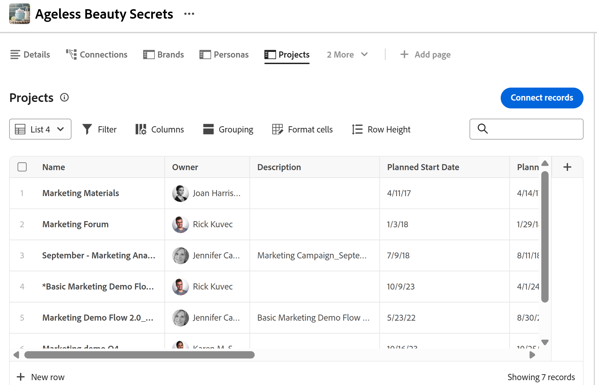

# Gestire la vista elenco in Adobe Workfront Planning

<!--
although list views in Planning are very similar to Workfront enhanced lists, keep this one separate with all the information, because of Planning standalone; some information here is also duplicated in this main Glist article: help/quicksilver/workfront-basics/navigate-workfront/use-lists/enhanced-lists.md
-->

<!--
The information highlighted on this page refers to functionality not yet generally available. It is available only in the Preview environment for all customers. After the monthly releases to Production, the same features are also available in the Production environment for customers who enabled fast releases.    

For information about fast releases, see [Enable or disable fast releases for your organization](/help/quicksilver/administration-and-setup/set-up-workfront/configure-system-defaults/enable-fast-release-process.md). 
-->

{{planning-important-intro}}

È possibile visualizzare gli oggetti nella vista a elenco nelle seguenti aree di Workfront Planning:

* Pagina record connessi per i progetti nell&#39;area dei dettagli di un record

  

* Elenco di moduli di richiesta a livello di tipo di record

  

In questo articolo viene descritto come spostarsi, creare o modificare una vista elenco in Workfront Planning.

## Requisiti di accesso

+++ Espandi per visualizzare i requisiti di accesso per la funzionalità in questo articolo. 

<table style="table-layout:auto"> 
<col> 
</col> 
<col> 
</col> 
<tbody> 
    <tr> 
<tr> 
</tr>   
<tr> 
   <td role="rowheader">
Pacchetto Adobe Workfront
</td> 
   <td> 

Qualsiasi pacchetto Workfront e Planning

Qualsiasi flusso di lavoro e qualsiasi pacchetto di Planning

Per ulteriori informazioni su ciò che è incluso in ogni pacchetto Workfront Planning, contattare il rappresentante del proprio account Workfront. 
 
   </td> 
  <tr> 
   <td role="rowheader">
Licenza di Adobe Workfront
</td> 
   <td>
 Standard per creare ed eliminare viste

   
Collaboratore o versione successiva per aggiornare gli elementi di visualizzazione

  </td> 
  </tr> 
  <tr> 
   <td role="rowheader">
Autorizzazioni sugli oggetti
</td> 
   <td>   
Gestire le autorizzazioni per una visualizzazione
  
   
Autorizzazioni di visualizzazione a una visualizzazione per modificare temporaneamente le impostazioni di visualizzazione o per duplicarla
 </td> 
  </tr> 
<tr>
   <td role="rowheader">
Modello layout
</td>
   <td> Agli utenti con una licenza Light o Contributor deve essere assegnato un modello di layout che includa Planning.
   
Per impostazione predefinita, le aree Pianificazione sono attivate dagli utenti standard e dagli amministratori di sistema.

</li></ul>
</td>
  </tr> 
</tbody> 
</table>

Per ulteriori informazioni sui requisiti di accesso a Workfront, vedere [Requisiti di accesso nella documentazione di Workfront](/help/quicksilver/administration-and-setup/add-users/access-levels-and-object-permissions/access-level-requirements-in-documentation.md).

+++ 

## Considerazioni sulle visualizzazioni elenco

* Considerare quanto segue per la visualizzazione elenco delle pagine dei record connessi:

   * È possibile visualizzare i progetti solo nella vista a elenco della pagina record connessi di un record. La visualizzazione elenco non è disponibile per altri tipi di oggetto o record in una pagina di record connessi.

  Per informazioni sulla creazione di una pagina di record connessi, vedere [Aggiungere una pagina di record connessi a un record](/help/quicksilver/planning/records/add-a-connected-records-page-to-a-record.md).
   * Prima di poter visualizzare una vista elenco in una pagina di record connessi di un record, è necessario collegare i progetti Workfront con i tipi di record di Planning. Per informazioni, vedere [Tipi di record di connessione](/help/quicksilver/planning/architecture/connect-record-types.md).
   * È possibile creare più visualizzazioni elenco per i progetti nella pagina record connessi di un record.

* Considera quanto segue per la visualizzazione elenco dei moduli di richiesta:

   * Non è possibile creare o modificare visualizzazioni elenco aggiuntive per i moduli di richiesta di Planning. Workfront crea una vista elenco per i moduli di richiesta. <!--this will change-->

     Per informazioni sui moduli di richiesta, vedere [Creare e gestire un modulo di richiesta in Adobe Workfront Planning](/help/quicksilver/planning/requests/create-request-form.md).
* A seconda della posizione in cui viene visualizzata, non tutte le visualizzazioni elenco dispongono di tutti gli elementi descritti in questo articolo.

## Gestire una vista a elenco {#manage-a-list-view}

Le viste elenco di Workfront Planning sono simili agli elenchi avanzati di Workfront. La maggior parte degli elementi delle viste avanzate è disponibile anche nelle viste elenco in Workfront Planning.

Per ulteriori informazioni, vedere [Utilizzare elenchi avanzati](/help/quicksilver/workfront-basics/navigate-workfront/use-lists/enhanced-lists.md).

<!--
Removed - more direct steps below: 
{{step1-to-planning}}

1. (Conditional) To access a projects connected page, do the following: 

    1. Click a workspace card, then click a record type card. 
    1. From any view, click the name of a record to open the record's preview or details page. 
    1. Add a **Connected records page** for connected projects as described in the article [Add a Connected records page to a record](/help/quicksilver/planning/records/add-a-connected-records-page-to-a-record.md).

    The Connected records page displays projects connected to the record in the list view. 

    

1. (Conditional) To access a list of request forms, do the following: 

    1. {{step1-to-planning}}

    1. (Conditional) To access a projects connected page, do the following: 

    1. Click a workspace card, then click a record type card.
    1. Click the **More** menu  to the right of the record name in the header, then click **Manage request forms**.

        A list of request forms displays.

-->

1. Passare a una visualizzazione elenco in una delle aree seguenti:

   * Pagina record connessi per i progetti nell&#39;area dei dettagli di un record
   * Pagina Moduli di richiesta di un tipo di record

1. (Condizionale) Se disponibile, effettuare una delle seguenti operazioni per modificare la vista a elenco:

   1. Espandere il menu delle viste a discesa nell&#39;angolo superiore sinistro dell&#39;elenco per selezionare un&#39;altra vista oppure fare clic su **Nuova vista** e crearne un&#39;altra.

      >[!TIP]
      >
      >Le visualizzazioni sono condivise in tutto il sistema. Se si crea una visualizzazione Progetti per un tipo di record, è possibile visualizzarla su altri tipi di record che visualizzano progetti collegati.

   1. Passa il puntatore del mouse sul nome di una visualizzazione esistente e fai clic sul menu **Altro** , quindi fai clic su una delle seguenti opzioni:
      * **Rinomina**, per assegnare un nuovo nome alla visualizzazione
      * **Condividi**, per condividere la visualizzazione con altri
      * **Elimina**, per eliminare la visualizzazione.

      >[!NOTE]
      >
      >* Per poter modificare, condividere o eliminare una visualizzazione, è necessario disporre delle autorizzazioni di gestione.
      >
      >* Non è possibile modificare le visualizzazioni di sistema.
      >
      >* È possibile reimpostare una visualizzazione condivisa con l&#39;utente che dispone solo delle autorizzazioni necessarie per la visualizzazione, dopo averla modificata per ripristinarne le preferenze originali, oppure copiarla con le modifiche e condividere la copia. Per ulteriori informazioni, vedere [Utilizzare elenchi avanzati](/help/quicksilver/workfront-basics/navigate-workfront/use-lists/enhanced-lists.md).

   1. Fai clic sull&#39;icona **Filtro**  per aggiungere un filtro alla visualizzazione. I risultati vengono filtrati immediatamente nell’elenco. Non è possibile salvare e denominare i filtri. I filtri vengono ricordati quando accedi alla pagina in futuro e fanno parte di visualizzazioni condivise.

      >[!TIP]
      >
      >Per applicare un filtro personalizzato, seleziona una delle seguenti opzioni per un valore di campo:
      >
      >* **Utente connesso** per fare riferimento all&#39;utente connesso nei campi relativi agli utenti.
      >
      >* **I miei team** o **Il mio team principale** per fare riferimento ai tuoi team nei campi che si riferiscono ai team.
      >
      >* **I miei gruppi** o **Il mio gruppo predefinito** fa riferimento ai tuoi gruppi nei campi che fanno riferimento ai gruppi.
      >
      >* **La mia azienda** per fare riferimento alla tua azienda nei campi che si riferiscono alle aziende.
      > 
      >* **I miei ruoli** o **Il mio ruolo principale** per fare riferimento alle tue mansioni nei campi che fanno riferimento alle mansioni.

   1. Fai clic sull&#39;icona **Colonne**  per selezionare le colonne da visualizzare o da nascondere nella visualizzazione.
   1. Passa il puntatore del mouse sul nome di una colonna, fai clic sulla freccia rivolta verso il basso a sinistra del nome della colonna, quindi fai clic su una delle seguenti opzioni:
      * **Rinomina**, per aggiungere una **etichetta personalizzata** per la colonna. Il nome del campo originale in Workfront non cambia.
      * **Ordina**, per ordinare l&#39;elenco in base al campo selezionato. All’intestazione della colonna viene aggiunta un’icona di ordinamento che indica la direzione dell’ordinamento.
   1. Fai clic sull&#39;icona **+** nell&#39;angolo superiore destro dell&#39;elenco per aggiungere o rimuovere colonne dall&#39;elenco, quindi fai clic su **Salva**.

      Verrà aperto **Gestione colonne**.

      È possibile aggiungere solo campi esistenti alla visualizzazione elenco.
Non è possibile rimuovere il campo principale nella vista a elenco visualizzato nella prima colonna.

   1. Fare clic sull&#39;icona **Formatta celle** . Viene visualizzata la casella **Formato**. <!--change the name of the box when they update it-->
Effettua le seguenti operazioni:

      1. Fai clic su **Aggiungi condizione**.
      1. Nella riga **If**, selezionare un campo, scegliere un valore di campo e aggiungere un modificatore. I modificatori cambiano a seconda del tipo di campo scelto.

         >[!TIP]
         >
         >Solo i campi visibili nella vista a elenco sono disponibili per la formattazione condizionale.

      1. (Facoltativo) Anziché aggiungere un valore di campo, fare clic sull&#39;icona **Confronta con un altro campo**  e scegliere un campo di cui si desidera confrontare il valore con il valore del campo selezionato. Ad esempio, puoi confrontare i campi Proprietario progetto e Sponsor progetto.

         >[!TIP]
         >
         >Solo i campi visibili nella vista a elenco sono disponibili per la formattazione condizionale. I campi da confrontare devono essere dello stesso tipo.

      1. (Facoltativo) Fai clic su **Aggiungi condizione** nella riga **If** per aggiungere altre condizioni alla stessa regola.

         >[!TIP]
         >
         >È possibile aggiungere fino a 10 condizioni in una regola di condizionamento e disporre di un massimo di 20 regole per un campo.

      1. Fare clic sul connettore **Or** tra le condizioni per passare a **And** e indicare che è necessario soddisfare più condizioni contemporaneamente. **Or** è il connettore predefinito.
      1. Nella riga **Formato** selezionare un campo per indicare la colonna da formattare. <!--edit this area, if it changes names??-->
      1. (Facoltativo) Fai clic sull&#39;icona **cerchio colore**  accanto al campo selezionato, per espanderlo e scegliere un altro colore nell&#39;area **Riempimento cella** per modificare il colore dello sfondo in una cella o scegliere un colore dall&#39;area **Colore testo** per modificare il colore del testo in una cella.
      1. Fai clic sull&#39;icona **Formato testo**  e seleziona una delle seguenti opzioni per formattare il testo in una cella:
         * Grassetto
         * Corsivo

      1. Attivare l&#39;impostazione **Applica a riga** per applicare la formattazione all&#39;intera riga del campo che soddisfa le condizioni.
      1. (Facoltativo) Fai clic su **Aggiungi condizione** nella casella **Formato** per aggiungere un&#39;altra regola per un altro campo e ripetere i passaggi precedenti.
      1. (Facoltativo) Fai clic su **Cancella tutto** per rimuovere tutta la formattazione.
      1. Fare clic all&#39;esterno della casella **Formato** per chiuderla.

         In questo modo si ritorna alla vista elenco.
La formattazione viene applicata immediatamente alla visualizzazione elenco.
Accanto all&#39;icona **Formatta celle** è presente un punto blu per indicare che alla visualizzazione è applicata una formattazione speciale.

   1. (Facoltativo) Fai clic sull&#39;icona **Raggruppamento**  <!--have they updated this to "Grouping"??--> per raggruppare gli elementi nell&#39;elenco in base a un campo comune. Seleziona una delle opzioni oppure utilizza la barra di ricerca per trovare un campo.

      Il campo deve essere una colonna nell&#39;elenco prima di poter essere raggruppato in base a esso. Non tutti i tipi di campo possono essere utilizzati per i raggruppamenti.

   1. Fai clic sull&#39;icona **Altezza riga**  per aggiornare la lunghezza verticale di una riga. Scegli una tra le opzioni seguenti:

      * Piccola
      * Standard. Questa è la scelta predefinita.
      * Canale
      * Alta

   <!--leave these here, although they duplicate for Enhanced lists in Workfront-->

1. (Facoltativo) Aggiungi una parola chiave nella casella di ricerca nell’angolo superiore destro dell’elenco per cercare un elemento.

   Gli elementi che corrispondono al termine di ricerca sono evidenziati nell&#39;elenco.

1. (Facoltativo e condizionale) Nella pagina Progetti <!--change projects to items here when more items will display in the Glist--> connessi, per aggiungere altri elementi all&#39;elenco e collegarli automaticamente al record selezionato, eseguire una delle operazioni seguenti:

   * Fai clic su **Connetti record** nell&#39;angolo superiore destro dell&#39;elenco per aggiungere elementi esistenti.
   * Fai clic su **Nuova riga** in fondo all&#39;elenco per aggiungere nuovi elementi.
1. Fare clic sul nome di un elemento collegato nell&#39;elenco per aprirlo in un&#39;altra scheda del browser.
1. Fare doppio clic all&#39;interno di una cella dell&#39;elenco per modificare le informazioni di un campo, quindi premere Invio per salvare le modifiche.

   Alcuni campi sono di sola lettura. Ad esempio, la percentuale di completamento di un progetto è un campo calcolato dal sistema e non è possibile modificarlo manualmente.

1. Passa il puntatore del mouse sul nome di un elemento nell&#39;elenco e fai clic sul menu **Altro** [Altro menu](assets/more-menu.png) e fai clic su **Visualizza** per aprire il progetto in un&#39;altra scheda

   Oppure

   Seleziona uno o più elementi e osserva la barra delle azioni nella parte inferiore dell’elenco, quindi fai clic su uno dei seguenti, se disponibile. A seconda dell&#39;area da cui si accede alla vista a elenco, fare clic su una delle opzioni seguenti:

   * **Elimina** per eliminare l&#39;elemento. Quando si elimina un progetto, questo viene disconnesso dal record e spostato nel Cestino di Workfront. Gli amministratori di Workfront possono recuperare i progetti eliminati fino a 30 giorni dopo la loro eliminazione. L’eliminazione di un modulo non comporta l’eliminazione delle richieste o dei record creati al momento dell’invio del modulo.
   * **Disconnetti** per disconnettere il progetto dal record. Se si disconnette un progetto, verranno rimossi anche tutti i valori dei campi di ricerca dal record corrente.

     <!--update screen shot at preview release-->

     

   * **Modifica modulo**: apre un modulo di richiesta Planning e consente di modificarlo.
   * **Annulla pubblicazione**: annulla la pubblicazione di un modulo di richiesta. In questo modo il modulo viene rimosso dall’area Richieste e gli utenti non possono più aggiungere richieste a questo tipo di record.
   * **Condividi**: apre la casella Condivisione per un modulo di richiesta da condividere con altri utenti.
   * **Copia collegamento**: copia un collegamento a un modulo di richiesta Planning per consentirne la condivisione con altri utenti. Se il modulo viene condiviso pubblicamente, è possibile condividere il collegamento con utenti esterni a Workfront Planning.

     

