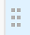

# Gestire la vista tabella

{{planning-important-intro}}

È possibile visualizzare i record e i relativi campi in una vista tabella quando si accede alla pagina del tipo di record in Adobe Workfront Planning.

Per informazioni sulle visualizzazioni record e su come gestirle, vedere [Gestione delle visualizzazioni record](/help/quicksilver/planning/views/manage-record-views.md).

## Requisiti di accesso

+++ Espandere per visualizzare i requisiti di accesso per Workfront Planning.

Per eseguire i passaggi descritti in questo articolo, è necessario disporre dei seguenti diritti di accesso:

<table style="table-layout:auto"> 
<col> 
</col> 
<col> 
</col> 
<tbody> 
    <tr> 
<tr> 
<td> 
   
 Prodotti
 </td> 
   <td> 
   <ul><li>
 Adobe Workfront
</li> 
   <li>
 Adobe Workfront Planning
</li></ul></td> 
  </tr>   
<tr> 
   <td role="rowheader">
Piano Adobe Workfront*
</td> 
   <td> 

Uno dei seguenti piani di Workfront:
 
<ul><li>Seleziona</li> 
<li>Prime</li> 
<li>Ultimate</li></ul> 

Workfront Planning non è disponibile per i piani Workfront legacy
 
   </td> 
<tr> 
   <td role="rowheader">
Piano di pianificazione Adobe Workfront*
</td> 
   <td> 

Qualsiasi 
 

Per ulteriori informazioni su quanto incluso in ogni piano di Workfront Planning, contattare l'account manager Workfront. 
 
   </td> 
 <tr> 
   <td role="rowheader">
Piattaforma Adobe Workfront
</td> 
   <td> 

Per poter accedere a tutte le funzionalità di Workfront Planning, l’istanza di Workfront della tua organizzazione deve essere integrata in Adobe Unified Experience.
 

Per ulteriori informazioni, vedere <a href="/help/quicksilver/workfront-basics/navigate-workfront/workfront-navigation/adobe-unified-experience.md">Esperienza unificata di Adobe per Workfront</a>. 
 
   </td> 
   </tr> 
  </tr> 
  <tr> 
   <td role="rowheader">
Licenza Adobe Workfront*
</td> 
   <td>
 Standard 

   
Workfront Planning non è disponibile per le licenze Workfront legacy
 
  </td> 
  </tr> 
  <tr> 
   <td role="rowheader">
Configurazione del livello di accesso
</td> 
   <td> 
Nessun controllo del livello di accesso per Adobe Workfront Planning
   
</td> 
  </tr> 
<tr> 
   <td role="rowheader">
Autorizzazioni oggetto
</td> 
   <td>   
Gestire le autorizzazioni per una visualizzazione
  
   
Autorizzazioni di visualizzazione per modificare temporaneamente le impostazioni di visualizzazione
 </td> 
  </tr> 
<tr> 
   <td role="rowheader">
Modello di layout
</td> 
   <td> 
A tutti gli utenti, inclusi gli amministratori di Workfront, deve essere assegnato un modello di layout che includa l'area Planning nel menu principale. 
 </td> 
  </tr> 
</tbody> 
</table>

*Per ulteriori informazioni sui requisiti di accesso a Workfront, vedere [Requisiti di accesso nella documentazione di Workfront](/help/quicksilver/administration-and-setup/add-users/access-levels-and-object-permissions/access-level-requirements-in-documentation.md).

+++

<!--
OLD:

<table style="table-layout:auto">
 <col>
 </col>
 <col>
 </col>
 <tbody>
    <tr>
<tr>
<td>
   
 Product
 </td>
   <td>
   
 Adobe Workfront
 </td>
  </tr>  
 <td role="rowheader">
Adobe Workfront agreement
</td>
   <td>

Your organization must be enrolled in the early access stage for Workfront Planning 

   </td>
  </tr>
  <tr>
   <td role="rowheader">
Adobe Workfront plan
</td>
   <td>

Any

   </td>
  </tr>
  <tr>
   <td role="rowheader">
Adobe Workfront license*
</td>
   <td>
   
New: Standard

   Or
   
Current: Plan 
 
  </td>
  </tr>
  
  <tr>
   <td role="rowheader">
Access level configurations
</td>
   <td> There are no access controls for Adobe Workfront Planning
  
</td>
  </tr>

  <tr>
   <td role="rowheader">
Permissions
</td>
   <td> 
Manage permissions to a view
  
   
View permissions to a view to temporarily change the view settings

</td>
  </tr>

<tr>
   <td role="rowheader">
Layout template
</td>
   <td> 
All users, including Workfront administrators,  must be assigned a layout template that includes the Planning area in the Main Menu. 
 
For information, see <a href="/help/quicksilver/planning/access/access-overview.md">Access overview</a>. 
 
</td>
  </tr>
 </tbody>
</table>

*For information, see [Access requirements in Workfront documentation](/help/quicksilver/administration-and-setup/add-users/access-levels-and-object-permissions/access-level-requirements-in-documentation.md).-->

## Modificare i record utilizzando la vista tabella

È possibile modificare le informazioni del record solo nella vista tabella.

Per ulteriori informazioni sulla modifica dei record nella vista tabella, vedere [Modifica record](/help/quicksilver/planning/records/edit-records.md).

## Gestire una vista tabella {#manage-a-table-view}

<!--insert screen shot of table view-->

Durante la creazione di una vista tabella, tutti i record del tipo selezionato vengono visualizzati in una tabella. Ogni riga è un record univoco e ogni colonna è un campo record. Tutti i campi e tutti i record vengono visualizzati per impostazione predefinita.

Per gestire una vista tabella:

1. Creare una visualizzazione tabella come descritto nell&#39;articolo [Gestire le visualizzazioni record](/help/quicksilver/planning/views/manage-record-views.md).

   

1. (Facoltativo) Fai clic su **Altezza riga**, quindi seleziona una delle seguenti opzioni per modificare l&#39;altezza delle righe della tabella:
   * Piccolo
   * Medio
   * Alto

1. Aggiornate i seguenti elementi della vista come descritto nelle sottosezioni seguenti:
   * [Colonne (o campi)](#add-columns-or-fields)
   * [Righe (o record)](#add-rows-or-records)
   * [Filtri](#add-filters)
   * [Raggruppamento](#add-groupings)
   * [Ordina](#add-a-sort)
   * [Abilita indicatore di presenza in tempo reale](#enable-the-real-time-presence-indicator)

### Aggiungi colonne (o campi) {#add-columns}

Nelle intestazioni di colonna di una vista tabella vengono visualizzati i campi associati ai record della vista. Gli stessi campi visualizzati nella vista tabella vengono visualizzati anche nella sezione Dettagli di un record. Per ulteriori informazioni, vedere [Modifica record](/help/quicksilver/planning/records/edit-records.md).

<!--this is not available yet:You can display record fields (or columns) in both a table and a timeline view. However, the number of columns displayed in the table of the timeline view is limited and you cannot add columns in addition to those selected by default.-->

L&#39;aggiunta di colonne a una visualizzazione è identica all&#39;aggiunta di campi a un tipo di record.

È possibile aggiungere fino a 500 campi (o colonne) in una visualizzazione tabella.

1. Passare a una pagina del tipo di record e fare clic su una scheda della vista tabella oppure fare clic su **+ Vista** per aggiungere una nuova vista, quindi scegliere **Tabella**.

1. Inizia ad aggiungere campi (o colonne), come descritto nell&#39;articolo [Crea campi](/help/quicksilver/planning/fields/create-fields.md).

   Le colonne aggiunte sono visibili a tutti gli utenti che accedono al tipo di record e vengono aggiunte come nuovi campi nella pagina del record.

1. Per riordinare le colonne della tabella, effettuare una delle seguenti operazioni:

   * Prendi l’intestazione della colonna e trascinala nella posizione desiderata. La colonna spostata viene visualizzata brevemente con uno sfondo blu finché non vengono apportate altre modifiche alla tabella.

   * Fai clic su **Campi** nella barra degli strumenti della tabella, trascina i campi nell&#39;ordine desiderato, quindi fai clic all&#39;esterno della casella **Visibilità campi e ordine** per chiuderla.

     

     >[!TIP]
     >
     >* Per impostazione predefinita, il campo Nome è sempre il primo campo della visualizzazione tabella. Questo è considerato un campo primario.
     >
     >* Non è possibile spostare il campo Nome in un&#39;altra posizione, a meno che non si indichi un altro campo come campo principale. Per ulteriori informazioni, continuare con il passaggio 4. <!--accurate?-->
     >
     >

   * Sostituire il campo nella prima colonna con un altro campo modificando il campo principale. Per ulteriori informazioni, continuare con il passaggio 4. <!--accurate?-->

1. (Facoltativo) Posizionare il puntatore del mouse su un nome di campo nell&#39;intestazione di colonna di un campo che non viene visualizzato nella prima colonna della tabella, fare clic sulla freccia rivolta verso il basso a destra del nome del campo, quindi fare clic su **Imposta come campo principale**.

   

1. Fai clic su **Imposta campo** per confermare.

   Il campo diventa un campo primario, ovvero viene visualizzato come prima colonna della visualizzazione tabella. Il campo primario precedente si sposta sulla seconda colonna.

   I campi primari diventano il titolo e la visualizzazione del record nell&#39;area dell&#39;intestazione della pagina del record e ovunque vengano visualizzati i record. Ad esempio, il titolo del record viene visualizzato in campi collegati e in tutte le visualizzazioni. Per ulteriori informazioni sui campi primari, vedere [Panoramica campo primario](/help/quicksilver/planning/fields/primary-field-overview.md).

1. Fate clic sulle linee di separazione delle colonne e trascinatele nel punto desiderato per aumentare la larghezza delle colonne.

   >[!TIP]
   >
   >Le modifiche apportate alla larghezza e all&#39;ordine delle colonne sono permanenti e visibili a tutti gli utenti che accedono al tipo di record.

1. Passa il puntatore del mouse sull&#39;intestazione della colonna, quindi fai clic sulla freccia rivolta verso il basso, quindi fai clic su **Nascondi campo**

   Oppure

   Fare clic su **Campi** nella barra degli strumenti della tabella e disattivare l&#39;interruttore associato ai campi o alle colonne che si desidera nascondere. Viene visualizzata la casella **Visibilità campi e ordine**.

   >[!TIP]
   >
   >Il numero di campi nascosti viene visualizzato a sinistra dell’icona Campi nella barra degli strumenti.

1. Fai clic sull&#39;icona **Campi** e abilita l&#39;interruttore associato ai campi che desideri visualizzare nelle colonne della tabella. Tutti i campi vengono visualizzati per impostazione predefinita.

1. Per trovare rapidamente i record che corrispondono a una parola chiave, eseguire le operazioni seguenti:

   1. Fai clic sull&#39;icona **Ricerca**  e inizia a digitare una parola chiave associata a qualsiasi campo di un record visualizzato sullo schermo. Accanto all’elemento da cercare viene visualizzato il numero di corrispondenze corrette e viene evidenziato il campo con la corrispondenza corretta.

      

      È possibile utilizzare qualsiasi parola o carattere speciale visibile sullo schermo.

      Non è possibile utilizzare parole chiave associate a campi nascosti nella visualizzazione Tabella.

   1. Premi **Invio** sulla tastiera per passare al successivo campo trovato.

   1. (Facoltativo) Se sono presenti più corrispondenze, fare clic sulle frecce su e giù a destra della parola chiave di ricerca per trovare tutte le corrispondenze nella tabella.

   1. Fare clic sull&#39;icona **x** nella casella di ricerca per deselezionare la parola chiave di ricerca.

### Aggiungi righe (o record) {#add-rows}

Le righe di una vista tabella visualizzano i singoli record del tipo di record selezionato.

È possibile avere fino a 50.000 record (o righe) per un tipo di record S.

1. Passare a una pagina del tipo di record e fare clic su una scheda della vista tabella oppure fare clic su **+ Vista** per aggiungere una nuova vista, quindi scegliere **Tabella**.

1. Inizia ad aggiungere record (o righe), come descritto nell&#39;articolo [Crea record](/help/quicksilver/planning/records/create-records.md).

   I record aggiunti nella vista tabella vengono salvati immediatamente e sono visibili a tutti gli utenti che dispongono di autorizzazioni di visualizzazione o di livello superiore per l&#39;area di lavoro.

1. (Facoltativo) Aggiungi una miniatura a ciascun record e fai clic su **Campi** nell&#39;angolo superiore destro della tabella, quindi seleziona l&#39;interruttore per il campo **Miniatura** per visualizzarlo a sinistra del campo primario. Per impostazione predefinita è deselezionato.

   Per informazioni, vedere [Aggiungere una miniatura a un record](/help/quicksilver/planning/records/add-thumbnails-to-records.md).

1. (Facoltativo) Seleziona uno o più record in una riga, quindi trascina e rilascia l&#39;icona **handle**  a sinistra del record per riordinare le righe.

   >[!NOTE]
   >
   >Non è possibile riordinare le righe se si applica almeno un ordinamento alla vista tabella.
   >
   >Le modifiche apportate all&#39;ordine delle righe sono visibili a tutti gli utenti che accedono al tipo di record

<!-- this section below links from the timeline view; consider splitting them if they become different-->

### Aggiungere filtri {#add-filters}

I filtri consentono di ridurre la quantità di informazioni visualizzate sullo schermo.

Quando si lavora con i filtri nella vista a tabella, considera quanto segue:

<!-- this list is almost identical to the one for the table view - update both-->

* I filtri creati per la vista tabella funzionano in modo indipendente dai filtri nella vista timeline se applicati allo stesso tipo di record.

* I filtri sono univoci per la vista selezionata. A due visualizzazioni tabella dello stesso tipo di record possono essere applicati filtri diversi. Due utenti che osservano la stessa vista tabella visualizzano lo stesso filtro attualmente applicato.

* Non è possibile denominare i filtri generati e applicati a una vista tabella.

* La rimozione dei filtri li rimuove da chiunque acceda allo stesso tipo di record utilizzato e utilizza la stessa visualizzazione utilizzata.

* L’aggiunta di filtri alla vista tabella è identica all’aggiunta di filtri alla vista timeline.

* È possibile filtrare in base ai campi record o ai campi di ricerca connessi.

* Puoi filtrare per campi di ricerca che visualizzano più valori.

* È possibile fare riferimento a un campo fino a 4 livelli di distanza dal tipo di record corrente. Ad esempio, se si crea un filtro per un tipo di record Attività e l&#39;attività è connessa al tipo di record Prodotto connesso al tipo di record Campagna connesso a un progetto Workfront, è possibile fare riferimento al budget del progetto nel filtro che si sta creando per il tipo di record Attività.

Per aggiungere un filtro a una vista tabella:

1. Creare una visualizzazione tabella per una pagina del tipo di record, come descritto nell&#39;articolo [Gestione visualizzazioni record](/help/quicksilver/planning/views/manage-record-views.md).
1. Seleziona una vista tabella, quindi fai clic su **Filtri** nell&#39;angolo superiore destro della tabella.
1. Fai clic su **Aggiungi condizione** e aggiungi le seguenti informazioni:

   * **Selezionare un campo** da filtrare per <!-- the tip below might change-->

   * **Seleziona un&#39;opzione** (o un modificatore di filtro) per definire il tipo di condizione che il campo deve soddisfare

     Nella tabella seguente vengono visualizzati i modificatori disponibili per ogni tipo di campo.

     <table>
        <thead>
        <tr>
            <th><b>Tipo di campo</b></th>
            <th><b>Modificatori</b></th>
        </tr>
        </thead>
        <tbody>
        <tr>
            <td>Linea singola, paragrafo, formula </td>
            <td>
Contiene

            
Non contiene

            
È

            
Non è

            
È vuoto

            
Non è vuoto
</td>
        </tr>
        <tr><td>Selezione singola</td>
            <td>
È

            
Non è

            
È uno qualsiasi di

            
Non è nessuno di

            
È vuoto

            
Non è vuoto
</td>
        </tr>
        <tr>
            <td>Selezione multipla, Persone</td>
            <td>
Ha uno qualsiasi di

            
Ha tutti

            
È esattamente

            
Non ha nessuno di

            
È vuoto

            
Non è vuoto
</td>
        </tr>
        <tr>
            <td>Numero, Percentuale, Valuta</td>
            <td>
=

            
≠

            
 &lt; 

            
&gt;

            
≤

            
≥

            
È vuoto

            
Non è vuoto
</td>
        </tr>
        <tr>
            <td>Data</td>
            <td>
È

            
Non è

            
È dopo il

            
È prima del

            
È compreso tra

Non è compreso tra

            
È vuoto

Non è vuoto
</td>
        </tr>

     <tr>
            <td>Casella di controllo</td>
            <td>
È

        </tr>
        </tbody>
        </table>

   * Selezionare un valore per il campo selezionato.

   

   Non esiste alcun limite al numero di condizioni di filtro che è possibile aggiungere.

1. (Facoltativo) Fai clic su **Aggiungi condizione** per aggiungere un&#39;altra opzione di filtro e ripetere i passaggi precedenti. Il numero di filtri applicati viene visualizzato a sinistra dell’icona Filtri.
1. Fai clic sugli operatori seguenti per indicare come vengono unite e devono essere applicate le condizioni del filtro:

   * **And**: tutte le condizioni specificate devono essere soddisfatte.
   * **Oppure**: è necessario che una delle condizioni specificate sia soddisfatta. Questa è l&#39;opzione predefinita.

   L’elenco dei record viene filtrato automaticamente.  <!--at this time, you can't name and save the filter - but will this change?!-->
   <!-- asked on the task for the simple filters whether there is a limitation for how many statements a filter can have?!-->

1. (Facoltativo) Fai clic su **Filtri**, quindi fai clic sull&#39;icona **x** per rimuovere un filtro. <!--right now you cannot "clear all" for filters, but this might come later-->

### Aggiungi raggruppamenti {#add-groupings}

<!--this section exists in the timeline view too, but the display is slightly different, so I kept both steps; consider updating both sections if any updates to groupings are introduced-->

È possibile raggruppare i record in base a informazioni simili quando si applica un raggruppamento a una visualizzazione.

L’aggiunta di raggruppamenti nella vista tabella è simile all’aggiunta di raggruppamenti nella vista timeline.

Considera quanto segue:

* Potete applicare i raggruppamenti sia nella vista tabella che nella vista timeline. I raggruppamenti della vista tabella sono indipendenti da quelli della vista timeline dello stesso tipo di record.
* È possibile applicare 3 livelli di raggruppamento in una visualizzazione. I record vengono raggruppati in base all&#39;ordine dei raggruppamenti selezionati.
&lt;!—* È possibile applicare fino a 4 livelli di raggruppamento quando si utilizza l’API. —controllare questo per il momento—>
* I raggruppamenti sono univoci per la vista selezionata. A due visualizzazioni tabella dello stesso tipo di record possono essere applicati raggruppamenti diversi. Due utenti che visualizzano la stessa vista tabella visualizzano lo stesso raggruppamento attualmente applicato.
* Non è possibile denominare i raggruppamenti creati per una vista tabella.
* Se si rimuovono i raggruppamenti, questi verranno rimossi da tutti coloro che accedono allo stesso tipo di record e che visualizzano la stessa visualizzazione.
* È possibile modificare i record elencati in un raggruppamento.
* È possibile eseguire il raggruppamento in base ai campi record o ai campi di ricerca connessi.
* Quando si esegue il raggruppamento per campi di ricerca con più valori (che non sono stati riepilogati da un aggregatore), i record vengono raggruppati per ogni combinazione univoca di valori di campo.
* È possibile fare riferimento a un campo fino a 4 livelli di distanza dal tipo di record corrente. Ad esempio, se si crea un raggruppamento per un tipo di record Attività e l&#39;attività è connessa al tipo di record Prodotto connesso al tipo di record Campagna connesso a un progetto Workfront, è possibile fare riferimento allo stato del progetto nel raggruppamento che si sta creando per il tipo di record Attività.
<!--checking into this: * You can apply up to 4 levels of grouping when using the API. -->
<!-- checking also into this: * You cannot group by a Paragraph-type field.-->

Per aggiungere un raggruppamento:

1. Creare una visualizzazione timeline per un tipo di record, come descritto nell&#39;articolo [Gestire le visualizzazioni record](/help/quicksilver/planning/views/manage-record-views.md).
1. Fai clic su **Raggruppamento** nell&#39;angolo superiore destro della visualizzazione tabella.

   

1. Fare clic su uno dei campi suggeriti oppure fare clic su **Scegli un campo diverso**, cerca un campo diverso e quindi fare clic su di esso quando viene visualizzato nell&#39;elenco.

   Il raggruppamento viene applicato automaticamente alla tabella e i record vengono visualizzati sotto la linea di separazione di raggruppamento.

1. (Facoltativo) Fai clic su **Aggiungi condizione** e ripeti i passaggi precedenti per aggiungere fino a 3 raggruppamenti.

   Il numero di campi selezionati per il raggruppamento viene visualizzato accanto all’icona Raggruppamento.

   

1. (Facoltativo) Nella casella **Raggruppa record per**, fai clic sull&#39;icona **x** a destra di un campo selezionato per il raggruppamento per rimuovere il raggruppamento

   Oppure

   Fare clic su **Cancella tutto** per rimuovere tutti i campi.

1. Fare clic all&#39;esterno della casella **Raggruppa record per** per chiuderla.
1. (Facoltativo) Fai clic su **+ Nuovo record** alla fine di qualsiasi raggruppamento per aggiungere nuovi record, quindi aggiorna la pagina per aggiungere il nuovo record al raggruppamento appropriato. <!--this might need to be changed when they add the Refresh button on the toolbar of the table view-->

### Aggiungi un ordinamento {#sort-information}

Applicando un ordinamento, è possibile organizzare le informazioni in un determinato ordine.

Puoi ordinare le seguenti informazioni:

* Tutti i record in una vista tabella. <!--or timeline view. ***********verify this is the case for the timeline view*********************-->
  <!--* All groupings. - this is not available yet-->

Quando si ordinano i record nella vista tabella, tenere presente quanto segue:

<!-- if this is available for the timeline view, update both when you update one-->

* L&#39;ordinamento è univoco per la visualizzazione selezionata. A due viste tabella dello stesso tipo di record possono essere applicati criteri di ordinamento diversi. Due utenti che visualizzano la stessa vista tabella visualizzano lo stesso ordinamento attualmente applicato.

* Non è possibile denominare le ordinazioni create e applicate a una vista tabella.

* L’ordinamento creato viene mantenuto anche quando ci si sposta.

* È possibile ordinare in base al numero di campi visualizzato nella visualizzazione per tabella di un tipo di record.

* Non è possibile ordinare in base ai campi record connessi, ma è possibile ordinare in base ai campi di ricerca dei tipi di record connessi.

* Quando si ordina in base a campi di ricerca con più valori (che non sono stati riepilogati da un aggregatore), il primo valore viene utilizzato per l’ordinamento.

* Se si rimuovono i criteri di ordinamento, questi verranno rimossi da chiunque acceda allo stesso tipo di record utilizzato e utilizzerà la stessa visualizzazione utilizzata.

* È possibile fare riferimento a un campo fino a 4 livelli di distanza dal tipo di record corrente. Ad esempio, se si crea un ordinamento per un tipo di record Attività e l&#39;Attività è connessa al tipo di record Prodotto connesso al tipo di record Campagna connesso a un progetto Workfront, è possibile fare riferimento allo Stato del progetto nell&#39;ordinamento che si sta creando per il tipo di record Attività.

Per ordinare <!--ungrouped (add this when sorting for groupings will be available--> record, eseguire le operazioni seguenti:

1. Creare una visualizzazione tabella come descritto nell&#39;articolo [Gestire le visualizzazioni record](/help/quicksilver/planning/views/manage-record-views.md).
1. Fai clic sull&#39;icona **Ordina**  nell&#39;angolo superiore destro della tabella

   Oppure

   Passa il puntatore del mouse sul nome di una colonna nella vista tabella, fai clic sulla freccia rivolta verso il basso a destra del nome dell&#39;intestazione della colonna, quindi fai clic su **Ordina per questo campo**. Il campo viene aggiunto come selezione di ordinamento nell’icona Ordina nell’angolo superiore destro della vista tabella.

1. (Condizionale) Nella casella **Ordina record per** fare clic su uno dei campi suggeriti oppure su **Scegli un campo diverso** e cerca un campo diverso, quindi fare clic su di esso quando viene visualizzato nell&#39;elenco.

   L&#39;ordinamento viene applicato automaticamente alla vista tabella e i record vengono visualizzati in base ai criteri selezionati.

   <!-- add a step that you can rearrange the sorting fields here, when this will be possible-->

1. (Facoltativo) Fai clic su **Aggiungi condizione** e ripeti i passaggi precedenti per ordinare in base ai campi aggiuntivi.

   Il numero di campi in base ai quali si esegue l’ordinamento viene visualizzato a sinistra dell’icona Ordina nell’angolo superiore destro della barra degli strumenti. È possibile scegliere solo i campi che vengono visualizzati nelle colonne della vista tabella.

1. (Facoltativo) Nella casella **Ordina record per**, fare clic sull&#39;icona **x** a destra di un campo di ordinamento per rimuovere l&#39;ordinamento

   Oppure

   Fare clic su **Cancella tutto** per rimuovere tutti i campi dall&#39;ordinamento.

1. Fare clic all&#39;esterno della casella **Ordina record per** per chiuderla.

   

   Le informazioni visualizzate nella tabella vengono ordinate in base ai criteri selezionati.

   I campi selezionati per l’ordinamento visualizzano un’icona di ordinamento seguita da un numero che indica l’ordine in cui viene applicato l’ordinamento.

<!-- this is not available yet: 

To sort grouped records: 

1. Create a view, as described in [Create or edit record views](#create-or-edit-record-views). 
1. ************************* add steps here for sorting grouped records****************

-->

### Abilita indicatore di presenza in tempo reale

Per impostazione predefinita, nell&#39;angolo superiore destro di tutte le visualizzazioni record vengono visualizzati gli avatar di altri utenti che modificano le informazioni dei record contemporaneamente.

Quando si visualizza la vista tabella, è inoltre possibile visualizzare il campo che un altro utente sta modificando al momento della visualizzazione del record.

Per ulteriori informazioni, vedere la sezione &quot;Abilitare l&#39;indicatore di presenza in tempo reale&quot; nell&#39;articolo [Gestire le visualizzazioni record](/help/quicksilver/planning/views/manage-record-views.md).