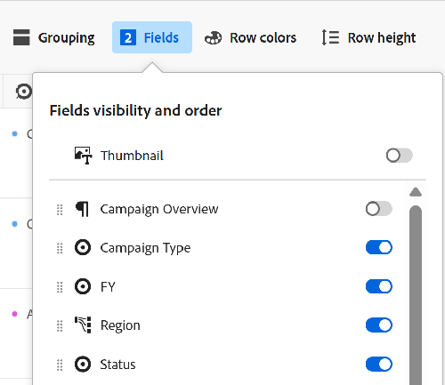
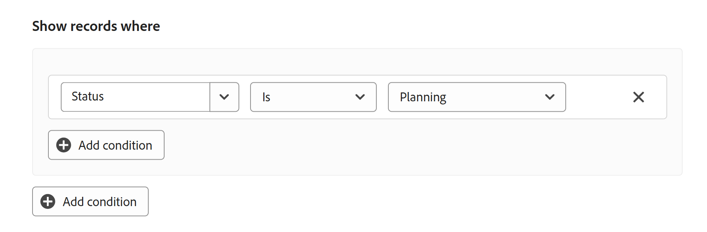
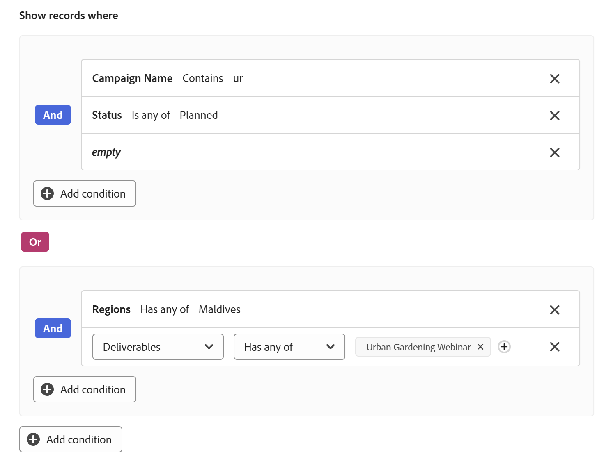
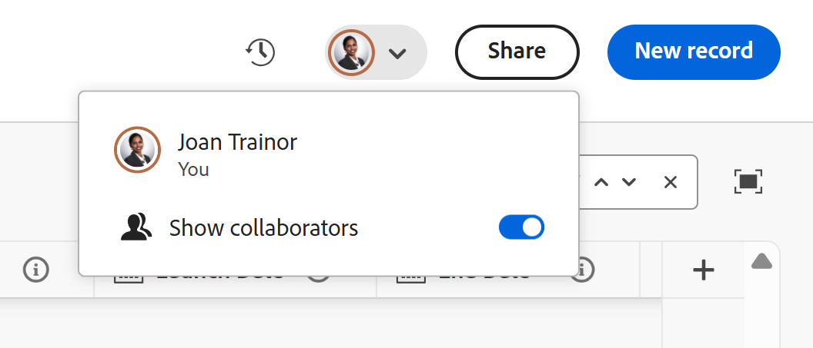

# Gestire la vista tabella

<!--
The information highlighted on this page refers to functionality not yet generally available. It is available only in the Preview environment for all customers. After the monthly releases to Production, the same features are also available in the Production environment for customers who enabled fast releases. 

For information about fast releases, see [Enable or disable fast releases for your organization](/help/quicksilver/administration-and-setup/set-up-workfront/configure-system-defaults/enable-fast-release-process.md). 
-->

{{planning-important-intro}}

È possibile visualizzare i record e i relativi campi in una vista tabella quando si accede alla pagina del tipo di record in Adobe Workfront Planning.

Per informazioni sulle visualizzazioni record e su come gestirle, vedere [Gestione delle visualizzazioni record](/help/quicksilver/planning/views/manage-record-views.md).

Questo articolo descrive le seguenti informazioni:

* [Creare o modificare colonne e righe in una vista tabella](#manage-a-table-view)
* [Abilita indicatori di presenza in tempo reale per la vista tabella](#enable-the-real-time-presence-indicator)

Per informazioni sull&#39;esportazione della vista tabella in un file Excel o CSV, vedere [Esportare i record dalla vista tabella](/help/quicksilver/planning/records/export-records-from-the-table-view.md).

## Requisiti di accesso

+++ Espandi per visualizzare i requisiti di accesso per la funzionalità in questo articolo. 

<table style="table-layout:auto"> 
<col> 
</col> 
<col> 
</col> 
<tbody> 
    <tr> 
<tr> 
</tr>   
<tr> 
   <td role="rowheader">
Pacchetto Adobe Workfront
</td> 
   <td> 

Qualsiasi pacchetto Workfront e Planning

Qualsiasi flusso di lavoro e qualsiasi pacchetto di Planning

Per ulteriori informazioni su ciò che è incluso in ogni pacchetto Workfront Planning, contattare il rappresentante del proprio account Workfront. 
 
   </td> 
  <tr> 
   <td role="rowheader">
Licenza di Adobe Workfront
</td> 
   <td>
 Standard per creare ed eliminare viste

   
Collaboratore o versione successiva per aggiornare gli elementi di visualizzazione

  </td> 
  </tr> 
  <tr> 
   <td role="rowheader">
Autorizzazioni sugli oggetti
</td> 
   <td>   
Gestire le autorizzazioni per una visualizzazione
  
   
Autorizzazioni di visualizzazione a una visualizzazione per modificare temporaneamente le impostazioni di visualizzazione o per duplicarla
 </td> 
  </tr> 
</tbody> 
</table>

Per ulteriori informazioni sui requisiti di accesso a Workfront, vedere [Requisiti di accesso nella documentazione di Workfront](/help/quicksilver/administration-and-setup/add-users/access-levels-and-object-permissions/access-level-requirements-in-documentation.md).

+++ 

<!--
Old:
<table style="table-layout:auto"> 
<col> 
</col> 
<col> 
</col> 
<tbody> 
    <tr> 
<tr> 
<td> 
   
 Products
 </td> 
   <td> 
   <ul><li>
 Adobe Workfront
</li> 
   <li>
 Adobe Workfront Planning
</li></ul></td> 
  </tr>   
<tr> 
   <td role="rowheader">
Adobe Workfront plan*
</td> 
   <td> 

Any of the following Workfront plans:
 
<ul><li>Select</li> 
<li>Prime</li> 
<li>Ultimate</li></ul> 

Workfront Planning is not available for legacy Workfront plans
 
   </td> 
<tr> 
   <td role="rowheader">
Adobe Workfront Planning package*
</td> 
   <td> 

Any 
 

For more information about what is included in each Workfront Planning plan, contact your Workfront account manager. 
 
   </td> 
 <tr> 
   <td role="rowheader">
Adobe Workfront platform
</td> 
   <td> 

Your organization's instance of Workfront must be onboarded to the Adobe Unified Experience to be able to access Workfront Planning.
 

For more information, see <a href="/help/quicksilver/workfront-basics/navigate-workfront/workfront-navigation/adobe-unified-experience.md">Adobe Unified Experience for Workfront</a>. 
 
   </td> 
   </tr> 
  </tr> 
    <td role="rowheader">
Adobe Workfront license*
</td> 
   <td>
 Standard to create and delete views

   
Contributor or higher to update view elements

   
Workfront Planning is not available for legacy Workfront licenses
 
  </td> 
  </tr> 
  <tr> 
   <td role="rowheader">
Access level configuration
</td> 
   <td> 
There are no access level controls for Adobe Workfront Planning
   
</td> 
  </tr> 
<tr> 
   <td role="rowheader">
Object permissions
</td> 
   <td>   
Manage permissions to a view
  
   
View permissions to a view to temporarily change the view settings or to duplicate it
 </td> 
  </tr> 
<tr>
   <td role="rowheader">
Layout template
</td>
   <td> Users with a Light or Contributor license must be assigned a layout template that includes Planning.
   
Standard users and System Administrators have the Planning areas enabled by default.

</li></ul>
</td>
  </tr>
</tbody> 
</table>
-->

## Modificare i record utilizzando la vista tabella

È possibile modificare le informazioni del record nella vista tabella.

Per ulteriori informazioni sulla modifica dei record nella vista tabella, vedere [Modifica record](/help/quicksilver/planning/records/edit-records.md).

## Gestire una vista tabella {#manage-a-table-view}

<!--
Depending on what environment you access record types from, the record type page displays using two different views: 

* Table view, in the Production environment
* List view, in the Preview environment

OR: 

If the List view in Project connected pages and request forms stays the same after GTable rolls out - keep that list as the List view and change the Table view in this article to "Table redesigned view" for now; keep it "the table view" here for the future; for the time being, just say "Updating the view in Prod and Preview is different and make the separate sections for Preview and Prod below with the different steps.

### Manage the table view in the Production environment
-->

Durante la creazione di una vista tabella, tutti i record del tipo selezionato vengono visualizzati in una tabella. Ogni riga è un record univoco e ogni colonna è un campo record. Tutti i campi e tutti i record vengono visualizzati per impostazione predefinita.

Per gestire una vista tabella:

1. Creare una visualizzazione tabella come descritto nell&#39;articolo [Gestire le visualizzazioni record](/help/quicksilver/planning/views/manage-record-views.md).

   

1. (Facoltativo) Fai clic su **Altezza riga**, quindi seleziona una delle seguenti opzioni per modificare l&#39;altezza delle righe della tabella:
   * Piccola
   * Standard
   * Canale
   * Alta

1. (Facoltativo) Fai clic sull&#39;icona **Schermo intero**  per aprire la visualizzazione a schermo intero, quindi sull&#39;icona **Esci da schermo intero**  o Esc sulla tastiera per uscire dallo schermo intero.

1. Aggiornate i seguenti elementi della vista come descritto nelle sottosezioni seguenti:
   * [Colonne (o campi)](#add-columns-or-fields)
   * [Righe (o record)](#add-rows-or-records)
   * [Filtri](#add-filters)
   * [Ordina](#add-a-sort)
   * [Raggruppamento](#add-groupings)
   * [Colori riga](#add-row-colors)
   * [Indicatore di presenza in tempo reale](#enable-the-real-time-presence-indicator)

### Aggiungi colonne (o campi) {#add-columns}

Nelle intestazioni di colonna di una vista tabella vengono visualizzati i campi associati ai record della vista. I campi visualizzati nella vista a tabella vengono visualizzati anche nella sezione Dettagli di un record.

Per ulteriori informazioni, vedere [Modifica record](/help/quicksilver/planning/records/edit-records.md).

<!--this is not available yet:You can display record fields (or columns) in both a table and a timeline view. However, the number of columns displayed in the table of the timeline view is limited and you cannot add columns in addition to those selected by default.-->

L&#39;aggiunta di colonne a una visualizzazione è identica all&#39;aggiunta di campi a un tipo di record.

È possibile aggiungere fino a 500 campi (o colonne) in una visualizzazione tabella.

1. Passare a una pagina del tipo di record e fare clic su una scheda della vista tabella oppure fare clic su **+ Vista** per aggiungere una nuova vista, quindi scegliere **Tabella**.

1. Inizia ad aggiungere campi (o colonne), come descritto nell&#39;articolo [Crea campi](/help/quicksilver/planning/fields/create-fields.md).

   Le colonne aggiunte sono visibili a tutti gli utenti che accedono al tipo di record e vengono aggiunte come nuovi campi nella pagina del record.

1. (Facoltativo) Fai clic sull&#39;icona **Campi**  nella barra degli strumenti, cerca un campo, quindi deseleziona l&#39;opzione a destra del nome del campo per nasconderlo.

1. Per riordinare le colonne della tabella, effettuare una delle seguenti operazioni:

   * Prendi l’intestazione della colonna e trascinala nella posizione desiderata. La colonna spostata viene visualizzata brevemente con uno sfondo blu finché non vengono apportate altre modifiche alla tabella.

   * Fai clic su **Campi** nella barra degli strumenti della tabella, trascina i campi nell&#39;ordine desiderato, quindi fai clic all&#39;esterno della casella **Visibilità campi e ordine** per chiuderla.

     

     >[!TIP]
     >
     >* Per impostazione predefinita, il campo Nome è sempre il primo campo della visualizzazione tabella. Questo è considerato un campo primario.
     >
     >* Non è possibile spostare il campo Nome in un&#39;altra posizione, a meno che non si indichi un altro campo come campo principale. Per ulteriori informazioni, continuare con il passaggio 4. <!--accurate?-->
     >
     >

   * Sostituire il campo nella prima colonna con un altro campo modificando il campo principale. Per ulteriori informazioni, continuare con il passaggio 4. <!--accurate?-->

1. (Facoltativo) Posizionare il puntatore del mouse su un nome di campo nell&#39;intestazione di colonna di un campo che non viene visualizzato nella prima colonna della tabella, fare clic sulla freccia rivolta verso il basso a destra del nome del campo, quindi fare clic su **Imposta come campo principale**.

   

1. Fai clic su **Imposta campo** per confermare.

   Il campo diventa un campo primario, ovvero viene visualizzato come prima colonna della visualizzazione tabella. Il campo primario precedente si sposta sulla seconda colonna.

   I campi primari diventano il titolo e la visualizzazione del record nell&#39;area dell&#39;intestazione della pagina del record e ovunque vengano visualizzati i record. Ad esempio, il titolo del record viene visualizzato in campi collegati e in tutte le visualizzazioni. Per ulteriori informazioni sui campi primari, vedere [Panoramica campo primario](/help/quicksilver/planning/fields/primary-field-overview.md).

1. Fate clic sulle linee di separazione delle colonne e trascinatele nel punto desiderato per aumentare la larghezza delle colonne.

   >[!TIP]
   >
   >Le modifiche apportate alla larghezza e all&#39;ordine delle colonne sono permanenti e visibili a tutti gli utenti che accedono al tipo di record.

1. Passa il puntatore del mouse sull&#39;intestazione della colonna, quindi fai clic sulla freccia rivolta verso il basso, quindi fai clic su **Nascondi campo**

   Oppure

   Fare clic su **Campi** nella barra degli strumenti della tabella e disattivare l&#39;interruttore associato ai campi o alle colonne che si desidera nascondere. Viene visualizzata la casella **Visibilità campi e ordine**.

   >[!TIP]
   >
   >Il numero di campi nascosti viene visualizzato a sinistra dell’icona Campi nella barra degli strumenti.
   >
   >Per impostazione predefinita, i campi nascosti non vengono visualizzati nella casella di anteprima **Dettagli** del record. Tutti i campi vengono visualizzati nella pagina Dettagli del record. Per informazioni, vedere [Gestire il layout della pagina record](/help/quicksilver/planning/records/manage-the-record-page.md).

1. Fai clic sull&#39;icona **Campi** e abilita l&#39;interruttore associato ai campi che desideri visualizzare nelle colonne della tabella. Tutti i campi vengono visualizzati per impostazione predefinita.

1. Per trovare rapidamente i record che corrispondono a una parola chiave, eseguire le operazioni seguenti:

   1. Nella casella **Cerca**  e inizia a digitare una parola chiave associata a qualsiasi campo di un record visualizzato sullo schermo. Accanto all’elemento da cercare viene visualizzato il numero di corrispondenze corrette e viene evidenziato il campo con la corrispondenza corretta.

      

      È possibile utilizzare qualsiasi parola o carattere speciale visibile sullo schermo.

      Non è possibile utilizzare parole chiave associate a campi nascosti nella visualizzazione Tabella.

   1. Premi **Invio** sulla tastiera per passare al successivo campo trovato.

   1. (Facoltativo) Se sono presenti più corrispondenze, fare clic sulle frecce su e giù a destra della parola chiave di ricerca per trovare tutte le corrispondenze nella tabella.

   1. Fare clic sull&#39;icona **x** nella casella di ricerca per deselezionare la parola chiave di ricerca.

### Aggiungi righe (o record) {#add-rows}

Le righe di una vista tabella visualizzano i singoli record del tipo di record selezionato.

Puoi avere fino a 50.000 record (o righe) per .

1. Passare a una pagina del tipo di record e fare clic su una scheda della vista tabella oppure fare clic su **+ Vista** per aggiungere una nuova vista, quindi scegliere **Tabella**.

1. Inizia ad aggiungere record (o righe), come descritto nell&#39;articolo [Crea record](/help/quicksilver/planning/records/create-records.md).

   I record aggiunti nella vista tabella vengono salvati immediatamente e sono visibili a tutti gli utenti che dispongono di autorizzazioni di visualizzazione o di livello superiore per l&#39;area di lavoro.

   Al record viene aggiunta anche un&#39;immagine di anteprima.

1. (Facoltativo) Fai clic sul menu **Altro**  a destra del nome del record, quindi fai clic su **Modifica miniatura** per aggiungere una nuova miniatura al nuovo record.

1. Fai clic su **Campi** nella parte superiore della tabella, quindi seleziona l&#39;interruttore per il campo **Miniatura** per visualizzarlo a sinistra del campo primario.

   Per informazioni, vedere [Aggiungere una miniatura a un record](/help/quicksilver/planning/records/add-thumbnails-to-records.md).

1. (Facoltativo) Seleziona uno o più record in una riga, quindi trascina e rilascia l&#39;icona **handle**  a sinistra del record per riordinare le righe.

   >[!NOTE]
   >
   >Non è possibile riordinare le righe se si applica almeno un ordinamento alla vista tabella.
   >
   >Le modifiche apportate all&#39;ordine delle righe sono visibili a tutti gli utenti che accedono al tipo di record

<!-- this section below links from the timeline view; consider splitting them if they become different-->

### Aggiungere filtri {#add-filters}

I filtri consentono di ridurre la quantità di informazioni visualizzate sullo schermo.

Quando si lavora con i filtri nella vista a tabella, considera quanto segue:

<!-- this list is almost identical to the one for the table view - update both-->

* I filtri creati per la vista tabella funzionano in modo indipendente dai filtri nella vista timeline se applicati allo stesso tipo di record.

* I filtri sono univoci per la vista selezionata. A due visualizzazioni tabella dello stesso tipo di record possono essere applicati filtri diversi. Due utenti che osservano la stessa vista tabella visualizzano lo stesso filtro attualmente applicato.

* Non è possibile denominare i filtri generati e applicati a una vista tabella.

* La rimozione dei filtri li rimuove da chiunque acceda allo stesso tipo di record utilizzato e utilizza la stessa visualizzazione utilizzata.

* È possibile filtrare in base ai campi record o ai campi di ricerca connessi.

* Puoi filtrare per campi di ricerca che visualizzano più valori.

* È possibile fare riferimento a un campo fino a 4 livelli di distanza dal tipo di record corrente. Ad esempio, se si crea un filtro per un tipo di record Attività e l&#39;attività è connessa al tipo di record Prodotto connesso al tipo di record Campagna connesso a un progetto Workfront, è possibile fare riferimento al budget del progetto nel filtro che si sta creando per il tipo di record Attività.

Per aggiungere un filtro a una vista tabella:

1. Creare una visualizzazione tabella per una pagina del tipo di record, come descritto nell&#39;articolo [Gestione visualizzazioni record](/help/quicksilver/planning/views/manage-record-views.md).
1. Seleziona una vista tabella, quindi fai clic su **Filtri** nell&#39;angolo superiore destro della tabella.
1. Fai clic su **Aggiungi condizione** e aggiungi le seguenti informazioni:

   * Cerca un campo e selezionalo quando viene visualizzato nell’elenco.

   * **Seleziona un&#39;opzione** (o un modificatore di filtro) per definire il tipo di condizione che il campo deve soddisfare

     Nella tabella seguente vengono visualizzati i modificatori disponibili per ogni tipo di campo.

     <table>
        <thead>
        <tr>
            <th><b>Tipo di campo</b></th>
            <th><b>Modificatori</b></th>
        </tr>
        </thead>
        <tbody>
        <tr>
            <td>Linea singola, paragrafo, formula </td>
            <td>
Contiene

            
Non contiene

            
È

            
Non è

            
È vuoto

            
Non è vuoto
</td>
        </tr>
        <tr><td>Selezione singola</td>
            <td>
È

            
Non è

            
È uno qualsiasi di

            
Non è nessuno di

            
È vuoto

            
Non è vuoto
</td>
        </tr>
        <tr>
            <td>Selezione multipla, Persone</td>
            <td>
Ha uno qualsiasi di

            
Ha tutti

            
È esattamente

            
Non ha nessuno di

            
È vuoto

            
Non è vuoto
</td>
        </tr>
        <tr>
            <td>Numero, Percentuale, Valuta</td>
            <td>
=

            
≠

            
 &lt; 

            
&gt;

            
≤

            
≥

            
È vuoto

            
Non è vuoto
</td>
        </tr>
        <tr>
            <td>Data</td>
            <td>
È

            
Non è

            
È dopo il

            
È prima del

            
È compreso tra

Non è compreso tra

            
È vuoto

Non è vuoto
</td>
        </tr>

     <tr>
            <td>Casella di controllo</td>
            <td>
È

        </tr>
        </tbody>
        </table>

   * Selezionare un valore per il campo selezionato.

   

   Non esiste alcun limite al numero di condizioni di filtro che è possibile aggiungere.

1. (Facoltativo) Fai clic su **Aggiungi condizione** per aggiungere un&#39;altra opzione di filtro e ripetere i passaggi precedenti. Il numero di filtri applicati viene visualizzato a sinistra dell’icona Filtri.
1. Fai clic sugli operatori seguenti per indicare come vengono unite e devono essere applicate le condizioni del filtro:

   * **AND**: tutte le condizioni specificate devono essere soddisfatte.
   * **OR**: è necessario soddisfare una delle condizioni specificate. Questa è l&#39;opzione predefinita.

   1. (Facoltativo) Aggiungi altri operatori **AND** o **OR** tra più raggruppamenti di condizioni.

      

   L’elenco dei record viene filtrato automaticamente.  <!--at this time, you can't name and save the filter - but will this change?!-->
   <!-- asked on the task for the simple filters whether there is a limitation for how many statements a filter can have?!-->

1. (Facoltativo) Fai clic sull&#39;icona **x** per rimuovere una condizione di filtro.
1. (Facoltativo) Fai clic su **Filtri** per chiudere la casella dei filtri. <!--right now you cannot "clear all" for filters, but this might come later-->

### Aggiungi un ordinamento {#sort-information}

Applicando un ordinamento, è possibile organizzare le informazioni in un determinato ordine.

Puoi ordinare le seguenti informazioni:

* Tutti i record in una vista tabella. <!--or timeline view. ***********verify this is the case for the timeline view*********************-->
  <!--* All groupings. - this is not available yet-->

Quando si ordinano i record nella vista tabella, tenere presente quanto segue:

<!-- if this is available for the timeline view, update both when you update one-->

* L&#39;ordinamento è univoco per la visualizzazione selezionata. A due viste tabella dello stesso tipo di record possono essere applicati criteri di ordinamento diversi. Due utenti che visualizzano la stessa vista tabella visualizzano lo stesso ordinamento attualmente applicato.

* Non è possibile denominare le ordinazioni create e applicate a una vista tabella.

* L’ordinamento creato viene mantenuto anche quando ci si sposta.

* È possibile ordinare in base al numero di campi visualizzato nella visualizzazione per tabella di un tipo di record.

* Non è possibile ordinare in base ai campi record connessi, ma è possibile ordinare in base ai campi di ricerca dei tipi di record connessi.

* Quando si ordina in base a campi di ricerca con più valori (che non sono stati riepilogati da un aggregatore), il primo valore viene utilizzato per l’ordinamento.

* Se si rimuovono i criteri di ordinamento, questi verranno rimossi da chiunque acceda allo stesso tipo di record utilizzato e utilizzerà la stessa visualizzazione utilizzata.

* È possibile fare riferimento a un campo fino a 4 livelli di distanza dal tipo di record corrente. Ad esempio, se si crea un ordinamento per un tipo di record Attività e l&#39;Attività è connessa al tipo di record Prodotto connesso al tipo di record Campagna connesso a un progetto Workfront, è possibile fare riferimento allo Stato del progetto nell&#39;ordinamento che si sta creando per il tipo di record Attività.

Per ordinare <!--ungrouped (add this when sorting for groupings will be available--> record, eseguire le operazioni seguenti:

1. Creare una visualizzazione tabella come descritto nell&#39;articolo [Gestire le visualizzazioni record](/help/quicksilver/planning/views/manage-record-views.md).
1. Fai clic sull&#39;icona **Ordina**  nell&#39;angolo superiore destro della tabella

   Oppure

   Passa il puntatore del mouse sul nome di una colonna nella vista tabella, fai clic sulla freccia rivolta verso il basso a destra del nome dell&#39;intestazione della colonna, quindi fai clic su **Ordina per questo campo**. Il campo viene aggiunto come selezione di ordinamento nell’icona Ordina nell’angolo superiore destro della vista tabella.

1. (Condizionale) Nella casella **Ordina record per** fare clic su uno dei campi suggeriti oppure su **Scegli un campo diverso** e cerca un campo diverso, quindi fare clic su di esso quando viene visualizzato nell&#39;elenco.

   L&#39;ordinamento viene applicato automaticamente alla vista tabella e i record vengono visualizzati in base ai criteri selezionati.

   <!-- add a step that you can rearrange the sorting fields here, when this will be possible-->

1. (Facoltativo) Fai clic su **Aggiungi condizione** e ripeti i passaggi precedenti per ordinare in base ai campi aggiuntivi.

   Il numero di campi in base ai quali si esegue l’ordinamento viene visualizzato a sinistra dell’icona Ordina nell’angolo superiore destro della barra degli strumenti. È possibile scegliere solo i campi che vengono visualizzati nelle colonne della vista tabella.

1. (Facoltativo) Nella casella **Ordina record per**, fare clic sull&#39;icona **x** a destra di un campo di ordinamento per rimuovere l&#39;ordinamento

   Oppure

   Fare clic su **Cancella tutto** per rimuovere tutti i campi dall&#39;ordinamento.

1. Fare clic all&#39;esterno della casella **Ordina record per** per chiuderla.

   

   Le informazioni visualizzate nella tabella vengono ordinate in base ai criteri selezionati.

   I campi selezionati per l’ordinamento visualizzano un’icona di ordinamento seguita da un numero che indica l’ordine in cui viene applicato l’ordinamento.

### Aggiungi raggruppamenti {#add-groupings}

<!--this section exists in the timeline view too, but the display is slightly different, so I kept both steps; consider updating both sections if any updates to groupings are introduced-->

È possibile raggruppare i record in base a informazioni simili quando si applica un raggruppamento a una visualizzazione.

Considera i seguenti aspetti:

* Potete applicare i raggruppamenti sia nella vista tabella che nella vista timeline. I raggruppamenti della vista tabella sono indipendenti da quelli della vista timeline dello stesso tipo di record.
* È possibile applicare 3 livelli di raggruppamento in una visualizzazione. I record vengono raggruppati in base all&#39;ordine dei raggruppamenti selezionati.
&lt;!—* È possibile applicare fino a 4 livelli di raggruppamento quando si utilizza l’API. —controllare questo per il momento—>
* I raggruppamenti sono univoci per la vista selezionata. A due visualizzazioni tabella dello stesso tipo di record possono essere applicati raggruppamenti diversi. Due utenti che visualizzano la stessa vista tabella visualizzano lo stesso raggruppamento attualmente applicato.
* Non è possibile denominare i raggruppamenti creati per una vista tabella.
* Se si rimuovono i raggruppamenti, questi verranno rimossi da tutti coloro che accedono allo stesso tipo di record e che visualizzano la stessa visualizzazione.
* È possibile modificare i record elencati in un raggruppamento.
* È possibile eseguire il raggruppamento in base ai campi record o ai campi di ricerca connessi.
* Quando si esegue il raggruppamento per campi di ricerca con più valori (che non sono stati riepilogati da un aggregatore), i record vengono raggruppati per ogni combinazione univoca di valori di campo.
* È possibile fare riferimento a un campo fino a 4 livelli di distanza dal tipo di record corrente. Ad esempio, se si crea un raggruppamento per un tipo di record Attività e l&#39;attività è connessa al tipo di record Prodotto connesso al tipo di record Campagna connesso a un progetto Workfront, è possibile fare riferimento allo stato del progetto nel raggruppamento che si sta creando per il tipo di record Attività.
* I raggruppamenti sono elencati in ordine alfabetico dei relativi valori.
<!--checking into this: * You can apply up to 4 levels of grouping when using the API. -->
<!-- checking also into this: * You cannot group by a Paragraph-type field.-->

Per aggiungere un raggruppamento:

1. Creare una visualizzazione timeline per un tipo di record, come descritto nell&#39;articolo [Gestire le visualizzazioni record](/help/quicksilver/planning/views/manage-record-views.md).
1. Fai clic su **Raggruppamento** nell&#39;angolo superiore destro della visualizzazione tabella.

   

1. Fare clic su uno dei campi suggeriti oppure fare clic su **Scegli un campo diverso**, cerca un campo diverso e quindi fare clic su di esso quando viene visualizzato nell&#39;elenco.

   Il raggruppamento viene applicato automaticamente alla tabella e i record vengono visualizzati sotto la linea di separazione di raggruppamento.

1. (Facoltativo) Fai clic su **Aggiungi condizione** e ripeti i passaggi precedenti per aggiungere fino a 3 raggruppamenti.

   Il numero di campi selezionati per il raggruppamento viene visualizzato accanto all’icona Raggruppamento.

   

1. (Facoltativo) Nella casella **Raggruppa record per**, fai clic sull&#39;icona **x** a destra di un campo selezionato per il raggruppamento per rimuovere il raggruppamento.

1. Fare clic all&#39;esterno della casella **Raggruppa record per** per chiuderla.
1. (Facoltativo) Fai clic su **+ Nuovo record** alla fine di qualsiasi raggruppamento per aggiungere nuovi record, quindi aggiorna la pagina per aggiungere il nuovo record al raggruppamento appropriato. <!--this might need to be changed when they add the Refresh button on the toolbar of the table view-->

1. Per espandere o comprimere i raggruppamenti, effettuare una delle seguenti operazioni:

   1. Fai clic sull&#39;icona **Raggruppamento**, quindi **Espandi tutto** o **Comprimi tutto**. Questo espande tutti i raggruppamenti e i sottogruppi nella vista tabella.

      

   1. Fai clic con il pulsante destro del mouse su una delle intestazioni di raggruppamento nella vista a tabella, quindi fai clic su una delle seguenti opzioni:
      * **Espandi gruppo**
      * **Comprimi gruppo**
      * **Espandi tutto**
      * **Comprimi tutto**
      * **Espandi sottogruppi**
      * **Comprimi sottogruppi**

      A seconda del numero di raggruppamenti applicati alla visualizzazione, alcune opzioni potrebbero non essere disponibili.

<!--
 this is not available yet: 

To sort grouped records: 

1. Create a view, as described in [Create or edit record views](#create-or-edit-record-views). 
1. ************************* add steps here for sorting grouped records****************

-->

### Aggiungi colori riga

1. (Facoltativo) Fai clic su **Colori riga** per definire le condizioni e scegliere di configurare colori diversi per le righe della tabella.

1. Fai clic su **Aggiungi colore**, quindi cerca un campo e selezionalo quando viene visualizzato nell&#39;elenco. Campo di cui si desidera determinare il colore di una riga.

   Ad esempio, per visualizzare le campagne con lo stato Attivo in verde, seleziona **Stato**, quindi scegli un modificatore e un valore per il campo.

   

1. Fare clic sul menu a discesa del selettore colore nell&#39;angolo superiore sinistro della condizione selezionata per scegliere il colore della condizione, quindi fare clic all&#39;esterno della casella del selettore colore per chiuderlo.

   

1. (Facoltativo) Fai clic su **Aggiungi condizione** per aggiungere altri campi e valori al primo set di condizioni

   Oppure

   Fare clic su **Aggiungi colore** per aggiungere un nuovo insieme di condizioni e identificare un nuovo colore.

   Ad esempio, è possibile visualizzare le campagne con lo stato Pianificazione in giallo definendo un nuovo set di condizioni.

   

1. (Facoltativo) Attivare l&#39;impostazione **Applica all&#39;intera riga** nell&#39;angolo superiore destro della casella Colori riga. L’intera riga in cui viene soddisfatta la condizione viene visualizzata automaticamente nel colore selezionato.

   >[!NOTE]
   >
   >* Se l&#39;opzione Applica all&#39;intera riga è disattivata, solo il lato sinistro del campo Principale visualizza un indicatore di colore stretto con il colore selezionato. L&#39;impostazione è disattivata per impostazione predefinita.
   >
   >* Non è possibile applicare colori di riga a un&#39;intera riga se nella visualizzazione per tabella è selezionato almeno un raggruppamento. Il colore del ruolo si applica solo a sinistra della cella del campo principale quando si applicano i raggruppamenti alla tabella.

1. Fare clic all&#39;esterno della casella **Colori riga** per chiuderla. I colori vengono applicati automaticamente.

### Abilita indicatore di presenza in tempo reale

Per impostazione predefinita, nell&#39;angolo superiore destro di tutte le visualizzazioni record vengono visualizzati gli avatar di altri utenti che modificano le informazioni dei record contemporaneamente.

Quando si visualizza la vista tabella, è inoltre possibile visualizzare il campo che un altro utente sta modificando al momento della visualizzazione del record.

1. Passare a una pagina del tipo di record e aprire qualsiasi visualizzazione.
1. (Condizionale) Se altri utenti modificano contemporaneamente i record del tipo selezionato, i relativi avatar vengono visualizzati nell’angolo superiore destro della visualizzazione.
1. Fai clic sul menu a discesa accanto agli avatar, per attivare l&#39;impostazione **Mostra collaboratori**. L&#39;impostazione è attivata per impostazione predefinita.

   

   >[!TIP]
   >
   >È possibile selezionare l&#39;opzione **Mostra collaboratori** da qualsiasi visualizzazione. Il campo attualmente modificato da altri utenti è evidenziato solo nella vista tabella.

1. (Facoltativo) Apri una vista a tabella e il campo che un’altra persona sta modificando attivamente viene evidenziato nel colore corrispondente al contorno del proprio avatar nella vista a tabella.

   Se il colore di evidenziazione dell’avatar è grigio, l’utente ha interrotto la modifica attiva del record più di 30 secondi fa.

   

   <!--maybe include a screen shot after release if they update the UI text in this list of users-->

1. (Facoltativo) Fai clic sul triangolo nell’angolo superiore destro della cella che contiene il campo modificato da altri. Viene visualizzato un elenco degli utenti che stanno modificando il campo.

>[!TIP]
>
>Gli indicatori di presenza in tempo reale visualizzano gli utenti che stanno modificando un campo in qualsiasi punto di Workfront Planning. Ciò include la vista tabella o l&#39;area Dettagli del record.

<!--

### Manage the list view in the Preview environment

**********MAYBE THIS IS VALID ONLY WHEN WE REPLACE THE NAVIGATION?????????*********

(*****************Maybe add this when they remove the list view from connection pages and request form list: In the Preview environment, the table view has been replaced with the list view. *******************)

*******************IF THEY REPLACE THE LIST VIEW (IN PROJECTS AND FORMS) WITH THE NEW LIST, THEN JUST UPDATE THAT ARTICLE - "MANAGE THE LIST VIEW" - AND ADD A LINK TO IT HERE; IF NOT, THEN ADD THE SPECIFICS OF THE VIEW HERE**************

When creating a table view, all records of the selected type display in a table. Each row is a unique record and each column is a record field. All fields and all records display by default. 

To manage a table view: 

1. Create a table view, as described in the article [Manage record views](/help/quicksilver/planning/views/manage-record-views.md).

    

1. (Optional) Click **Row height**, then select from the following options to modify the height of the table rows: 
    * Short
    * Standard
    * Medium
    * Tall 

1. (Optional) Click the **Full screen** icon  to open the view in full screen, then the **Exit full screen** icon  or Escape on your keyboard to exit the full screen.

1. Update the following view elements as described in the subsections below:
    * [Columns (or fields)](#add-columns-or-fields)
    * [Rows (or records)](#add-rows-or-records)
    * [Filters](#add-filters) 
    * [Sort](#add-a-sort) 
    * [Grouping](#add-groupings)
    * [Row colors](#add-row-colors)
    * [Real-time presence indicator](#enable-the-real-time-presence-indicator)

### Add columns (or fields) {#add-columns}

The column headers of a table view display fields associated with the records in the view. Fields displayed in the table view also display in the Details section of a record. 

For more information, see [Edit records](/help/quicksilver/planning/records/edit-records.md). 

************ this is not available yet:You can display record fields (or columns) in both a table and a timeline view. However, the number of columns displayed in the table of the timeline view is limited and you cannot add columns in addition to those selected by default. ***************

Adding columns to a view is identical to adding fields to a record type.  

You can add up to 500 fields (or columns) in a table view. 

1. Go to a record type page and click a table view tab, or click **+ View** to add a new view, then choose **Table**. 

1. Start adding fields (or columns), as described in the article [Create fields](/help/quicksilver/planning/fields/create-fields.md). 

    The columns you add are visible to all users who access the record type and are added as new fields on the record's page.

1. (Optional) Click the **Fields** icon  in the toolbar, search for a field, then unselect the toggle to the right of the field name to hide the field. 
   
1. Do one of the following to reorder columns in the table:

    * Grab the column header and drag and drop it in the desired position. The column you moved briefly displays with a blue background until you make other adjustments to the table. 

    * Click **Fields** in the table's toolbar, then drag and drop the fields in the desired order, then click outside the **Fields visibility and order** box to close it.
        
        

        >[!TIP]
        >
        >* The Name field is always the first field in the table view, by default. This is considered a primary field. 
        >
        >* You cannot move the Name field to another position, unless you designate another field as the primary field. For more information, continue with Step 5. **********************accurate?**************
        >
        >
 
    * Replace the field in the first column with another field by changing the primary field. For more information, continue to step 5. **********************accurate?**************

1. (Optional) Hover over a field name in the column header of any field that does not display in the first column of the table, click the downward-pointing arrow to the right of the field name, then click **Set as primary field**. 
    
    

1. Click **Set field** to confirm. 

    The field becomes a primary field which means it displays as the first column of the table view. The previous primary field moves to the second column.

    Primary fields become the record's title and display in the header area of the record's page, and everywhere where the records display. For example, the record title displays in connected fields and all views. For more information about primary fields, see [Primary field overview](/help/quicksilver/planning/fields/primary-field-overview.md). 

1. Click and drag the column separation lines and drop them in the desired spot to increase the width of the columns. 

    >[!TIP]
    >
    >The changes you make to the column width and order are permanent and visible to all users who access the record type. 

1. Hover over the column header, then click the downward-pointing arrow, then click **Hide field**

    Or

    Click **Fields** in the table toolbar and deselect the toggle associated with the fields (or columns) you want to hide. The **Fields visibility and order** box displays.

    >[!TIP]
    >
    >The number of hidden fields displays to the left of the Fields icon in the toolbar.
    >
    >By default, hidden fields do not display in the record's **Details** preview box. All fields display in the record's Details page. For information, see [Manage the record page layout](/help/quicksilver/planning/records/manage-the-record-page.md).

1. Click the **Fields** icon and select the toggle associated with the fields you want to display in the columns of the table. All fields display by default.

1. Do the following to quickly find records that match a keyword:

    1. In the **Search** box  and start typing a keyword associated with any field of a record that displays on the screen. The number of correct matches displays next to the search item and the field with the correct match is highlighted. 

        

        You can use any word or special character that is visible on the screen. 
    
        You cannot use keywords that are associated with fields that are hidden in the table view. 

    1. Press **Enter** on your keyboard to go to the next found field. 

    1. (Optional) If there is more than one match, click the up and down arrows to the right of the search keyword to find all the matches in the table. 

    1. Click the **x** icon in the search box to clear the search keyword. 
1. For number, currency, percentage, and formula fields that are formatted as any of these field types, expand the aggregator dropdown menu at the bottom of the columns, and select from the following options:

    * SUM: Displays the total of all cells in the column. This is the default selection. 
    * MIN: Displays the lowest value from all the cells in the column. 
    * MAX: Displays the highest value from all the cells in the column. 
    * AVG: Displays the average value of all the cells in the column. 

    The aggregator row in the column is frozen and is part of the view settings. The aggregator you choose will be shared with the view when you share the view with others. 

### Add rows (or records) {#add-rows}

The rows of a table view display individual records of the selected record type. 

You can have up to 50,000 records (or rows) for a record type. 

1. Go to a record type page and select a table view, or click **+ View** to add a new view, then choose **Table**. 

1. Start adding records (or rows), as described in the article [Create records](/help/quicksilver/planning/records/create-records.md). 

    The records you add in the table view are saved immediately and are visible to all users who have View or higher permissions to the workspace. 

    A default thumbnail image is also added to the new record.

1. (Optional) Click the **More** menu  to the right of the record, then click **Edit thumbnail** to add a thumbnail to each record
1. Click **Fields** at the top of the table, then select the toggle for the **Thumbnail** field to display it to the left of the primary field. It is deselected by default. 
    
    For information, see [Add a thumbnail to a record](/help/quicksilver/planning/records/add-thumbnails-to-records.md).

******************** NOT POSSIBLE NOW **********

1. (Optional) Select one or multiple records in a row, then drag and drop the **handle** icon  to the left of the record to reorder the rows. 

    >[!NOTE]
    >
    >You cannot reorder rows if you apply at least one sort to the table view. 
    >
    >The changes you make to the row order are visible to all users who access the record type

******************** NOT POSSIBLE ABOVE **************

### Add filters {#add-filters}

Filters help you reduce the amount of information displayed on the screen.

Adding filters in the table view in the Preview environment is identical to adding filters in the Production environment. 

For information, see the [Add filters](#add-filters) section in this article. 

*****************at production, paste here the information from the Production section above*******************

### Add a sort {#sort-information} 

By applying a sort, you can organize information in a given order. 

You can sort the following information:

* All records in a table view. 
************** * All groupings. - this is not available yet***********

Consider the following when sorting records in the table view: 

*********** if this is available for the timeline view, update both when you update one ****************

* Sorting is unique to the view that you select. Two table views of the same record type can have different sorting criteria applied to them. Two users looking at the same table view see the same sorting that is currently applied. 

* You cannot name the sortings you build and apply to a table view.

* The sorting you create is preserved when you navigate away.

* You can sort by as many fields as you see displayed in the table view of a record type.

* You cannot sort by connected record fields, but you can sort by lookup fields from connected record types. 

* When you sort by lookup fields with multiple values (that have not been summarized by an aggregator), the first value is used for sorting. 

* Removing sorting criteria removes them from anyone accessing the same record type as you and uses the same view as you use.

* You can reference a field that is up to 4 levels away from the current record type. For example, if you are creating a sort for an Activity record type, and the Activity is connected to the Product record type which is connected to the Campaign record type which is connected to a Workfront Project, you can reference the project's Status in the sort you are creating for the Activity record type. 

To sort records, do the following:

1. Create a table view, as described in the article [Manage record views](/help/quicksilver/planning/views/manage-record-views.md).
1. Click the **Sort** icon  in the upper-right corner of the table
    
    Or

    Hover over the name of a column in the table view, click the downward-pointing arrow to the right of the column header name, then click **Sort by this field**. 
    
1. (Conditional) If you clicked the **Sort** icon at the top of the table, also select the order in which you want the field sorted. The options for the sorting order depend on the type of field you are sorting by. 

    >[!TIP]
    >
    >The selections below are not available when you access sorting from the column header. 

    Choose from the following options: 

    * Date fields: 
        * Earliest to latest
        * Latest to earliest
    * Text, paragraph, select fields, people, Record ID:
        * Alphabetical A to Z
        * Reverse alphabetical Z to A
    * Number, percentage, currency fields:
        * Ascending 0 to 9
        * Descending 9 to 0
    * Checkbox fields: 
        * Selected first
        * Deselected first

    The field is added as a sorting selection in the **Sort** icon at the top of the table. 

1. (Conditional) In the **Sort records by** box, click one of the suggested fields, or click **Choose a different field** and search for a different field, then click it when it displays in the list. 

    The sorting is applied automatically to the table view and records display sorted by your selected criteria. 
    
1. (Optional) Click **Add condition**, and repeat the above steps to sort by additional fields.  

    The number of fields that you are sorting by displays to the left of the Sort icon in the upper-right corner of the toolbar. You can choose only fields that display in the columns of the table view.

1. (Optional) In the **Sort records by** box, click the **x** icon to the right of a sorting field to remove the sort

    Or

    Click **Clear all** to remove all fields from the sort. 

1. Click outside the **Sort records by** box to close it. 

    

    The information displayed in the table is sorted according to your selected criteria. 
    
    The fields selected for the sort display a sorting icon followed by a number that indicates the order in which the sorting is applied. 

### Add groupings {#add-groupings}

***********************this section exists in the timeline view too, but the display is slightly different, so I kept both steps; consider updating both sections if any updates to groupings are introduced***************

You can group records by similar information when applying  a grouping to a view.

Consider the following:

* You can apply groupings both in the table and timeline views. The groupings of the table view are independent from those in the timeline view of the same record type.
* You can apply 3 levels of grouping in a view. The records are grouped in the order of groupings that you select. 
***************  * You can apply up to 4 levels of grouping when using the API. --checking on this one for now ******************
* The groupings are unique to the view that you select. Two table views of the same record type can have different groupings applied to them. Two users looking at the same table view see the same grouping that is currently applied. 
* You cannot name the groupings you build for a table view.
* Removing groupings removes them from anyone accessing the same record type as you and who displays the same view as you do. 
* You can edit records listed under a grouping. 
* You can group by connected record fields or lookup fields. 
* When you group by lookup fields with multiple values (that have not been summarized by an aggregator), records are grouped by each unique combination of field values.  
* You can reference a field that is up to 4 levels away from the current record type. For example, if you are creating a grouping for an Activity record type, and the Activity is connected to the Product record type which is connected to the Campaign record type which is connected to a Workfront Project, you can reference the project's Status in the grouping you are creating for the Activity record type. 
* Groupings are listed in the alphabetical order of their values. 
********************* checking into this: * You can apply up to 4 levels of grouping when using the API. ******************

To add a grouping:

1. Create a table view for a record type, as described in the article [Manage record views](/help/quicksilver/planning/views/manage-record-views.md). 
1. Click **Grouping** in the upper-right corner of the table view.

    

1. Click one of the suggested fields, or click **Choose a different field**, search for a different field, then click it when it displays in the list.

    The grouping is applied automatically to the table and records display under the grouping separation line.
    
1. (Optional) Click **Add condition** and repeat the above steps to add up to 3 groupings. 

    The number of fields selected for the grouping displays next to the Grouping icon. 

    

1. (Optional) Inside the **Group records by** box, click the **x** icon to the right of a field selected for the grouping to remove the grouping. 

1. Click outside the **Group records by** box to close it. 
1. (Optional) Click **+ New record** at the end of any grouping to add new records, then refresh your page to add the new record to the appropriate grouping.

1. To expand or collapse groupings, click the **Grouping** icon, then **Expand all**, or **Collapse all**. This expands all the groupings and subgroupings in the table view. 

    

    
    ******** NOT POSSIBLE **********
    1. Right-click any of the grouping headers in the table view, then click one of the following options:
        * **Expand group**
        * **Collapse group**
        * **Expand all**
        * **Collapse all**
        * **Expand subgroups**
        * **Collapse subgroups**

        Depending on the number of groupings you apply to the view, some options might not be available.
    ********* NOT POSSIBLE ABOVE **********
   

************* EDIT THIS OR HIDE FOR PREVIEW RELEASE ***************

### Add row colors

1. (Optional) Click **Row colors** to define conditions and choose configure different colors for table rows.

1. Click **Add color**, then search for a field then select it when it displays in the list. This is the field whose value you want to define the color of a row.

    For example, to display campaigns with a status of Active in green, select **Status**, then choose a modifier and a value for the field. 

    

1. Click the drop-down menu for the color picker in the upper-left corner of the condition you selected, to pick the color for the condition, then click outside the color picker box to close it. 

    

1. (Optional) Click **Add condition** to add more fields and values to the first set of conditions 

    Or

    Click **Add color** to add a new set of conditions and identify a new color. 
    
    For example, you can display campaigns in a Planning status in yellow by defining a new set of conditions. 

    

1. (Optional) Turn on the **Apply to the entire row** setting in the upper-right corner of the **Row colors** box. The entire row where the condition is met automatically displays in the selected color. 

    >[!NOTE]
    >
    >If the **Apply to the entire row** setting is turned off, only the background of the primary field cell displays in the selected color. The setting is turned off by default.
    >

1. Click outside the **Row colors** box to close it. The colors are applied automatically.

### Enable the real-time presence indicator

The avatars of other users who are editing record information at the same time as you display in the upper-right corner of all record views, by default.

When you display the table view, you can also view which field another user is editing at the time you are viewing the record. 

Enabling the real-time presence indicator in the table view in the Preview environment is identical to enabling it in the Production environment. 

For information, see the [Enable the real-time presence indicator](#enable-the-real-time-presence-indicator) section in this article. 

************* at production, paste here the information from the Production section above ****************

-->

