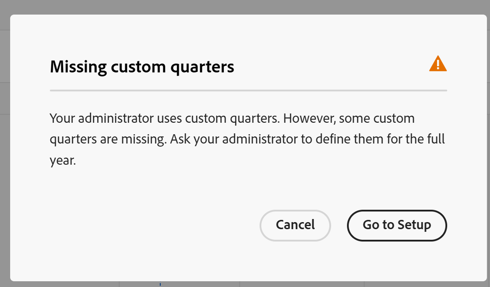

# Gestire la visualizzazione della timeline

Le informazioni evidenziate in questa pagina si riferiscono a funzionalità non ancora generalmente disponibili. È disponibile solo nell’ambiente di anteprima per tutti i clienti. Dopo i rilasci mensili in Produzione, le stesse funzioni sono disponibili nell’ambiente di Produzione per i clienti che hanno abilitato i rilasci rapidi. 

Per informazioni sulle versioni rapide, vedere [Abilitare o disabilitare le versioni rapide per l&#39;organizzazione](/help/quicksilver/administration-and-setup/set-up-workfront/configure-system-defaults/enable-fast-release-process.md). 

{{planning-important-intro}}

È possibile visualizzare i record in una vista timeline quando si accede alla pagina del tipo di record in Adobe Workfront Planning.

Per informazioni sulle visualizzazioni record, vedere [Gestione visualizzazioni record](/help/quicksilver/planning/views/manage-record-views.md).

## Requisiti di accesso

+++ Espandi per visualizzare i requisiti di accesso per la funzionalità in questo articolo. 

<table style="table-layout:auto"> 
<col> 
</col> 
<col> 
</col> 
<tbody> 
    <tr> 
<tr> 
</tr>   
<tr> 
   <td role="rowheader">
Pacchetto Adobe Workfront
</td> 
   <td> 

Qualsiasi pacchetto Workfront e Planning

Qualsiasi flusso di lavoro e qualsiasi pacchetto di Planning

Per ulteriori informazioni su ciò che è incluso in ogni pacchetto Workfront Planning, contattare il rappresentante del proprio account Workfront. 
 
   </td> 
  <tr> 
   <td role="rowheader">
Licenza Adobe Workfront
</td> 
   <td>
 Standard per creare ed eliminare viste

   
Collaboratore o versione successiva per aggiornare gli elementi di visualizzazione

  </td> 
  </tr> 
  <tr> 
   <td role="rowheader">
Autorizzazioni oggetto
</td> 
   <td>   
Gestire le autorizzazioni per una visualizzazione
  
   
Autorizzazioni di visualizzazione a una visualizzazione per modificare temporaneamente le impostazioni di visualizzazione o per duplicarla
 </td> 
  </tr> 
<tr>
   <td role="rowheader">
Modello layout
</td>
   <td> Agli utenti con una licenza Light o Contributor deve essere assegnato un modello di layout che includa Planning.
   
Per impostazione predefinita, le aree Pianificazione sono attivate dagli utenti standard e dagli amministratori di sistema.

</li></ul>
</td>
  </tr> 
</tbody> 
</table>

Per ulteriori informazioni sui requisiti di accesso a Workfront, vedere [Requisiti di accesso nella documentazione di Workfront](/help/quicksilver/administration-and-setup/add-users/access-levels-and-object-permissions/access-level-requirements-in-documentation.md).

+++ 

<!--Old:
<table style="table-layout:auto"> 
<col> 
</col> 
<col> 
</col> 
<tbody> 
    <tr> 
<tr> 
<td> 
   
 Products
 </td> 
   <td> 
   <ul><li>
 Adobe Workfront
</li> 
   <li>
 Adobe Workfront Planning
</li></ul></td> 
  </tr>   
<tr> 
   <td role="rowheader">
Adobe Workfront plan*
</td> 
   <td> 

Any of the following Workfront plans:
 
<ul><li>Select</li> 
<li>Prime</li> 
<li>Ultimate</li></ul> 

Workfront Planning is not available for legacy Workfront plans
 
   </td> 
<tr> 
   <td role="rowheader">
Adobe Workfront Planning package*
</td> 
   <td> 

Any 
 

For more information about what is included in each Workfront Planning plan, contact your Workfront account manager. 
 
   </td> 
 <tr> 
   <td role="rowheader">
Adobe Workfront platform
</td> 
   <td> 

Your organization's instance of Workfront must be onboarded to the Adobe Unified Experience to be able to access Workfront Planning.
 

For more information, see <a href="/help/quicksilver/workfront-basics/navigate-workfront/workfront-navigation/adobe-unified-experience.md">Adobe Unified Experience for Workfront</a>. 
 
   </td> 
   </tr> 
  </tr> 
    <td role="rowheader">
Adobe Workfront license*
</td> 
   <td>
 Standard to create and delete views

   
Contributor or higher to update view elements

   
Workfront Planning is not available for legacy Workfront licenses
 
  </td> 
  </tr> 
  <tr> 
   <td role="rowheader">
Access level configuration
</td> 
   <td> 
There are no access level controls for Adobe Workfront Planning
   
</td> 
  </tr> 
<tr> 
   <td role="rowheader">
Object permissions
</td> 
   <td>   
Manage permissions to a view
  
   
View permissions to a view to temporarily change the view settings or to duplicate it
 </td> 
  </tr> 
<tr>
   <td role="rowheader">
Layout template
</td>
   <td> Users with a Light or Contributor license must be assigned a layout template that includes Planning.
   
Standard users and System Administrators have the Planning areas enabled by default.

</li></ul>
</td>
  </tr>
</tbody> 
</table> -->

## Gestire una vista timeline {#manage-a-timeline-view}

Durante la creazione di una vista timeline, tutti i record del tipo di record selezionato vengono visualizzati in una timeline cronologica.

Considera quanto segue:

* È possibile creare una visualizzazione Sequenza temporale solo se a un tipo di record sono associati almeno due campi data. Se a un tipo di record è associato uno o nessun campo data, l&#39;opzione della visualizzazione Timeline non è disponibile.

  Durante la creazione di una vista timeline, puoi scegliere uno dei seguenti campi di data:

   * Registra date
   * Registra campi generati dal sistema: Data di creazione, Data ultima modifica
   * Ricercare le date dai tipi di oggetto o record connessi (solo quando è stato aggiunto un aggregatore per tali date quando sono stati collegati i tipi di oggetto o record)
* A seconda delle date associate ai record, alcuni record potrebbero non essere visualizzati nella visualizzazione della sequenza temporale nei seguenti scenari:

   * Quando le date di inizio e fine non hanno valori
   * Quando le date di inizio o fine non hanno valore
   * Quando la data di inizio è successiva alla data di fine

Per gestire una vista timeline:

1. Passare alla pagina del tipo di record per la quale si desidera visualizzare la sequenza temporale.
1. Creare una visualizzazione timeline come descritto nell&#39;articolo [Gestire le visualizzazioni record](/help/quicksilver/planning/views/manage-record-views.md).

   

   Per impostazione predefinita, i record associati al tipo di record selezionato vengono visualizzati come barre in un indicatore cronologico e ordinati in ordine cronologico rispetto alla data di inizio.

   >[!TIP]
   >
   >    L&#39;ordinamento dei record nella timeline non è visibile nella visualizzazione Compatta.

1. (Condizionale) Se l’amministratore ha abilitato i trimestri personalizzati e Workfront rileva problemi nella configurazione dei trimestri personalizzati, potresti ricevere un avviso all’apertura della visualizzazione della timeline.

   Esistono i seguenti scenari:

   * Se sono stati rilevati spazi vuoti o sovrapposizioni tra le date dei trimestri, è possibile che venga inviata una notifica che informa che è ora possibile impostare i trimestri personalizzati e che potrebbe essere necessario modificarli.

     

     >[!TIP]
     >
     >Questo messaggio dovrebbe essere visualizzato solo subito dopo che l’organizzazione ha acquistato Planning e i trimestri personalizzati erano già abilitati prima dell’acquisto. Le sovrapposizioni e gli spazi tra i trimestri non sono consentiti dopo l&#39;abilitazione di Workfront Planning per l&#39;organizzazione.

   * Se i trimestri sono stati impostati parzialmente e mancano alcuni mesi all&#39;interno dello stesso anno, quando si scorre potrebbe essere visualizzata una notifica per indicare i trimestri mancanti in cui è necessario impostare il resto dell&#39;anno con i trimestri mancanti.

   

   I messaggi di avviso relativi ai trimestri personalizzati vengono visualizzati una volta per ogni utente.

   >[!NOTE]
   >
   >Se il trimestre personalizzato non viene salvato correttamente, nella visualizzazione della timeline vengono visualizzati i trimestri classici.
   >Dopo aver impostato i trimestri personalizzati nell&#39;area Configura, nella vista timeline vengono visualizzati i trimestri personalizzati anziché quelli classici.
   >Per informazioni, vedere [Abilitare i trimestri personalizzati](/help/quicksilver/administration-and-setup/set-up-workfront/configure-system-defaults/enable-custom-quarters-projects.md).

1. (Condizionale) Se sei un amministratore di Workfront, fai clic su **Vai al programma di installazione** per configurare i trimestri. In caso contrario, fare clic su **OK** e chiedere all&#39;amministratore di Workfront di impostare i trimestri personalizzati.

   >[!TIP]
   >
   >Il pulsante Vai all&#39;installazione viene visualizzato solo per l&#39;amministratore di Workfront.

1. (Facoltativo e condizionale) Quando il nome del record viene troncato, posizionare il puntatore del mouse su una barra dei record per visualizzare il nome completo del record e le informazioni aggiuntive. Per informazioni sull&#39;impostazione del troncamento della barra dei record nella sequenza temporale, vedere la sezione [Modificare le impostazioni della visualizzazione della sequenza temporale](#edit-the-timeline-view-settings) in questo articolo.

1. Per spostarsi nella timeline, effettuate una delle seguenti operazioni:

   * Fate clic sulle icone sinistra e destra nell&#39;angolo superiore sinistro oppure utilizzate lo scorrimento orizzontale per spostarvi avanti e indietro nella timeline. L’aggiornamento della pagina mantiene l’intervallo di tempo selezionato.
   * Fai clic su **Oggi** nell&#39;angolo superiore destro per centrare la timeline fino alla data odierna.
   * Per aggiornare gli incrementi di tempo e aggiornare la vista, selezionate una delle seguenti opzioni dal menu a discesa intervallo di tempo:

      * **Anno**: visualizza trimestri e mesi con indicazione dell&#39;anno.
      * **Trimestre**: visualizza mesi e settimane con indicazione del trimestre.
      * **Mese**: visualizza settimane e giorni.
1. (Facoltativo) Fare clic su **Passa alla visualizzazione compatta** per visualizzare i record le cui date non si intersecano sulla stessa riga. <!--check to see if they updated the name of the setting here-->
1. (Condizionale) Se hai cambiato la modalità in **Compatta**, fai clic su **Passa alla visualizzazione Standard** per visualizzare i record in righe separate. L&#39;opzione **Standard** è quella predefinita.  <!--check to see if they updated the name of the setting here-->

1. Per trovare rapidamente i record che corrispondono a una parola chiave, eseguire le operazioni seguenti:

   1. Fai clic sull&#39;icona **Ricerca**  e inizia a digitare una parola chiave associata a qualsiasi campo di un record visualizzato sullo schermo. Il numero di corrispondenze corrette viene visualizzato accanto all’elemento di ricerca e viene evidenziato il record con la corrispondenza corretta.

      

      È possibile utilizzare qualsiasi parola o carattere speciale visibile sullo schermo.

      Non è possibile utilizzare parole chiave associate a campi che non vengono visualizzati nella visualizzazione timeline.

   1. Premi Invio sulla tastiera per passare al successivo campo trovato.
   1. (Facoltativo) Se sono presenti più corrispondenze, fare clic sulle frecce su e giù a destra della parola chiave di ricerca per trovare tutte le corrispondenze nella tabella.
   1. Fare clic sull&#39;icona **x** nella casella di ricerca per deselezionare la parola chiave di ricerca.

   1. (Facoltativo) Fai clic sull&#39;icona **Schermo intero**  per aprire la visualizzazione a schermo intero, quindi sull&#39;icona **Esci da schermo intero**  o Esc sulla tastiera per uscire dallo schermo intero.

1. (Facoltativo) Fai clic su **Raggruppamento** per visualizzare i record connessi nella timeline.

   Per informazioni, vedere la sezione [Utilizzare la funzionalità di raggruppamento per visualizzare i record connessi nella visualizzazione della sequenza temporale](#break-down-connected-records-in-the-timeline-view) in questo articolo.
1. Per creare record nella vista timeline o modificare le date, effettuare una delle seguenti operazioni:

   * Fare doppio clic in un punto qualsiasi della timeline per creare un record.

     Per informazioni, vedere [Creare record](/help/quicksilver/planning/records/create-records.md).

   >[!TIP]
   >
   >Non è possibile fare doppio clic per creare record nella timeline all’interno di un raggruppamento.

   * Fare clic sul margine sinistro o destro di una barra dei record, quindi trascinarlo e rilasciarlo in una nuova posizione. Se si ridimensionano le barre dei record, le date di inizio o di fine vengono aggiornate immediatamente.

   * Trascinare i record per aggiornarne la posizione e le date nella sequenza temporale. Lo spostamento delle barre dei record ne aggiorna immediatamente le date di inizio e di fine.

     Per informazioni, vedere [Modifica record](/help/quicksilver/planning/records/edit-records.md).

   >[!TIP]
   >
   >Non è possibile ridimensionare e trascinare i record nella timeline per i tipi di oggetto Workfront e AEM Assets visualizzati nei raggruppamenti.

1. Aggiornate i seguenti elementi della vista come descritto nelle sottosezioni seguenti:
   * [Filtri](#add-filters)
   * [Raggruppamento](#add-grouping)
   * [Impostazioni](#edit-the-timeline-view-settings)
     <!--* [Sort](#add-sort) not yet in timeline; also check the anchor and make sure it's correct-->

### Aggiungere filtri

È possibile ridurre la quantità di informazioni visualizzate sullo schermo utilizzando i filtri.

Quando si lavora con i filtri nella vista timeline, considera quanto segue:

<!-- this list is almost identical to the one for the table view - update both-->

* I filtri creati per una visualizzazione timeline funzionano in modo indipendente dai filtri di qualsiasi altra visualizzazione applicata allo stesso tipo di record.

* I filtri sono univoci per la vista selezionata. A due visualizzazioni timeline dello stesso tipo di record possono essere applicati filtri diversi.

* Due utenti che visualizzano la stessa visualizzazione timeline visualizzano lo stesso filtro attualmente applicato.

* Non è possibile assegnare un nome ai filtri creati per una vista timeline.

* Se si rimuovono i filtri, questi verranno rimossi da tutti coloro che accedono allo stesso tipo di record e che visualizzano la stessa visualizzazione.

* È possibile filtrare in base ai campi record o ai campi di ricerca connessi.
* Puoi filtrare per campi di ricerca che visualizzano più valori.

Per aggiungere un filtro a una vista timeline:

1. Creare una visualizzazione timeline per una pagina del tipo di record, come descritto nell&#39;articolo [Gestire le visualizzazioni record](/help/quicksilver/planning/views/manage-record-views.md).
1. Seleziona una visualizzazione timeline, quindi fai clic su **Filtri** nell&#39;angolo superiore destro della tabella.
1. Fai clic su **Aggiungi condizione** e aggiungi le seguenti informazioni:

   * **Selezionare un campo** in Cercare un campo o  fare clic sul menu a discesa per visualizzare un elenco di campi e selezionarlo dall&#39;elenco

   * **Seleziona un&#39;opzione** (o un modificatore di filtro) per definire il tipo di condizione che il campo deve soddisfare

     Nella tabella seguente vengono visualizzati i modificatori disponibili per ogni tipo di campo.

     <table>
        <thead>
        <tr>
            <th><b>Tipo di campo</b></th>
            <th><b>Modificatori</b></th>
        </tr>
        </thead>
        <tbody>
        <tr>
            <td>Linea singola, paragrafo, formula </td>
            <td>
Contiene

            
Non contiene

            
È

            
Non è

            
È vuoto

            
Non è vuoto
</td>
        </tr>
        <tr><td>Selezione singola</td>
            <td>
È

            
Non è

            
È uno qualsiasi di

            
Non è nessuno di

            
È vuoto

            
Non è vuoto
</td>
        </tr>
        <tr>
            <td>Selezione multipla, Persone</td>
            <td>
Ha uno qualsiasi di

            
Ha tutti

            
È esattamente

            
Non ha nessuno di

            
È vuoto

            
Non è vuoto
</td>
        </tr>
        <tr>
            <td>Numero, Percentuale, Valuta</td>
            <td>
=

            
≠

            
 &lt; 

            
&gt;

            
≤

            
≥

            
È vuoto

            
Non è vuoto
</td>
        </tr>
        <tr>
            <td>Data</td>
            <td>
È

            
Non è

            
È dopo il

            
È prima del

            
È compreso tra

Non è compreso tra

            
È vuoto

Non è vuoto
</td>
        </tr>

     <tr>
            <td>Casella di controllo</td>
            <td>
È

        </tr>
        </tbody>
        </table>

   * Selezionare un valore per il campo selezionato.

   

   Non esiste alcun limite al numero di condizioni di filtro che è possibile aggiungere.

1. (Facoltativo) Fai clic su **Aggiungi condizione** per aggiungere un&#39;altra opzione di filtro e ripetere i passaggi precedenti. Il numero di filtri applicati viene visualizzato a sinistra dell&#39;icona **Filtri**.
1. Fare clic sugli operatori seguenti a sinistra per indicare come vengono unite e devono essere applicate le condizioni del filtro:

   * **AND**: tutte le condizioni specificate devono essere soddisfatte.
   * **OR**: è necessario soddisfare una delle condizioni specificate.
Questa è l&#39;opzione predefinita.

   1. (Facoltativo) Aggiungi altri raggruppamenti di filtri e aggiungili da **AND** o da **OR** operatori.

      

   L’elenco dei record viene filtrato automaticamente in base ai criteri di filtro.  <!--at this time, you can't name and save the filter - but will this change?!-->
   <!-- asked on the task for the simple filters whether there is a limitation for how many statements a filter can have?!-->

1. (Facoltativo) Fai clic sull&#39;icona **x** per rimuovere una condizione di filtro.
1. (Facoltativo) Fai clic su **Filtri** o in qualsiasi altro punto della pagina per chiudere la casella dei filtri. <!--right now you cannot "clear all" for filters, but this might come later-->

### Aggiungi raggruppamento

<!-- groupings are almost identical between this view and table  but they display a little differently, so I kept the steps for both; update in both places if they make changes to groupings-->

È possibile raggruppare i record in base a informazioni simili quando si applica un raggruppamento a una visualizzazione.

Quando si lavora con i raggruppamenti nella vista timeline, tenete presente quanto segue:

* Potete applicare i raggruppamenti sia nella vista tabella che nella vista timeline. I raggruppamenti della vista tabella sono indipendenti da quelli della vista timeline dello stesso tipo di record.
* È possibile applicare 3 livelli di raggruppamento in una visualizzazione. I record vengono raggruppati in base all&#39;ordine dei raggruppamenti selezionati.
&lt;!—* È possibile applicare fino a 4 livelli di raggruppamento quando si utilizza l’API. —controllare questo per il momento—>
* I raggruppamenti sono univoci per la vista selezionata. A due visualizzazioni tabella dello stesso tipo di record possono essere applicati raggruppamenti diversi. Due utenti che visualizzano la stessa vista tabella visualizzano lo stesso raggruppamento attualmente applicato.
* Non è possibile denominare i raggruppamenti creati per una vista tabella.
* Se si rimuovono i raggruppamenti, questi verranno rimossi da tutti coloro che accedono allo stesso tipo di record e che visualizzano la stessa visualizzazione.
* È possibile modificare i record elencati in un raggruppamento.
* È possibile eseguire il raggruppamento in base ai campi record o ai campi di ricerca connessi.
* Quando si esegue il raggruppamento per campi di ricerca con più valori (che non sono stati riepilogati da un aggregatore), i record vengono raggruppati per ogni combinazione univoca di valori di campo.
* È possibile fare riferimento a un campo fino a 4 livelli di distanza dal tipo di record corrente. Ad esempio, se si crea un raggruppamento per un tipo di record Attività e l&#39;attività è connessa al tipo di record Prodotto connesso al tipo di record Campagna connesso a un progetto Workfront, è possibile fare riferimento allo stato del progetto nel raggruppamento che si sta creando per il tipo di record Attività.
* I raggruppamenti sono elencati in ordine alfabetico dei relativi valori.
<!--checking into this: * You can apply up to 4 levels of grouping when using the API. -->
<!-- checking also into this: * You cannot group by a Paragraph-type field.-->

Per aggiungere un raggruppamento nella vista timeline:

1. Creare una visualizzazione timeline per un tipo di record, come descritto nell&#39;articolo [Gestire le visualizzazioni record](/help/quicksilver/planning/views/manage-record-views.md).
1. Fai clic su **Raggruppamento** nell&#39;angolo superiore destro della visualizzazione della timeline.

   

1. Fare clic su uno dei campi suggeriti oppure fare clic su **Scegliere un campo diverso** e cercare un campo diverso, quindi fare clic su di esso quando viene visualizzato nell&#39;elenco.

   Il raggruppamento viene applicato automaticamente alla timeline e i record vengono visualizzati nella casella di raggruppamento.

1. (Facoltativo) Ripeti i passaggi precedenti per aggiungere fino a 3 raggruppamenti.

   Il numero di campi selezionati per il raggruppamento viene visualizzato accanto all’icona Raggruppamento.

   

1. Nella casella **Raggruppa record per** trascinare i raggruppamenti nell&#39;ordine corretto.

1. (Facoltativo) Nella casella **Raggruppa record per**, fai clic sull&#39;icona **x** a destra di un campo selezionato per il raggruppamento per rimuovere il raggruppamento

   Oppure

   Fare clic su **Cancella tutto** per rimuovere tutti i campi.

1. Fare clic all&#39;esterno della casella **Raggruppa record per** per chiuderla.
1. (Facoltativo) Fai clic su **Impostazioni**, quindi su **Colore** per impostare i raggruppamenti del codice colore. Per ulteriori informazioni, vedere la sezione [Modificare le impostazioni della visualizzazione della sequenza temporale](#edit-the-timeline-view-settings) in questo articolo.

<!-- 

### Add sort

this is not possible right now; if this is the same functionality as the table view, document it there and link from here. 

-->

### Modificare le impostazioni della vista timeline {#edit-the-timeline-view-settings}

Aggiornate le impostazioni della vista timeline per indicare cosa e come vengono visualizzate le informazioni nella sezione timeline della vista.

1. Creare una visualizzazione timeline per un tipo di record, come descritto nell&#39;articolo [Gestire le visualizzazioni record](/help/quicksilver/planning/views/manage-record-views.md).
1. Fare clic su **Impostazioni**.
1. Fai clic su **Data e ora** nel pannello a sinistra, quindi seleziona una **Data di inizio** e una **Data di fine** da visualizzare sulla timeline. È possibile scegliere le date di inizio e di fine predefinite oppure scegliere qualsiasi campo data disponibile.

   Le barre che rappresentano i record iniziano nella data indicata per la data di inizio e terminano nella data corrispondente alla data di fine.

   >[!NOTE]
   >
   >* I record privi di valori per le date di inizio o di fine o con una data di inizio successiva alla data di fine non vengono visualizzati nella visualizzazione della sequenza temporale.
   >
   >* Se si visualizzano record aggiuntivi utilizzando l&#39;opzione Raggruppamento, le date di inizio e di fine corrispondono a quelle del record principale. Non è possibile scegliere le date di inizio e di fine per i record connessi in quest&#39;area.

1. (Condizionale e facoltativo) Se sei un amministratore di Workfront, fai clic su **Vai al programma di installazione** nella casella **Utilizza trimestri personalizzati** per passare all&#39;area di installazione e impostare i trimestri personalizzati. Dopo aver impostato i trimestri personalizzati, è possibile visualizzarli nella vista timeline anziché nei trimestri classici. Se non sei un amministratore di Workfront, puoi richiedere a un amministratore di abilitare i trimestri personalizzati per la tua organizzazione.

   Per informazioni, vedere [Abilitare i trimestri personalizzati](/help/quicksilver/administration-and-setup/set-up-workfront/configure-system-defaults/enable-custom-quarters-projects.md).

   

   >[!TIP]
   >
   >Il pulsante Vai all&#39;installazione viene visualizzato solo per l&#39;amministratore di Workfront.

1. Fare clic su **Stile barra** nel pannello sinistro per indicare le informazioni da visualizzare sulle barre dei record.

   Quando si utilizza l&#39;opzione Raggruppamento nella visualizzazione Standard, è possibile definire lo stile della barra del record principale e dei record collegati.

   Il campo principale (o titolo) del record, come definito nella vista tabella del record, è selezionato per impostazione predefinita.
   <!--adjust this when the primary field is released??-->

1. (Facoltativo e condizionale) Se hai aggiunto miniature ai record, seleziona l&#39;opzione **Miniatura** per visualizzare l&#39;immagine associata ai record nella barra dei record.

   >[!NOTE]
   >
   >    Prima di poter visualizzare le miniature nella vista timeline, dovete aggiungerle alla vista tabella. Per ulteriori informazioni, vedere [Aggiungere una miniatura a un record](/help/quicksilver/planning/records/add-thumbnails-to-records.md).

1. Fai clic su **Aggiungi campo**, quindi fai clic nella casella **Cerca campi** e fai clic sul campo che desideri aggiungere.

   >[!TIP]
   >
   >   * È necessario creare i campi prima di aggiungerli alle barre dei record.
   > 
   >   * È necessario selezionare almeno un campo. **Nome** è selezionato per impostazione predefinita.
   >
   >   * Puoi aggiungere fino a 5 campi.

   Sulla destra viene visualizzata un&#39;anteprima dell&#39;aspetto delle barre sulla timeline.

   

1. (Facoltativo e condizionale) Se si visualizza la timeline in modalità Standard, selezionare l&#39;impostazione **Tronca dettagli barra**. Se questa opzione è selezionata, le informazioni sulle barre dei record vengono troncate e vengono visualizzate completamente solo quando si passa il puntatore del mouse sulle barre. Questa impostazione è deselezionata per impostazione predefinita e le informazioni del record sono visualizzate completamente sulle barre.

   

   >[!TIP]
   >
   >L’impostazione dei dettagli della barra di troncamento non è disponibile quando si visualizza la vista timeline in modalità Compatta.
   >

1. Fai clic su **Colore** nel pannello a sinistra per personalizzare i colori dei record e dei raggruppamenti nella timeline.

   

   Quando si utilizza l&#39;opzione Raggruppamento nella visualizzazione Standard, è possibile definire il colore del record principale e dei record collegati.

1. (Condizionale e facoltativo) Se hai aggiunto un raggruppamento alla visualizzazione della timeline, seleziona una delle seguenti opzioni per impostare un colore per il raggruppamento nella sezione **Imposta colore di raggruppamento**:

   * **Predefinito (grigio)**: il colore dei raggruppamenti è impostato su grigio. Questa è l&#39;impostazione predefinita.
   * **Valori campo**: il colore dei raggruppamenti corrisponde al colore del campo in base al quale eseguire il raggruppamento.

     >[!NOTE]
     >
     >    * È possibile far corrispondere il colore solo ai campi con opzioni codificate per colore. Ad esempio, è possibile associare il colore ai campi Stato oppure ai campi con opzioni associate ai colori.
     >    
     >    * Non è possibile associare il colore ai campi di ricerca da tipi di record o oggetti collegati.

   Ad esempio, i campi a selezione multipla o a selezione singola possono avere opzioni codificate con colori.

   Se si raggruppa per campi senza opzioni codificate per colore, il colore di raggruppamento rimane grigio.

   >[!TIP]
   >
   >Se non hai aggiunto i raggruppamenti alla vista timeline, questa sezione non viene visualizzata.

1. Nella sezione **Imposta colore record** selezionare una delle opzioni seguenti per impostare un colore per i record:

   * **Tipo di record**: il colore dei record corrisponde al colore del tipo di record selezionato. Questa è l&#39;opzione predefinita.
   * **Valori campo**: il colore dei record corrisponde al colore di un campo specificato. Continuare con il passaggio 10. <!--ensure this stays accurate-->
   * **Raggruppamento**: il colore dei record corrisponde a quello indicato per i raggruppamenti. Questa opzione è disattivata se non avete applicato raggruppamenti alla vista timeline.
   * **Nessuno**: i record vengono visualizzati in una barra bianca.

1. (Condizionale) Se hai selezionato **Valori campo** per i colori del record, seleziona un campo dal menu a discesa **Corrispondenza colore del record con**.

   

   Nel menu a discesa vengono visualizzati solo i campi con opzioni codificate a colori.

   Ad esempio, i campi a selezione multipla o a selezione singola possono avere opzioni codificate con colori.

   Se non si dispone di un campo con opzioni codificate a colori per il tipo di record selezionato, questa opzione viene disattivata.

1. (Facoltativo) Se utilizzi l&#39;opzione **Raggruppamento**, ripeti i passaggi a partire dal passaggio 4 per ogni record connesso visualizzato nella timeline.

1. Fai clic su **Salva**.

   I record vengono visualizzati nella vista timeline con le specifiche selezionate.

### Suddividere i record connessi nella visualizzazione timeline

È possibile visualizzare i record connessi nella visualizzazione della sequenza temporale di un record utilizzando la funzione Raggruppamento. La suddivisione dei record in base alle relative connessioni consente di visualizzare le timeline degli altri record connessi e di comprendere in che modo potrebbero influire sulle prestazioni e sulle scadenze dei record.

#### Considerazioni durante l’utilizzo della funzione di raggruppamento

* È possibile visualizzare i record o gli oggetti connessi sotto i record del tipo di record selezionato nella vista timeline.
* È possibile visualizzare i record connessi nella visualizzazione timeline solo quando si visualizzano i record in modalità Standard. Non potete utilizzare l&#39;opzione Raggruppamento (Breakdown) nella modalità Compatta della vista timeline.
* Utilizzando la funzione Raggruppamento (Breakdown), potete visualizzare quanto segue nella vista timeline:
   * Record di Workfront Planning connessi al tipo di record selezionato.
   * Tipi di oggetto Workfront o risorse Experience Manager connesse al tipo di record selezionato.
   * Record di Workfront Planning o oggetti di un&#39;altra applicazione connessi a record connessi al tipo di record selezionato.

     Ad esempio, puoi collegare le campagne ai portfolio. Inoltre, è possibile collegare un altro tipo di record, prodotti, con progetti e con campagne. Quando crei la visualizzazione timeline della campagna, puoi suddividere le campagne per portfolio, prodotti e progetti.

* Non è possibile visualizzare tipi di oggetto connessi solo a oggetti di Workfront in Workfront, ma non connessi a un tipo di record di Workfront Planning. È possibile visualizzare solo gli oggetti o i tipi di record connessi in Workfront Planning.

  Le attività, ad esempio, sono collegate ai progetti in Workfront. La funzione Raggruppamento consente di visualizzare i progetti connessi alle campagne in Planning, ma non i task collegati ai progetti in Workfront.

  Se si desidera visualizzare sia i portafogli che i progetti nella visualizzazione della sequenza temporale di un tipo di record di Workfront Planning, è necessario che entrambi siano collegati al record di Planning o a un record connesso al record di Planning di cui si sta gestendo la visualizzazione della sequenza temporale.
* Non è possibile visualizzare i Marchi Adobe GenStudio connessi ai tipi di record di Planning.
Per informazioni, vedere [Tipi di record di connessione](/help/quicksilver/planning/architecture/connect-record-types.md).
* È possibile visualizzare solo i tipi di record associati ad almeno due campi data.
* I campi data per i tipi di record che si desidera visualizzare nella visualizzazione timeline devono essere visibili nella visualizzazione per tabella del tipo di record selezionato, come campi di ricerca.
* Le date di inizio e di fine dei tipi di record che si desidera visualizzare nella vista timeline devono essere in ordine cronologico. Ad esempio, se un record ha una data di inizio 31 gennaio e una data di fine 1 gennaio, non viene visualizzato nella visualizzazione della sequenza temporale. Per ulteriori informazioni, vedere la sezione [Gestire una visualizzazione della sequenza temporale](#manage-a-timeline-view) in questo articolo.
* È possibile includere nella suddivisione di un record un limite di 5 tipi di record.

#### Suddividere i record connessi

1. Creare una visualizzazione timeline per un tipo di record, come descritto nell&#39;articolo [Gestire le visualizzazioni record](/help/quicksilver/planning/views/manage-record-views.md).
1. Dalle modalità **Standard** o **Compatta**, fai clic su **Suddivisione** nell&#39;angolo superiore destro della visualizzazione della sequenza temporale.
1. Espandere la casella **Selezionare un tipo di record collegato** e selezionare un tipo di record connesso. <!--add a new screen shot - submitted a bug to remove the "the"-->

   

   >[!TIP]
   >
   >    Se non si dispone di record connessi o se i record connessi non dispongono di almeno due campi data, la casella **Seleziona un tipo di record collegato** non è disponibile.

1. Scegli una **Data inizio** e un **Campo data fine**.

   >[!TIP]
   >
   >    Le date di inizio e di fine devono essere sequenziali. Se la data di fine è precedente alla data di inizio, nella sequenza temporale non verrà visualizzato alcun record.

   Una freccia rivolta a destra viene visualizzata sulla barra del record selezionato nella timeline, se sono collegati ad altri record.
1. Fare clic sulla freccia rivolta a destra per espandere un tipo di record e visualizzarne le connessioni. <!--update screen shot at production-->

   

   >[!IMPORTANT]
   >
   >    Quando si visualizzano più record connessi nel raggruppamento, questi non sono in ordine gerarchico.
   >
   >Ad esempio, se visualizzi la timeline delle campagne e aggiungi Prodotti e quindi Programmi al raggruppamento, i Programmi non sono necessariamente connessi prima ai Prodotti.
   >
   >Sia Prodotti che Programmi devono essere connessi alle campagne per essere visualizzati come opzioni di suddivisione e puoi aggiungerli al raggruppamento in qualsiasi ordine.

1. (Condizionale) Se si visualizza la sequenza temporale in modalità Compatta, fare clic su **Cambia visualizzazione**. Il raggruppamento non è visibile in modalità **Compatta**.

   >[!TIP]
   >
   >Seleziona **Non mostrare più** in **Passa alla visualizzazione Standard?Casella**, prima di cambiare visualizzazione.
   >
   >Questa preferenza viene memorizzata solo per il browser corrente. Se si modificano browser o computer, sarà necessario selezionare nuovamente questa preferenza.
   >
   >Non è possibile tornare alla modalità Compatta dopo aver impostato la visualizzazione su Standard e aver visualizzato i record collegati nella visualizzazione.
1. (Facoltativo) Ripeti i passaggi precedenti per aggiungere altri record connessi.

