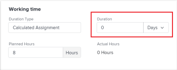

# 21.4 Miglioramenti al progetto

Questa pagina descrive tutti i miglioramenti apportati all’ambiente di anteprima con la versione 21.4 di Project. Questi miglioramenti saranno resi disponibili nell’ambiente di produzione la settimana del 4 ottobre 2021.

Per un elenco di tutte le modifiche disponibili con la versione 21.4, consulta [Panoramica sulla versione 21.4](../../../product-announcements/product-releases/21.4-release-activity/21-4-release-overview.md).

## Includi immagini negli aggiornamenti

Nella scheda Aggiornamenti di un oggetto è ora possibile aggiungere immagini facendo clic sull&#39;icona Immagine sulla barra degli strumenti. È inoltre possibile trascinare un&#39;immagine nell&#39;area di aggiornamento. Per poter visualizzare l’icona Immagine, l’amministratore di Workfront deve abilitare l’aggiunta delle immagini.

È possibile aggiungere immagini sia negli aggiornamenti che nelle risposte. Una miniatura immagine nell’aggiornamento indica che i destinatari possono visualizzare in anteprima l’immagine nel browser o scaricarla, e le notifiche e-mail e in-app mostrano che le immagini sono associate all’aggiornamento.

In precedenza, l’unico modo per condividere un’immagine in Workfront era allegarla a un oggetto come documento. Le immagini aggiunte nella scheda Aggiornamenti sono disponibili solo in tale scheda e non nella scheda Documenti.

Per ulteriori informazioni, consulta [Aggiorna lavoro](../../../workfront-basics/updating-work-items-and-viewing-updates/update-work.md).

Prima che gli utenti di Workfront possano includere immagini negli aggiornamenti, questa funzione deve essere abilitata dall’amministratore Adobe Workfront, come descritto in [Configurare le preferenze per gli aggiornamenti utente](../../../administration-and-setup/set-up-workfront/system-tracked-update-feeds/configure-preferences-user-updates.md).

## Algoritmo aggiornato per le assegnazioni intelligenti

È stato migliorato l’algoritmo utilizzato per le assegnazioni intelligenti. Con questo nuovo miglioramento, Workfront esamina le 30 assegnazioni più recenti effettuate dall’utente connesso per fornire suggerimenti quando assegna attività e problemi. L’elenco dei suggerimenti può contenere fino a 50 utenti.

Prima di questo miglioramento, Workfront stava considerando le assegnazioni sulle attività padre e altri attributi utente correlati a tali assegnazioni quando suggeriva gli utenti.

Per informazioni sulle assegnazioni avanzate, consulta [Panoramica delle assegnazioni intelligenti](../../../manage-work/tasks/assign-tasks/smart-assignments.md).

## Nuova esperienza durante la creazione di un progetto da un modello

Per rendere il tuo utilizzo di Workfront coerente con la nuova esperienza Workfront, abbiamo riprogettato l’interfaccia per la creazione di un progetto da un modello. La funzionalità per la creazione di un progetto utilizzando un modello non è stata modificata. Tuttavia, alcuni dei miglioramenti apportati a questa nuova interfaccia includono:

* Anteprima delle informazioni sul modello prima di allegarlo
* Aggiungere modelli a un elenco di preferiti durante il processo di creazione del progetto

È stata aggiornata l’interfaccia per la creazione del progetto sia quando lo si crea dall’area Progetti che dall’area Modelli.

Per informazioni, [Creare un progetto utilizzando un modello](../../../manage-work/projects/create-projects/create-project-from-template.md).

## Nuova esperienza durante l’associazione di modelli ai progetti

>[!NOTE]
>
>Questa funzione è disponibile solo nella nuova esperienza Adobe Workfront.

Per rendere il tuo utilizzo di Workfront coerente con la nuova esperienza Workfront, abbiamo riprogettato l’interfaccia per allegare un modello a un progetto. La funzionalità per allegare un modello non è stata modificata. Tuttavia, l&#39;interfaccia riprogettata presenta alcuni miglioramenti, tra cui i seguenti:

* Anteprima delle informazioni sul modello prima di allegarlo
* Aggiungere modelli a un elenco di preferiti durante il processo di creazione degli allegati
* Visualizza tutte le opzioni per la gestione delle impostazioni di modello e progetto in un&#39;unica pagina continua

Per informazioni, consulta [Allegare un modello a un progetto](../../../manage-work/projects/create-and-manage-templates/attach-template-to-project.md).

## Valori unitari di durata e durata per le attività

Per un’esperienza utente più pulita e semplificata, il valore del campo Durata è stato unito all’unità di durata. Prima di questo miglioramento, l’unità di tempo visualizzata in un campo a discesa separato dopo il campo Durata.

Oltre ai campi Durata nelle caselle Dettagli attività, Modifica attività e Nuova attività, stiamo aggiornando i campi seguenti per far corrispondere questa esperienza:

* Campo durata durante l&#39;esecuzione di assegnazioni avanzate
* Campo Ritardo livellamento durante la creazione o la modifica di un&#39;attività
* Campo di frequenza durante la creazione di un&#39;attività ricorrente (disponibile a breve)
* Campo Lag durante l’aggiunta di un predecessore (disponibile a breve)

Per informazioni, consulta [Modifica attività](../../../manage-work/tasks/manage-tasks/edit-tasks.md).

## Disabilita l’aggiunta di problemi in linea nei progetti

Per garantire che gli utenti forniscano informazioni accurate quando aggiungono problemi ai progetti completando un modulo per i problemi, è stata introdotta una nuova impostazione che consente di gestire l’aggiunta in linea di problemi a un progetto o alle relative attività. Questa impostazione è attivata per impostazione predefinita nella nuova area Impostazioni problemi della casella Modifica progetto. La disattivazione di questa opzione disattiva l’opzione Aggiungi altri problemi nella sezione Problemi di un progetto, impedendo agli utenti di aggiungere altri problemi all’elenco. Gli utenti possono comunque aggiungere problemi ai progetti utilizzando l’opzione Nuovo problema nella sezione Problemi o utilizzando una coda di richieste, se ne è stata configurata una per il progetto.

>[!NOTE]
>
>Questa impostazione è disponibile solo nella nuova esperienza Workfront. Gli utenti che lavorano in Workfront Classic possono comunque aggiungere problemi in linea a un progetto o alle sue attività anche se questa impostazione è stata disabilitata per il progetto da un utente che lavora nella nuova esperienza Workfront.

Per ulteriori informazioni, consulta [Modifica progetti](../../../manage-work/projects/manage-projects/edit-projects.md).

## Miglioramento della visualizzazione dei campi personalizzati per caselle di controllo e pulsanti di scelta

La visualizzazione e la selezione delle opzioni relative alle caselle di controllo e ai pulsanti di scelta nei moduli personalizzati sono diventate più semplici. Un campo personalizzato con molte opzioni relative alle caselle di controllo o ai pulsanti di scelta viene ora visualizzato in più colonne della pagina. Precedentemente, venivano visualizzate in una singola colonna, che richiedeva uno scorrimento aggiuntivo per gli utenti che compilavano il modulo.

Ciò dipende dal modo in cui vengono posizionati i campi nel modulo personalizzato. Se si inserisce un altro campo nella stessa riga con il campo casella di controllo o pulsante di opzione, le opzioni potrebbero disporre di spazio orizzontale sufficiente per la visualizzazione in una singola colonna.

Per informazioni sulla compilazione di un modulo personalizzato, consulta [Modificare le informazioni nei campi modulo personalizzati](../../../workfront-basics/work-with-custom-forms/edit-custom-forms.md).

Per informazioni sulla creazione di un campo casella di controllo o pulsante di scelta in un modulo personalizzato, vedere le sezioni [Creare o modificare un modulo personalizzato](../../../administration-and-setup/customize-workfront/create-manage-custom-forms/create-or-edit-a-custom-form.md#create) e [Creare o modificare un modulo personalizzato](../../../administration-and-setup/customize-workfront/create-manage-custom-forms/create-or-edit-a-custom-form.md#configur) nell’articolo [Creare o modificare un modulo personalizzato](../../../administration-and-setup/customize-workfront/create-manage-custom-forms/create-or-edit-a-custom-form.md).

